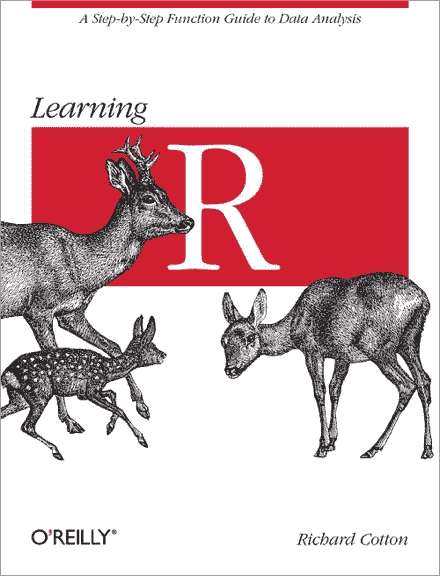
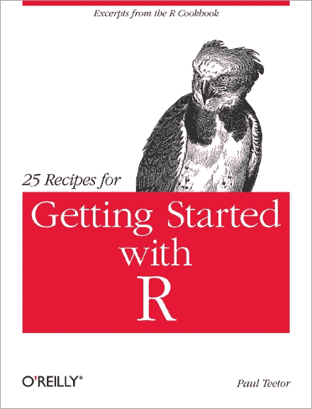
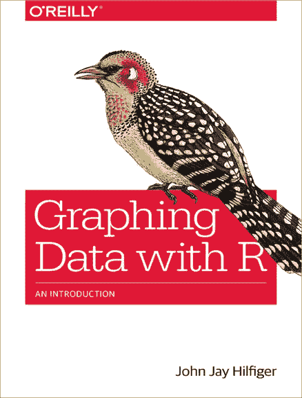
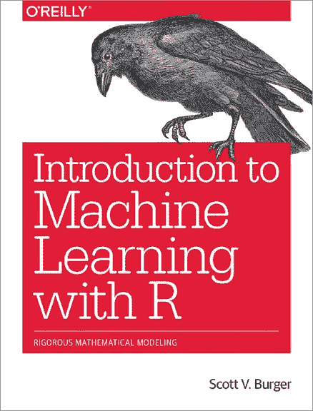
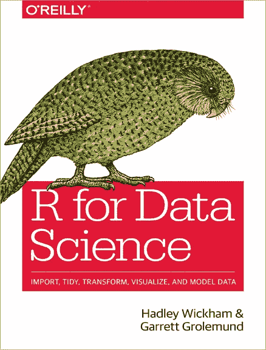
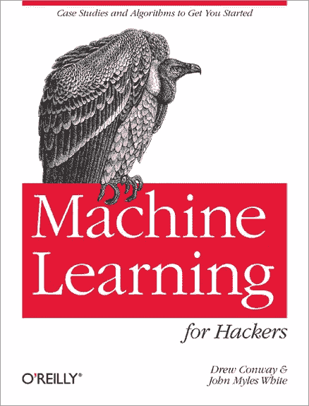

# 2020 年数据科学和机器学习必读书籍

> 原文：<https://towardsdatascience.com/data-science-and-machine-learning-must-read-books-for-2020-ca22df42b6c2?source=collection_archive---------30----------------------->

## 更好的编程建议

## 为下一个十年提高你的编码技能

Image by Jaz King available at [Unsplash](https://unsplash.com/photos/DOoYFgTQWfs)

# 未来十年的数据科学

2020 年即将到来，随之而来的是学习新事物、强化现有技能和发展新技能的许多机会。数据科学领域将继续扩展到新的领域；新的库、算法和分析工具将继续被开发；更多的数据科学家、数据分析师和机器学习职位空缺将继续在行业内出现；学术界将设计和提供新的专业和学术项目；越来越多的行业需要更多拥有编程、编码和分析技能的人来处理今天的大量数据，希望从中获得信息、知识、见解和智慧。

要做到这一点，人们必须开始熟悉基于他们兴趣领域的多种编程语言和软件。他们应该理解分析和机器学习算法背后的理论，以及它们的统计和数学基础。考虑到开源软件(例如 R、Python)的日益流行，拥有一个完善的学习计划对于真正掌握一门新的编程语言和软件变得至关重要。以下是对 R 感兴趣的新老程序员的数据科学和机器学习必读书籍清单，R 是一个用于统计计算和图形的免费软件环境。希望你觉得有用。

## 对于**初学者**:

Learning R

没有编程经验？没问题。[学习 R](http://shop.oreilly.com/product/0636920028352.do) 讲解如何用 R 语言和软件环境进行数据分析。这本书包含学习如何使用基本的 R 工具分析不同类型和结构的数据的教程，以及基本的编程概念。

Getting Started with R

学习一门全新的编程语言可能是一个缓慢(有时)令人沮丧的过程，尤其是当没有一个完善的学习计划和适当的资源和材料时。[R 入门](http://shop.oreilly.com/product/0636920018315.do)为初学者提供了一系列如何使用基本的统计、图形和回归来解决简单的 R 问题的方法。初次接触 R 软件的好书。

Graphing Data with R

在向经理和团队的其他成员传达结果时，有效的数据可视化是一项重要的任务。[用 R 绘制数据图](http://shop.oreilly.com/product/0636920038382.do)展示了如何创建各种有用的图表，用于可视化和分析科学、商业、媒体和许多其他领域的复杂数据。本书教授的方法有助于突出重要的关系和趋势，将数据简化为更简单的形式，并强调关键数字一目了然。

## 对于有一些经验的程序员:

Introduction to Machine Learning with R

近年来，机器学习已经成为学术界和专业人士的热门趋势。然而，乍一看，它可能看起来像一个令人生畏的主题，直到你知道它的基本原理。[用 R](http://shop.oreilly.com/product/0636920058885.do) 介绍机器学习有助于获得坚实的机器学习原理入门基础，包括机器学习模型、算法和数据训练。这本书介绍了简单的算法，如回归模型，一直到更高级的算法，如神经网络和基于树的方法。

Text Mining with R

当今的许多可用数据都是非结构化的，并且大量使用文本，这使得数据分析师需要应用特定的技术和工具来处理这些数据。[带 R 的文本挖掘](http://shop.oreilly.com/product/0636920067153.do)是一本学习自然语言处理(NLP)文本挖掘工具的好书。它演示了如何将文本数据作为数据框架来处理、总结和可视化来自文学、新闻和社交媒体的文本特征，以从中获得洞察力。

## 对于更有经验的程序员:

R for Data Science

未来十年，数据科学领域、算法和应用将继续大幅扩展，引领行业内最受欢迎的工作岗位和学术界的顶级学术项目。 [R for Data Science](http://shop.oreilly.com/product/0636920034407.do) 是一本学习如何将原始数据转化为见解、知识和理解的好书。这本书引导读者通过输入，争论，探索，建模和交流结果的步骤。本书中教授的 R 包集合旨在使数据科学变得快速、流畅和有趣。

Machine Learning for Hackers

期待机器学习更上一层楼？《黑客机器学习》是一本给对处理数据感兴趣的有经验的程序员的好书。这本书通过一系列实践案例研究，而不是传统的数学演示，为理解机器学习和统计工具提供了全面的解释。对任何背景的程序员都有好处，包括商业、政府和学术研究。

*— —*

*如果你觉得这篇文章有用，欢迎在* [*GitHub*](https://github.com/rsalaza4?tab=repositories) *上下载我的个人代码。你也可以直接在 rsalaza4@binghamton.edu 给我发邮件，在*[*LinkedIn*](https://www.linkedin.com/in/roberto-salazar-reyna/)*上找到我。有兴趣了解工程领域的数据分析、数据科学和机器学习应用的更多信息吗？通过访问我的媒体* [*个人资料*](https://robertosalazarr.medium.com/) *来浏览我以前的文章。感谢阅读。*

*——罗伯特*