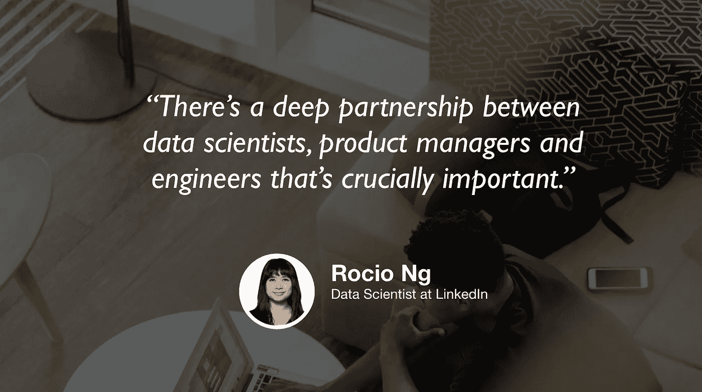

# LinkedIn 的数据科学和产品管理

> 原文：<https://towardsdatascience.com/data-science-and-product-management-at-linkedin-92a3433cdd6c?source=collection_archive---------24----------------------->

## [苹果](https://podcasts.apple.com/ca/podcast/towards-data-science/id1470952338?mt=2) | [谷歌](https://www.google.com/podcasts?feed=aHR0cHM6Ly9hbmNob3IuZm0vcy8zNmI0ODQ0L3BvZGNhc3QvcnNz) | [SPOTIFY](https://open.spotify.com/show/63diy2DtpHzQfeNVxAPZgU) | [其他](https://anchor.fm/towardsdatascience) | [剪辑](https://youtu.be/JmIhKid3Rh4)

## 点击 [TDS 播客](https://medium.com/towards-data-science/podcast/home)

> *编者按:这是迈向数据科学播客“攀登数据科学阶梯”系列的第五集，由 Jeremie Harris、Edouard Harris 和 Russell Pollari 主持。他们一起经营一家名为*[*sharpes minds*](http://sharpestminds.com)*的数据科学导师创业公司。可以听下面的播客:*

大多数软件开发角色非常简单:有人告诉你要构建什么(通常是产品经理)，你就构建它。数据科学有趣的地方在于，虽然是软件角色，但并不完全遵循这个规律。

这是因为数据科学家通常是唯一能够理解其工作的实际业务后果的人。团队中只有一个人可以回答这样的问题:“我们的聚类分析中的方差告诉我们关于用户偏好的什么？”以及“我们模型的 ROC 分数的商业后果是什么？”，而那个人就是数据科学家。从这个意义上来说，数据科学家有一个非常重要的责任，那就是不要在桌面上留下任何见解，即使在处理深度技术问题时，也要展现商业直觉。

在今天的节目中，我们采访了 LinkedIn 的数据科学家 Rocio Ng，讨论了数据科学家和产品经理之间建立强大合作伙伴关系的必要性，以及 LinkedIn 这些角色之间的日常互动。一路上，我们还谈到了早期职业数据科学家最常犯的一个错误:过于专注于第一个角色。以下是我们从对话中获得的一些最大收获:

*   产品经理的主要职责之一是提出他们的团队将试图优化的性能指标(KPI)。提出这些指标，跟踪它们，并弄清楚如果它们看起来不好该怎么办，这通常需要数据科学家(或数据分析师，取决于您的定义)的投入。
*   在许多公司(包括 LinkedIn)，数据科学家是翻译:他们的工作是善于将高度抽象的想法转化为可操作的目标，并在产品经理的帮助下检查他们的想法。
*   如果你想进入数据科学或者提升你的职业生涯，不要为了学习工具而学习工具。尝试通过构建有清晰用例的项目来学习。他们不一定要赚钱或做任何事情，但拥有你试图通过项目传递的明确的价值将有助于发展和展示你的商业意识，这是 Kaggle 竞争所无法做到的。
*   不要太担心得到“完美”的第一个角色。如果你处于职业生涯的早期，你可能对不同公司的数据科学家、数据分析师和 ML 工程师之间的差异没有很好的认识，所以大胆地投入进去通常是有意义的。人们一直在横向流动，要么换公司，要么根据兴趣改变角色和工作描述。从获得处理数据的经验开始，剩下的事以后再操心。

## [TDS 播客—剪辑](https://youtu.be/JmIhKid3Rh4)

如果你在推特上，随时欢迎和我联系 [@jeremiecharris](https://twitter.com/jeremiecharris) ！