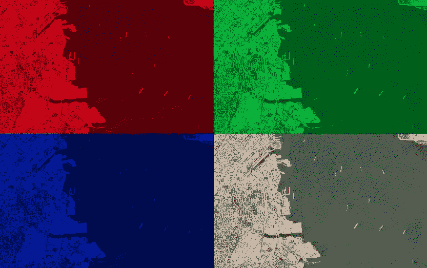
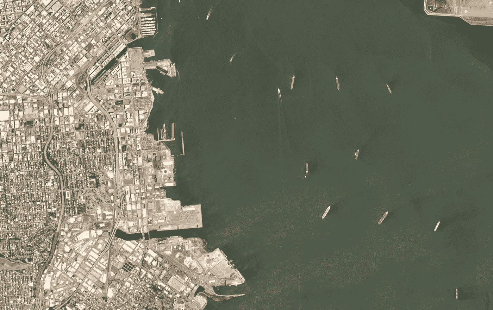
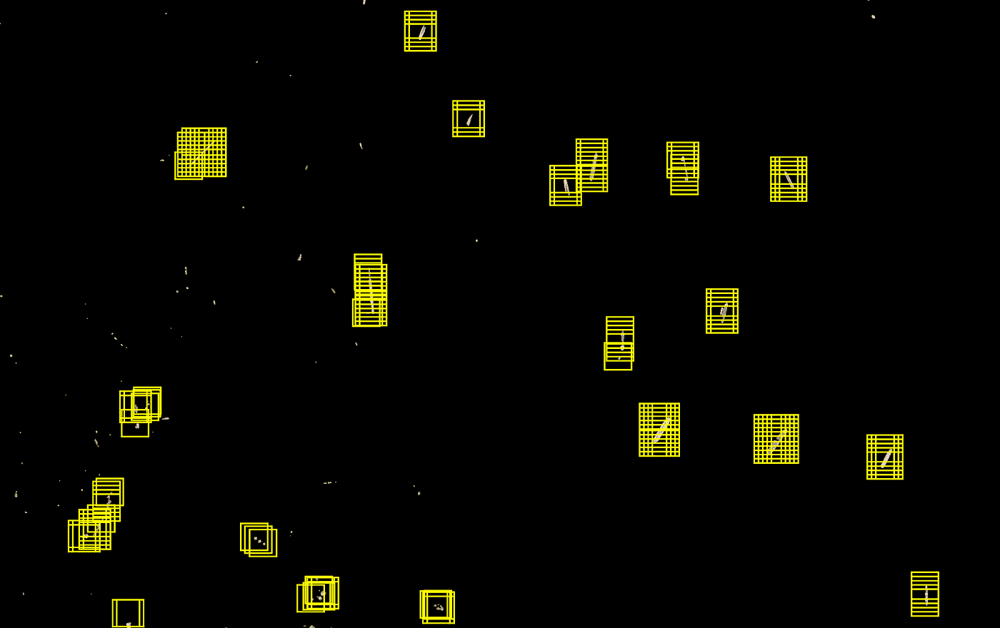
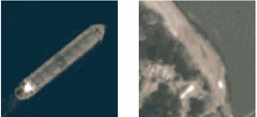
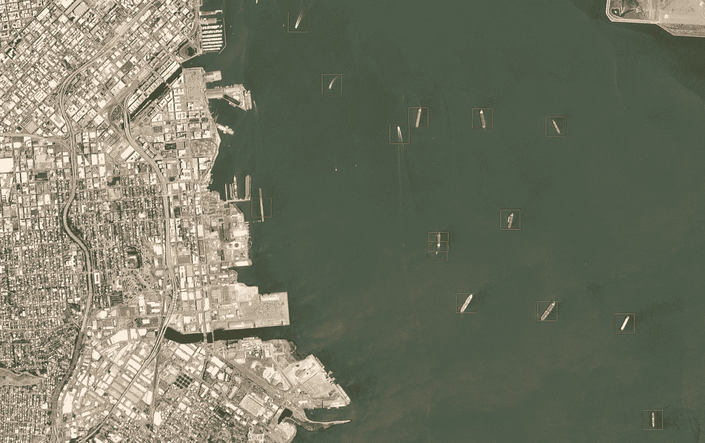
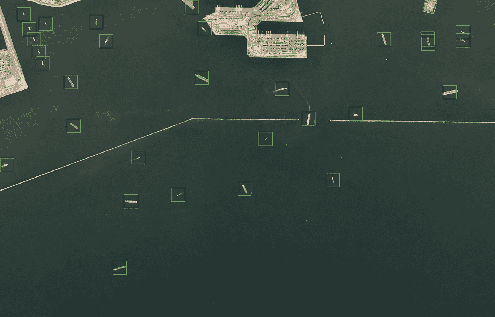

# 数据科学和卫星图像

> 原文：<https://towardsdatascience.com/data-science-and-satellite-imagery-985229e1cd2f?source=collection_archive---------4----------------------->

## ***我们将介绍在国际开发中使用真实应用在卫星图像中实现目标检测的工作流程。***

***物体检测，位于深度学习和计算机视觉的交叉点，由于其在多个现实世界应用中的广泛使用，最近获得了很多关注。国际发展并不排斥这一趋势。在这篇博客中，我们介绍了支持这种人工智能解决方案的工作流背后的一些基本概念。为此，我们在***[***AK tek***](https://www.aktek.io/)***项目中使用了一个基于卫星图像的真实应用程序。***

**背景意识是许多行业成功实施运营、项目和投资的关键。**虽然现场信息仍然是基本的，但收集这些数据可能非常昂贵，而且可能只有在承担高风险的情况下才有可能，特别是在脆弱和受冲突影响的地区。此外，这些区域中的上下文信息很快就会过时，这加剧了这些限制。通过机器学习和计算机视觉解决方案，物体检测技术的兴起正在促进新的应用，其中图像被自动摄取以通知决策过程。这种增长是可能的，这要归功于多种因素的结合，其中两个主要因素是图像记录系统的更好的质量和成本；再加上更强大但也更实惠的计算资源，为深度学习算法等高级解决方案提供动力。

这些因素的结合使得能够在多个行业中实现对象检测。虽然有些技术对于所有类型的图像(甚至视频)都是通用的，但这里我们只关注卫星图像。卫星图像是遥感数据的一个来源，有助于提高国际发展和其他行业参与者的背景意识水平，有可能在任何地方，而且成本较低。

# 一些鼓舞人心的参考

卫星图像已经在国际发展和其他领域得到应用。一个不完全的例子清单包括土地利用和土地覆盖变化检测的[研究](https://earthobservatory.nasa.gov/world-of-change/Deforestation)(LULC)以确定非法毁林，或为农业项目提供信息；利用卫星图像对[难民定居点进行研究](https://www.unrefugees.org/news/usa-for-unhcr-launches-satellite-imagery-and-crowdsourcing-project-to-improve-refugee-camp-planning-and-maintenance/)；或者它的分析有助于自然灾难(如洪水或火灾)后的救援行动。这些令人印象深刻的应用的另一个例子发表在两年前斯坦福大学可持续发展和人工智能实验室的作者的论文中。这项研究将深度学习、白天卫星图像、夜晚卫星图像和社会经济传统调查结合在一起，共同开发了一个预测非洲几个地方贫困估计的解决方案。尽管有其局限性，但在实现第一个联合国可持续发展目标[的过程中，仍然需要新的方法来改进对贫困的估计，即在任何地方消除一切形式的贫困。这项研究是一个非常鼓舞人心的例子，说明卫星图像和人工智能如何能够融合在一起，为国际发展增加价值。](https://sustainabledevelopment.un.org/sdg1)

# 隐形船只探测

在 [AKTEK](https://www.aktek.io/) ，我们一直致力于将卫星图像作为一种新的遥感数据来源，从而增强我们项目中的环境意识。在这篇博文中，我们将使用其中的一个项目来说明支持深度学习应用程序进行对象检测的工作流。**在这个项目中，我们的目标是补充传统的船只跟踪系统，增加一个*不可见的*船只检测算法，该算法在卫星图像上自动工作。**

*Red, Green and Blue bands extracted from a satellite scene of the San Francisco bay. The image is made available through Planet’s* [*Open California*](https://www.planet.com/products/open-california/) *dataset, which is* [*openly licensed*](https://creativecommons.org/licenses/by-sa/4.0/)*.*

[自动识别系统](https://en.wikipedia.org/wiki/Automatic_identification_system) (AIS)作为船舶自动跟踪系统被广泛使用，它用于监控海上交通。它基于船舶、地面站和卫星上的转发器和导航系统。然而，即使所有的法律规定强制使用该系统，船只可以关闭他们的 AIS 应答器，有效地进入*黑暗*。这对非常敏感的国际问题具有重大影响。这个清单很长，但是 ***隐形*船只关系到非常紧急的发展和安全问题:危险的海上移民、贩卖人口或货物、非法捕鱼和海盗行为。甚至海上事故救援行动也受此影响。所有这些问题都对人类生活产生了可怕的后果，更不用说它们可能带来的经济影响了。针对这种情况，结合不同类型的数据和分析技术的高级解决方案正在开发中。AIS 数据和异常检测，雷达信号处理，包括合成孔径雷达(SAR)，航空摄影和物体检测，以及现代海军巡逻。卫星图像是另一种数据来源，将补充这种数据来源，以提供更好的探测解决方案。虽然这种解决方案的商业成功依赖于数据源的组合和对每个数据源使用几种分析技术，但我们在这里不做进一步讨论；在这篇文章中，我们将关注卫星图像中的视觉船只检测。因此，**我们介绍由深度学习和其他计算机视觉技术驱动的对象检测背后的基础知识**。**

**卫星图像**

技术进步和成本降低导致商业航空航天产品急剧增加，包括卫星图像的可用性。卫星图像提供商的名单很广，不仅包括其图像对所有公民开放的公共提供商，如 Landsat 或 Sentinel missions，还包括私人拥有的卫星星座，如 DigitalGlobe、Airbus 或 Planet。

**卫星图像相对于其他类型的图像有几个奇点**。现代卫星图像是数百万像素阵列，具有各种地面分辨率，具体取决于具体的供应商和光谱带。地面分辨率涵盖了各种各样的每像素值，从 60 厘米到超过 120 米的每像素地面采样距离不等。图像的地面分辨率决定了可以在其上探测到的物体的大小。这些图像是多光谱的，我们为每个记录的光谱带准备了一个阵列。这包括*常见的*红、绿、蓝(RGB)波段，还有近红外、短波红外、热或全色波段等等。波段的组合分析可用于构建和研究指数，如植被、水、土壤或热指数，从而为多种解决方案提供动力，例如土地利用和土地覆盖检测。虽然卫星图像可以连续覆盖整个地球，但从空中拍摄图像存在局限性，重访率是制定解决方案的关键。这些取决于供应商，对于一个给定的地方，它们的范围从每天几幅图像到每几天一幅图像。不同的光谱带在天气事件(如云或风暴)或仅仅是一天中的时间的函数中显示不同的能见度行为。一些红外波长在晚上仍然是可见的*，而通常的 RGB 图像则不可见。附在卫星图像上的奇点清单还在继续，最低点，正射校正等等。的确，这些方面中的一些通常是影像提供商在向用户发布场景本身之前所做的处理的一部分，但是许多解决方案仍然依赖于分析和适当地组合所有这些方面，因此如果您感兴趣，我们鼓励您寻找更多关于这方面的信息。卫星图像正成为许多行业背景信息的惊人来源，值得投入时间。*

***解决方案定义***

*在这篇博文中，我们从一个更具策划性的场景开始，**目的是拍摄一个 RGB 卫星场景，如下图所示(这里忽略天气影响)，并设计和训练一个机器学习算法，自动检测和定位给定场景中的出港船只。***

**

**Satellite scene of San Francisco bay, made available through Planet’s* [*Open California*](https://www.planet.com/products/open-california/) *dataset, which is* [*openly licensed*](https://creativecommons.org/licenses/by-sa/4.0/)*.**

*这种类型的场景覆盖了几十平方公里的地球表面(~ 45 公里 *2* )。一个基于卫星图像的现实监控解决方案将不得不及时浏览成千上万或更多的场景。因此，**依靠持续的人工监管这样的解决方案是不可行的。这是一个适合机器学习的场景**。最初仅依靠最少的人工监督，系统可以被设计和训练来执行船舶检测，而无需进一步的人工干预。这将在可行的计算时间内实现大面积表面的自动监控。使组织能够更快地监控和覆盖更大的表面。*

*请注意，卫星场景是数百万像素的图像(~5MP)，在这种情况下，地面分辨率为每像素 3m，为每个色带构建了一个大的数值数组。因此，除了旨在达到高出港船舶检测精度之外，**算法的另一个关键指标将是检测速度**。否则，要监控的场景的大小将对查看许多平方英里的真实世界解决方案提出令人望而却步的挑战。*

***解决方案工作流程***

*为了构建船只检测解决方案，我们需要遵循一个简单的两阶段工作流程，允许我们说明深度学习和计算机视觉交汇处的两个领域:图像分割和图像分类。工作流程如下进行。*

*首先，使用选择性分割算法来识别场景中必须在第二阶段进一步分析的区域。在这个阶段，大块的土地和/或水域已经被丢弃。这使我们能够在处理如此繁重的卫星场景时实现快速解决方案，同时提高整体解决方案的准确性。*

*在第二阶段，我们实现了一个移动窗口浏览机制，只围绕在前面阶段选择的区域。这些窗口中的每一个都被输入到一个二元分类器中，该分类器输出在那个特定窗口中有一艘船的概率。如果它估计有一个盒子，就画一个。正如我们将要描述的，这样的机器学习算法是在一组先前标记或注释的图像上训练的，机器*可以从这些图像中学习*。***

***这样，给定一个卫星场景，该解决方案只需几秒钟就能输出该场景的新图像，并在每个检测到的出港船只周围画出一个方框。***

***选择性分割***

*对于用来说明这篇文章的解决方案，我们使用一个简单的分段算法。然而，我们注意到，更先进的分割算法，选择性或非选择性，可以使用，新的正在研究中。如果你感兴趣，可以看看最先进的区域提议算法，在那里可以学习区域，比如更快的 T2 R-CNN，或者 T4 YOLO T5 的实现。*

***然而，这里使用基于**[***k-均值聚类***](https://en.wikipedia.org/wiki/K-means_clustering) ***的众所周知的无监督算法就足够了。*** 在一个场景中，每个像素可以理解为一个三维数值向量。也就是说，每个像素由其红色、绿色和蓝色光谱带的值来定义。这些像素然后形成向量的集合。 *k-means* 算法将所有这些像素划分和分布在 *k* 不同的簇中，在我们的例子中，仅基于颜色接近度。这是一个困难的计算问题，但通常，特别是在这里，数值算法会迅速收敛到最优解。这种优化算法通过将每个像素分配给均值向量最接近该像素的聚类(在 RGB 空间中；第一次分配可以是任意的)，然后在新的像素分配之后重新计算每个结果聚类的新平均值，并反复重复这两个相同的动作，直到聚类中的像素分布稳定。在我们手头的例子中，聚类的最佳数量通常较低(2)，这足以将像素聚类成*水状*和*非水状*像素。为此，聚类可以完全忽略地理空间意义上的像素邻近，因为聚类可以仅在三维颜色向量上执行。*

*一旦执行了聚类，我们就可以进行一些简单的操作来提高算法性能。*水状*像素可以通过分析从 *k-means* 算法得到的每个聚类的平均颜色向量来建立，然后在接下来的步骤中被安全地忽略。假设场景不仅仅是水，我们可以聚焦在*非水状的*像素上。我们通过排除由相邻像素形成的区域来继续，这些区域或者太大，或者太小，或者具有非常非线性的形状，对于它们来说不是船。**船只的最终检测仍将发生在解决方案的下一阶段，但这是一种非常快速有效的方法，可以去除不需要由接下来的深度学习算法进一步处理的水域和陆地，从而提高效率和速度**。为此，我们需要考虑手头场景的地面分辨率，场景的颜色归一化，如果我们对检测港口的船只感兴趣，这一步会更复杂。*

**

**Illustration of the selected areas to be further analyzed after the segmentation of the previous Planet scene.**

*对于我们用来说明这篇博客文章的场景，通过选择性分割选择的区域(仍需要进一步分析)在上图中用黄色方框表示。在那里，只有小的*非水状*像素被描绘出来，其他的都是黑色的。如果我们没有这个分割阶段，而是采用强力方法，固定框将需要在下一阶段解析整个场景。如下所述，使用 80×80 像素的盒子，这意味着即将到来的算法将分析大约 5000 万个窗口，这将导致在计算速度方面令人望而却步的解决方案。相反，通过我们在这里执行和描述的简单的选择性分割，只需要进一步分析几百个窗口。**这将花费在场景完整分析上的时间显著减少到几秒钟，**(如果仅使用**单个廉价 CPU**而没有对预测进行任何并行化)，同时还有助于提高整体解决方案的准确性。*

***监督学习和图像分类***

*一旦分割自动选择了需要进一步分析的区域，解决方案就进入第二阶段。在那里，**一个卷积神经网络(CNN)被设计和训练来决定每个区域是否包含船只**。为此，我们浏览那些移动 80×80 像素的固定大小窗口的区域。这种窗口适用于探测高达 250-300 米的船只(如现场最大的货船)。*

*因此，这意味着我们设计的 CNN 总是摄取 80 x 80 像素的 RGB 盒图像，而不是直接摄取更大的场景，从而提高了效率。正如我们在之前关于基于文本的[国际发展和数据科学项目的博客文章中所描述的，这里我们也使用监督学习技术。为了训练 CNN，我们需要首先手动标记一组智能图像，并将这些图像分配到一个二进制类别:*船*或*非船*。我们认为这种分配是每个训练集图像的基础事实标签，算法必须从中学习推断决策过程。](/data-science-in-international-development-part-i-working-with-text-44ebb6e0feef)*

**

**Example of two of the derived boxes from the labeled images that we have used for the algorithm training in this blog post.The left box has a ground truth label that states it does contain a ship, while the right box belongs to the no-ship category.**

*然后，将这些训练集标签与相应训练集图像的 RGB 值数组一起输入算法。对于真实世界的解决方案，我们结合了几个供应商的标签图像。在对标记的图像进行一些简单的插值或合并处理后，这是可能的，这仅仅是因为那些提供者的分辨率是兼容的。这为我们提供了几十万张 80 x 80 图像的更大数据集，在*有船*图像和*无船*图像之间相对平衡。然而，**对于这篇博文中提出的更简单的解决方案，我们只使用了几千幅图像，在两个类别之间进行平衡，来训练解决方案的第一个工作版本。**请注意，我们这里指的是大约 80 x 80 的盒子，而不是完整的场景。*

***数据扩充***

*这是可能的，因为我们对这些图像进行数据扩充。数据扩充是指通过获取原始手动标记的图像并以受控方式扩展标记集来人为增加标记图像的数量的过程。这是通过对它们执行一些基本动作来完成的:旋转、图像翻转、平移等，同时给那些新*派生的图像*分配与原始图像相同的标签。这是计算机视觉中另一套丰富的技术，所以如果你感兴趣，我们鼓励你进一步研究。**数据增强可以显著减少在训练阶段手动标记和输入算法的图像数量，而不会降低准确性**。*

***卷积神经网络***

*正如我们在[的第一篇博文](/data-science-in-international-development-part-i-working-with-text-44ebb6e0feef)中所描述的，在很高的层面上，算法是对图像数字数组进行运算的数学公式，并输出图像属于每个特定类别的概率。为了能够尽可能准确地对新图像进行分类，在所谓的训练阶段，算法工作以最小化它们对训练集的预测和这些相同训练集图像的真实分类之间的误差。假设这种训练在适当的验证框架内进行，那么相同的算法可以预测新的图像(从而预测新的场景)，而不需要进一步的人工监督。这可以近乎实时地完成，这个过程现在是可扩展的，其准确性可以通过测试集严格地建立。*

***卷积神经网络是一组算法，广泛用于人工智能中最先进的图像解决方案。**CNN 实施背后的灵感、历史和细节可以在别处找到。由于描述其技术细节的书籍、论文、博客条目和教程的列表已经很长了，很难只挑选一个参考。在这篇博客中，我们将 CNN 过于简化，说它们是神经网络算法，有数万到数百万个参数需要训练，都以非常结构化的方式运行。这些神经网络遵循对数值阵列进行数学运算的系统模式:卷积、池化和正则化层。这种结构使得它们适合于自动学习如何提取图像上的相关特征，例如形状、边缘和更复杂的视觉特征。将这一点与训练它们的强大的最小化算法相结合，使它们成为图像和其他图像中对象检测的非常强大的解决方案。*

*目前，许多基于 CNN 的解决方案利用了所谓的预训练模型。这些都是巨大的 CNN 结构(如 ResNet、VGG、Inception 等)，它们之前已经在公开可用的通用标记图像数据集中进行了训练，如 [ImageNet](http://www.image-net.org/) 中的图像集。通过*迁移学习*技术，这些预训练的结构得到扩展，然后使用手头新解决方案的特定新标记数据集进一步训练若干层。这样，新模型被调整用于期望的新物体检测，这里是图像中的船只检测。虽然这可能会导致高精度的解决方案，但这些解决方案通常也较重，因此速度较慢。**相反，对于这篇博客来说，从零开始构建和训练一个新的 CNN 就足够了，可以使用你偏好的编程语言中的现有库来做什么。**仅使用几块卷积层和池层(每个层只有几十个不同的小型卷积滤波器)、一些密集层，并使用适当的正则化技术(例如批量归一化)，我们已经可以在用于该博客条目的简化训练集的选定子样本上达到高验证和一致的二进制测试准确度(95%以上)，进一步提高效率。*

***训练过程是通过分批馈送所有图像和预处理步骤来实现的，因此并行化是可能的，并且加速了算法的训练**。如果我们保持模型轻便，训练时间会很短。现在，这里描述的所有工作流程都可以通过大量可用的图像处理和机器学习库，用您喜欢的编程语言来实现。例如在 python 中，通常的 numpy、scipy、scikit-learn(和 image)、openCV、keras 和 tensorflow 库足以构建解决方案。对于所有这些，网上有很好的博客和教程。*

***解决结果***

*总之，我们的两阶段解决方案结合了一个相对简单的 k-means 聚类算法用于初始选择性分割，随后是一个相对简单的 CNN 构造，该构造仅针对几千张进一步增强的图像针对这篇博客文章进行了训练。**该解决方案的工作流程可以摄取如上图所示的卫星场景，并在几秒钟内输出检测到的船只(如果有)在场景中的位置。下图中的场景说明了这一点。***

**

**Satellite scene of San Francisco bay, made available through Planet’s* [*Open California*](https://www.planet.com/products/open-california/) *dataset, which is* [*openly licensed*](https://creativecommons.org/licenses/by-sa/4.0/)*, after being processed by our ship detector algorithm.**

*正如我们所观察到的，这种更轻便的解决方案在处理场景时已经相当精确了。它只错过了一艘非常小的船(肉眼几乎看不到)，它只错把一个*船形的*甲板当成了一艘真正的船。当然，真实世界的解决方案更完整，因为它使用更大的数据集，并在适当的场景集合中得到进一步验证。然而，这个更简单的算法已经足够好来说明整个工作流程，同时已经达到相当高的性能。这也有助于突出船舶检测面临的一些主要挑战。分割有助于处理大多数基于海岸的物体，但在那里，甲板和其他像船一样的陆地表面有时可能会与船混淆。除了改进选择性分割，这些对象的样本可以进一步手动标记，并再次馈送到新的训练阶段，从而改进算法的执行方式。此外，最小的船只仍然最难被发现。这与图像的分辨率有关，可以依靠更高分辨率的场景来改善。*

**

**Satellite scene of Long Beach bay, made available through Planet’s* [*Open California*](https://www.planet.com/products/open-california/) *dataset, which is* [*openly licensed*](https://creativecommons.org/licenses/by-sa/4.0/)*, after being processed by our ship detector algorithm.**

*你可以在另一个场景中看到表演，这一次是在长滩湾(分辨率与旧金山湾相同)。*

***超越***

*除了我们在上面已经建议的改进，为了达到更鲁棒的对象检测器，在这一点上真正的解决方案将继续将算法与 AIS 数据集成。一旦船只被定位在卫星画面上，我们就有了它们在某个时刻的地理位置，与 AIS 数据进行对比，我们就可以继续识别出哪些是不可见的船只，从而可能从事非法活动。*

# *观点*

***卫星图像与机器学习和计算机视觉相结合，可用于设计和培训新的解决方案，并提高环境意识。这个过程已经在国际开发的一个项目中进行了说明，但是潜在的应用超出了船舶和这个行业，几乎涵盖了你能想到的任何东西。实际上，相同的工作流程并不局限于卫星图像，因为它也适用于其他类型的图像甚至视频。我们才刚刚开始触及表面。***