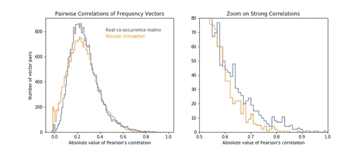

# 数据科学和犯错的重要性

> 原文：<https://towardsdatascience.com/data-science-and-the-importance-of-being-wrong-1b31123accfc?source=collection_archive---------12----------------------->

Photo by [Ethan Sykes](https://unsplash.com/@e_sykes?utm_source=medium&utm_medium=referral) on [Unsplash](https://unsplash.com?utm_source=medium&utm_medium=referral)

数据科学可以提供高价值的见解，例如，通过发现历史数据中与更高效率相关的制度，或者通过找到制造流程中非质量的根本原因。成功的数据科学模型可以启动补救项目，产生数百万的收入。

然而，即使是最惊人的结果也不总是它们看起来的那样！当我们决定以不同的方式处理数据时，强相关性可能会消失。高性能的分类器可能只是反映了我们默认的假设或糟糕的采样。由于这些和许多其他原因，根据项目早期的成功进行投资是危险的。

这就是为什么我们也需要谈论我们的负面结果。如果我们希望我们的商业伙伴信任数据科学，我们需要向他们展示(而不仅仅是告诉他们)正在进行的*假设拒绝*过程如何让我们找到正确的模型。反驳我们自己的初步结果的健康愿望是我们如何获得对数据景观、其陷阱和惊喜以及隐藏的宝石的深刻理解。

我最近的一个项目很好地说明了这一点。

**假设**

一家汽车制造商让我分析工程师在测试过程中记录的标准化缺陷代码数据集。汽车投入使用后，车载电脑会自动生成相同的代码。我的客户想知道在测试中发现的*缺陷是否预示着服务中出现的缺陷*。

**数据模型**

举一个具体的例子，设想一个针对某型号汽车的交付前测试程序。发动机可以提出 50 个可能的缺陷，电气系统可以提出 50 个可能的缺陷，液压系统可以提出 40 个可能的缺陷。测试实验室通常只发现 2 或 3 个缺陷，并当场修复它们。大多数新车主不会遇到任何问题，但有时汽车在交付后不久就发生故障或发出警告。我们可以将客户在给定时间范围内(例如 3 个月)经历的缺陷建模为一个频率向量:在 140 个可能的缺陷中，哪些发生在服务中，频率如何？

为了寻找数据中的预测关系，我为每辆车构建了这些频率向量，并对所有在测试中遇到特定缺陷的车辆求和(图 1)。然后，我使用主成分分析在这个共现矩阵中寻找不寻常的向量(并找到了一些)。但是客户也有兴趣发现*在用缺陷的常见模式*，这些缺陷有可能通过改进公司的测试程序来解决。

*Fig. 1\. A portion of the co-occurrence matrix showing the most common defects. Each row of in-service defects (right axis) aggregates the total counts of all vehicles that raised a particular defect during testing (left axis). A vehicle with multiple testing defects can contribute to more than one row. Hence, the rows are not fully independent. The color thresholds are powers of two (blue = 1, green ≥ 2, yellow ≥ 4 …).*

即使在聚集载体之后，频率向量也非常稀疏，并且非常类似于 TF-IDF 文档向量的小语料库。因为我没有太多的向量可以比较，所以我尝试使用潜在的 Dirichlet 分配来寻找共现缺陷的模式(即 LDA 主题)。

**初步结果**

虽然 90%的向量彼此非常相似，并且与平均缺陷分布非常相似，但是剩余的 10%在 LDA 主题空间中形成了四个不同的聚类。我的客户很兴奋——我们是否发现了客户问题的频繁模式，也许可以用测试一些车辆子系统的有缺陷的过程来解释？然而，我还没有准备好验证结果，因为我知道数据集中聚集的频率向量并不是完全独立的。

**证明自己错了**

我又花了一周时间改进数据预处理，用泊松过程模拟缺陷频率向量，以估计虚假相关性的预期数量(图 2)，并检查进入聚类向量的单个汽车。其中一个集群缩小到只有两个成员，另外两个集群原来是由共享来自一辆高度缺陷车辆的数据的向量组成的。剩下的一个簇只在我集中分析罕见的运行中缺陷时出现，虽然它包含几个独立的向量，但它们之间的相似性很弱。

*Fig. 2\. Distribution of correlation coefficients (absolute value) between the vectors of the co-occurrence matrix (blue). Correlations in a simulated matrix where defects are generated by a Poisson process (orange). The similarity of the two distributions undermines the hypothesis that we can find frequent patterns. In fact, the excess of strong correlations is due to the fact that some rows of the matrix are not fully independent.*

最终，这一分析最重要的结果是否定了最初的假设:虽然我们发现了少数异常可靠或有缺陷的车辆，*，但在测试过程中遇到的缺陷和使用中出现的问题之间没有可辨别的关系*。从商业角度来看，这个结果是令人鼓舞的，因为它表明目前的测试程序非常好。

**公布否定结果**

通过快速否定频繁模式的假设，我可以告诉我的客户去别处寻找价值发生器。时间、注意力和分析是昂贵的，所以他仍然很高兴。现在他可以做出正确的选择。反驳一个假设往往比证明它更容易，通过在测试领域专家的想法时“快速失败”，我们可以快速提供见解并建立信任。

任何一个数据科学部门都会遇到很多这样的案例。业务部门带来了他们创造价值的想法，我们有责任快速过滤这些想法，以便只有可行的概念才能进入下一阶段。此外，我们有责任*质疑自己的想法* *和结果*。我们必须尽力证明自己是错的，不管我们的想法看起来多么优雅或有吸引力。

简而言之，我们的负面结果表明，我们不仅仅是应用程序开发人员或机器学习黑客——我们是假设测试者，这一活动是数据科学中的“科学”。