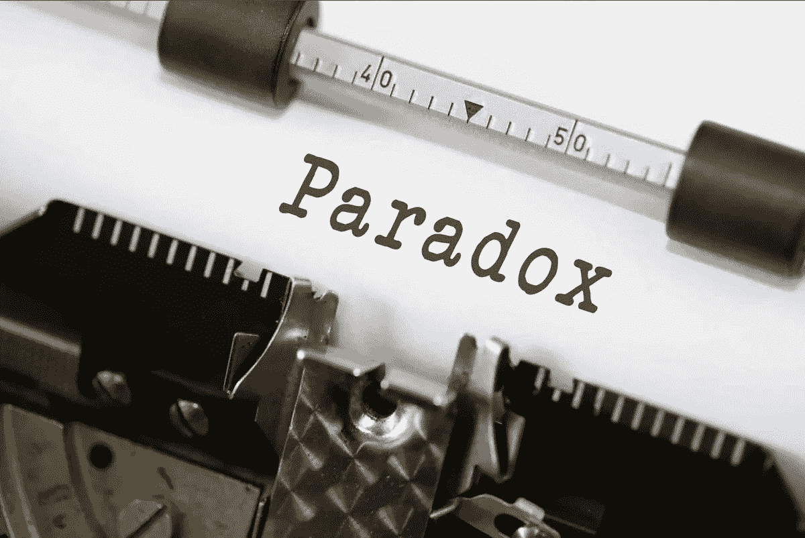

# 数据科学和预测的悖论

> 原文：<https://towardsdatascience.com/data-science-and-the-paradox-of-predictions-422ee8325348?source=collection_archive---------14----------------------->

Paradox by [Nick Youngson](http://www.nyphotographic.com/)

## 知道的行为如何改变我们所知道的。

许多数据科学项目都是对知识的追求。正如历史多年来告诉我们的那样，仅仅是知道的行为就可以改变我们认为知道的东西。

哈拉里教授在《德乌斯人》中用我们在他的作品中已经习以为常的技巧探讨了这个话题。哈拉里以马克思的《资本论》为例，阐明了这一观点，并将其转化为非常有价值的一课。

# 资本主义改革

Karl Marx

在 19 世纪中叶，马克思对当时的经济学提出了一系列见解。马克思还预言了西方的暴力起义和资本主义制度的崩溃，这一制度在很大程度上一直延续到今天。虽然俄罗斯最终也步其后尘，但他的预言从未在西方实现。但是为什么呢？

一个原因是资本家知道如何阅读。随着马克思成为政界越来越突出的人物，当时的资本家正利用他的洞察力来改变未来。他们明白资本主义是如何让如此多的人失望的，如果不做出改变，整个体系将会崩溃。

随着人们开始看到并相信马克思的预言，他们的行为发生了变化。系统变了。此外，尽管马克思为人类知识基础带来了宝贵而永久的补充，但他更激进的预测大多是错误的。错误的，即使他们可能是正确的。如果没有马克思带来的变化，西方的政治体系很可能会成为马克思预言的牺牲品。

# 预言的悖论

因此，我们面临着预测的悖论。

在做预测的过程中，我们经常会发现有价值的新知识。新的知识和它引发的预测改变了系统。哈拉里是这样说的:

> *不改变行为的知识是无用的。但是改变行为的知识很快就失去了相关性。*

同样的悖论也适用于数据科学中的许多预测系统。随着我们收集越来越多的数据，我们创造了越来越强大的预测系统。这些系统改变了行为，我们拥有的数据和系统到今天都不再准确。我们必须对系统的某些部分进行返工或全部重建。

# 完美的不完美

想象一个试图预测股票市场价格的系统。如今，海量数据正被以越来越有创意的方式加以利用，但与前几年相比，对冲基金正获得巨大回报的说法并不正确。

基金采用的许多交易策略都是基于市场的失误。定价过高事件、定价过低事件或其他价格错误。有效市场假说在很大程度上成立，但“错误”仍会发生。

让我们说，你建立了一个系统，每天准确预测哪些公司被低估。你使用一个新颖的系统，它采用独特的方法，因此你相信你可以保持你的优势。正如历史向我们展示的那样，很少有发明是孤立产生的。而且，如果你能找到它，其他人也可能会找到。

所以你不只是打开你的系统然后走开。你不断努力改进它，使用更多的数据，更好的数据，更强的计算能力。最终，有人赶上了。然后另一个。然后另一个。你的模式不再像以前那样赚钱，或许几乎没有利润。你需要继续下一个模型。

这同样适用于不太复杂的模型。您可能正在构建一个系统来预测哪些客户将很快离开您的公司。该系统允许您干预和改变最终行为，修改您用来构建它的数据。随着时间的推移，你必须继续更新和发展你的系统，因为你干预得越多，它就会慢慢变得不准确。

希腊神话西西弗斯似乎是一个合适的例子。作为对他欺骗行为的惩罚，这位前国王被判终身监禁，将一块巨石推上山，却看到它又滚了下来。

就像西西弗斯必须回到山底重新开始一样，优秀的数据科学家也必须不断回到他们的模型，不断调整他们的假设，并不断将巨石推上山。

当你建立创新的预测系统时，你正在增加你对某些东西的理解(不管是否可以解释)。如果这个系统不改变行为，那么它就没有效用。如果它确实改变了行为，那么它就会慢慢变得无关紧要。

在持续的基础上重新访问和返回到我们的模型应该成为惯例。通过这样做，我们确保了我们的模型继续执行，但是我们也考虑到了它们的创建所产生的悖论。

没有一个有用的模型可以孤立存在。

*最初发表于*[*Jesse Moore . ca*](https://jessemoore.ca/2019/paradox-of-predictions/)*。*