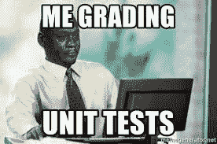
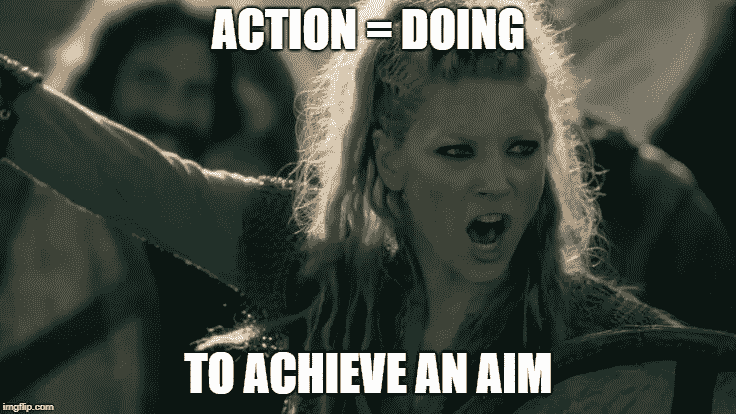

# 面向学校的数据科学应用

> 原文：<https://towardsdatascience.com/data-science-applications-for-schools-d8913d21d363?source=collection_archive---------24----------------------->

各个领域一直在以自己的速度采用数据科学。一些领域的采用速度比其他领域慢。其中一个，特别是我所在的领域，是教育领域。有趣的是，一个产生大量关于人(学生和学校工作人员)的数据的领域还没有最大限度地利用这些数据。这就像看到巨大的粘土团等待被塑造成美丽的雕塑。

Photo by [The Digital Marketing Collaboration](https://unsplash.com/@thedmcsa?utm_source=medium&utm_medium=referral) on [Unsplash](https://unsplash.com?utm_source=medium&utm_medium=referral)

这块粘土需要雕塑家将这些数据塑造成解决问题的解决方案，从而增强学校学生和员工的体验。尽管一些组织(如特许学校)有数据分析师来解决这些需求，但他们要么对每个学校不够具体，要么只达到管理级别。这就是需要数据科学家，数据的雕塑家的地方。

在这篇文章中，我将成为这些雕塑家之一，并分享学校如何塑造他们未使用的数据来解决具体问题，并改善学生和员工的体验。

Photo by [Monica Melton](https://unsplash.com/@monicomelty?utm_source=medium&utm_medium=referral) on [Unsplash](https://unsplash.com?utm_source=medium&utm_medium=referral)

## 1.学生评估数据

Photo by [Ben Mullins](https://unsplash.com/@benmullins?utm_source=medium&utm_medium=referral) on [Unsplash](https://unsplash.com?utm_source=medium&utm_medium=referral)

评估数据是教师确定学生对所学材料理解程度的常用数据源。这些可以用来获得概念的脉搏读数(通过测验和退出票)或学生对一个或多个单元的整体理解(单元测试、期中、期末)。

这些评估的理想用途是让教师根据结果修改未来课程的策略。这包括重温他们努力学习过的材料，也许还可以组成最佳小组，这样同龄人就可以互相教授他们努力学习过的话题。然而，除了对这些评估进行评分所花费的时间之外，这一过程本身也很耗时。

Image from [memegenerator.net](http://memegenerator.net)

有诸如 [ZipGrade](http://www.zipgrade.com) 之类的多项选择评估工具来加速这一过程，并提供快速的总结见解和项目分析。但它没有回答以下问题:

a)我的学生中有多少人在进化简答问题上获得了超过一半的学分？

b)我的学生中有多少人回答了用图解法求逆的问题，却在用代数法求逆的问题上苦苦挣扎？

c)我如何根据评估数据快速创建复习课的学生小组来回答问题 B？

问题 A 的答案可以用 ECDF 圆图来完成。如果你不熟悉这种类型的图表，你可以阅读我下面的文章。

 [## 什么，为什么，以及如何阅读经验 CDF

### 鼓励探索性数据分析(EDA)来获得数据的可消化的一瞥。这包括直方图，用于…

towardsdatascience.com](/what-why-and-how-to-read-empirical-cdf-123e2b922480) 

对于问题 B，可以使用气泡图来比较两个问题上的分数数据，以查看有多少学生在两个问题上都表现良好，在一个问题上表现良好，或者两个问题都没有表现良好。你可以在这里阅读更多关于气泡图[。](http://www.bubblechartpro.com/content/what_are_bubble_charts.php)

对于问题 C，我们可以使用无监督的机器学习来帮助解决这个问题。我已经为此构建了一个 web 应用程序解决方案。我将在以后的文章中与您分享这一点；).

## 2.学生项目数据

Image from [gettingsmart.com](https://www.gettingsmart.com/2019/05/6-creative-classroom-project-ideas/)

教师给出项目作为评估的有趣替代方案。在这些项目中，学生可以以更实际和/或更灵活的方式应用他们所学的知识。这可能是使用指数增长函数来估计股票投资，或者是将多项式与其分解形式相匹配的难题。

学生们会得到这些项目的评分标准，以显示他们是如何被评估的。同样，我们讨论的关于学生评估数据的同类问题也适用于任何有标题的项目或文章。唯一的问题是，将这些数据导入系统或 Excel 文件并不容易。让一位合作教师或助教输入这些数据可能会有所帮助，但也许计算机视觉和自然语言处理可以帮助构建解决方案。我找到的最接近的解决方案是 [GradeCam 的标题功能](https://gradecam.zendesk.com/hc/en-us/articles/115000776134-5i-Create-Rubric-with-Capture-Area-Questions-in-GradeCam-Go-)。

## 3.父母/监护人数据

Image from [signupgenius.com](https://www.signupgenius.com/school/parent-teacher-conferences-questions.cfm)

如果每个家长都来参加家长会(PTC)就太好了。尤其是由于学生在学校的进步，老师们非常想见见家长，看看他们是否能一起帮助学生取得成功。

美国有研究称，越来越多的家长更频繁地参加关于他们孩子的会议，但并非每个学校都是如此。一些学校努力达到 PTC 的 80%出勤率。学校当然有家长签到，但是那些家长和学生的数据是什么样子的呢？

如果这些数据被用来过滤掉那些家长没有出席家长会的学生，那么这些数据可以被分析来发现这些家庭的潜在相似之处。即使共同趋势不在你的数据中，它也提供了一个机会来研究这些家庭阻止他们出席的共同趋势。

然后，你可以向这些家庭发送有针对性的信息，以增加他们出席的机会，而不是向所有父母发送一个普通的电话或电子邮件。

## 4.学生行为参赛作品

Image from [thoughtco.com](https://www.thoughtco.com/antecedent-analyzing-difficult-behaviors-3110821)

当学校发生事故时，工作人员必须将其记录到系统中。为了确定处理每个事件的行动过程，有一个度量系统来确定严重程度。然而，对于工作人员来说，输入事件非常耗时。作为一名新教师，这个过程可能需要更多的时间，因为事件级别太多了，更不用说通读了。甚至学校纪律人员也需要花时间阅读这些日志，然后再确定严重程度。

自然语言处理可以在这方面有所帮助。在一所已经存在了几年的学校中，应该有大量的日志条目可用于构建严重性级别分类器。这将节省纪律人员和教师的时间，如果他们也能看到它。这个数据也可以应用到 PTC 考勤问题上。

## 5.学生人口统计数据

Image from [eurekafacts.com](https://www.eurekafacts.com/project/market-segmentation/)

在 PowerSchool、ATS 等系统中，有大量来自教师和学校网络专用数据池的学生数据。使用这些数据不仅有助于解决 PTC 出勤率问题，也有助于解决预测[辍学率](https://pdfs.semanticscholar.org/87d7/6971e37a604c3d3970d218d4f126565c88d8.pdf)等问题。

## 6.来自第三方教学平台的数据。

Image from [gamificationplus.uk](https://gamificationplus.uk/gamification-tools-kahoot/)

像 [Kahoot](https://kahoot.com/) 和 [Picklers](https://get.plickers.com/) 这样的应用程序是让学生参与学习和快速检查理解的有趣方式。也间接引发了学生隐藏的好胜的一面。

Image from [meme.xyz](https://meme.xyz/meme/28908&nomobileview=1)

但这些平台允许你将游戏中的数据提取到 CSV 和 Excel 文件中。然后，您可以应用我们在学生评估数据部分提到的技术。

## 结束语

这并不是可以应用于学校的数据科学应用的详尽列表。我也不是说我知道所有这些，但我确实对它们保持开放的心态。只要记住，如果你工作，或计划工作，用上面的数据，记住它来自谁。记住你正在雕刻的数据是在帮助谁。

Image from [weareteachers.com](https://www.weareteachers.com/how-should-reading-levels-be-used/)

Image from [weareteachers.com](https://www.weareteachers.com/saving-budgeting-activities/)

你正在塑造和影响学生、老师和学校教职员工的生活。你这样做是为了帮助他们所有人成功。以便他们有时间做更重要的事情。不是不断重复可以自动化的任务，也不是现在学校里发生的编程错误。

## 行动呼吁

Image from [impflip.com](https://i.imgflip.com/2f5r0h.jpg)

感谢您的阅读！无论您是教师、学校工作人员、数据科学家，还是介于两者之间的任何人，我希望这是有帮助和有见地的。

如果有我错过的任何应用程序，请在下面的评论中分享。你同意还是不同意其中的一些应用？也请在评论中告诉我。如果你认为这将有助于其他人阅读，请与他们分享这篇文章。

想谈谈你或你的学校如何开始使用这些方法吗？向我伸出手来！你可以通过 [Linkedin](https://www.linkedin.com/in/jdejesus22/) 、 [Twitter](https://twitter.com/johnnydata22?lang=en) (DMs 开放)或者直接在 j.dejesus22@gmail.com 联系我。

如果你喜欢在媒体上阅读，并愿意进一步支持我，你可以使用我的[推荐链接](https://medium.com/@j.dejesus22/membership)注册一个媒体会员。这样做可以用你的会费的一部分在经济上支持我，我将不胜感激。

直到下一次，

约翰·德杰苏斯