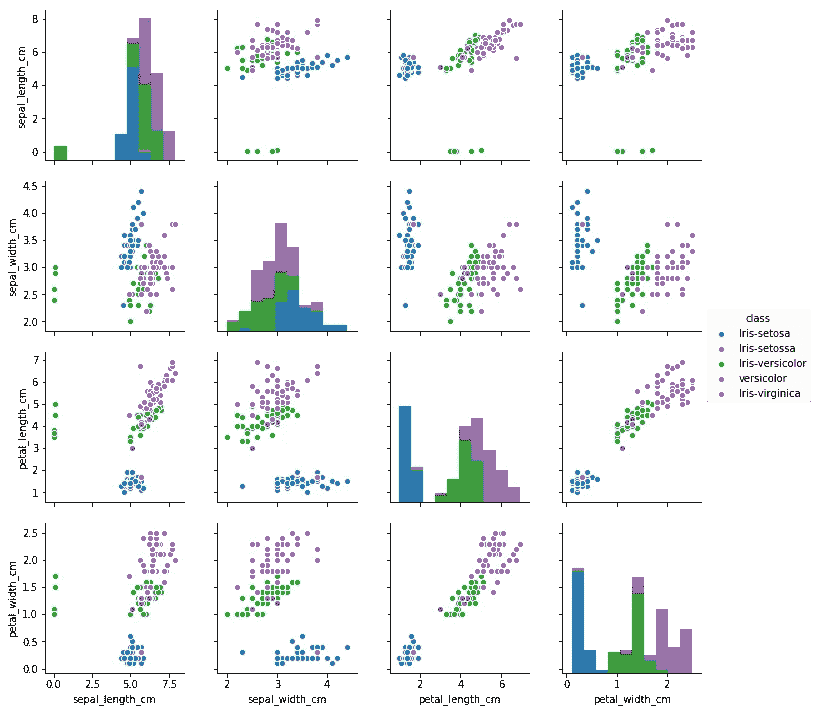

# 作为软件的数据科学:从笔记本到工具[第 1 部分]

> 原文：<https://towardsdatascience.com/data-science-as-software-from-notebooks-to-tools-part-1-253a39e4fc0a?source=collection_archive---------15----------------------->

现在有很多关于数据科学的炒作，许多人只知道这个有趣工作领域的某些方面。当数据科学家产生了伟大的 MVP(最小可行产品)但未能继续前进时，一个巨大的挑战就出现了。在本文中，我想展示数据科学的一个可能的旅程，从项目的最开始到为移交做好准备。本系列文章的目标是从开发人员的角度展示数据科学项目的不同阶段，并为该领域的工作人员提供最佳实践。

让我们先从议程开始，然后再进入具体部分:

1.  设置您的工作环境
2.  数据探索的重要模块
3.  机器学习第一部分:数据预处理[ [第二部分](/data-science-as-software-from-notebooks-to-tools-part-2-e1d1bf99d067)
4.  机器学习第二部分:模型[ [第二部分](/data-science-as-software-from-notebooks-to-tools-part-2-e1d1bf99d067)
5.  从朱庇特[ [第三部](/data-science-as-software-from-notebooks-to-tools-part-3-84023404d428) ]继续
6.  闪亮的东西:我们什么时候得到一个前端？[ [第三部分](/data-science-as-software-from-notebooks-to-tools-part-3-84023404d428)
7.  您在代码中的日常工作:保持标准[ [第 3 部分](/data-science-as-software-from-notebooks-to-tools-part-3-84023404d428)

1.  设置您的工作环境

每个数据科学项目都从设置您的工作环境开始。但是在我们这样做之前，在开始编码之前，每个编程任务的第一个问题必须首先回答:你选择什么语言？

对于数据科学来说，这非常清楚:使用 Python！随着 Python 成为 2018 年第七大最常用的编程语言([https://insights . stack overflow . com/survey/2018/# technology-programming-scripting-and-markup-languages](https://insights.stackoverflow.com/survey/2018/#technology-programming-scripting-and-markup-languages))，它已经在许多人当中广受欢迎。事实上，许多可用的工具简化了您的旅程，并且有很好的社区支持，可以肯定这将是您在数据科学领域的主要编程语言，本文就是基于这一事实。当然，在这种情况下，其他语言也是有效和必要的(SQL、HTML 等)。)但是我们将首先关注 Python 来开发数据科学项目的核心。

所以，首先要做的是:如何安装 Python？最简单的方法是使用 [Anaconda，](https://www.anaconda.com/distribution/)因为它附带了两个包管理工具，多个工具和包供您使用，并且您可以安装在任何操作系统上。

随着 Anaconda 成为您的语言分发工具， [PyCharm](https://www.jetbrains.com/pycharm/) 将成为我们 IDE(集成开发环境)的首选。PyCharm 由 JetBrains 开发，将许多工具和特性集成到其 IDE 中，仅举几例:

*   饭桶
*   Dockerfile 文件
*   自动缩进、自动完成
*   代码拼写检查
*   内联代码运行

为什么不是一个简单的文本编辑器？因为本文的目标是展示如何准备数据科学项目，以便将它们移交给生产开发，所以您需要与不同的开发人员或开发团队协作。使用可用的工具来简化这项任务是我们需要使用 ide 的原因。此外，您不需要经常担心 CTRL+S'ing，因为 PyCharm 具有自动保存功能。

在开始项目之前，有必要为您的项目设置一个虚拟环境。什么是虚拟环境，为什么需要虚拟环境？假设您不会为每个单独的项目更换计算机，虚拟环境允许您将每个项目的依赖项彼此分开。一个非常明显的例子是，当您为一个项目运行 Python 2，而为另一个项目运行 Python 3 时。虚拟环境允许您分离这些 Python 版本。除此之外，如果将它们安装到一个环境中，您还可能会有不同的包依赖关系，并且会相互干扰(例如 Tensorflow 1.x 与 Tensorflow 2.x)。因此，在开始一个新项目之前，用 conda 终端创建一个虚拟环境:

```
conda create -n [ENVIRONMENT_NAME] python=PYTHON_VERSION
```

这将在 conda 的标准位置使用您想要的 python 版本创建一个新的虚拟环境。使用以下命令激活该环境，您就可以开始了:

```
activate [ENVIRONMENT_NAME]
```

你还需要将你的虚拟环境链接到你的 PyCharm IDE，关于这个的教程可以在[这里](https://github.com/NatholBMX/CV_Introduction)找到。这允许您直接从 PyCharm 运行代码，并利用 IDE 的功能，例如使用调试器。

需要的最后一步是在您的虚拟环境中安装一个 Jupyter 内核，该内核链接到您的虚拟环境。这可以通过激活虚拟环境并运行以下命令来实现:

```
pip install ipykernelpython -m ipykernel install --user --name [VIRTUAL_ENVIRONMENT_NAME] --display-name "[DISPLAY_NAME]"
```

这些命令的作用是安装 Jupyter 内核包，并使用您的虚拟环境创建一个定制的 Jupyter 内核供您选择。关于 Jupyter 的更多信息以及它为什么有用可以在下一段找到。设置好环境后，让我们从最重要的包开始。

2.用于数据探索的重要 Python 模块

有了您的环境，我们可以更深入地了解开始您的数据科学项目所需的工具:数据探索。不管你得到的数据是什么，你总是需要去探索它。有很多特定的工具可以用来完成这项任务，但是这里列出了最相关的工具。

这个名单上的第一名当然是朱庇特。Jupyter Notebook 是一个工具，它将代码、代码的输出、markdown 和任何可视化内容结合在一个文档中。它用于快速原型和可视化，因此是探索性数据分析的伟大工具，也是您踏上数据科学之旅的第一步。一个非常好的笔记本的例子可以在这里找到:[https://nb viewer . jupyter . org/github/rhi ever/Data-Analysis-and-Machine-Learning-Projects/blob/master/Example-Data-science-notebook/Example % 2520 Machine % 2520 Learning % 2520 note book . ipynb](https://nbviewer.jupyter.org/github/rhiever/Data-Analysis-and-Machine-Learning-Projects/blob/master/example-data-science-notebook/Example%2520Machine%2520Learning%2520Notebook.ipynb)

你可以在那里找到融合成一个有用文件的不同格式:你有 Markdown 来描述正在发生的事情，结合图片和文本信息来分享必要的领域知识。Python 代码和每个单元各自的输出显示在它的下面。此外，任何可视化都可以直接显示在代码行之间:



Visualization of the Iris dataset ([Source](https://nbviewer.jupyter.org/github/rhiever/Data-Analysis-and-Machine-Learning-Projects/blob/master/example-data-science-notebook/Example%2520Machine%2520Learning%2520Notebook.ipynb))

作为数据科学家，这不仅有助于您探索数据并生成第一个代码原型，您还可以轻松地与其他感兴趣的人分享您的成果。

但是朱庇特和熊猫在一起是不完整的。Pandas 是一个 python 包，允许您对表格数据和时间序列数据进行数据分析。你可以把熊猫描述为巨蟒的兴奋剂。让我们来看看一个非常简单的方法:我们加载[虹膜数据集](https://en.wikipedia.org/wiki/Iris_flower_data_set)并显示其中包含的第一个条目。对于熊猫，我们得到了以下结果:

Loading a dataset into Pandas

接下来，让我们讨论两个最重要的包:NumPy 和 SciPy。NumPy 是一个对类似数组的数据提供高效计算的包。SciPy 是一个为 Python 提供科学和数值计算工具的包。总之，这些包是任何数据科学项目的支柱。从非常简单的统计分析开始，例如获得数字数据的标准偏差，您可以操作数组，运行算法，例如快速傅立叶变换等等。

数字分析并不是数据探索的全部:通过可视化，您将获得对数据的更多洞察。为此，可以使用许多软件包，但其中最突出的一个是 Matplotlib。Matplotlib 是一个绘图库，允许您快速查看数据发生了什么，从而获得新的见解。看一下上面的虹膜数据集的例子，它有两个特征:

Visualizing two features of the Iris data set

您可以看到萼片长度的直方图，以及不同例子的萼片长度和萼片宽度的散点图，并且已经对所提供的数据有了直观的了解。

有了这个初始设置，您应该准备好开始您的数据科学之旅。第 2 部分将处理更有趣的部分:数据准备和创建机器学习模型。