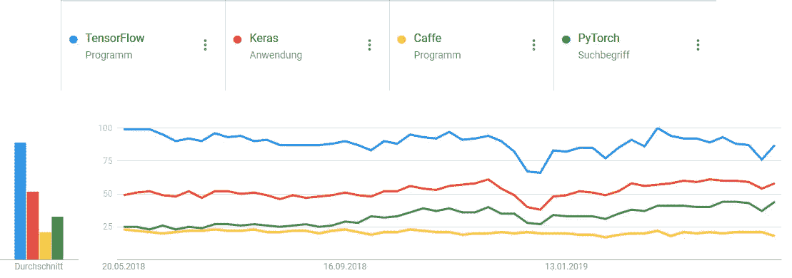
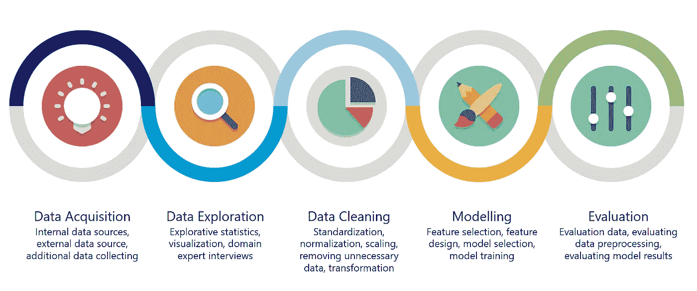

# 作为软件的数据科学:从笔记本到工具[第 2 部分]

> 原文：<https://towardsdatascience.com/data-science-as-software-from-notebooks-to-tools-part-2-e1d1bf99d067?source=collection_archive---------19----------------------->

这是关于如何确保您的数据科学项目能够从原型进入生产环境的系列文章的第 2 部分，以及实现这一点的必要步骤。在深入细节之前，让我们先从议程开始:

1.  设置您的工作环境[ [第 1 部分](/data-science-as-software-from-notebooks-to-tools-part-1-253a39e4fc0a)
2.  数据探索的重要模块[ [第一部分](/data-science-as-software-from-notebooks-to-tools-part-1-253a39e4fc0a)
3.  机器学习第一部分:数据预处理[第二部分]
4.  机器学习第二部分:模型[第二部分]
5.  从朱庇特[ [第三部](/data-science-as-software-from-notebooks-to-tools-part-3-84023404d428) ]继续
6.  闪亮的东西:我们什么时候得到一个前端？[ [第三部分](/data-science-as-software-from-notebooks-to-tools-part-3-84023404d428)
7.  您在代码中的日常工作:保持标准[ [第 3 部分](/data-science-as-software-from-notebooks-to-tools-part-3-84023404d428)

**机器学习第一部分:数据预处理**

数据科学中最重要也是最耗时的任务是数据预处理:清理数据、选择要素或生成新要素。幸运的是，我们有大量的工具可以帮助我们完成这项任务。让我们从基本上所有项目中使用的通用工具开始，然后从那里继续到特定的领域。

在每个列表的最顶端，你总是会看到熊猫。[第 1 部分](/data-science-as-software-from-notebooks-to-tools-part-1-253a39e4fc0a)已经强调了 Pandas 是一个数据探索工具，但是这个库提供了更多，尤其是结合了 [numpy](http://www.numpy.org/) 。

一个非常简单的例子就是 [Titanic](https://www.kaggle.com/c/titanic) 数据集。这个数据集包含泰坦尼克号上的乘客信息，可以用来预测乘客是否能够生还。在这个数据集中，我们已经可以处理一个最令人沮丧但也经常发生的事实:丢失数据。在这种情况下，乘客信息有时会遗漏乘客的年龄。为了缓解这种情况，我们可以用乘客年龄的平均值来填充这些条目。本要点说明了如何:

深入研究机器学习，你最终将不可避免地使用 [scikit-learn](https://scikit-learn.org/stable/) 。这个库提供了你可能遇到的最全面的机器学习方法。这里我想强调一下您可以使用的预处理工具。

关于 sklearn 预处理能力的全面概述可以在他们的[网站](https://scikit-learn.org/stable/modules/preprocessing.html)上找到，但我想对 titanic 数据集的方法做一个快速概述。

将数据缩放到 0 到 1 之间的范围是一种非常标准的方法，可以通过安装 sklearn 提供的 scaler 方法轻松实现:

其他主要方法包括非线性变换，例如将数据映射到均匀分布或高斯分布、分类数据编码、连续数据离散化或生成多项式要素等。总而言之，现在应该很清楚，sklearn 提供了许多工具和方法，您可以在项目中使用它们来预处理您拥有的数据。

在没有特定领域的情况下，拥有一个通用的库是很好的，但是当您遇到特定领域的问题时，通常需要更多的库。根据您工作的领域，Python 中有不同的库可用。

让我们从图像开始，因为计算机视觉非常受欢迎，并且有很多机会应用数据科学。这里流行的库包括艾德里安·罗斯布鲁克的 [openCV](https://opencv.org/) 、 [imutils](https://github.com/jrosebr1/imutils) 和 [Pillow](https://pillow.readthedocs.io/en/stable/) 。坦率地说，大多数任务已经可以用 openCV 完成，另外两个库是填补空白的很好的补充。如果你对 Python 中计算机视觉入门的一般介绍感兴趣，你可以看看我的知识库:[https://github.com/NatholBMX/CV_Introduction](https://github.com/NatholBMX/CV_Introduction)

当处理音频数据时，对于音频数据的一般处理，没有什么比 [Librosa](https://librosa.github.io/librosa/) 更好的了。提取音频特征，检测你的音频细节(如开始，节拍和速度等。)或分解光谱图。Librosa 是您音频处理的首选解决方案。

就文本数据而言，您可以使用这里的任何或所有自然语言处理(NLP)库: [spaCy](https://spacy.io/) ， [gensim](https://radimrehurek.com/gensim/) ， [NLTK](https://www.nltk.org/) 。这些库有不同的可用特性，您可以结合使用它们。我将 spaCy 用于与 NLTK 的词干支持相结合的文本数据预处理。Gensim 提供了相同的功能，但我更喜欢这个库来训练特定的模型(例如 [Word2Vec](https://en.wikipedia.org/wiki/Word2vec) )。

使用这些库是一个起点，因为许多问题已经可以用这些库解决了。预处理数据是一个必要的步骤

**机器学习第二部分:模型**

数据科学中的建模不仅包括选择模型，还包括定义和设计合适的特性供模型使用。清理和预处理数据后，有多个库可供您在此阶段使用。

sklearn 经常出现在这个列表中，但是有必要再一次包括这个库，因为它对所支持的特性和算法非常详尽。Sklearn 提供了监督学习和非监督学习的模型，但我们将专注于前者。从简单模型(例如，广义线性模型)开始，它包括支持向量机、朴素贝叶斯、基于简单树的模型以及对神经网络的基本支持。

如果这还不够，您可以通过包含特定于模型的库来增加选择的可能性。对于基于树的模型，有 [LightGBM](https://github.com/microsoft/LightGBM) 、 [XGBoost](https://xgboost.readthedocs.io/en/latest/) 或 [catboost](https://github.com/catboost/catboost) 。

深度学习领域，即涉及神经网络工作的所有领域，提供了许多库，但最著名的可能是与 [Keras](https://keras.io/) 、 [PyTorch](https://pytorch.org/) 或 [Caffe](https://caffe.berkeleyvision.org/) 结合的 [Tensorflow 2.0](https://www.tensorflow.org/install) 。有许多不同的“本月特色”DL 框架，因此快速比较一下提到的那些应该会让您知道一般使用什么:

Google Trends for different Deep Learning frameworks

让我们回顾一下数据科学工作流，看看我们目前所处的位置。该过程可分为以下几个步骤:

Data Science Workflow

数据获取:如果你认为所有需要的数据都是现成可用的，那就太好了，但现实却并非如此。第一步包括导入内部数据源(如公司数据库)，也可能是外部数据源(如网络爬行)，甚至是收集你自己的数据。

数据探索:对数据有一个基本的了解是至关重要的，所以这一步包括探索性统计(Pandas 在这方面特别有用，尤其是与 Jupyter 结合)，可视化你的发现，甚至进行领域专家访谈。当数据科学家拥有他们工作领域的知识时，他们的工作会更好。为了促进这一点，当数据科学家缺乏领域知识时，您需要与领域专家合作。

数据清洗:正如本系列文章的这一部分所描述的，这一部分需要清洗和缩放技术，例如标准化。此外，不要犹豫，从简单开始，逐渐增加你的解决方案的复杂性。这意味着:删除您当前不需要或不使用的不必要数据，以简化您的解决方案。

建模:选择你的方法所需的相关特征或设计特征(例如用 Librosa 生成声音特征)。选择或设计解决方案所需的模型，并训练这些模型。

评估:这是一个很大的部分，因为你需要确保你的数据是适合的任务，你的数据预处理是正确的，模型给出了预期的结果。

这些步骤是迭代完成的，这意味着你多次通过这个过程，而且每个步骤也多次通过。例如，选择不同的要素会影响您需要如何预处理数据以及模型的外观。

到目前为止，在这些系列中，我们已经涵盖了除评估之外的工具所支持的工作流的每一个部分。评估您的结果是一个持续的过程，我目前不知道有任何工具可以可靠地支持您完成这项任务。

第 3 部分将介绍如何从 Jupyter 继续前进，如何处理前端和代码质量。