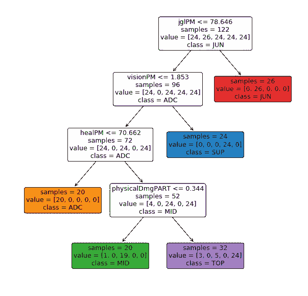

# 作为电子竞技表现和策略支撑的数据科学(一)

> 原文：<https://towardsdatascience.com/data-science-as-support-of-esports-performance-and-strategies-i-d511843b00a1?source=collection_archive---------15----------------------->

## 第一步:关于英雄联盟世界锦标赛的一般案例研究

## 在进入主题之前，这里有一些关于驱动这个项目的动机的免责声明和信息。

这篇文章的目标读者是任何想要参与数据分析的**体育/电子竞技**或**科技爱好者**。我在这里的主要目标是探索各种数据科学工具，从统计分析到机器学习技术，以便获得理解电子竞技中的性能或策略轴的新钥匙。由于它将专注于英雄联盟，所以读者最好至少对游戏规则有基本的了解。

本文是一个系列的第一集。作为对主题的初步了解，这里讨论的两个主要观点是:

*   如何获取数据。
*   发现未来分析的轴心。

这个系列将是一个游乐场和实验场所。由于我还没有为任何运营团队工作，**性能将不是唯一的关注点**。我的动机大多是将各种机器学习技术应用到一个我很了解的话题中；我相信通过这种方式可以发现新的知识或线索(也许不会)。

# 哪些数据？

在欧洲举办的第九届英雄联盟世界锦标赛以 FunPlus Phoenix 的胜利结束，这是中国队第二次背靠背。每年的世界锦标赛都是一年比赛的总结。24 支队伍从全球 13 个地区、127 名选手和一百多场比赛中脱颖而出。

这个锦标赛，也称为世界锦标赛，是一个非常好的分析主题，原因有很多:

*   合理的**数据量**。
*   来自所有不同地区的玩家和策略的多样性。
*   这是目前为止最受关注的比赛，所以我们有很多已经完成的分析、资源和材料。

我们也可以添加大联盟常规赛的数据，如果我们想发现更多关于地区比赛风格，球员简介，选秀优先权的一般事情…

# 怎么会？

知道分析什么是一回事，**获取数据**是另一回事。

令人高兴的是，开发游戏的公司 Riot Games 提供了一些关于每个公共游戏的非常详细的数据。通过它的**公共 API** ，我们可以得到很多关于比赛和球员的不同数值和指标。

然而，锦标赛是在不同的服务器上运行的，而不是普通玩家使用的服务器。因此，我们不得不使用变通办法，不从公共 API 获取数据，而是从另一个提供几乎相同类型数据的服务器获取数据。我们唯一需要的是获得每个游戏的**标识符，这可能很难找到。感谢[*Tim Sevenhuysen*](https://twitter.com/TimSevenhuysen)*和他的项目 [*Oracle's Elixir*](https://oracleselixir.com/) ，通过下载整个季节拆分的转储并选择我们想要的列，这些数据可以自由而简单地获得。*所以真的，对他大感恩*。***

**

*Actors involved, querying architecture and steps.*

*既然甲骨文的灵丹妙药已经是关于聚合大联盟的数据，那么这种工作有什么意义呢？主要目标是获得一个**更高粒度的**和**更完整的数据**，我们是否需要关注游戏的特定方面，比如玩家、冠军、团队、地域、丛林路径、玩家分项……它不应该受到架构的限制。同样，使用相同的代码，未来的扩展将有可能获得**常规排名游戏**数据。如果我们想要一个巨大的体积，更普遍的趋势或侦察工具，这将是非常有趣的。*

# *涉及的技术*

*在这样的项目中很少会用到技术。我们的目标是拥有一个有效的已经被证实的技术堆栈，而不是试验新的架构。以下是这些工具的简要概述:*

*   *Python:如果你想学习当代数据分析或机器学习，那么 python 应该是你的主要关注点。从简短而强大的语法、解释语言的优势和大量编译库来看，python 通过像 *Pandas* 、 *Tensorflow* 、 *Scikit* 或 *Seaborn* 这样的工具，提供了一些高质量的**数据处理**、**学习**或**可视化**工具。*
*   *Jupyter:由于为这一系列文章所做的工作更多的是一种探索性的工作，而不是为每个人构建一个健壮的框架，所以笔记本环境非常适合。这样，编码更加灵活，让测试和试验阶段有更多的空间。*
*   *MySQL:我们需要存储的数据是明确预定义的，可能已经存储在原始数据库的关系模型中。此外，我们需要一个可以查询大量数据并汇总结果的工具。SQL 和 MySQL 实现可以免费使用，并且非常健壮。*
*   *Tableau:在未来的分析中，除了 python 中产生的可视化，我还可以使用这个软件作为补充。*

**

*Database relational model.*

*这个数据库模型是原始的，但是严格遵循 Riot API 返回的 JSON 结构(树结构)。此外，Oracle 的 Elixir 中的一些竞争信息存储在 GameMetadata 中。时间线信息尚未整合，因为此类数据需要更全面的关注。它们将被整合起来进行具体分析。*

*请注意，玩家和团队并不代表竞争环境中的独特实体，如 G2、Invictus Gaming 或 Doublelift。它存储了一个球员在一场比赛中的实际状态，而一个球队在这场比赛中只有 5 名球员。拥有能够跟踪球员结构和移动的实体是件好事，特别是在 T2 时代。但这样的工作需要大量的手工工作，是另一项任务，完全可以在未来的扩展中作为一个新的层添加。*

*但是，对于竞技游戏来说，我们必须认识到数据的质量。通过对游戏中的用户名进行简单的分割，我们可以以统一的方式检索团队的**标签和**用户名**，这大大简化了未来的分析。还有玩家好像是按**角色**排序的，这也是一个真正有用的值。***

## *最后，一些分析。*

*作为对分析工作的第一次审视，我们必须选择一种方法。数据集提供了许多可能性，无论我们是想专注于球队、挡拆、区域打法……这篇文章已经很长了，目标主要是展示数据准备过程。我认为首先关注球员和角色之间统计数据的差异可以提供数据集的一个很好的**概览。***

# *面向特征的分析*

*在下面的分析中，数据是世界锦标赛中每个球员的汇总(平均值)。我们只选择至少打了 3 场比赛的球员，以避免有偏见的平均值。几乎每一个值(=特征)都根据比赛的持续时间进行标准化:一个玩游戏时间越长的玩家，总伤害越大。然后，我将使用一些后缀来引用规范化方法:*

*   *AVG / **平均值**:最简单的聚合。它使用可用游戏的平均值。*
*   *PM / **每分钟**:总值除以总时长。这种方法假设所有值都是随时间线性变化的。这并不总是正确的，例如，冠军在游戏后期比早期造成更多的伤害。但在我看来，相对于原始值，这是一个很好的权衡。*
*   *部分/部分或**百分比**:该值表示为包含它的另一个值的一部分。例如，魔法、物理和真实伤害是总伤害的三个互补的子部分。*

*获得所有变量的清晰概览的一个非常实用的工具是相关矩阵。每一列都与所有其他列进行比较。无需深入定义，相关性研究两个随机变量是**正相关**(蓝色)、**负相关**(红色)还是**独立**(白色)。*

> *警告:相关性不是因果关系*

*当列没有排序时，相关矩阵可能难以阅读。作为补充，我们可以使用**凝聚聚类，**如果我们将相关性视为相似性。这样，我们就有了一棵相关变量在更近的叶子上的树。*

**

*Correlation matrix, with scale, agglomerative tree and clusters.*

*解释视觉矩阵和树的每一个结论都会适得其反。然而，有趣的是至少有几条线索可供未来分析:*

*   *在以绩效为导向的工作中，主要目标是最大化胜率。我们可以观察到**大部分量化指标都与**和it 相关，其中参与杀伤和助攻的数值较高。作为第一种解释:玩家在有组织的/集体的战斗中取得胜利的队伍会得到更好的奖励。*
*   *我们还可以观察到一些与胜率反相关的数值。显然，我们在这里检索死亡和损失。但是有些价值并不是那么明显:游戏持续时间、物理伤害和人群控制也是反相关的。这些指标可以给我们关于元游戏的提示，并且可以进行更深入的研究。*
*   *与支援角色相关联的视野、守卫和辅助与诸如耕作、获得的黄金或伤害输出等附带价值有很大区别。*
*   *炮塔上的伤害与丛林农场高度相关，这突出了这个角色对车道压力和目标恢复的作用。*
*   *第一滴血的出现与胜率只有轻微的关联，似乎并不显著。它不应被视为期货分析的主要特征。*

# *面向角色的分析*

*我们看到一些功能可以被聚集并与特定的游戏角色相关联。我们可以根据角色查看这些变量的分布和预测，看看我们是否真的可以更深入地关注一些特定的任务(丛林、广告宣传、单飞、中层或高层以及支持)。*

**

*Pair-plot of selected variables : scatter-plots and distributions highlighted by roles.*

**

*Decision tree with role as target.*

*我们可以在投影上观察到，丛林和支援角色实际上是分开的，可以很容易地聚集在一起。为了证实这个假设，我们可以对我们的类应用决策树。*

*这里的目标不是能够真正预测一个玩家的角色，而是对职业的重叠有一个概念。*

*通过视觉分析得出结论，丛林和支援都可以用**非常简单的规则**分开，这要归功于每分钟分别应用的丛林农场和视觉。*

*我们可以观察到进位(Solo laner:Top 和 Mid，Botlaner : ADC)具有更多相似的轮廓，并且更难分离。在未来的分析中，我们可以将重点放在 **3 个不同角色**的个人资料上:丛林、支持和运输。*

**

*Principal Component Analysis, with roles, axis representation and some player labels.*

*作为第三项检查，我们还可以对数据集应用降维算法，以仅在 2 个轴上表示变量的最大方差。*

*我们再次检索我们的 3 个集群。此外，通过观察空间中的球员，我们感觉这可能与表现出色的球队的球员有关。这是第一个线索，但一个主要目标是观察**的表演和每个角色的打法。***

# *结论*

*在这篇文章中，我们已经看到了两个主要步骤 t **走向更专业的分析**:*

*   ***数据准备**步骤，包括查询架构、涉及的技术和关系模型。*
*   ***概述**关注玩家的不同变量及其与游戏角色的关系。*

*下一篇文章可能会关注世界锦标赛期间的丛林者或支持者，试图了解不同比赛风格的效率。*

> *欢迎任何关于技术、方法、动机或结论的评论或问题。欢迎通过我的推特账号@swnw_dev 联系我。*
> 
> *这里有一个包含笔记本和 SQL 文件的存储库:[https://github.com/Hugoswnw/league-analysis](https://github.com/Hugoswnw/league-analysis)。原始数据不公开。*

*谢谢你的时间。*