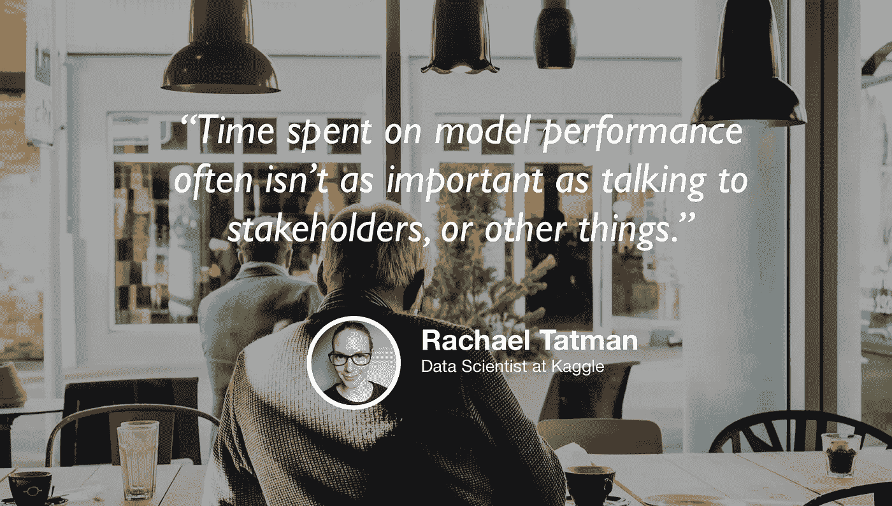

# Kaggle 的数据科学

> 原文：<https://towardsdatascience.com/data-science-at-kaggle-9c1e17859d4b?source=collection_archive---------26----------------------->

## [苹果](https://podcasts.apple.com/ca/podcast/towards-data-science/id1470952338?mt=2) | [谷歌](https://www.google.com/podcasts?feed=aHR0cHM6Ly9hbmNob3IuZm0vcy8zNmI0ODQ0L3BvZGNhc3QvcnNz) | [SPOTIFY](https://open.spotify.com/show/63diy2DtpHzQfeNVxAPZgU) | [其他](https://anchor.fm/towardsdatascience)

## Rachael Tatman 在 [TDS 播客](https://towardsdatascience.com/podcast/home)

*编者按:这是迈向数据科学播客“攀登数据科学阶梯”系列的第 12 集，由 Jeremie Harris、Edouard Harris 和 Russell Pollari 主持。他们一起经营一家名为*[*sharpes minds*](http://sharpestminds.com)*的数据科学导师创业公司。可以听下面的播客:*

最近我经常被问到的一个问题是，为了在数据科学领域找到一份工作，研究生学位——尤其是博士学位——是否是必要的。当然，不同公司的教育要求差异很大，这就是为什么我认为这个问题最有价值的答案往往不是来自招聘人员或招聘经理，而是来自那些拥有高级学位的数据科学家，他们可以判断这些数据是否真的有用。

不过，这远不是我想在本期播客中与雷切尔·塔曼坐下来谈谈的唯一原因。除了拥有计算社会语言学博士学位，Rachael 还是 Kaggle 的一名数据科学家，也是一名受欢迎的直播程序员(点击这里查看她的 Twitch stream)。她对如何进入数据科学领域、如何充分利用 Kaggle、NLP 的未来以及研究生学位对数据科学角色的价值有很多深刻的见解。

以下是我们聊天中的一些最大收获:

*   研究生院并不适合每一个人，有很多原因可以让你在没有研究生院的情况下一头扎进求职大军。尤其是博士学位需要很长时间才能完成，而且不能保证你在学习期间学到的过时知识在毕业时不会过时。
*   Kaggle 上没有足够多的人利用的一件事是 Kaggle 内核——基本上是 Kaggle 用户分享他们关于竞争战略或一般数据科学问题的想法的论坛。如果你想看看有能力的数据科学家之间的对话是什么样子，这是一个很好的去处！
*   尽管博客和 MOOCs 可以很好地学习数据科学，但它们教不好的一件事是*过程*。数据科学家如何修复他们代码中的错误？可以将错误信息复制/粘贴到 Google 中吗？答案当然是肯定的，但看到一位真正的数据科学家像 Rachael 在 Twitch 上那样直播她的问题解决过程，可以让你看到你应该在项目中使用的思维过程。

你可以在推特@rctatman 或她的 [Twitch stream](https://www.twitch.tv/rctatman) 上关注瑞秋。

我们正在寻找能与我们的观众分享有价值的东西的客人。如果你碰巧知道谁是合适的人选，请在这里告诉我们:【publication@towardsdatascience.com】T4。