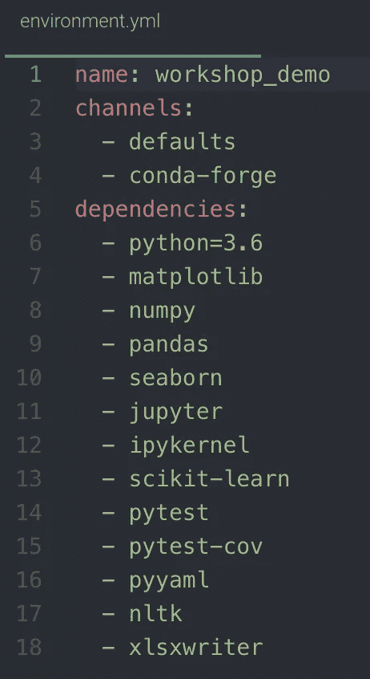

# 数据科学最佳实践:Python 环境

> 原文：<https://towardsdatascience.com/data-science-best-practices-python-environments-354b0dacd43a?source=collection_archive---------18----------------------->


Photo by [Tracy Adams](https://unsplash.com/@tracycodes?utm_source=medium&utm_medium=referral) on [Unsplash](https://unsplash.com?utm_source=medium&utm_medium=referral)

# 什么是 Python 虚拟环境？

虚拟环境是隔离的编码空间，可以在其中安装、升级和使用 Python 包，而不是在您的工作环境中全局安装包。虚拟环境可以用. txt 或。yml 文件，它通过终端/命令提示符/anaconda 提示符列出了软件包名称及其版本。当您安装或升级软件包时，旧版本仍安装在您的目录中，因此不同的虚拟环境可以使用不同的软件包版本。

# 为什么在数据科学中使用虚拟环境？

想象一下，你花了几个月的时间清理、操作、创建特征、训练你的模型、改进模型、评估你的模型性能；你操作你的模型并投入生产。此时，您还没有听说过虚拟环境，所以您进入了下一个项目。您找到了下一个项目需要的 Python 包，但是您首先必须更新比如说 Pandas，所以您决定使用以下命令一次性更新您的所有包:

```
conda update --all
```

你开始了你的一天，但是从你最近的一个项目中得到一个警告，告诉你有东西坏了。如果你够幸运，并且这个 bug 并不模糊，你就能够修复它。然而，如果你像我的同事一样不幸，碰巧在一个服务器上运行你的生产模型，并且你破坏了整个 Python path 环境，那么，运气不好。是时候清理干净并托管新服务器了。

您还可能希望使用特定于项目的虚拟环境，通过在环境中指明所有包及其指定版本来确保代码的可再现性。通过使用虚拟环境，您还可以绕过安装软件包时可能需要的管理员权限。最后，使用环境是您可以更好地组织项目的另一个步骤，或者当您只需要一个项目时，避免将包安装到您的默认路径。

# 如何创建和安装虚拟环境？

以下是使用 conda 创建环境的方法之一

```
conda create --name myenv    ## Replace myenv with environment name
```

上面的代码将在当前路径中创建环境，使用的 Python 版本与您当前使用的版本相同，因为您没有指定版本。您可以通过以下方式激活此环境:

```
conda activate myenv  ## Replace myenv with environment name
```

一旦环境被激活，您就可以正常安装软件包，它只会被添加到该环境中。如果要在创建和激活环境之前指定软件包，可以创建一个文件并将文件扩展名更改为。格式如下的 yml。*名称*部分将是您激活环境时使用的环境名称。



在你喝完之后。yml 文件就绪，执行此操作以从文件创建环境:

```
conda env create -f environment.yml
```

*的名字是 environment.yml* 。yml 文件。

# 将环境安装为您的 Jupyter 笔记本内核

对于喜欢使用 Jupyter 笔记本的人来说，这是非常重要的一步。

```
python -m ipykernel install --user --name myenv
```

如果不执行这一行，您将无法使用刚刚在 Jupyter 笔记本中创建的环境。

# 更新您的环境

如果您由于以下原因需要更新您的环境:

*   您的一个核心依赖项的新版本发布了
*   需要安装额外的软件包
*   或者你不再需要一个包裹

编辑您的。yml 文件，编辑包名，然后保存它。打开终端/命令提示符，导航到的目录。yml 文件并运行以下代码:

```
conda env update --file environment.yml --prune
```

# 克隆环境

您可以在终端/命令提示符下使用以下代码来制作环境的精确副本:

```
conda create --name clonename --clone myenv
```

*clonename* 将是您想要命名您的克隆环境的名称， *myenv* 是您想要克隆的环境的名称。

# 谢谢你看我的文章！

**如果你觉得这篇内容很有帮助，并想阅读我的其他内容，请随时关注我:** [Twitter](http://www.twitter.com/datascitips)
[insta gram](http://www.instagram.com/datascitips)
[脸书](http://www.facebook.com/datascitips)
**我会发布一些对你有用的数据科学技巧和窍门！**