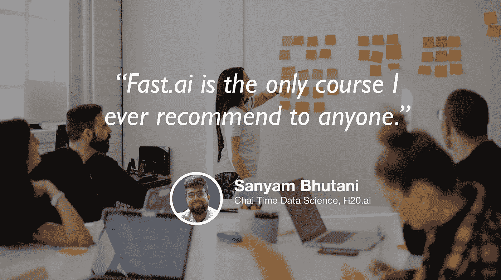

# 课堂之外的数据科学

> 原文：<https://towardsdatascience.com/data-science-beyond-the-classroom-f9e210d37953?source=collection_archive---------33----------------------->

## [苹果](https://podcasts.apple.com/ca/podcast/towards-data-science/id1470952338?mt=2) | [谷歌](https://www.google.com/podcasts?feed=aHR0cHM6Ly9hbmNob3IuZm0vcy8zNmI0ODQ0L3BvZGNhc3QvcnNz) | [SPOTIFY](https://open.spotify.com/show/63diy2DtpHzQfeNVxAPZgU) | [其他](https://anchor.fm/towardsdatascience)

## Sanyam Bhutani 在 [TDS 播客](https://towardsdatascience.com/podcast/home)

*编者按:这是迈向数据科学播客“攀登数据科学阶梯”系列的第 10 集，由 Jeremie Harris、Edouard Harris 和 Russell Pollari 主持。他们一起经营一家名为*[*sharpes minds*](http://sharpestminds.com)*的数据科学导师创业公司。可以听下面的播客:*

几年前，数据科学在理论和实践上并没有太大的区别:一个 jupyter 笔记本和几个导入就是你做有意义的数据科学工作所需要的全部。如今，随着课堂与行业现实的重叠越来越少，对于数据科学家来说，培养独立学习和打破常规的能力变得越来越重要。

很少有人像 Sanyam Bhutani 这样有效地做到了这一点，他是 H2O.ai 的一名即将上任的 ML 工程师，是排名前 1%的 Kaggler，受欢迎的博客作者和 Chai Time 数据科学播客的主持人。Sanyam 对课堂教学和行业需求之间的不匹配有着独特的看法:他在大学期间就开始做 ML 合同工作，并采访了一些世界顶级的 Kagglers，以更好地了解橡胶与数据科学道路的交汇点。

以下是我们从对话中获得的最大收获:

*   将初学者与有经验的数据科学家真正区分开来的最佳实践之一是维护一个实用程序脚本，在该脚本中保存您经常使用的方便的函数，如数据清理、数据提取、可视化等。随着您解决更多的问题，您的实用程序脚本将会增长，使您成为更高效的数据科学家，并允许您将更多的时间和注意力放在宏观问题上，而不是琐碎的细节上。
*   当你在数据科学领域从事合同工作时，按时交付产品比从你的模型中榨取额外的 0.1%的性能要重要得多。不要让完美成为优秀的敌人。
*   与最后一点相关，您可能会发现自己在想“对于我的模型来说，有多好才算足够好？”答案通常是，“尽我所能”时间是决定何时停止模型调优和优化的最重要因素。
*   说到网络，人们很容易高估会议的重要性。因为会议只是一次性事件，它们并不真正允许你随着时间的推移与人建立关系，关系才是最重要的。定期聚会通常是一种更好的方式，因为你可以在持续的基础上与同一批人建立社会资本。引用艾德的话，“会议是网络的舞蹈俱乐部。”]
*   数据科学社区异乎寻常地开放，如果他们得到了深思熟虑的帮助，大多数人都会很乐意提供帮助。问题是，大多数人不会向不认识的人伸出援手，因为他们担心社交尴尬的因素。克服你对这些接触带来的社交尴尬的恐惧是一个很大的竞争优势:这很容易做到(如果你没有得到回应，你所付出的代价是挫伤你的自尊)，如果成功了，它可以带来高价值的联系和见解。
*   如果你想与数据科学世界分享你的工作，解释清楚的博客通常会击败 GitHub repos。尽管数据科学社区可能是技术性的，但一份不错的、不太技术性的工作总结更容易被分享，也有助于展示你的沟通技巧。
*   与最后一点相关:不要害怕写失败的实验/项目。总会从无效的结果中吸取教训，告诉自己你会以某种方式写下你的工作是抵消失败恐惧的好方法，否则会限制你提出项目想法的雄心。

如果你在 Twitter 上，请随时与我联系 [@jeremiecharris](https://twitter.com/jeremiecharris) ！