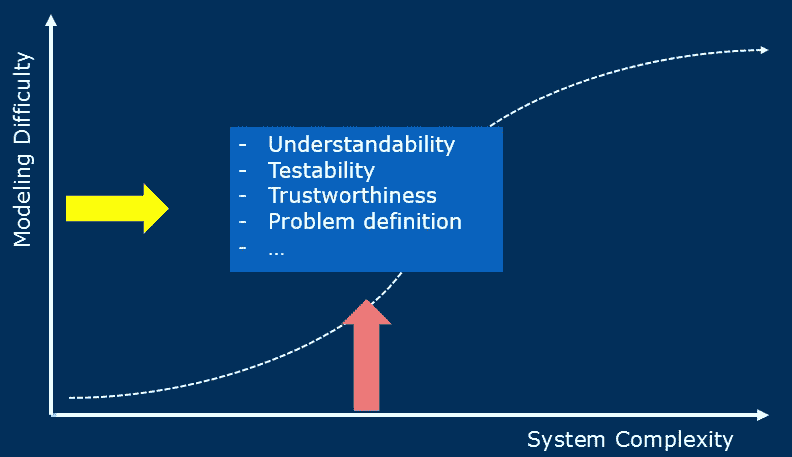
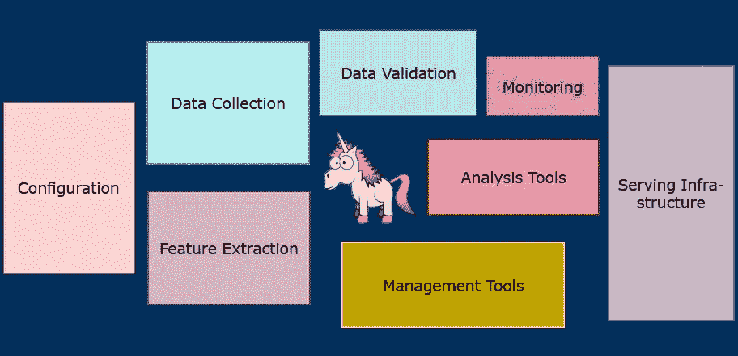

# 宣传之外的数据科学—您真正需要什么样的技能？

> 原文：<https://towardsdatascience.com/data-science-beyond-the-hype-what-kind-of-skills-you-really-need-3e66c1ab5235?source=collection_archive---------12----------------------->

**数据科学的宣传周期即将结束，成为数据科学家的技能也在发生变化。除了摆弄最佳性能的机器学习模型，让数据科学产生商业影响比以往任何时候都更重要。在柏林** [**达泰库**](https://www.dataiku.com/) **举办的分析&数据科学会议上，我讨论了当前有助于定义和构建数据科学工作流以交付真正价值的技能组合。我演讲的幻灯片你可以在这里找到******。****

****

**The Data Science Unicorn — Photo by [Andrea Tummons](https://unsplash.com/@krewellah87?utm_source=medium&utm_medium=referral) on [Unsplash](https://unsplash.com?utm_source=medium&utm_medium=referral)**

**在准备我的演讲时，我的一个“老”朋友在 LinkedIn 上联系了我。像我一样，他完成了神经科学的博士学位，现在正在数据科学领域寻找职业机会。此时，我在问自己:要成为一名数据科学家，他应该具备什么样的技能？我不认为成为一名成功的数据专家需要博士学位。你应该带着对数据的热情和强大的分析思维。但是需要哪些技能呢？**

**有那么多文章和观点不符合我自己的经历。具有讽刺意味的是，我还没有找到一个关于数据科学的好的或精确的定义，但却有相当具体和压倒性的期望。数据科学似乎被大肆宣传了。当然，我明白这种炒作是必要的(例如，分析上的竞争(D [avenport，2006)](https://hbr.org/2006/01/competing-on-analytics) 或者推动传统部门，如 IT 或营销)。**

**然而，我终于找到了一篇非常好的文章，作者是德国电信公司的数据科学家[张秀坤·海茨](/the-third-wave-data-scientist-1421df7433c9) (2019)。他确定了四个技能集群:**

****

****Figure 1:** “Skill portfolio of the third wave data scientist.”, Dominik Haitz**

1.  ****统计和算法工具箱:**数据科学家应该了解统计和机器学习的基础知识。我尤其喜欢“*算法工具箱*”这个术语。这意味着你手头应该有你熟悉的算法，并且可以在运行中应用于几个问题。**
2.  ****软技能:**这是一个非常重要的集群。根据我的经验，你可能会多次处理利益相关者的“感觉”。要“理解”他们，你需要一定程度的软技能😉。**
3.  ****商业思维:**这项技能在海茨的技能组合中占据核心位置(见图 1)。它涉及数据科学项目可以为企业带来的价值。**
4.  ****软件工程技术:**当一个数据科学模型只在你的笔记本电脑上运行时，会有什么影响？—建立有效的数据科学工作流需要软件工程原理的基本知识。**

**在我的 meetup 演讲中，我主要关注最后两个技能集群，因为我认为它们在所有这些大肆宣传的“如何成为数据科学家”文章中并不重要，但在我的日常业务中非常重要。**

# **从简单开始，逐渐变得复杂**

**关于机器学习及其对商业价值的影响之间的关系，有一种过于简单化的说法。Civis Analytics 数据科学总监 Skipper Seabold 谈到了“数据科学的可信度危机”( [Seabold，2019](https://www.datacamp.com/community/blog/credibility-crisis-in-data-science) )。这场危机是关于专注于机器学习算法或验证培训计划的细节而不了解业务需求的趋势。对于数据科学家来说，更重要的是对你公司的商业模式及其如何创造价值有一定程度的熟悉，因为这样你就会为最常见的情况做好准备( [Frei，2019](/why-the-data-science-venn-diagram-is-misleading-16751f852063) ):**

*   **企业遇到了问题或看到了潜力。**
*   **它想让你成为数据科学的独角兽。**
*   **它希望你创造/增加价值。**

**因此，价值可以有不同的含义。这可能意味着你从用于改变业务流程的数据中创造见解，或者你推动了“数据驱动的文化”。但大多数时候，预计你的项目会带来收入或/和利润的提升([海茨，2019](/the-third-wave-data-scientist-1421df7433c9) )。商业并不关心你的机器学习模型的细节( [Frei，2019](/why-the-data-science-venn-diagram-is-misleading-16751f852063) )，而是希望*你证明*你的模型正在创造价值。**

**那么，为什么对最先进的机器学习的关注无助于自动产生价值？数据科学的版图可以用两个维度来描述:**系统** **复杂度**和**建模** **难度**。系统复杂性总结了业务流程、依赖关系和 IT 基础设施的复杂性，而建模难度则涉及如何在数学空间中统计解决或转化问题([参见 Ramanathan，2016](https://medium.com/@anandr42/the-data-science-delusion-7759f4eaac8e) )。您的数据科学项目在这些维度上的位置会影响几个因素，这些因素对于您的项目成功以及被视为成功至关重要。**

****

**The data science landscape with the dimensions system complexity and modeling difficulty (cf. Ramanathan, 2016)**

1.  ****可理解性:**非数据人能理解问题的解决方法吗？根据事情的复杂程度，人们理解你的可能性会发生变化。**
2.  ****可测试性:**你的解决方案是可测试的吗？对于大多数简单的项目，您能够运行 A/B-测试，但是对于其他更复杂的项目，测试变得很困难(例如，优化物流过程)。**
3.  ****可信赖度:**这个因素其实也是受上面那些影响的！当人们无法理解你的解决方案，而你又很难证明你的解决方案更好/能带来提升时，他们会“不信任你”。**
4.  ****问题定义:**随着复杂性的增加，问题本身的公式化已经成为一种挑战——因为随着复杂性水平的增加，人们不会以同样的方式理解所有事情。**

**具体地说，在开始时，仅仅计算例如一些简单的概率(例如，购买概率)可能就足够了。简单的解决方案更容易被理解，也让你有可能更好地理解业务问题。此外，您将能够轻松测试您的解决方案(例如，以 A/B 测试的形式)，并证明您的数据科学方法正在增值。然后在下一步，您的解决方案可能会变得更加复杂(例如，通过添加更多参数或运行更复杂的机器学习模型)。由于您已经在第一轮中获得了企业的信任，因此您已经为数据科学项目的成功奠定了坚实的基础。**

# **为现实生活准备好你的独角兽**

**因此，您开发并测试了一个新的数据科学产品——您的 unicorn 软件。现在，真正的工作开始了:你必须帮助你的独角兽独立生活。在这里，你必须考虑你的软件的特性([甚至有一个 ISO 文档](http://www.sqa.net/iso9126.html))，在我的团队中，我们已经就这些达成一致:**

1.  ****稳定性:**你的软件应该有一定程度的容错能力，不应该出现非预期的行为。**
2.  ****可维护性:**更新/或更改/或修复你的独角兽应该很简单。**
3.  ****可伸缩性:**你的产品的性能应该是稳定的，运行流畅，不受外部因素的影响，比如数据量。**
4.  **对于给定的输入，你的代码应该总是产生相同的输出。**

**最后，只有很小一部分代码会真正处理实际的数据科学魔术(参见图 2)。其中大部分将处理数据收集、验证、特征提取、it 系统配置或与服务 IT 基础设施的交互等。([斯卡利等人，2016](http://wiki.esipfed.org/images/5/5f/NIPS-5656-hidden-technical-debt-in-machine-learning-systems.pdf) )。**

****

**Figure 2: The Life of your Data Science unicorn (after Sculley et al., 2016): A data science product is part of a more or less complex IT infrastructure. Only a small fraction of code is actually dealing with the actual product.**

**因此，你需要的软件工程技能应该包括，例如，以下组成部分(参见 [Boykis，2019](http://veekaybee.github.io/2019/02/13/data-science-is-different/) ):**

1.  ****学习一门编程语言及其一般概念:**你学的是 R 还是 Python，甚至是 Java，其实都不重要。最重要的是，你要熟悉一种编程语言，并理解它的概念。把学习一门编程语言更多地看作一门学科。**
2.  ****SQL 和数据仓库:** SQL 是每个数据科学项目的基础，也是一项非常重要的技能。熟悉数据仓库概念和不同的数据库。了解如何在数据库中自动查询。**
3.  ****版本控制:**您的数据科学软件会不断变化(例如，新的更复杂的功能)。当你学习像 git 这样的版本控制框架时，这将帮助你跟踪变化，并与你的同事分享代码和知识。**
4.  ****“命令行”:**你需要在服务器上配置一些东西或者更新一个包，这种情况经常发生。最常用的命令行知识会有所帮助。**
5.  **我们正在使用的其他实用工具有 **Docker** (用于环境控制) **Jenkins** (用于以自动化方式运行我们的代码)，还有其他技术，如**云服务**(例如 AWS、Google、Microsoft Azure)和 **kubernetes** 都是有趣的东西，它们将帮助您了解如何建立一个成功的数据科学工作流。**

****

**Analytics and Data Science meetup from DataIku hosted at [MYTOYS GROUP](https://mytoysgroup.jobs/en/)**

# **保持个性和好奇心**

**你不可能学到所有的东西。我给你的建议是学习你觉得有趣的技能。这有两个积极的方面:你保持动力，你显示你是独一无二的。保持联系并访问 meetups。一些城市，如柏林，甚至为有抱负的数据科学家举办一些晚宴活动(例如 [AI Guild](https://www.theguild.ai/) )。最后但同样重要的是，永远敞开心扉去学习新事物，永远不要失去好奇心，因为…**

> ***最优秀的数据科学家都有一个共同点:* ***难以置信的好奇心。****(*[*d . j . Palil，第一位白宫首席数据科学家*](https://www.sciencefriday.com/articles/10-questions-for-the-nations-first-chief-data-scientist/) *)***