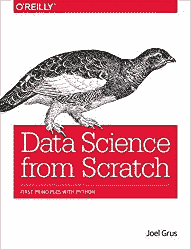
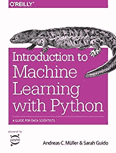
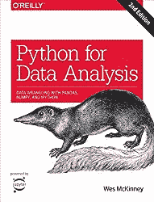
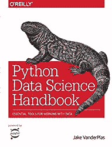
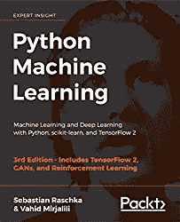
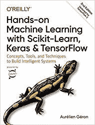
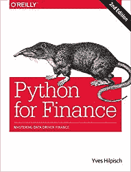
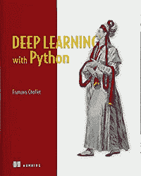
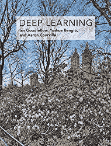
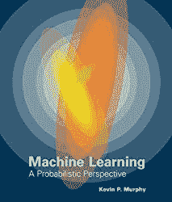

# 2021 年你应该读的数据科学书籍

> 原文：<https://towardsdatascience.com/data-science-books-you-should-read-in-2020-358f70e1d9b2?source=collection_archive---------4----------------------->

## 目前最好的数据科学书籍是什么？

数据科学无疑是目前最热门的市场之一。几乎每个公司都有数据科学职位空缺或正在考虑。这意味着这是成为数据科学家的最佳时机，或者如果你已经是一名数据科学家，并且想要晋升到更高的职位，磨练你的技能。

本文涵盖了你现在能找到的一些最受欢迎的数据科学书籍。

What Data Science books you should read in 2020?

# 入门水平

如果您刚刚开始您的数据科学之旅，您绝对应该尝试:

[从零开始的数据科学](https://www.amazon.com/gp/product/149190142X/ref=as_li_tl?ie=UTF8&camp=1789&creative=9325&creativeASIN=149190142X&linkCode=as2&tag=petacrunch-20&linkId=edf06af7b6694a8bc86289c37f4378e4)顾名思义:面向完全初学者的数据科学入门。你甚至不需要了解 Python 就可以开始。我完全推荐这个介绍给任何人。

如果你是一个完全的初学者，但你想在机器学习方向上走得更远，那么[《Python 机器学习入门](https://www.amazon.com/gp/product/1449369413/ref=as_li_tl?ie=UTF8&camp=1789&creative=9325&creativeASIN=1449369413&linkCode=as2&tag=petacrunch-20&linkId=8669cacfe298d25c2832d9062642dd44)》是一本适合你的书。它也不假设你知道 Python。

Data Science Job

最后，如果你想了解成为一名数据科学家意味着什么，那么看看我的书[数据科学工作:如何成为一名数据科学家](https://amzn.to/3aQVTjs)，它将指导你完成这个过程。

# 中间能级

如果您已经阅读了 1 或 2 本数据科学书籍，为自己做了 1 或 2 个项目，并对使用数据有了一点习惯，这里有一些书籍将带您走得更远。

[Python for Data Analysis](https://www.amazon.com/gp/product/1491957662/ref=as_li_tl?ie=UTF8&camp=1789&creative=9325&creativeASIN=1491957662&linkCode=as2&tag=petacrunch-20&linkId=7664d523f4c3d5195b201dc219efdd15) 是了解更好的标准 Python 库(如 NumPy 或 pandas)的最佳途径。这是一篇完整的论文，从提醒你 Python 是如何工作的开始。

Python 数据科学手册也是所有标准 Python 库的优秀指南:NumPy、pandas、Matplotlib、Scikit-learn。

[Python 机器学习](https://www.amazon.com/gp/product/1789955750/ref=as_li_tl?ie=UTF8&camp=1789&creative=9325&creativeASIN=1789955750&linkCode=as2&tag=petacrunch-20&linkId=cc65892b0564ce32cee20536fb70b29c)介于中级和专家之间。它将吸引专家和处于中间位置的人。它从温和开始，然后进入机器学习和深度学习的最新进展。伟大的阅读！

[用 Scikit-Learn 和 TensorFlow 进行机器学习](https://amzn.to/3d3tpE7)(第二版已经推出！)是中级惊人的参考。它涵盖了所有的基础知识(分类方法、降维)，然后进入神经网络和深度学习。

如果你对金融和数据科学感兴趣，Python for Finance 是必读书。它着重于如何使用数据科学工具来分析金融市场，并有许多很好的例子来说明这一点。它非常实用，也会吸引日常不从事金融工作的人。

# 专家

如果你接近专家水平，那么实际上阅读科学论文通常比阅读书籍更有意义。然而，现在也是时候在您的解决方案中研究和实施深度学习，以超越经典统计数据。三个奇妙且现在成为标准的参考文献是:

[用 Python 进行深度学习](https://www.amazon.com/gp/product/1617294438/ref=as_li_tl?ie=UTF8&camp=1789&creative=9325&creativeASIN=1617294438&linkCode=as2&tag=petacrunch-20&linkId=fa7304c5324df649a4ba536bd74927d2)是由 Keras 的一个创建者编写的，Keras 是 Python 中最流行的机器学习库之一。这本书从温和开始，非常实用，给出了你可以马上使用的代码，并且总的来说有许多关于使用深度学习的有用提示。深度学习的必读书目。

[深度学习](https://www.amazon.com/gp/product/0262035618/ref=as_li_tl?ie=UTF8&camp=1789&creative=9325&creativeASIN=0262035618&linkCode=as2&tag=petacrunch-20&linkId=00701393c949f16bfd3a89d9c3240b35)是深度学习算法的惊人参考。它包含的代码不多，但对如何处理机器学习问题有很好的见解:由深度学习的先驱编写。

如果你对数学感兴趣，那么你会爱上[机器学习:一种概率视角](https://www.amazon.com/gp/product/0262018020/ref=as_li_tl?ie=UTF8&camp=1789&creative=9325&creativeASIN=0262018020&linkCode=as2&tag=petacrunch-20&linkId=a52c63d00ba9f01f29e1db95d6b4c171)。这是所有机器学习方法背后的数学杰作。你很可能一下子读不出来，但是作为机器学习研究中的参考非常有用。

—

仅此而已！祝您在数据科学之旅中一切顺利！

如果你正在寻找你的第一份入门级数据科学工作，并且不知道从哪里开始，请在此 报名参加我的 [**数据科学工作课程。我解释了你应该做什么，并在几周内学会成为一名初级数据科学家。**](https://datasciencerush.thinkific.com/courses/data-science-job)

如果你喜欢这篇文章，看看我关于成为数据科学家的其他帖子:

*   [成为数据科学家的完整指南](/complete-guide-to-become-a-data-scientist-1e08bc54688d)
*   [成为数据科学家的实用指南](/practical-guide-to-become-a-data-scientist-2483a5f83770)
*   [数据科学书籍和课程推荐](https://datasciencerush.com/)

 [## 加入我的数据科学时事通讯

让我们保持联系。关于技术的每周或双周电子邮件。](https://creative-producer-9423.ck.page/c3b56f080d)