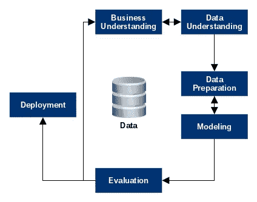
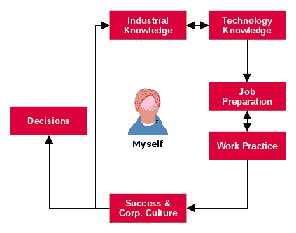

# 基于 CRISP-DM 过程模型的数据科学职业反思

> 原文：<https://towardsdatascience.com/data-science-career-reflection-based-on-crisp-dm-process-model-aedd8542b019?source=collection_archive---------30----------------------->

如何与商业分析和数据科学领域的硕士生分享自己的专业经验？鼓励他们自我反省？最近，当我应邀在一所应用科学大学做客座演讲时，我问了自己这个问题。我的方法是采用 CRISP-DM 过程模型[1]，这是数据科学领域的许多学生和从业者所熟悉的。该模型共有六个步骤(见图 1)，描述了如何系统地研究数据集的模式和关系。

Fig. 1: CRISP-DM process model

然而，通过调整六个步骤的目标，也可以制定一个模型来反映个人的职业生涯和工作规划。这种模式不仅适用于学生，也适用于正在反思现状或愿意改变的专业人士。这产生了图 2 所示的图，下面将对此进行讨论。这种反映似乎符合个人利益，特别是由于数据科学家之间的高度波动[2]。

Fig. 2: CRISP-DM inspired career reflection model

## 工业和技术知识

CRISP-DM 的前两步一方面是业务理解，另一方面是数据理解。在个人职业反思的背景下，这指的是工业和技术知识。数据科学从业者的特殊之处在于将这些技能结合起来的能力。当然，职场新人不应该因为(还)不具备后一种专业技能而气馁。但是，在每一个职业生涯阶段，意识到自己的优势和局限是值得的。

由此可以得出结论，用于个人的专业重点或个人发展。因为即使公司并不总是明确要求这一点，在申请工作和内部晋升时，对行业的了解也是一个明显的优势。

## 申请和工作准备

据估计，一个数据项目 80%的工作花费在预处理[3]上，这是 CRISP-DM 循环的下一步。根据 Waters [4]的说法，对于数据科学家来说，寻找新工作也是一项持续、耗时的任务，因此这是职业反思周期的第三部分。在这一点上，没有考虑这种波动的根本原因。

根据职位的重点以及公司的数据成熟度，申请人必须通过许多选择程序。经典的面试就像评估中心一样，属于一贯典型使用的程序。然而，根据我的经验，在定量的案例研究中，分成两个维度已经很明显了。一方面，如果公司已经在数据驱动的决策领域取得了进展，申请人不得不期待这一选拔测试。另一方面，这些情况出现的频率似乎越低，所要填补的角色越具有战略性。这里的重点是商业案例研究和与申请人的文化匹配。如何进一步了解一家公司的现状？嗯，求一下:公司去年进行了哪些数据项目？有多少数据科学家参与其中？公司希望通过哪种组织结构变得更加数据驱动？

希望给新员工一个平稳开端的公司可以通过准确的入职计划来得分。然而，我强烈鼓励申请人在申请过程中询问是否有指导机会，或者新加入者是否可以在定期支持的网络活动中见面。这样更容易为以后的项目找到重要的联系人。

## 工作实践

CRISP-DM 流程的第四步是建模，这是数据项目的核心。因此，专业实践的主题是工作评估的核心。数据科学家在什么情况下可以在公司找到自己？在我看来，这有两个极端:绿色分析领域的先锋和成熟数据科学团队的新成员。这两极的优劣要和自己的意愿相比较。

作为一名先锋，你享有高度的创作自由。是你设定了主要的主题焦点，并设计了整体的大画面。此外，不可或缺的是，企业家精神的概念是应用的，或者至少是学到的。通过这种通常也由个人扮演的广义角色，一个人很快就享有了专家的地位，这种地位可以但不必打开大门。因此，人们应该喜欢公司政治和战略。您还会被要求“修复”一个或另一个 Excel 电子表格。

在一个已建立的团队中，你通常可以完全专注于分析主题。每个团队成员都从与同事的专业交流中受益，这实际上包括在职培训。这些团队已经证明了他们的价值和优势。因此，他们通常已经拥有先进的基础设施和必要的工具。此外，项目通常已经定义和计划好了。所以影响和改变基本策略的空间并不大。作为一个团队，你们总是一起赢。因此，在某种程度上，通过杰出的成就推进职业发展的潜力可能会很低。

## 自身成功和企业文化

我的工作满意度受两个因素的影响，其中包括:我的工作有多成功，我在企业文化中感觉如何？CRISP-DM 中的模型评估部分因此让位于这两个维度的自我评估。

一方面，决定一个人成功的水平是困难的，另一方面是高度个性化的。当然，许多员工的绩效是使用或多或少复杂的矩阵来划分的。然而，这些程序是否 100%有意义或有效值得怀疑。尤其是涉及到自己的成功感的时候。对于数据科学家来说，强化一项技术技能或学习一种数学能力可以被认为是成功的，即使该项目被推迟或失败。错误文化是一个很好的术语，但是在实践中并不总是如此，尤其是当涉及到探索性的和昂贵的数据项目时。这里有必要对自己进行适当的评估。

此外，公司是动态系统，因此数据科学家的环境可能会发生变化。会有什么后果？例如，可以提到股东结构的变化，这种变化可能不会导致执行委员会的人事变动。即使乍一看这似乎很高级，但它会对数据项目产生直接影响。当我们考虑一个先驱者的例子时，这种情况更为常见，他能很快面对项目的中止。然而，结构变化也可以提供机会，例如，如果建立新的领域来促进数据驱动的文化。最后，数据科学家还必须考虑到一个事实，即成本削减计划或公司总部的搬迁将使工作场所受到质疑，与他们的工作完全无关。此时还有对自己工作的评价。

## 决定

项目成功后，将在 CRISP-DM 的最后阶段部署数据产品。在职业生涯周期中，我把决策放在这个位置。这不仅仅是一年一次或一个季度一次，而是为了一个人的幸福，反复让这个人意识到她或他的处境。这将导致一个持续的决策过程，在此过程中，将回答如下问题:

*   主要任务(仍然)符合我的兴趣吗？
*   我能提高我的能力并很好地运用我的知识吗？
*   我想在其他领域/行业获得经验吗？
*   我的工作符合我的个人规划吗？一定要吗？
*   我(仍然)对公司的文化满意吗？

由此，你可以在自己的工作中获得满足感，因为你让自己意识到这些要素对你个人来说是正确的。或者它避免了太长时间的停滞，如果自己的指南针不再符合工作的方向。内心的逆来顺受并没有成为一个说不完的故事。以我的经验来看，这可能是商业组织中数据科学领域乐趣的重要组成部分。

## 参考

[1]皮特·查普曼。《CRISP-DM 用户指南》。(1999)

[2]乔尼·布鲁克斯。“为什么这么多数据科学家离职”。(2018)[https://www . kdnugges . com/2018/04/why-data-scientists-leaving-jobs . html](https://www.kdnuggets.com/2018/04/why-data-scientists-leaving-jobs.html)。访问时间:2019 年 7 月 15 日

[3]吉尔出版社。调查显示，清理大数据是最耗时、最不愉快的数据科学任务。(2016)[https://www . Forbes . com/sites/Gil press/2016/03/23/data-preparation-most-time-consumption-least-enjoy-data-science-task-survey-saids/# 6 ea 73 f 616 f 63](https://www.forbes.com/sites/gilpress/2016/03/23/data-preparation-most-time-consuming-least-enjoyable-data-science-task-survey-says/#6ea73f616f63)。访问时间:2019 年 7 月 15 日

[4]理查德·沃特斯。“机器学习如何创造新职业——以及问题”。(2017)[https://www . ft . com/content/49 e 81 ebe-CBC 3-11e 7-8536-d 321d 0d 897 a 3](https://www.ft.com/content/49e81ebe-cbc3-11e7-8536-d321d0d897a3)。访问时间:2019 年 7 月 15 日

上图标题由 [Headway](https://unsplash.com/@headwayio) 拍摄，图中“工作实践”部分由 [Austin Distel](https://unsplash.com/@austindistel) 拍摄，图中“决策”部分由 [Damir Kopezhanov](https://unsplash.com/@kpzhnv) 拍摄，均在 [Unsplash](https://unsplash.com/@headwayio) 上