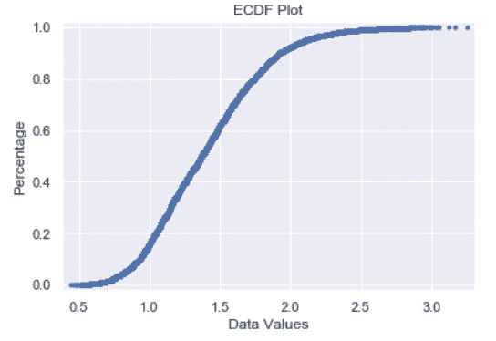

# 数据科学代码重构示例

> 原文：<https://towardsdatascience.com/data-science-code-refactoring-example-14c3ec858e0c?source=collection_archive---------13----------------------->

当学习为数据科学编码时，我们通常不会考虑修改我们的代码以在性能方面获得特定的好处。我们编码来修改我们的数据，产生可视化，并构建我们的 ML 模型。但是，如果你的代码将被用于仪表板或应用程序，我们必须考虑我们的代码是否是最佳的。在这个代码示例中，我们将针对速度对 ecdf 函数做一个小的修改。

*如果你不确定 ecdf 是什么，你可以查看我的* [*博客文章*](/what-why-and-how-to-read-empirical-cdf-123e2b922480) *了解更多详情。为了方便起见，这里有一个快速的可视化示例。*



Ecdf Plot made the function we will make below.

*我们将用于绘制上述 ecdf 函数的数据是关于 2015 年至 2018 年* [*鳄梨价格*](https://data.world/makeovermonday/2018w40-avocado-prices) *的数据。*

# 等等，到底什么是代码重构？

代码重构是对代码进行修改，以提高其可读性和性能。对于性能部分，这意味着您必须调整代码，以减少内存使用或缩短运行时间。

首先，让我们完成导入和数据加载。

```
*# Load Libraries*
import pandas as pd
import numpy as np
import matplotlib.pyplot as plt
import seaborn as sns
import time*# Load the data from data.world*
avocado = pd.read_csv('https://query.data.world/s/qou5hvocejsu4qt4qb2xlndg5ntzbm')
```

Seaborn 更喜欢这里。当我在 jupyter 笔记本上创建情节时，我使用 seaborn 来设置情节背景。

现在我们的导入和数据已经设置好了，让我们来看看我们的 ecdf 绘图功能。

```
*# Create a function for computing and plotting the ECDF with default parameters*
def plot_ecdf(data, title='ECDF Plot', xlabel='Data Values', ylabel='Percentage'):

    *"""* 
 *Function to plot ecdf taking a column of data as input.*
 *"""*
    xaxis = np.sort(data)
    yaxis = np.arange(1, len(data)+1)/len(data)
    plt.plot(xaxis,yaxis,linestyle='none',marker='.')
    plt.title(title)
    plt.xlabel(xlabel)
    plt.ylabel(ylabel)
    plt.margins(0.02)
```

对于速度重构，我们将关注于定义`yaxis`的地方。

```
yaxis = np.arange(1, len(data)+1)/len(data)
```

注意，我们调用了两次`len()`来构造`yaxis`。这导致运行时间不必要的增加。为了解决这个问题，我们将把我们的`yaxis`代码重构如下:

```
length = len(data)
yaxis = np.arange(1,length+1)/length
```

在上面的代码中:

1.  我们分配变量`length`来保存数据长度值。
2.  用我们预先定义的变量`length`替换了对`len()`的调用。

现在来看看这些变化后我们的功能:

```
# ECDF plot function with modifications
def plot_ecdf_vtwo(data, title='ECDF Plot', xlabel='Data Values', ylabel='Percentage'):

    *"""* 
 *Function to plot ecdf taking a column of data as input.*
 *"""*
    xaxis = np.sort(data)
    length = len(data)
    yaxis = np.arange(1,length+1)/length
    plt.plot(xaxis,yaxis,linestyle='none',marker='.')
    plt.title(title)
    plt.xlabel(xlabel)
    plt.ylabel(ylabel)
    plt.margins(0.02)
```


Pic from [CollegeDegrees360](https://www.flickr.com/photos/83633410@N07/7658225516) on Flickr

# 但是现在我们有了另一行代码！这如何改进我们的运行时间？

是的，我们确实使用了另一行代码。它也比我们上一个版本的函数使用了更多的内存。但是现在我们的函数会比以前更快地生成一个图。为了确定改进，我们为此引入了`time`模块。让我们来看看。

```
# Generating Run Time of plot_ecdf
start1 = time.time()
plot_ecdf(avocado['AveragePrice'])
end1 = time.time()
diff1 = end1-start1
print(diff1)0.04869723320007324
```

所以第一个版本的时钟大约是百分之五秒。现在来看看我们的重构版本是否真的有所改进。

```
# Generating Run Time of plot_ecdf_vtwo
start2 = time.time()
plot_ecdf_vtwo(avocado['AveragePrice'])
end2 = time.time()
diff2 = end2-start2
print(diff2)0.019404888153076172
```

太好了！我们将绘图函数的运行时间提高了大约百分之二秒！

# 那么，从长远来看，这有什么好处呢？

假设这是一个进入仪表板的绘图函数。你为你的雇主制作的仪表板。

如果这是一个应用程序中的 ML 模型的函数呢？

在这两种情况下，更快的运行时间非常重要。

百分之一秒可能看起来不多。但是，如果您考虑该功能的使用量，那么您可以为仪表板或应用程序的用户节省大量时间。它会让你的产品对他们来说快如闪电。


Pic from [GoodFreePhotos](https://www.goodfreephotos.com/finland/other-finland/lightning-across-the-sky-over-the-water.jpg.php)

# 酷！怎样才能学到更多的代码重构？

1.  如果你需要更多的例子，看看这个由[的](https://pybit.es/)[Julian Sequeria](https://twitter.com/_juliansequeira?lang=en)py bites写的[牛逼博客帖子](https://pybit.es/refactoring.html)。
2.  从旧项目中回顾你自己的代码。找到一些不止一次使用函数的代码。然后尝试重构代码，使函数只被调用一次。
3.  如果你想看我口头讲述同样的例子，你可以看看这篇文章的 youtube 视频短片[。这是这篇文章和视频的笔记本](https://www.youtube.com/watch?v=zIakz2_b1Lc&t=1s)[和](https://github.com/JohnDeJesus22/YoutubeTutorials/blob/master/Data%20Science%20Code%20Refactoring%20Example.ipynb)。

# 在我们走之前大声喊出来。

Tony Fischetti 是纽约公共图书馆的数据科学家。他是我在数据科学领域的第一位导师。是他让我更加意识到代码重构。

感谢阅读！希望你喜欢这个代码重构的例子，并考虑重构你的代码。你认为你将重构哪些代码？

如果你喜欢在媒体上阅读，并愿意进一步支持我，你可以使用我的[推荐链接](https://medium.com/@j.dejesus22/membership)注册一个媒体会员。这样做可以用你的会费的一部分在经济上支持我，我将不胜感激。

直到下一次，

约翰·德杰苏斯