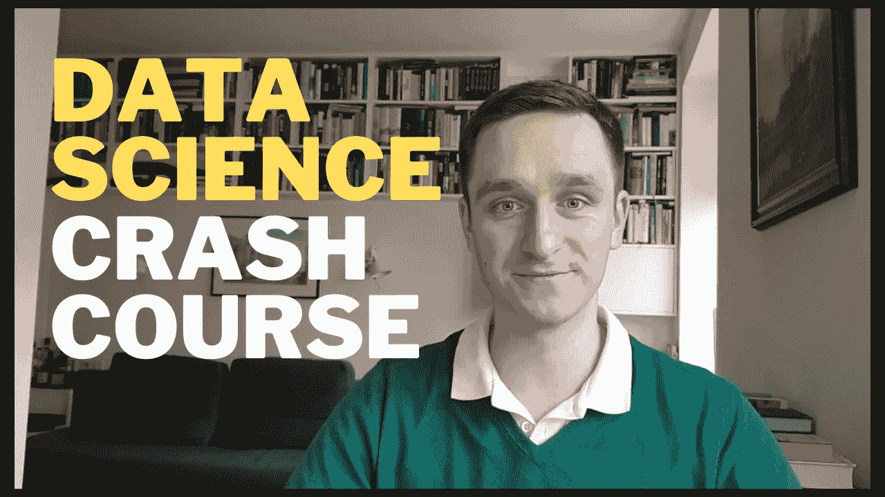

# 数据科学速成班

> 原文：<https://towardsdatascience.com/data-science-crash-course-df69fd0fdc3c?source=collection_archive---------32----------------------->

## 在 60 分钟内学习数据科学的基础知识

数据科学正在蓬勃发展。它不仅有趣，而且在任何领域或行业都有惊人的应用。在我所有的职业活动中，我尽我所能以一种所有人都能接触到的方式来推广数据科学。我还试图填补知识空白，尤其是在数据科学的商业应用方面。这就是创建[数据科学速成班](https://www.youtube.com/playlist?list=PLqkIWXwde6nHnG5UWqwfzIb3AwtapGojf)的想法。

# 你的第一道菜

那么，你如何着手创建自己的课程呢？对我来说并不难。作为一名数学博士，我有很多机会为我的学生创造大学水平的课程。但这次我想要不同的东西——快速、专注、高效。这就是为什么我决定建立这个课程。

它的目标是让你熟悉你可能已经听过很多次的数据科学的基本概念:监督学习、非监督学习、Anaconda、Python、pandas、json、NumPy、scikit-learn 等。我在介绍中解释了这一点:

从那以后只会变得更好。

# 蟒蛇和朱庇特笔记本

数据科学最基本的工具是 Python，通过为它安装一个框架 Anaconda，您将开始一些实验。

[下面告诉你怎么做。](https://www.youtube.com/watch?v=s8opek6U3CQ)

# 复习数学

下一步就是复习一些线性代数和统计。你需要能够操作向量和矩阵，知道什么是均值、方差和偏差，并且能够计算一些概率。

[以下是你需要知道的。](https://www.youtube.com/watch?v=7NPGFddsgdk)

# 使用数据

做完这些准备后，我们就可以进入主要部分了。第一步是处理数据:从 jsons、XML、电子表格和文本文件导入数据。一旦你导入它，你就必须存储它:pandas 中的 NumPy 数组和 DataFrames 运行良好。

现在是时候拿一些实际数据来做实验了。[有几个来源你可能会用到](https://www.youtube.com/watch?v=FCPnZl7IkSc):

*   古登堡图书计划
*   社交媒体洞察的 Twitter API
*   抓取你最喜欢的网站(当然是中号！)

你可以走了！

# 机器学习

现在是时候讨论算法了。你有数据，你知道如何处理它，让我们用它做一些有趣的事情。我谈到了监督学习和非监督学习之间的区别，因此分类与聚类问题，或者换句话说:数据集有标签或没有标签的情况。

在这两种情况下都有许多标准技术，我会在视频中介绍它们。

*   [分类算法](https://www.youtube.com/watch?v=e70i3dRxJbM)
*   [聚类算法](https://www.youtube.com/watch?v=N45y169LQ6Y&t=11s)
*   [神经网络](https://www.youtube.com/watch?v=vuunxXqOe48&t=10s)
*   [降维](https://www.youtube.com/watch?v=nf4VNdCDU7g&t=10s)

# 可视化和交流

[从事数据科学的最后一部分是与他人交流您的成果。唯一的方法是视觉化:要么把它们标在图上，要么就此写一份报告。最好的方法是使用 matplotlib 和 Dash，然后把你的代码放到 GitHub 上。](https://www.youtube.com/watch?v=Tu0SEYYEHAo&t=30s)

我们的 60 分钟课程到此结束！

如果您已经完成并观看了所有视频，您应该已经准备好用数据科学解决一些现实生活中的问题。

祝你好运！