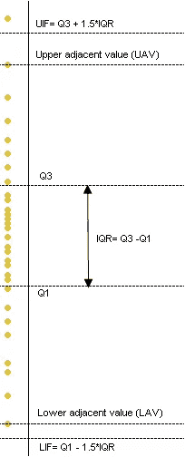

# 数据科学-创建带有异常值的描述性统计数据的 Google 工作表浏览功能

> 原文：<https://towardsdatascience.com/data-science-creating-google-sheets-explore-feature-for-descriptive-statistics-with-outliers-8e2451aaa331?source=collection_archive---------25----------------------->

## 通过分解数据中的异常值，了解如何进行正确的数据和描述性统计及分析的实用方法

Photo by [Giorgio Tomassetti](https://unsplash.com/@gtomassetti?utm_source=medium&utm_medium=referral) on [Unsplash](https://unsplash.com?utm_source=medium&utm_medium=referral)

## 什么是描述性分析？

描述性分析或统计是指使用平均值、中值、标准偏差等显示数据的集中趋势和分布的数据集摘要

我记得在学校的时候学过这些概念，但是直到最近我才明白它们在现实生活中的用途。

## 这个练习背后的动机？

最近在玩一些工资数据学习机器学习。我创建了一些正态分布的数据。最后，我追加了两笔巨额工资，以玩弄不同的统计概念。

我在 Google sheets 上传了这些数据，令我惊讶的是，它有一个探索功能，清除了这些异常值，并呈现了一个非常干净利落的描述性分析，带有一个整洁的直方图。

Google Sheet’s Explore feature showing summary analysis

这真的让我很好奇，并让我思考以下问题:

1.  Google 使用了什么数学方法来删除两个错误的值/异常值，并从剩余的数据中显示最低和最高工资？
2.  50300 的中间值是用什么数学计算出来的？
3.  8320 的价差值是用什么数学方法得出的？

从那时起，我真正的旅程开始进入数据分析的奇妙世界。

## 离群值？

在现实生活中，你很难找到理想的数据集。异常或与大部分数据不同的数据点称为异常值。异常值可以告诉你一个异常，一个特殊的事件或者仅仅意味着一些被篡改的东西。这真的取决于用例。

当您想要对数据集进行描述性分析时，将异常值考虑在内变得非常重要，否则您的结果可能会有偏差。

示例:考虑以下数据集和描述性摘要

> [10, 15, 15, 20, 20, 20, 25, 25, 30, 400]
> 
> 最小值:10 |最大值:400 |平均值:58 |中位数:20

现在，如果你仔细观察，数据点 400 可能是一个异常点，它给了我们错误的平均值和最大值。大多数数据都在 10 到 30 之间，那么平均值怎么可能是 58 呢？这是因为一个 400 的异常值扭曲了我们的总结。然而，如果你看看中位数，它多少显示了正确的中心值，并且不受异常值 400 的影响。

让我们进一步将数据倾斜到下面，并查看统计数据:

> [10, 15, 15, 20, 20, 20, 25, 25, 30, 800]
> 
> 最小值:10 |最大值:400 |平均值:98 |中位数:20

如您所见，如果我们将 400 更改为 800，平均值会增加，但中值保持不变，这仍能让我们更好地了解数据的中心。因此，这里的问题是，我们如何检测异常值并获得正确的数据描述性摘要？

## 四分位数和四分位数间距(IQR)

四分位数是将排序数据表(的一部分)分成四组的值，这四组包含大约相等数量的观察值。100%的总和分成四等份:25%、50%、75%和 100%。

第一个四分位数( *Q* 1)被定义为数据集的最小数和[媒体](https://en.wikipedia.org/wiki/Median)之间的中间数。第二个四分位数( *Q* 2)是数据的中位数。第三个四分位数( *Q* 3)是数据集的中值和最高值之间的中间值。

如上图所示，这里是范围，您需要注意获得正确的数据点:

> **IQR(四分位数间距)= Q3 — Q1**
> 
> **UIF(上部内栅栏)= Q3+1.5*IQR**
> 
> **LIF(下部内护栏)= Q1–1.5 * IQR**
> 
> **UOF(上部外栅栏)= Q3+3*IQR**
> 
> **LOF(上部外侧围栏)= Q1–3 * IQR**

## 现在，您可以根据以下隔离规则轻松找到可疑数据或异常值:

> 位于 UIF 和 UOF 之间的任何东西都被称为轻度上异常值。
> 
> 位于 LIF 和 LOF 之间的任何东西都被称为轻度低异常值。
> 
> 任何位于 UOF 之外的都称为上极端异常值。
> 
> 位于 LOF 以下的任何东西都被称为下极端异常值。

现在，如果我们将上述计算应用于我们的样本数据集，这就是我们得到的结果

> [10, 15, 15, 20, 20, 20, 25, 25, 30, 800]
> 
> Q1:16.25 | Q2:20 | Q3:25 | IQR:8.75 | LIF:3.125 | LOF:-10 | UIF:38.125 | UOF:51.25
> 
> 由于 800>UOF，这是一个可能的异常值，需要将其移除以获得正确的描述性分析。

因此，让我们继续并删除离群值 800，看看我们对新数据集的新分析

> [10, 15, 15, 20, 20, 20, 25, 25, 30]
> 
> 最小值:10 |最大值:30|平均值:20|中值:20 |分布/标准差:6

> 这使我们得到了最终的总结，其中心值为 20(平均值)，加上或减去 6(标准偏差(SD)或数据分布) :
> 
> **数据范围从 10 到 30。大多数数据将集中在 20 左右，正负 6。”**

我可能是错的，但我相信这就是谷歌用来对一个数据集做出如此美丽而简单的描述性统计的数学方法。

# 编写我们自己的谷歌探索功能

Custom Google’s Style Descriptive Statistics for data analysis with outlier correction

为了让上述概念更上一层楼，是时候编写我们的 Google Sheet 了，比如 explore analysis

用于分析的样本数据表可在此查阅或下载[。](https://docs.google.com/spreadsheets/d/1akkqLVpGZKDkhmLNXO-17SDaif9dUp3oYphr2q1s9Sc/edit#gid=0)

下面是一个 codepen，它使用 Google 图表、上面链接的数据和一点 Javascript 数学进行了类似的分析。

Our custom Google Explore feature

代码非常简单。我们对排序后的数据计算 Q1、Q2、Q3、IQR、UOF、LOF，并在获得数据的平均值和标准差之前过滤异常值。

# 下载

1.  [样本数据的谷歌表单](https://docs.google.com/spreadsheets/d/1akkqLVpGZKDkhmLNXO-17SDaif9dUp3oYphr2q1s9Sc/edit#gid=0)
2.  [可执行代码笔](https://codepen.io/apuravchauhan/pen/bGGjrBM)
3.  [Github 代码回购](https://github.com/apuravchauhan/google-sheets-explore)

## 反馈和跟进

欢迎您的任何反馈，因为我相信这是我们成长和成熟的方式。欢迎随时在 LinkedIn 或 Twitter 上关注我。