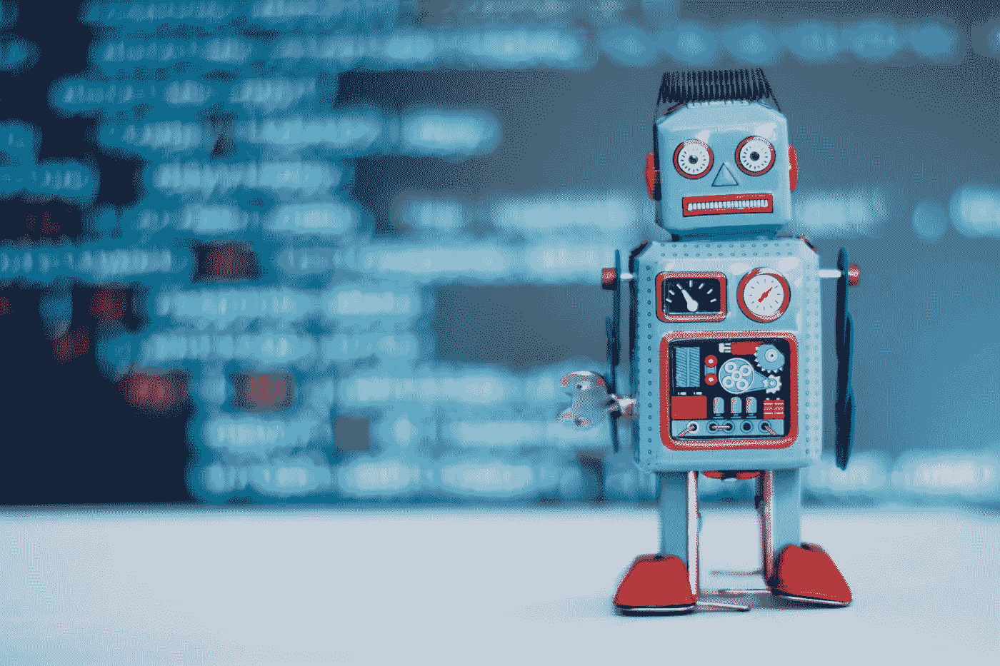
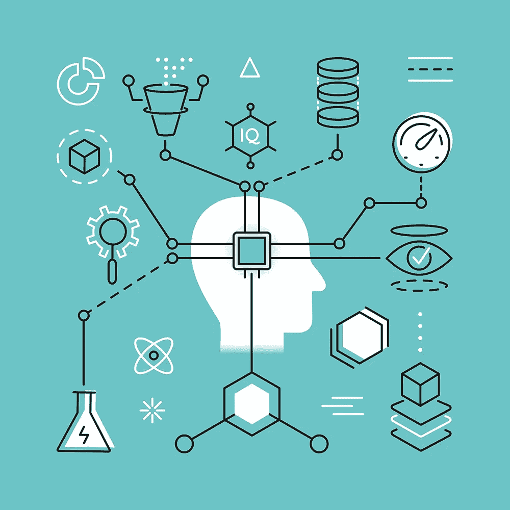
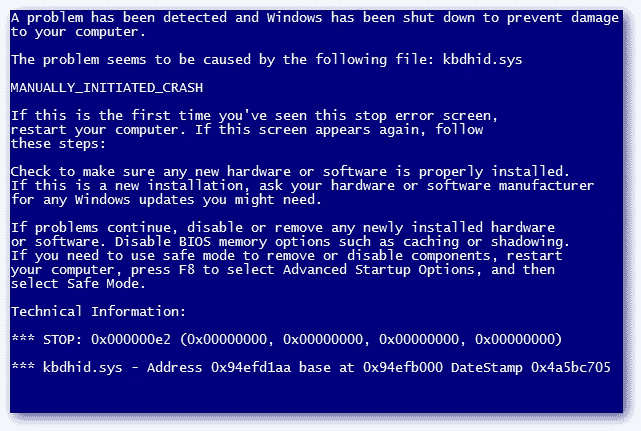

# 数据科学网络犯罪具有可怕的潜力。

> 原文：<https://towardsdatascience.com/data-science-cyber-crime-has-scary-potential-c70c552b08d5?source=collection_archive---------20----------------------->

## 等等……什么？

自八十年代中期以来，网络攻击一直是困扰计算机的一个严重问题。自那以来，恶意软件攻击一直在以惊人的速度增长，仅在 2019 年第一季度就有近 1200 万起恶意软件案件。早在 2017 年，“WannaCry”攻击引起了人们对这一问题的关注，当时有近 20 万人受到一种蠕虫的影响。这些感染包括但不限于:

> 医院、政府和企业。

不幸的是，随着技术的发展，恶意软件也在发展，技术问题的实际解决方案可能很快成为恶意软件开发的垫脚石。网络安全是一个巨大的话题，坦率地说，我不太参与，但显然；当我们所有的个人信息，包括信用卡、银行对账单和地址都在网上数据库中时，安全性是极其重要的。

W 虽然我们都知道网络攻击是危险的，也许我们应该避免访问任何这种事情超出我们控制的网站，但一种新型蠕虫很有可能在未来几年袭击互联网。近年来，机器学习一直在以惊人的速度推进我们的技术发展。但任何新技术，无论是枪、刀、弓、矛、火，甚至是机器学习，都会带来不满。

一个基于数据的蠕虫有着惊人的潜力，因为与其他任何蠕虫不同；它有自我提升的潜力。通常，传输和效果是由软件的创造者在蠕虫的制作中精心安排的。然而，基于机器学习的恶意软件有可能彻底摧毁这种方法。一个适应它收集的数据的病毒是一个可怕的概念，但总的来说诚实是完全可能的。

用《狂热未来学家》中马修·格里芬的话说，

> “无论好坏，人工智能都是网络安全游戏的改变者，我们需要为即将到来的事情做好更好的准备。”

事实上，在最近的攻击中，机器学习模型实际上已经被入侵者反复使用，试图窃取密码和用户输入。如果我们想继续安全地生活，没有蠕虫持续攻击我们的数据，网络安全本身可能必须改变。这不一定是数据伦理的话题了，因为当恶意软件产生时，伦理很少发挥作用。在典型的**法律**数据科学中，我们有一种称为数据匿名化的东西，这是一种保护参与者数据并保持其匿名的行为准则。违反这一概念就是违反传统的数据伦理，这是一种解释如何以及何时收集数据的伦理思想。

T 通常，恶意软件可以分为不同的类别，有些目标完全不同。

## 数据窥探

数据窥探是收集和记录通常经过加密的敏感信息。窥探攻击往往是更多攻击的开始，不仅会危及你的姓名和地址，还会危及你的银行账户和法律信息。此外，数据窥探通常是更深入、更典型的攻击的前兆。

## 渗透

渗透被认为是一种非常负面的情况，因为恶意软件现在正在您的计算机内部执行您不允许的具有管理权限的任务。通常当感染进入渗透阶段时，除非创建者另有指示，否则计算机将完全成为病毒的奴隶。

## 广告软件

广告软件稍微轻松一些，但仍然是一个严重的问题。广告软件不一定是带有恶意的软件，但在未经您允许的情况下自行安装后，通常会扰乱系统并降低系统速度。这通常是通过粗略的安装程序完成的，安装菜单混乱，当用户意外接受安装时，安装菜单会“附加”广告软件。广告软件当然是一个对参与者来说有经济收益的市场，允许从广告软件中赚钱的公司与他们分享利润。

## 勒索软件

勒索软件通常是渗透后可以观察到的东西。勒索软件的故事通常是对加密数据的勒索。这在包含员工和客户敏感信息的计算机化市场中尤其有害。想哭(如上所述)是勒索软件的一个很好的例子。

有了机器学习的巧妙伪装，一切皆有可能:假公司，假承诺，是的，假身份。鉴于机器学习因其图像识别和视频处理而闻名，它在右手掌权的情况下有一些严重的潜在损害。

A video using machine-learning to fake a speech made by Barrack Obama.

在最近的新闻中，一次又一次地解释说，人工智能在黑客攻击方面击败了人类，并且凭借其自然适应能力，无法对抗大多数网络安全努力。那么，对于一个主观目标是感染尽可能多的系统的人工大脑，我们能做些什么呢？当然，我们听过“不要去这里，不要去那里”的古老故事，但如果这些真的有用，为什么我们仍然担心这种威胁？

这是一个关于技术的可怕、可悲的现实，其中一些总是习惯于负面的接受。更有趣的是网络安全本身的未来。截至目前，有许多人以从事网络安全研究为生。机器学习已经被用来防止广告软件和垃圾邮件，所以看看 ML 在未来会提供什么样的安全功能会很有趣。

从伦理上讲，恶意应用程序中提出的建议在道德上与大多数机器学习爱好者所代表的东西是并列的……但机器学习技术正变得越来越容易获得，这已经不是什么秘密。随着机器学习的普及和全球化，很难相信它不会被用于任何负面的方面。毕竟，这正是大多数负面事物最初的样子。