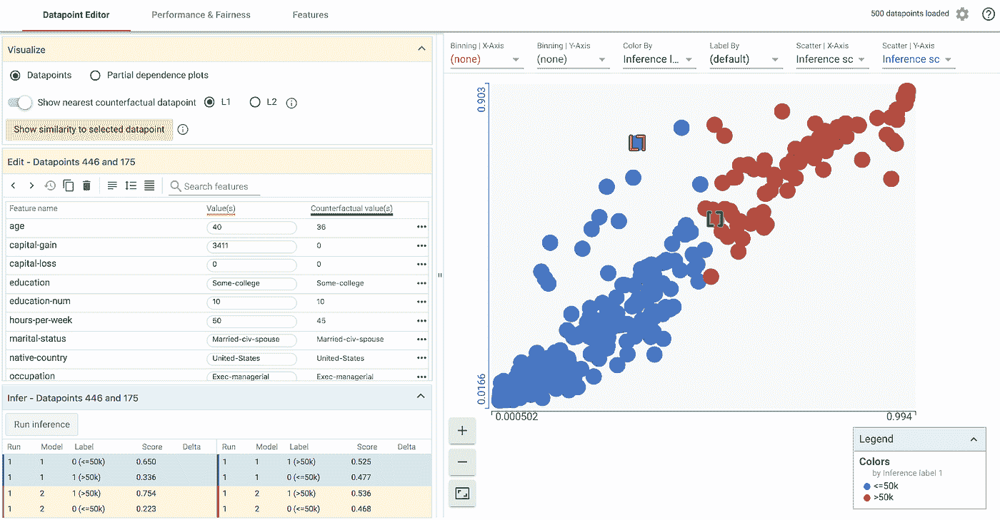

# 作为 UX 问题的数据科学有效性

> 原文：<https://towardsdatascience.com/data-science-effectiveness-as-a-ux-problem-9fa9bb84f5c8?source=collection_archive---------13----------------------->

我们[数据科学家](http://bit.ly/quaesita_datasci)花了这么多精力来帮助你了解你的用户……[你忘记了*我们也是用户*](http://bit.ly/quaesita_22) 。

> 数据科学家也是用户。

在很多情况下，感觉就像有人试图为数据科学家制作一个数据科学工具，却从未见过一个真正的工具。如果你采用那种产品开发方法，你会让我想起那些试图闯入卫生棉条市场的兄弟们，他们从来没有咨询过女人。什么可能会出错…？

如果你是一个从未听说过用户体验(UX)设计的工具制造者，我很高兴欢迎你来到 21 世纪。停止阅读这篇文章，转到[维基百科](https://en.wikipedia.org/wiki/User_experience_design)，你将享受到一场盛宴！你睡觉的时候发生了这么多事。

“It’s important to understand how the end user uses the product!” (I found this image [here](https://twitter.com/vipinmittal143/status/1095287089111941120).)

# 人物角色

UX101 一开始就提到了用户角色。如果你从未见过这个列表中的人的所有现实世界版本，这些将很难产生。为了给我们设计好的东西，你需要花时间去建立这种共鸣。

很抱歉很难让你们理解我们，但我们不是典型的软件工程师。首先，如果你看看列表，你会注意到我们有不同的风格。惊喜！数据科学专业有不同的种类。你是为哪个设计的？你有没有花时间去理解[为什么](http://bit.ly/quaesita_analysts)一个分析师不关心一个工具是否值得生产，但是一个 ML 工程师关心？(如果您对 R vs Python 的混乱感到困惑，那么这个难题将会派上用场。)你知道为什么如果你骗统计学家使用一种优化工具进行快速分析[他们可能会翻出一张表格吗](http://bit.ly/quaesita_analysts)？如果没有，这是开始你的侦探工作的两个好地方。

# 好的设计是什么样的

我很自豪能参与其中的一项合作是[假设分析工具](http://bit.ly/whatiftool)，就像在****假设分析工具*** *中一样，在 ML/AI 开发过程中查看你的模型性能和数据难道不是一件很痛苦的事情吗？”*能够掌握自己的进展是快速迭代到一个令人敬畏的 [ML/AI](http://bit.ly/quaesita_emperor) 解决方案的关键，所以为在[机器学习](http://bit.ly/quaesita_simplest)领域工作的[分析师](http://bit.ly/quaesita_analysts)设计的好工具可以帮助他们帮助你实现[雄心勃勃的目标](http://bit.ly/quaesita_dmguide)并在伤害你的用户之前抓住像 [AI 偏差](http://bit.ly/quaesita_aibias)这样的问题。*

*我喜欢假设工具的方法的一点是，UX 数据科学公司不是事后才想到的——该项目从一开始就包括视觉设计师和 UX 工程师。第一个版本(2018 年末发布)是为支持致力于 [TensorFlow](http://bit.ly/quaesita_tf) 开发的团队的分析师设计的。我们知道 TensorFlow 的[暴躁不透明](http://bit.ly/quaesita_tf2)会让分析爱好者感到沮丧，所以我们从那里开始。*

*我们逐渐将我们的目标用户群扩大到任何使用 [Python](http://bit.ly/pyisfun) 中的模型工作的 ML/AI 分析师，最终在本月早些时候在[TensorFlow Dev Summit 2019](https://www.tensorflow.org/dev-summit)上宣布的[假设工具 1.0 版](http://bit.ly/whatiftool)，以及关于 tensor flow 对用户体验的更强整体承诺的突破性消息，我将很快在另一篇文章中进行报道。*

*没错:即使您对 TensorFlow 过敏，也能通过模型理解和快速数据探索获得特性选择/预处理见解*。*配有便捷的[人工智能偏差](http://bit.ly/quaesita_aibias)检测，因为这通常是人工智能/人工智能分析师的第一个问题。它能与 [Jupyter](http://bit.ly/jupyter_try) 笔记本兼容吗？你打赌！内置[刻面](http://bit.ly/facetstool)？没问题！*

**

*Take the What-If Tool for a test-drive [here](http://bit.ly/whatiftool).*

*我们知道我们希望它成为 ML/AI 分析师的伟大工具，所以我们观察了真正的[分析师](http://bit.ly/quaesita_analysts)在他们的自然栖息地*和*可用性研讨会中使用该工具。我们整合了他们沮丧的尖叫，以推动更好的设计，直到哭泣平息，皱眉变成微笑(大多数情况下——它还不完美，但我们正在努力)。这个工具不是我们强加给毫无戒心的数据科学家[的某种意外事故。这是我们为你做的，希望你会喜欢。(请给我们网站上的反馈，以便我们不断改进。)](http://bit.ly/quaesita_datasci)*

*我们也知道在我们的目标用户群中谁是 ***谁不是*** 。统计学家不会是粉丝，除非他们[兼职做分析师](http://bit.ly/quaesita_bsides)。研究人员可能已经拼凑出他们自己的利基版本。完全的初学者最好先从别处学习基础知识。*

*无论你对[假设工具](http://bit.ly/whatiftool)还有什么看法，我最自豪的是我们认真对待 UX 设计，并努力理解我们的数据科学用户。(我们甚至知道你为什么对我们为了其他目标用户群而不得不做出妥协并保留让传统数据科学家想要攻击某些东西的传统行话感到恼火。是啊，那个“推论”不是 [*推论*](http://bit.ly/quaesita_fisher) 。我们理解你。)*

*如果你渴望看到运行中的[假设工具](http://bit.ly/whatiftool)，你不需要安装任何东西——只需点击[这里](http://bit.ly/whatiftool)。我们有大量令人眼花缭乱的演示和文档。如果你想真正开始使用它，你甚至不需要安装 [TensorFlow](http://bit.ly/quaesita_tf) 。简单的 *pip 安装 witwidget* 。*

# *我的观点是什么？*

*这个故事的寓意是，如果你想要快乐的数据科学家，你必须理解我们。令人难过的是，非数据科学家很少花时间。如果你是我们中的一员，检查一下你将要信任的人是否理解你和你的需求。询问潜在雇主[关于数据、决策者和工具的尖锐问题](http://bit.ly/quaesita_22)。如果你要雇佣我们，确保你有我们需要的快乐和有效的东西。如果你在为我们设计工具，了解我们是谁，我们是如何思考的。*

> *如果你想要快乐的数据科学家，你必须理解我们。*

*当然，如果你一生都在躲避我们，因为有人曾经因为你混淆了因果关系而对你大喊大叫，这是一项艰巨的工作……问题是:我们值得努力吗？*

# ***数据科学家值得吗？***

*如果你是一名产品经理、工程师或用户体验设计师，只想着置身事外，而不想知道是什么让你的数据科学家伙伴们成功，你是在赌[数据科学是泡沫](http://bit.ly/quaesita_bubble)而[人工智能是时尚](http://bit.ly/quaesita_fad)。我不建议打赌，因为尽管名称可能会演变，但数据科学和人工智能从根本上讲是让数据变得有用，我无法想象未来的数据会比今天少。*

*我经常认为[信息是有价值的](http://bit.ly/quaesita_hist)，就像任何曾经说过“知识就是力量”的人一样。投资于那些技能适合帮助你充分利用信息的专业人士，是获得或保持你在市场中的优势的一个好方法。无论你如何称呼那些让你的数据对你有用的专业人士，这个角色只会在你的行业中变得更加普遍。你迟早会明白我们是谁。当你的同事们还在打盹的时候，你也可以享受早起的鸟儿特餐，调查我们。你的同理心和与我们合作的能力也将是你职业生涯中难以置信的优势。*

*我相信我们*值得你花时间。[让数据变得有用](http://bit.ly/quaesita_datasci)是未来，这就是我们为您所做的。让我们做朋友吧！**

# *感谢阅读！人工智能课程怎么样？*

*如果你在这里玩得开心，并且你正在寻找一个为初学者和专家设计的有趣的应用人工智能课程，这里有一个我为你制作的娱乐课程:*

*Enjoy the entire course playlist here: [bit.ly/machinefriend](http://bit.ly/machinefriend)*

# *喜欢作者？与凯西·科兹尔科夫联系*

*让我们做朋友吧！你可以在 [Twitter](https://twitter.com/quaesita) 、 [YouTube](https://www.youtube.com/channel/UCbOX--VOebPe-MMRkatFRxw) 、 [Substack](http://decision.substack.com) 和 [LinkedIn](https://www.linkedin.com/in/kozyrkov/) 上找到我。有兴趣让我在你的活动上发言吗？使用[表格](http://bit.ly/makecassietalk)取得联系。*