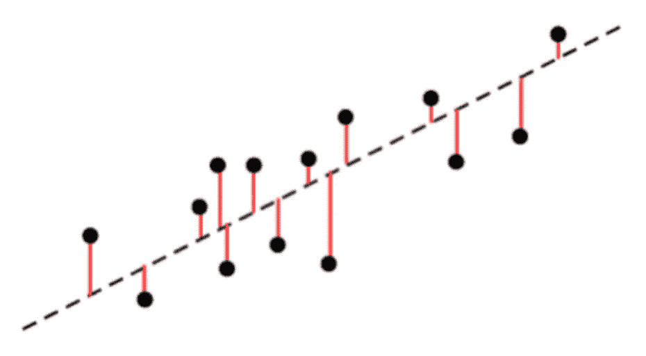
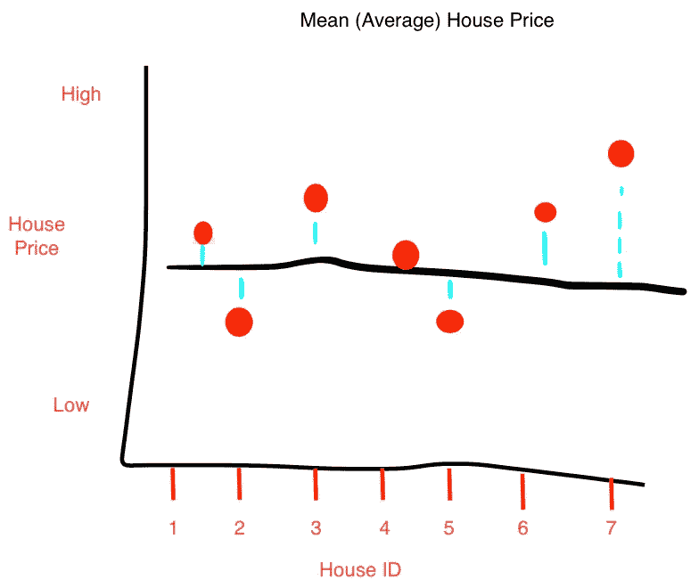
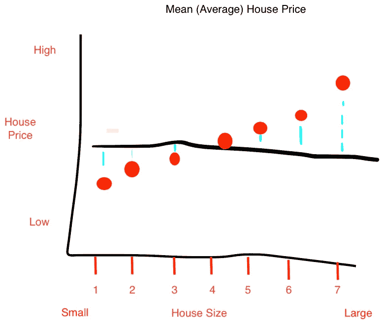
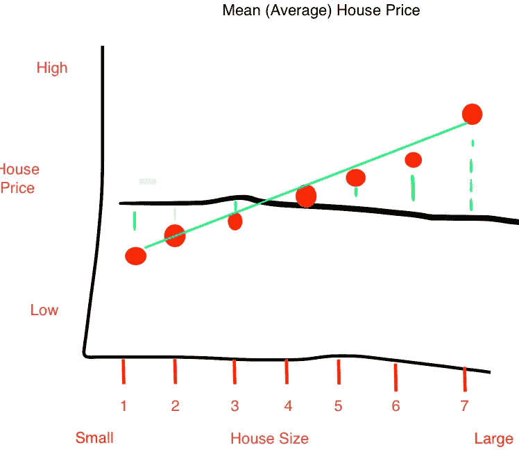
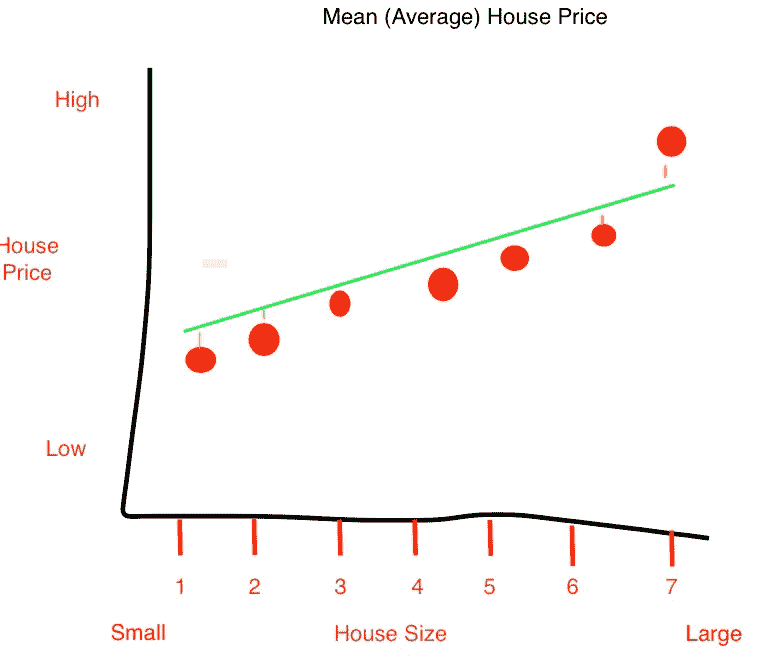

# 数据科学:解释统计学中的 R

> 原文：<https://towardsdatascience.com/data-science-explaining-r%C2%B2-in-statistics-6f34e7f0a9bb?source=collection_archive---------9----------------------->

## *统计学中 R 平方的回顾*

## 快速概述:

r 平方是相关性的度量。相关性由**“r”**来衡量，它告诉我们两个变量的相关性有多强。更接近+1 的相关性意味着正方向的强关系，而-1 意味着反方向的强关系。更接近 0 的值意味着变量之间没有太大的关系。r 平方与相关性密切相关。

## 示例:

理解 **R 平方**的最好方式是通过一个简单的例子。在本例中，黑色水平线代表房屋的平均价格。垂直蓝线代表**变化。**变异意味着各点与均值之间的差异。数据的变化可以通过每个点的平方差之和减去平均值来计算。

换句话说:**变化=总和(房价 *i-* 均值)**

## “平方”从何而来？

每个数据点的差异是平方的，因此低于平均值的点不会抵消高于平均值的点。

## 现在，如果我们按照房子的大小来排列圆点呢？

房屋按大小排序，而不是按房屋 ID 排序(注意上图和当前图之间 X 轴的变化)。但是，均值和变差和上图一模一样！由于尺寸的原因，点的顺序发生了变化，但是水平线的值和蓝线的值仍然相同。

## 如果我们想确定一栋新房子的价格(第 8 号)，给定的平均值是预测价格的最佳方法吗？

答案是否定的！我们可以通过**对数据拟合一条线来做得更好。**

拟合一条线后，我们可以用这条绿线预测房价。假设新房的面积相对较大，我们可以通过查看绿线来更准确地预测新房的价格。绿线比平均值更符合数据。

## 但是，与平均线相比，绿线与数据的吻合程度有多高呢？

我们通过你的猜测来量化这种差异。R 平方的公式为:

**R =** **Var(均值)-Var(直线)/ Var(均值)。**

我们已经计算了 Var(均值)。第二部分 Var(线)是新绿线周围每个数据点的变化。这种差异现在用垂直的橙色线表示。您可以预期绿线周围的变化会更小，因为它更符合数据。R 的范围将从 0 到 1。公式也让 R 变成了百分比。

## 简单演练:

假设我们计算了 Var(均值)= 32，Var(直线)=6。

我们使用我们的公式，得到 R = 32–6/32 = . 81

换句话说，线周围的变化比平均值少 81%。房子的大小/价格解释了 81%的变化。

在线性回归中，R 通常用作解释拟合线如何最好地解释数据的方法。创建线性回归模型后，平均值被用作基线，并与新拟合的线进行比较。