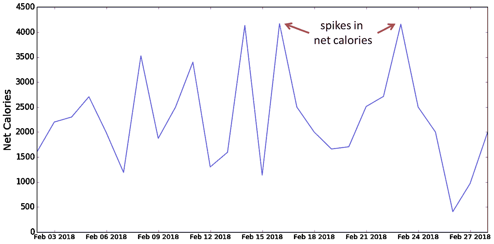

# 为了更好的身体的数据科学

> 原文：<https://towardsdatascience.com/data-science-for-a-better-body-5a58f6f77f7c?source=collection_archive---------11----------------------->

Photo by [Victor Freitas](https://unsplash.com/@victorfreitas?utm_source=unsplash&utm_medium=referral&utm_content=creditCopyText) on [Unsplash](https://unsplash.com/search/photos/fitness?utm_source=unsplash&utm_medium=referral&utm_content=creditCopyText)

20 个月前，我开始跟踪与我健康相关的统计数据。整个故事就在那上面，包括 [**的起伏，这里的**](/one-year-of-calorie-counting-in-graphs-4a89784e11d7) 。

因为我是使用数据科学和统计学来 ***破解你的个人发展*** 的超级粉丝，我真的很兴奋地分享我学到的打造更好身材的三个统计学技巧。

# 1.不要用单一的衡量标准来衡量成功

在我健康追踪之旅的早期，我使用**净卡路里**(摄入的卡路里减去消耗的卡路里)作为我唯一的*成功标准。而且，正如传统智慧告诉我们的，我使用 2000 卡路里的任意阈值作为我在任何一天成功或失败的标准。*

这种方法有效了几个月，当我注意到我的净卡路里量定期攀升到 2000 以上时，我让自己对此负责。但是很快，关键的缺陷暴露了出来:

***单纯的净热量不足以促进充分的运动。***

让我解释一下。在我计算卡路里的头几个月，我善于将卡路里摄入量减少到 2000 卡路里以下。所以，我每天都吃大约 1900 卡路里，消耗大约 0*卡路里，认为我已经“成功”了。*

我意识到我需要一个新的标准来奖励我的锻炼，并最终提出了 ***卡路里*** ***出比率*** ，简单定义为消耗的卡路里除以摄入的卡路里。

为了理解这个比率的重要性，考虑两个可能的日期:

> ***第一天:*** *吃 2000 卡路里，燃烧 0 卡路里其中* ***净卡路里是 2000*** *和* ***出-入比率是 0/2000 = 0.0***
> 
> ***第二天:*** *吃下 2500 卡路里并燃烧掉 500 卡路里其中* ***净卡路里又是 2000*** *但是* ***的出-入比是 500/2500 = 0.2***

在这两种情况下，净卡路里都是 2000，但我更愿意在第二天，因为**我已经燃烧了 500 卡路里**，并因锻炼而获得额外的好处。出入比是实现这一目标的最佳选择。我设定的每日目标是达到 0.2 或更高的出/入比率。

对于你们这些视觉学习者来说，在一张**“卡路里输入”对“卡路里输出”**的图表上，我想位于下面的**“最佳点”**。

你可以想出任何你想要的令人敬畏的健康跟踪指标，但是一般的建议是选择两到三个指标来定义你的成功，而不是一个。

这有两个互补的目的。首先，你要确保捕捉到你*真正*关心的生活方式的改变。第二，你不会把你的自我价值感仅仅局限在一个数字上。

# 2.使用滚动平均值而不是原始统计数据

让我知道这听起来是否熟悉。周一到周四，你吃得很好，定期锻炼，对糟糕的自己感觉很好。

然后周末来了…

*   周五晚上与朋友共进晚餐
*   周六下午自发的冰淇淋抢购活动
*   一个慵懒的周日，你不想去健身房

暗示接下来的周一，你会觉得自己抹去了这一周的所有进步，所以 ***“这一切有什么意义？!"***

Random spikes in net calories

人们很容易感到气馁，相信我。在我开始追踪健康状况时，我经常感到沮丧。心态发生了转变，随之而来的是我报告健康数据方式的改变，这帮助我看到了真实的情况。

最重要的认识是，每一天都是不可预测的。

~你计划第二天早上去健身房，然后意识到你就是 ***不行。*** ***秋天。*睡着了**。

~你可能计划晚餐吃鸡胸肉+蔬菜，但意识到和一些老朋友出去郊游太好了，不能错过。

~你可能会发现自己失去了一个意想不到的盯着油炸圈饼。

关键是，有时候事情会出乎你的意料。这基本上是人类生存的座右铭。

一旦我不再问自己今天我达到目标了吗？“我开始问自己”*平均而言，我的健康状况有所改善吗？“我开始关注长期稳定的增长，而不是随机的短期波动。*

那么这如何转化为跟踪你的统计数据呢？好吧，让我们假设你用**每日**频率制作了一张随时间变化的净卡路里图表。由于我们讨论的每日随机性，图表必然会有很大的波动。

Net calories in the last 20 months

但是，如果我们取过去 7 天的净卡路里平均值为例，我们就能够“洗去”日常事件，捕捉更多的潜在趋势。你健康的星期一和你食物充盈的星期六**不再独立**，现在通过平均运算相互影响。在原始数据上叠加 7 天的滚动平均值看起来像:

7-Day rolling average of net calories

您可以在您决定使用的任何其他健康跟踪指标上使用这种技术。

# 3.对数据进行切片，找出需要改进的地方

所以你已经追踪你的健康状况几个月了。你如何使用你仔细记录的数据来改善健康状况？

总体来看这些数据肯定会让你知道*的平均水平*在哪里，但不会给你任何关于*如何*改进的想法。

当我按一周中的某一天对数据进行切片时，我获得了最好的见解之一。

*   我知道周末可能比工作日(更)不健康，但是到底有多糟糕呢？
*   每个周末净卡路里的好目标是什么？
*   在所有的工作日中，有没有哪一天我在有系统地偷懒？

将我的净卡路里按照一周中的某一天进行切片，得到了下面的图表。

Net calories sliced by day of week

不出所料，周末很忙，但我不知道在周三 T10 和 T11 我已经危险地接近了 2000 卡路里的目标。很高兴知道这一点！

或者可能在一个月的某一天有一个趋势。我知道，在月初，我会感到信心和动力的高涨，但随着月份的进展，这种情绪通常会消退。如果我们在那个轴上切片呢？

Average net calories sliced by day of month

似乎我最应该意识到的是，在每个月的 ***中旬*** 左右，我的热量摄入会变得过高。

在这里，你可以尽情发挥创造力。关键是将你的数据分割成对你的生活有意义的变量，并努力改善那些不太重要的数据。

这就是我给你的全部！我希望这有助于给你的健康跟踪之旅更多的形状和方向。 ***祝好运，感谢阅读~***