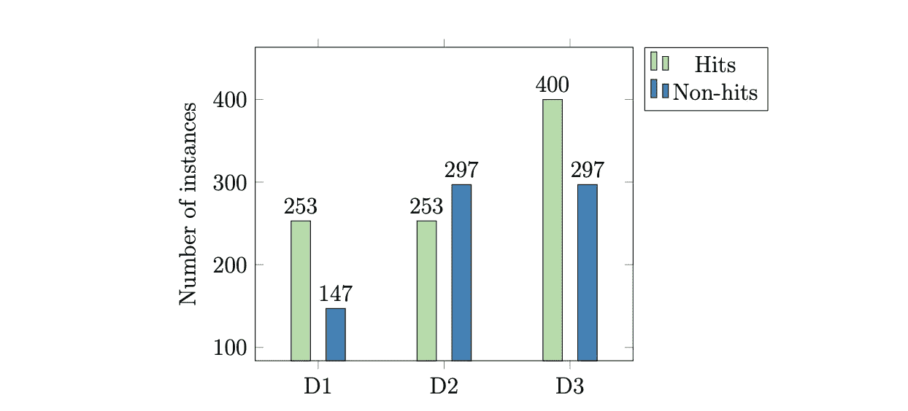
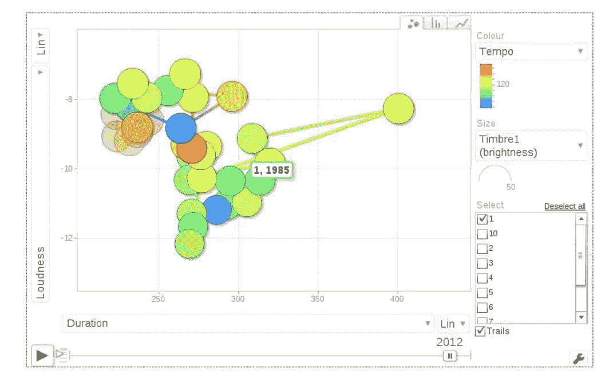
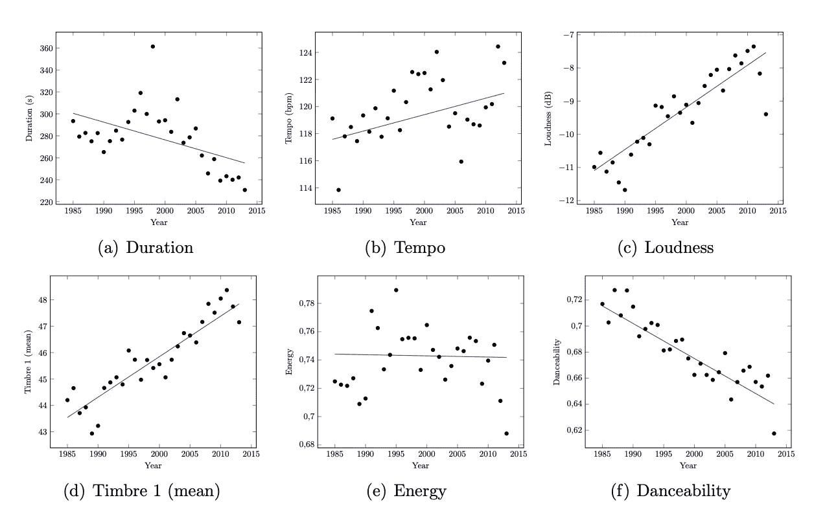
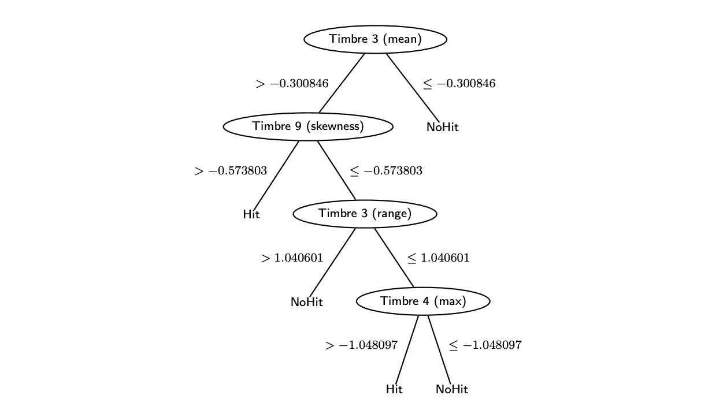
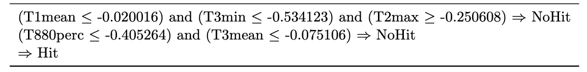
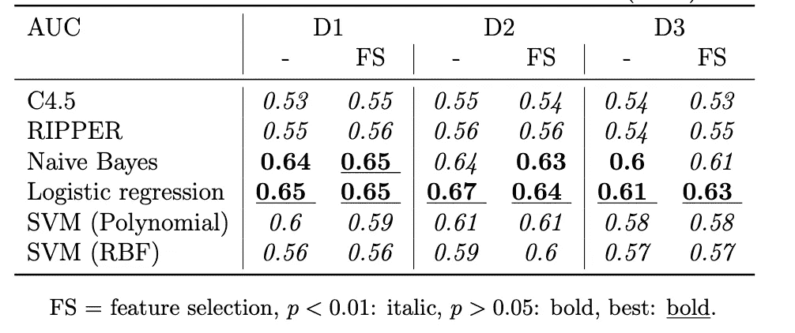
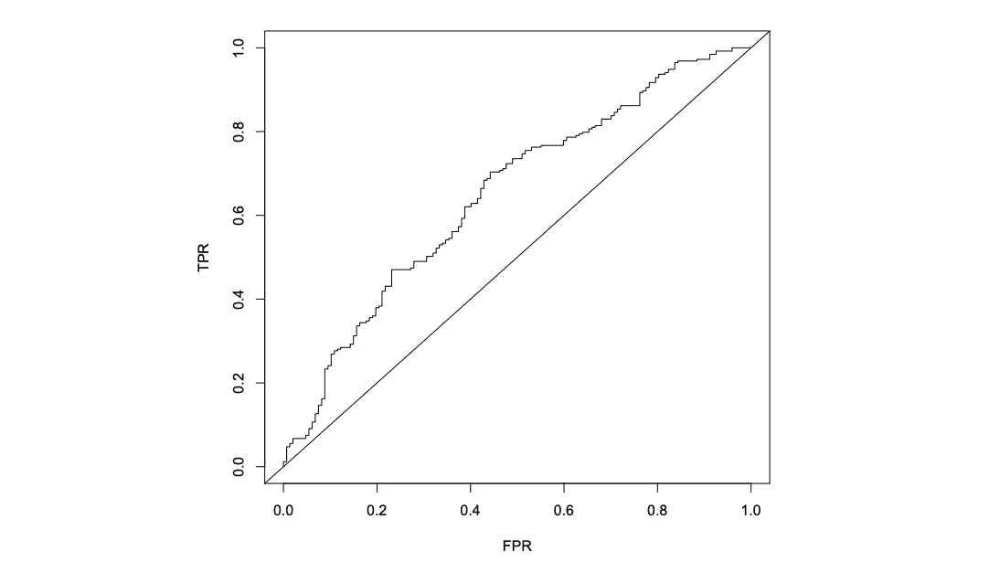
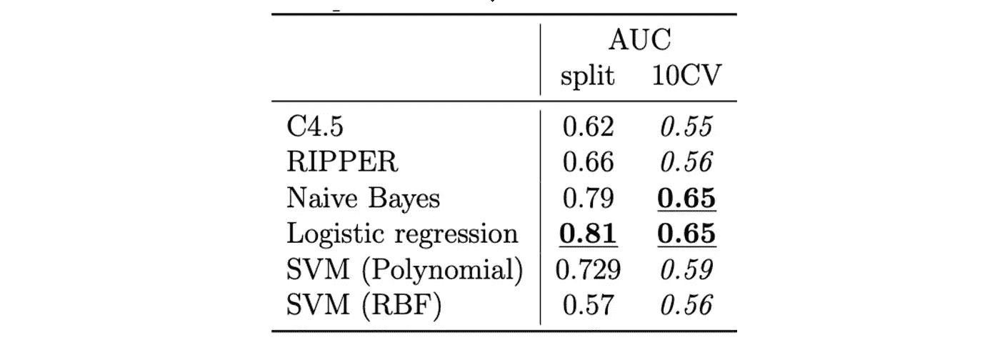

# 热门歌曲预测的数据科学

> 原文：<https://towardsdatascience.com/data-science-for-hit-song-prediction-32370f0759c1?source=collection_archive---------18----------------------->

算法能预测热门歌曲吗？让我们来探索如何仅使用音频特征来成功构建热门歌曲分类器，如我的出版物 [(Herremans et al .，2014)](https://www.tandfonline.com/doi/full/10.1080/09298215.2014.881888?casa_token=w0GGhjQd194AAAAA:V_YGtWJeIR869x4fYUfyyfFrPiCWhb56ddybPADsO9s9D-k8WaTZI4ADKxgILlufl3UbICsVZEWB5Q) 中所述。

在我的博士研究期间，我看到了 Pachet & Roi (2008)的一篇题为“热门歌曲科学还不是科学”的论文。这引起了我的兴趣，并促使我探索我们是否真的可以预测热门歌曲。关于这一主题的研究非常有限，更完整的文献综述请参见 [Herremans et al. (2014)](https://www.tandfonline.com/doi/full/10.1080/09298215.2014.881888?casa_token=w0GGhjQd194AAAAA:V_YGtWJeIR869x4fYUfyyfFrPiCWhb56ddybPADsO9s9D-k8WaTZI4ADKxgILlufl3UbICsVZEWB5Q) 。我们决定，可以通过关注一个特定的流派来优化模型的有效性:舞曲。这对我来说很有直觉，因为不同的音乐类型会有不同的特点来成为热门歌曲。

# 资料组

为了能够进行热门歌曲预测，我们首先需要一个热门/非热门歌曲的数据集。虽然不乏热门名单，但发现《T4》不在热门名单上却是另一回事。因此，我们决定在热门列表上对排名高和排名低的歌曲进行分类。我们做了一些实验，看看哪种分割效果最好，如表 1 所示，这产生了三个数据集(D1、D2 和 D3):

**Table 1** — Hit dataset split from [Herremans et al. (2014)](https://arxiv.org/pdf/1905.08076.pdf).

每一个都有稍微不平衡的阶级分布:

**Figure 1** — Class distribution from [Herremans et al. (2014)](https://arxiv.org/pdf/1905.08076.pdf).

热门榜单收集自两个来源:Billboard (BB)和原创排行榜公司(OCC)。下表显示了收集的点击量。请注意，歌曲会在排行榜上停留数周，因此独特歌曲的数量要少得多:

**Table 2** — Hit dataset from [Herremans et al. (2014)](https://arxiv.org/pdf/1905.08076.pdf).

现在我们已经有了一个歌曲列表，我们需要相应的音频特性。我们使用回声巢分析器(Jehan 和 DesRoches，2012 年)提取了一些音频特征。这个漂亮的 API 允许我们获得许多音频特性，只基于艺术家的名字和歌名。Echo Nest 被 Spotify 收购，现在集成在 Spotify API 中。那么我们提取了什么:

*1。标准音频特征:* 这些包括持续时间、速度、拍号、模式(大调(1)或小调(0))、调、响度、可跳舞性(由 Echo Nest 根据节拍强度、速度稳定性、整体速度等计算)、能量(由 Echo Nest 根据响度和片段持续时间计算)。

*2。新的时间特征* 因为歌曲会随着时间的推移而变化，我们在迅达&劳伯(2012)的基础上增加了一些时间聚合特征。它们包括平均值、方差、最小值、最大值、范围和 80%的~1s 段。这样做是为了实现以下功能:

**音色** —音频音色的 PCA 基向量(13 维)。一个 13 维的矢量，它捕捉歌曲每一段的音色。
**节拍差—** 节拍之间的时间。

太好了！现在我们有了一个很好的音频特征集合，以及它们在排行榜上的位置。像任何好的数据科学项目应该开始，让我们做一些数据可视化。我们注意到的第一件事是点击率会随着时间而变化。十年前的热门歌曲，不一定是今天的热门歌曲。随着时间的推移，当我们观想我们的特征时，这变得很明显:

**Figure 2**— Interactive bubble chart from [Herremans et al. (2014)](https://arxiv.org/pdf/1905.08076.pdf), also on [dorienherremans.com/dance](http://dorienherremans.com/dance) (apologies .js may not work on some browsers though, I have not updated this in a while)

> 有趣的是，我们看到热门舞曲变得更短、更响，而且根据 Echo Nest 的“可跳舞性”特征，更不适合跳舞！

**Figure 3** — Evolution of hit features over time from [Herremans et al. (2014)](https://arxiv.org/pdf/1905.08076.pdf).

要更完整地了解一段时间以来的特征，请查看我关于可视化热门歌曲的短文:( [Herremans & Lauwers，2017](http://dorienherremans.com/sites/default/files/dh_visualiation_preprint_0.pdf) ) [和附带的网页。](http://musiceye.dorienherremans.com/clustering.html)

# 模型

探讨了两种模型:**可理解的**模型和**黑箱**模型。正如所料，后者更有效，但前者让我们了解为什么一首歌可以被认为是热门。

*决策树(C4.5)*

为了适应页面上的决策树，我将修剪设置为高。这使得树很小并且容易理解，但是在 D1 上给出了 0.54 的低 AUC。我们看到只有时间特征存在！这意味着它们一定很重要。特别是音色 PCA 音色向量的第三维)，它反映了攻击的重点(锐度)，似乎对预测热门歌曲有影响。

**Figure 3** — Decision tree from [Herremans et al. (2014)](https://arxiv.org/pdf/1905.08076.pdf).

*基于规则的模型(Ripper)*

使用 RIPPER，我们得到一个与决策树非常相似的规则集。音色 3 再次出现。这一次，我们在 D1 的 AUC 是 0.54。

**Table 3** — Rule set from [Herremans et al. (2014)](https://arxiv.org/pdf/1905.08076.pdf).

*朴素贝叶斯、逻辑回归、支持向量机(SVM)*

关于这些技术的简单描述，请参考 [Herremans 等人(2014)](https://arxiv.org/pdf/1905.08076.pdf) 。

# 决赛成绩

在进入任何结果之前，我应该强调，在这里使用一般的分类“准确性”是没有意义的，因为类别是不平衡的(见图 1)。如果你想使用精度，它应该是类特定的。这是一个常见的错误，但记住这一点非常重要。因此，我们使用受试者操作曲线(ROC)、曲线下面积(AUC)和混淆矩阵来正确评估模型。

*十重交叉验证*

我们获得了数据集 1 (D1)和数据集 2 (D2)的最佳结果，没有特征选择(我们使用 CfsSubsetEval 和遗传搜索)。所有特征在训练前都是标准化的。因为 D3 在命中和非命中之间具有最小的“分离”,所以这个结果是有意义的。总的来说，逻辑回归表现最好。

**Table 4**— AUC Results from [Herremans et al. (2014)](https://arxiv.org/pdf/1905.08076.pdf), with and without feature selection (FS).

看下面的 ROC 曲线，我们看到该模型优于随机预言(对角线)。

**Figure 4**— ROC for Logistic Regression from [Herremans et al. (2014)](https://arxiv.org/pdf/1905.08076.pdf).

通过查看混淆矩阵可以看到分类准确性的细节，这揭示了正确识别非热门歌曲并不容易！然而，在 68%的情况下，命中是正确识别的。

**Table 5**— Confusion matrix for Logistic Regression from [Herremans et al. (2014)](https://arxiv.org/pdf/1905.08076.pdf).

*超时测试设置*

我们还使用了一组按时间顺序排列的“新”歌曲，而不是 10 倍交叉验证。这进一步提高了性能:

**Table 6**— AUC for split versus 10-fold CV from [Herremans et al. (2014)](https://arxiv.org/pdf/1905.08076.pdf).

有趣的是，该模型对新歌曲的预测更好。是什么导致了这种偏斜？也许它学会了预测趋势如何随时间演变？未来的研究应该着眼于音乐偏好随时间的有趣演变。

# 结论

如果只看音频特征，Herremans 等人(2014 年)可以用 81%的 AUC 预测一首歌是否会出现在前 10 名的热门列表中。我们能做得更好吗？很可能是的！我们在这项研究中看到的特征集是有限的，因此通过使用低水平和高水平的音乐特征来扩展它，可以实现更高的准确性。此外，在后续研究中，我观察了社交网络对点击预测的影响，这也有重大影响 [(Herremans & Bergmans，2017)](http://dorienherremans.com/sites/default/files/paper_preprint_hit.pdf) 。

> Dorien Herremans 博士教授——dorienherremans.com

# 参考

Herremans 博士、Martens 博士和 s rensen k .(2014 年)。舞蹈热门歌曲预测。*《新音乐研究杂志》*， *43* (3)，291–302。[【预印本链接】](https://arxiv.org/pdf/1905.08076)

Herremans 博士和 Bergmans t .(2017 年)。基于早期采用者数据和音频特征的热门歌曲预测。第 18 届国际音乐信息检索学会会议(ISMIR)——最新演示。中国苏州[【预印本链接】](http://dorienherremans.com/sites/default/files/paper_preprint_hit.pdf)

劳沃斯·赫尔曼斯..2017.视觉化另类排行榜的演变。第 18 届国际音乐信息检索学会会议(ISMIR)——最新演示。中国苏州[【预印本链接】](http://dorienherremans.com/sites/default/files/dh_visualiation_preprint_0.pdf)

Jehan T .和 DesRoches D. 2012。EchoNest 分析器文档，URL developer . echo nest . com/docs/v4/_ static/analyzed Documentation。可移植文档格式文件的扩展名（portable document format 的缩写）

帕切特和罗伊出版社(2008 年 9 月)。打宋科学还不是科学。在*伊斯米尔*(第 355–360 页)。

辛德勒和劳伯(2012 年 10 月)。在 echonest 特征中捕获时间域以提高分类效率。在*自适应多媒体检索国际研讨会*(第 214–227 页)。斯普林格，查姆。