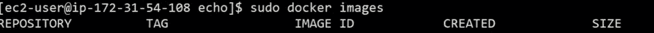
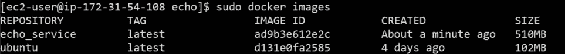
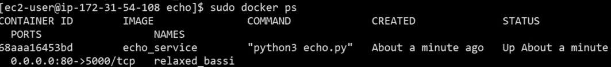

# 创业公司的数据科学:容器

> 原文：<https://towardsdatascience.com/data-science-for-startups-containers-d1d785bfe5b?source=collection_archive---------10----------------------->


Source: [https://commons.wikimedia.org/wiki/File:CMA_CGM_Benjamin_Franklin.jpeg](https://commons.wikimedia.org/wiki/File:CMA_CGM_Benjamin_Franklin.jpeg)

## 为机器学习构建可重复的设置

数据科学家越来越需要的技能之一是再现分析的能力。让代码和脚本只在你的机器上工作是不可持续的。您需要能够分享您的工作，并让其他团队能够重复您的结果。我在数据科学组织中看到的一些最大的影响是当其他团队将旧代码重新用于新用例时。这篇博文是关于鼓励通过容器重用分析的，这意味着你的工作可以转移。

容器的概念是，它是一个隔离的环境，您可以在其中设置执行任务所需的依赖关系。任务可以是执行 ETL 工作、监控数据质量、建立 API 或者托管交互式 web 应用程序。容器框架的目标是提供轻量级实例之间的隔离。容器是虚拟机的替代品，虚拟机是隔离的一个很好的解决方案，但是需要很大的开销。使用容器框架，您可以指定代码需要的依赖项，并让框架处理管理不同执行环境的跑腿工作。Docker 实际上是容器的标准，围绕 Docker 有很多工具。

一般来说，与本地部署相比，数据科学家使用 Docker 需要做更多的工作。然而，Docker 有几个好处:

*   **可重复的研究:**如果你能以容器的形式交付你的分析，那么其他数据科学家可以重新运行你的工作。
*   **显式依赖:**为了将你的脚本设置成一个容器，你需要理解你的代码的依赖关系和任何可能需要的额外的库，以及它们的版本。
*   **改进的工程协作:**如果你想扩大你已经建立的模型，给你的工程团队提供一个 docker 文件比提交一个 R 或 Python 脚本要好得多。它还调出代码执行所需的依赖项。
*   **更广泛的技能集:**能够将基础设施作为代码是一种有价值的技能集，使用 Docker 容器可以帮助数据科学家开始开发这种技能集。

一个有效的数据科学组织的理想状态是团队的任何成员都可以复制以前的研究。作为一名前学者，我想进一步推广这个建议，并鼓励所有提交给 arXiv 的内容都包含可复制的环境。建立一个标准的研究框架是很棒的，作为概念验证，我将我以前的一篇研究论文移植到了一个容器环境中:

[](/reproducible-research-starcraft-mining-ea140d6789b9) [## 可再生研究:星际采矿

### 2009 年，我发表了一篇关于预测《星际争霸:育雏战争》建造顺序的论文，使用了不同的分类…

towardsdatascience.com](/reproducible-research-starcraft-mining-ea140d6789b9) 

有很多围绕容器环境构建的生态系统，比如 Kubernetes 和弹性容器服务(ECS)。与这些环境所提供的关注规模不同，我们将关注获取一个现有的脚本并将其包装在一个容器中。

[](/deploying-keras-deep-learning-models-with-flask-5da4181436a2) [## 使用 Flask 部署 Keras 深度学习模型

### 这篇文章演示了如何使用 Keras 构建的深度学习模型来设置端点以服务于预测。它…

towardsdatascience.com](/deploying-keras-deep-learning-models-with-flask-5da4181436a2) 

这篇文章中使用的所有代码都可以在 [github](https://github.com/bgweber/StartupDataScience/tree/master/containers) 上获得。当使用 Docker 时，我鼓励在源代码控制中托管所有文件，以确保您的容器可以部署到新的环境中。在这篇文章中，我将介绍 Docker 安装，在 Docker 中包装一个简单的 web 应用程序，然后作为 Docker 容器托管一个深度学习模型。

## 安装 Docker

使用 Docker 的第一步是在您想要构建和测试映像的机器上设置 Docker。在这篇文章中，我用新的 AWS AMI ( [设置指令](/data-science-for-startups-r-python-2ca2cd149c5c))构建了一个 EC2 实例。您可以使用以下命令安装并验证 Docker 安装:

```
**# python 3** 
sudo yum install -y python3-pip python3 python3-setuptools**# docker install** sudo yum update -y
sudo amazon-linux-extras install docker
sudo service docker start**# test docker setup** sudo docker ps
```

对于 AWS，如果您使用不同的实例类型，这里的[提供了更多的细节。对于所有其他环境，参见 docker](https://docs.aws.amazon.com/AmazonECS/latest/developerguide/docker-basics.html) [说明](https://docs.docker.com/install/)。运行完这些步骤后，您可以通过运行以下命令来检查哪些容器正在运行:`sudo docker ps`。



An empty Docker Install

虽然还没有任何活动的容器，但是这个输出表明 Docker 已经启动并在您的实例上运行。我们现在准备开始托管 web 应用程序和 Python 脚本作为 Docker 容器！

## 回声服务

在 Python 中支持 web 服务最常用的工具之一是 Flask。首先，我们将建立一个简单的 echo web 服务，其中传入的消息被返回给调用者。这是一个相对简单的环境。我们需要安装 Python 3，我们在安装 Docker 时已经这样做了，然后安装 Flask，如下所示:

```
pip3 install --user Flask
```

现在我们可以编写一个 Flask 应用程序来实现这个 echo 服务，其中传递给服务的参数被回显到终端:

这是一个简单的 web 应用程序，它将返回一个有效负载，其中的`msg`参数将回显到 web 响应中。因为我们使用的是 Flask，所以我们可以用一个命令来部署应用程序:

```
python3 echo.py
```

结果是我们可以向服务发布消息:

```
**# web call**
[http://ec2-3-88-9-61.compute-1.amazonaws.com:5000/predict?msg=HelloWorld](http://ec2-3-88-9-61.compute-1.amazonaws.com:5000/predict?msg=HelloWorld)**# result** {"response":"HelloWorld","success":true}
```

到目前为止，我们所做的大部分工作都围绕着设置 AWS 以允许传入连接，以及在 EC2 实例上安装 Python 3。现在我们可以专注于服务的容器化。

## 将服务作为容器回应

自从我们让 echo 服务在一个新的 EC2 实例上工作以来，我们已经完成了设置可再现环境的一些过程。在执行简单的服务之前，我们需要设置 Python 3 和 Flask。使用 Docker，我们需要做同样的过程，但是是以自动化的方式。要指定如何用 Docker 构建环境，您需要在项目中创建一个 Dockerfile 对象，它枚举了设置环境的细节。复制 echo 服务应用程序的 dockerfile 文件如下所示，位于 [github](https://github.com/bgweber/StartupDataScience/blob/master/containers/echo/Dockerfile) 上:

```
FROM ubuntu:latest
MAINTAINER Ben Weber RUN apt-get update \  
  && apt-get install -y python3-pip python3-dev \  
  && cd /usr/local/bin \  
  && ln -s /usr/bin/python3 python \  
  && pip3 install flask COPY echo.py echo.py ENTRYPOINT ["python3","echo.py"]
```

该 Dockerfile 文件提供了一些条目:

*   **From:** 列出了一个基础容器。
*   **Run:** 指定构建容器时要运行的命令。
*   **Copy:** 告诉 Docker 将文件从 EC2 实例复制到容器中。
*   **Entrypoint:** 指定容器实例化时运行的脚本。

我们将从 Ubuntu 环境开始，设置 Python 3，将我们的脚本复制到容器中，然后在实例化容器时启动脚本。我使用以下脚本测试了这个容器:

```
**# install git** sudo yum -y install git**# Clone the repo and build the docker image** git clone [https://github.com/bgweber/StartupDataScience](https://github.com/bgweber/StartupDataScience)
cd StartupDataScience/containers/echo/
sudo docker image build -t "echo_service" .**# list the docker images** sudo docker images
```

我在 EC2 实例上安装了 git，将代码从我的 repo 克隆到本地机器上，然后构建容器。运行 ps 命令会产生以下命令行输出:



Docker Images

我们现在有了一个可以运行的容器！要运行它，我们需要指定映像名称和标识容器端口(5000)和外部端口(80)的端口映射:

```
sudo docker run -d -p 80:5000 echo_service
sudo docker ps
```

关于暴露 EC2 端口的更多细节可在[这里](/data-science-for-startups-r-python-2ca2cd149c5c)获得。当我运行上面的命令时，我得到了以下输出:



该输出表明 echo 服务现在作为一个容器运行，并作为一个端点向 web 公开。结果与之前完全相同，但不是将端口公开为 Flask 应用程序，而是将端口公开为运行 Flask 应用程序的 Docker 实例的映射端口。

```
**# web call** [http://ec2-18-204-206-75.compute-1.amazonaws.com/predict?msg=Hi_from_docker](http://ec2-18-204-206-75.compute-1.amazonaws.com/predict?msg=Hi_from_docker)**# result** {"response":"Hi_from_docker","success":true}
```

在功能上，初始设置和停靠设置之间的 API 调用是相似的。关键区别在于，dockerized 设置使用容器范围的 python 库，而直接 flask 设置依赖于系统范围的 python 库。用容器方法在一个新的实例上建立这个服务是微不足道的，但是如果不使用 Docker，在一台新机器上复制这个服务可能就不那么容易了。

## 托管复杂模型

在使用复杂的库时，Docker 的威力更加明显。在本节中，我们将在本地训练一个 Keras 模型，然后将其部署为一个容器。为了在本地训练模型，我们需要安装几个库:

```
**# Deep Learning setup** pip3 install --user tensorflow
pip3 install --user keras
pip3 install --user  pandas
```

接下来，我们将通过在本地运行 Python 脚本来训练模型。这个脚本的输出是一个我们希望作为端点托管的 *h5* 模型。更多关于训练代码的细节可以在[这里](/deploying-keras-deep-learning-models-with-flask-5da4181436a2)找到。

因为我们已经在主机 EC2 实例上安装了必要的库，所以我们可以使用以下命令构建模型文件:

```
python3 train_model.py
```

结果是一个`games.h5`模型，我们希望将它包含在我们的预测容器中。虽然我们可以将这一步打包到 Docker 设置中，但是在第一次设置 Docker 工作流时，将这些步骤分开会更容易。

现在我们有了模型规范，我们可以将深度学习模型作为 Flask 应用程序托管，作为 Docker 容器管理。下面的代码显示了如何设置 Flask 应用程序来服务于该模型，并且没有修改您之前关于使用 Flask 托管深度学习模型的帖子:

下一步是指定 Dockerfile，它在构建容器时接收代码和模型。下面的脚本显示，我们已经添加了几个库，并且还将一个模型文件从本地机器复制到 docker 映像，这意味着它可以在提供预测时使用:

```
FROM ubuntu:latest
MAINTAINER Ben WeberRUN apt-get update \ 
  && apt-get install -y python3-pip python3-dev \
  && cd /usr/local/bin \
  && ln -s /usr/bin/python3 python \
  && pip3 install tensorflow \
  && pip3 install keras \
  && pip3 install pandas \
  && pip3 install flask COPY games.h5 games.h5
COPY keras_app.py keras_app.pyENTRYPOINT ["python3","keras_app.py"]
```

下面的命令行说明显示了如何将这个 docker 文件转换为一个容器，我们可以使用它来托管深度学习模型:

```
**# Clone the repo and build the docker image** git clone [https://github.com/bgweber/StartupDataScience](https://github.com/bgweber/StartupDataScience)
cd StartupDataScience/containers/model/
sudo docker image build -t "model_service" .**# Expose a model endpoint**
sudo docker run -d -p 80:5000 model_service
```

运行该容器的结果是，我们现在有了一个深度学习模型，该模型作为 Flask 端点公开，我们可以向其传递参数以获得预测。下面的代码块显示了我如何测试这个接口以获得一个预测结果。

```
**# web call** [http://ec2-18-204-206-75.compute-1.amazonaws.com/predict?g1=1&g2=0&g3=0&g4=0&g5=0&g6=0&g7=0&g8=0&g9=0&g10=0](http://ec2-18-204-206-75.compute-1.amazonaws.com/predict?g1=1&g2=0&g3=0&g4=0&g5=0&g6=0&g7=0&g8=0&g9=0&g10=0)**# result** {"prediction":"2.160104e-16","success":true}
```

所有这些工作的结果是，我们在 Docker 容器中包装了一个 Keras 模型，但是维护了 Flask 接口以将模型作为 web 上的端点公开。与我在 Flask 上发表的第一篇文章的主要区别在于，该模型现在是在容器范围的环境中定义的，而不是在 EC2 范围的环境中定义的，并且在新机器上设置该模型是很简单的。除了设计可以在容器中工作的模型，急切地瞄准 Docker 和云工具意味着数据科学家项目更容易在整个组织中共享使用。

## 结论

数据科学家应该能够创作超出其本地工作空间的模型和数据工作流。Docker 之类的容器环境是实现这一目标的一种方式，熟悉这些类型的工具有助于利用诸如将基础设施指定为代码之类的技能来构建您的投资组合。这篇文章展示了如何使用 Docker 将 Keras 模型作为一个 webpoint，但只是对这些工具支持的可重复研究能力的一瞥。

本·韦伯是 Zynga 的杰出数据科学家，也是 T2 恶作剧公司的顾问。