# 天气预报的数据科学:如何证明一个有趣的理论

> 原文：<https://towardsdatascience.com/data-science-for-weather-forecast-how-to-prove-a-funny-theory-f005ea2d1efe?source=collection_archive---------16----------------------->

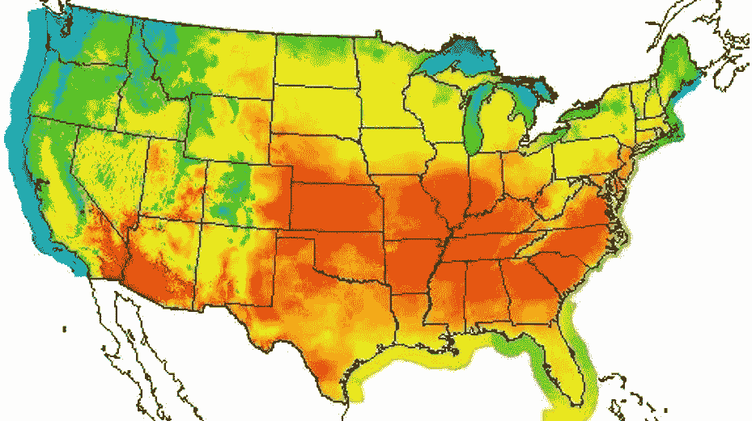

[The USA during a heat wave](https://www.npr.org/sections/thetwo-way/2012/06/29/155971952/whew-todays-weather-map-is-hot-the-nation-is-baking)

# 我们要做什么？

在描述这个实验是关于什么的之前，我需要给你一些背景。我的同事 Aouss Sbai(本文的合著者)和我正在寻找一个有趣的项目。所以我们问我们的导师[普拉门·内德尔切夫](https://www.linkedin.com/in/plamen-nedeltchev-1687266/)(思科杰出的工程师)他是否有什么股票，他和我们分享了他对加州圣何塞天气的理论。他告诉我们，他能够仅仅根据 5 月 19 日、20 日和 21 日的温度来预测夏天是否会热。他要求我们证明这一点。

你没看错，根据 3 天预测 3 个月的平均天气。坦率地说，我们并不真正相信它，并以极大的怀疑态度对待这项任务。然而，我们开始尝试去理解我们如何去证明这样一个原始的陈述。

# 数据收集

## 第一个障碍

在任何数据科学问题中，任何事情的出发点都是数据。

我们到底想要什么数据？记住我们的目标:预测圣何塞市 5 月 3 天(19 日、20 日和 21 日)的平均夏季温度。

所以我们开始寻找历史温度数据的数据库或档案。你猜怎么着？对我们来说，没有一个是足够完整或简单的😬。我们找到的唯一信息来源是一个网站，[旧农民年鉴](https://www.almanac.com/)，它列出了自 1945 年以来每天的平均气温。太棒了，任务完成了！嗯，不完全是…

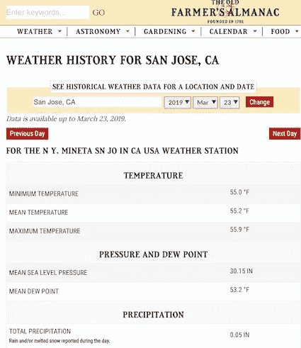

[the old farmer’s Almanac](https://www.almanac.com/)

这是 2019 年 3 月 23 日对应的页面。我们可以得到平均温度，这正是我们所需要的。但是当计算 1945 年以来每年夏季的平均温度时，这就变得繁琐得多了(~4500 天)。我们没有办法每天访问不同的页面，并手动在 excel 表格中收集这些数据…

所以我们决定自动化这项任务，并为它编写一个脚本！🤖

## 使用 web 抓取脚本实现自动化

基本上，这个想法是脚本独立地访问每个页面并寻找我们想要的数据，计算夏季的平均温度，捕捉五月三天的温度，并从 1945 年开始每年重复这个过程。但是我们到底该怎么做呢？

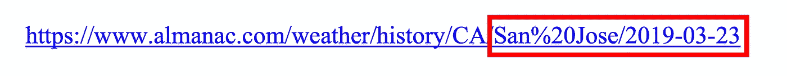

这是你刚才在上面看到的页面的 URL。正如你所看到的，它在 URL 中指定了你想要访问的城市和日期。因此，我们可以告诉脚本，对于我们感兴趣的每一天，要访问哪个 URL。但是另一个问题来了。一旦脚本出现在页面上，它如何检测我们想要的温度呢？

你可能知道，每个网页都是以 HTML 格式编写的，这意味着你在屏幕上看到的每个元素都属于一个特定的 HTML 标签。幸运的是，该网站的每个页面都是以完全相同的方式构建的。因此，我们需要做的唯一事情是识别哪个 HTML 标签存储了日平均温度，并告诉脚本获取该特定值。(感兴趣的，我们用了 python 库[美汤](https://www.crummy.com/software/BeautifulSoup/bs4/doc/))

然后，该脚本能够为我们做所有令人讨厌的计算，并返回每年的夏季平均温度和 5 月 3 天的个别温度，所有这些都打包在一个漂亮的 Excel 表中📝。

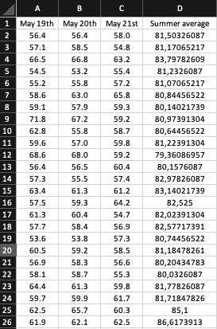

what our dataset looks like now (temperatures are in Fahrenheit). The first 3 columns are the 3 days of May, and the last one is the average summer temperature

但是(总有一个“但是”)，这还不够。事实上，仔细想想，我们 Excel 表格中的每一行都代表 1 年(夏季的平均温度+5 月的 3 天)。所以，即使我们回到 1945 年，那也只代表了 73 条线…这是太少的数据，无法假装做任何可靠的分析或预测(几百条会好得多)。因此，我们决定对圣何塞周围的北加州其他 4 个城市重复完全相同的过程，这些城市受到相同类型的天气影响，但距离足够远，没有多余的数据(以旧金山为例，它靠近海边，会使一切都有偏差，而以圣何塞郊区的米尔皮塔斯为例，不会添加任何相关数据)。我们现在有 370 次测量，这并不理想，但足以开始做一些分析。

# 开始分析吧！

## 数据转换

现在，让我们尝试简化数据集，使其更易于分析。

首先，我们将 Excel 文件数据放入 [Alteryx](https://www.alteryx.com/) ，这是一个创建端到端数据管道的数据科学工具。这将有助于我们在整个实验过程中准备和分析数据。

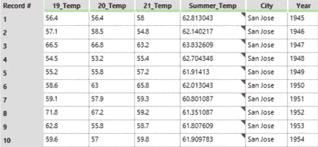

Ingested Data: we decided to add 2 columns which indicated the city and the year of the measurement

我们的目标是使用 [Tableau](https://www.tableau.com/) 可视化数据，这是最常用的商业智能(BI)工具之一。因此，我们需要将数据转换成 Tableau 可以轻松有效地使用的格式。值得一提的是，我们以一种已经结构化的格式收集数据，因此，只需要很少的数据清理。我们只是重新排序和重新格式化了一些列，并检查没有空值。

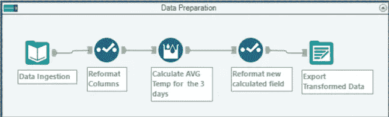

the end-to-end data transformation pipeline

上图总结了 Alteryx 转换数据的所有步骤。如您所见，第一步和最后一步只是数据导入/导出。第二个和第四个修改了数据格式，使其更容易处理。但是这个过程的第三步是什么呢？

我们注意到，5 月 19 日、20 日和 21 日的温度在所有城市和年份中都非常相似，因此我们决定通过计算它们的平均值来合并它们，从而减少要素的数量。事实上，通过结合它们，我们能够直接比较这三天的温度和夏天的温度。

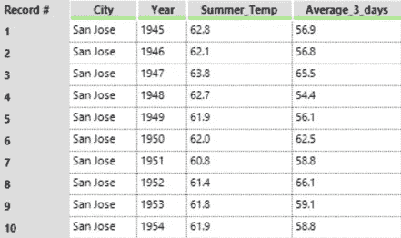

Our dataset after data transformation

请注意，有不同的解决方案来转换数据(脚本、Excel……)。我们选择使用 Alteryx 是因为我们熟悉这个工具，我们知道我们可以非常及时地完成这项工作。事实上，我们希望最大限度地减少准备数据的时间，以便最大限度地增加分析数据和解决问题的时间。

## 实际分析(这次是真的😇)

现在，我们将带您逐步了解我们用来探索和分析数据的方法，并最终得出具有统计学意义的结论:

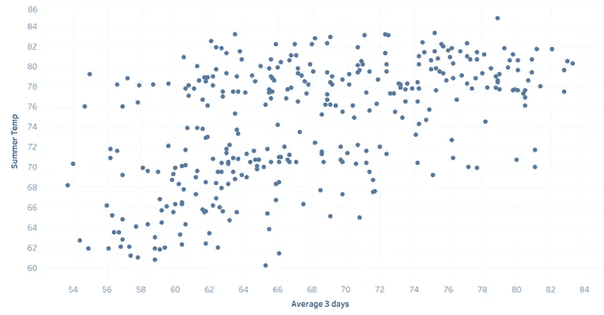

The initial graph

我们首先创建一个散点图，以了解这两个变量之间的关系。提醒一下，我们的目标是表明 5 月 19 日、20 日和 21 日的温度是预测夏季温度的良好指标。

通过查看该图，两个变量之间似乎存在正线性关系:随着这三天的温度升高，夏季的温度也升高。

这就引出了一个问题:我们如何证明这种关系？📝

这就是回归分析的用武之地。这是一种统计方法，可以用来研究两个连续变量之间的关系。

我们使用的一个非常简单的回归分析模型是线性模型，它使用一个简单的线性方程来拟合数据。我们使用这种方法是因为它解释起来相对简单，并且受到 Tableau 的支持。

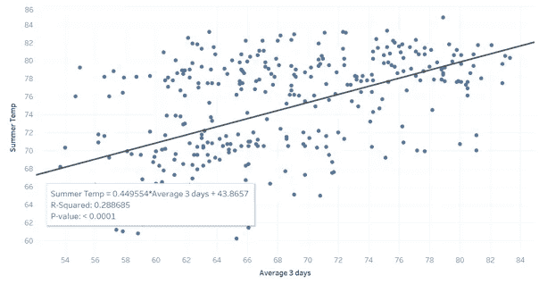

Linear regression

我们绘制的趋势线实际上向我们展示了这组点似乎遵循的大致方向。我们现在可以确认两个变量之间存在正的线性关系:**随着三天温度的升高，夏天的温度**也随之升高。

对于阅读本文的更懂统计的人来说，我们甚至可以使用描述我们的线性模型的一些度量来展示这种关系:

*   r 平方= 0.29 仅仅表明夏季温度变化的 29%可以用 3 天的温度来解释
*   p 值< 0.0001 仅仅表明模型是显著的，结果是可靠的

因此，这些结果清楚地表明，3 天(5 月 19 日、20 日和 21 日)的温度与夏季的温度之间存在相关性。虽然这些结果已经很有趣了，但是有没有可能提高模型的意义呢？

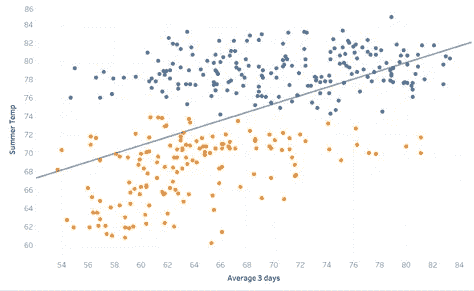

Disparity in the data

看起来数据被分成两大块(如图中突出显示的)，这肯定会影响线的拟合。有可能解释数据中的这种差异吗？

请记住，数据集包括圣何塞周围均匀分布的不同城市的温度。那么，让我们看看如果我们按城市给数据点着色会发生什么。

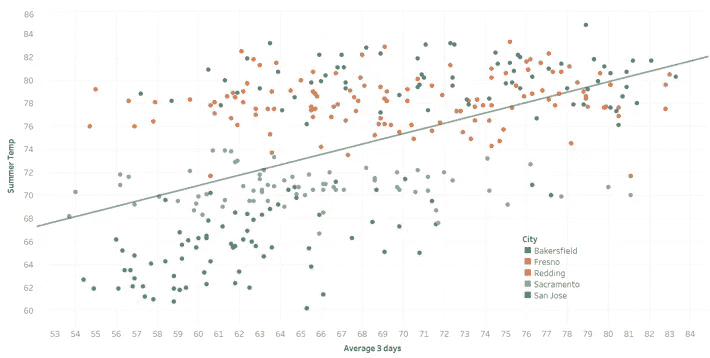

Here is the [link to the dashboard](https://public.tableau.com/profile/julien.emery#!/vizhome/Capture5/Dashboard2?publish=yes) if you want to play with the dashboard 📊

这张图表清楚地表明，即使城市受到相同类型天气的影响，结果也会因城市而异。事实上，位于北部的萨克拉门托和圣何塞比更靠南的弗雷斯诺和贝克斯菲尔德更冷。我们还可以注意到，与圣何塞相比，贝克斯菲尔德、弗雷斯诺和雷丁的夏季温度几乎没有变化，圣何塞的数据点似乎遵循积极的趋势线。

因此，单独分析每个城市这两个变量之间的关系更有意义。

通过为每个城市拟合一个模型，我们认识到，在萨克拉门托、雷丁、弗雷斯诺和贝克斯菲尔德的情况下，这两个变量之间显然没有关系。这在统计学上由接近 0 的 R 平方值和高于 0.70 的 P 值证明。

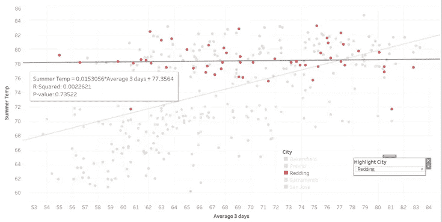

Redding trend line (similar to Sacramento, Fresno and Bakersfield)

然而，我们可以看到，在圣何塞的情况下，两个变量之间存在相关性(R 平方= 0.316，P 值< 0.0001)。请注意，这一次，夏季温度变化的 31.6%可以用 3 天的平均温度来解释。

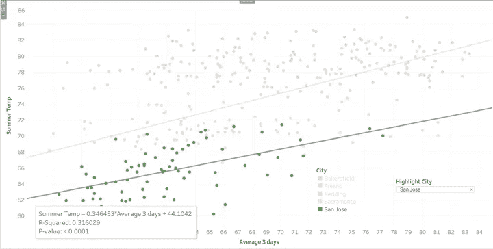

San Jose trend line

# 那么结论是什么？

结果显示了 3 天(5 月 19 日、20 日和 21 日)的温度与夏季温度之间的相关性，置信度为 99.99%(p 值< 0.0001)。然而，这一理论只适用于圣何塞市，这是非常令人惊讶的，因为所有这些城市都在加利福尼亚州，因此应该显示类似的温度趋势。

既然我们已经完成了艰苦的工作，看看我们的理论是否在今年得到证实肯定会很有趣👨‍🔬。我们将把我们的线性模型应用于 2019 年的数据，看看它是否能正确预测夏季的平均温度。虽然结果肯定不会非常准确，但它仍将是一个很好的指标，表明夏天是否会热。

在未来，我们希望通过研究可能解释这一现象的其他因素来加强这一分析，并通过使用不同的分析方法来改进我们的模型。