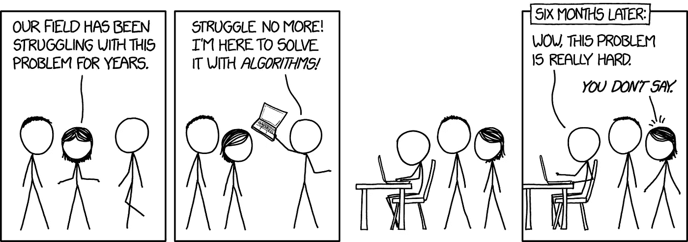
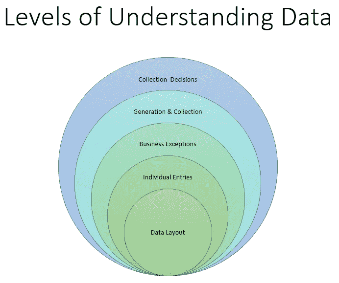

# 数据科学基础:了解你的数据。真的，真的，知道吗

> 原文：<https://towardsdatascience.com/data-science-foundations-know-your-data-really-really-know-it-a6bb97eb991c?source=collection_archive---------9----------------------->

*了解你的数据，它来自哪里，里面有什么，意味着什么。一切都从那里开始。*

如果有一条建议是我一直给每一个刚起步的数据人的，不管他们是要成为分析师、科学家还是可视化专家，那就是这条。

直到现在，我大部分时间都在这座山上度过，到了痴迷的程度。这是一个沉睡但非常重要的兔子洞。

# 但是为什么呢？

我不认为我见过一个真正的从业者相信熟悉一个数据集和周围的系统是可选的，但这是不熟悉该领域的人在涉足该领域时会想到的事情。

[https://xkcd.com/1831/](https://xkcd.com/1831/)

生活不是一次偶然的周末旅行。向您的工作数据扔一个随机森林就像向您的数据库服务器扔一个盆景一样有效。它会损坏您的服务器，并让您到处清理污垢。

你在商界的同事，尽管不是数据人员，但也不是任何类型的白痴(希望如此)。他们是领域专家，非常了解这个行业。不要做一个初级分析师，在向首席执行官展示一个辉煌的新发现时，被问及“那么，你有没有拿出我们的 3 个特别大的合同客户？”，没有好下场。相信我。

# “了解你的数据”是什么意思？

这有许多层面。我将详细介绍每一层。你也可以和我一起重温过去每一层的创伤。

The onion of data knowledge. Things get hazier and more complex as you go out.

最简单的一层是了解数据布局——它在哪里，它是如何组织的。在数据科学环境中，这通常是在数据库或日志归档中，可能是一些第三方服务和其中定义的模式。有多少数据存储，它们包含什么？什么是字段，什么是表模式和关系。基本结构和定义的东西。

接下来是个别数据中的怪癖和陷阱。数据实际上是否遵循模式，是否有任何奇怪的历史错误和工件？哪里有陷阱(总是有陷阱)。

然后是关于数据的业务问题。内部测试账户、有特殊交易的特殊合作关系、要求特定实施的处理、会计和安全实践等。

另一个更深层次的问题是，这些数据是如何收集的，从何而来。是什么系统产生的，创作和记录的背后是什么逻辑和技术。

最后，询问为什么收集了数据片段，以及什么**没有**收集，事情变得非常棘手。为什么选择某些指标而不是其他指标。

# 这个过程通常需要多长时间？

视情况而定

我通常预计每天查询和使用数据集大约需要 3-6 个月的时间，然后我才能放心地说我了解一个系统的基本原理，这个系统大约有十几个关键核心表+几十个支持表。中型公司/系统级的东西。

显然，这也取决于有多少数据，有多少系统等。要“掌握”一个系统可能需要数年时间，结果却是人们在你的领导下不断地改变这个系统。

# #1 了解数据布局

这基本上是知道什么是可用的桌面赌注。你必须知道这一点才能开始工作。

但是再深入一点，你会发现其中有很多细微的差别。有外键约束吗？数据库的设置类似于 OLTP 还是 OLAP？随着时间的推移，数据结构是否发生了很大变化，这些迁移和更新进行得如何？默认的文本编码和时区是什么？(听着，曾经有一段时间 UTF-8 不是默认的。)

哪些字段是自动生成的(自动递增字段、分片方案、自动更新的时间戳等)。表格上的相关索引是什么。什么是数据类型，一切是如何实施的。(我在一个大的 MySQL 和一个巨大的日志环境中呆了几年，这是一个很大的问题。)

当您拥有更复杂的生产环境时，事情会变得更加有趣。数据库的东西在这里，原始日志在那里，处理过的日志在这里，第三方工具使用另一种东西，Hadoop 存在于另一套机器上，我们在云中也有东西？你真的有足够的资格去接触这些东西吗？它们运行在同一时钟上吗？你到底要怎么把这些东西连接起来？你打算在什么系统上把这些东西连接在一起？你会疯了吗？(提示:大概)

## **为什么这一层对你很重要**

你需要熟悉所有这些东西才能胜任你的工作。就像知道厨房里所有的食材在哪里一样。在一些组织中，协商访问权可能是一场彻头彻尾的噩梦，然后您必须将所有东西整理到一个可以工作的地方。

在更深的层次上，通常有多种方法来衡量某些东西:销售可能记录在数据仓库中，但也可能记录在基本订单表中，并且它会在原始服务器日志中留下痕迹。中间有多层处理，这些细节可能有一天会很重要。

# #2 了解您的数据记录

当我访问一个数据表时，我做的第一件事就是在上面运行一个 **SELECT * LIMIT 5** 。我通常懒得做描述。查看一些实际的行会提供更多的信息。

玩数据玩久了，你会发现奇怪的事情，甚至在关系数据库的结构化世界里，你也会发现各种各样的怪癖。任意日志中的事情变得更加疯狂。我更难忘的一些真实发生的例子包括:

1.  空值只是在你最不怀疑的时候随机出现，如果一个字段没有被硬编码为非空，我现在希望找到空值
2.  整数被用作存储偏好标志的位掩码，因为 Eng 上有人认为这样会更好更紧凑。SQL 中的按位运算是一种额外的乐趣。进行了讨论
3.  多种时间戳风格:带/不带 tz 的字符串 ISO、64 位整数的微秒精确 unixtimes、使用内部类型的实际时间戳
4.  JSON 存储为明文，因为 db 还不支持 JSON
5.  截断 JSON，因为我们忘记了文本字段的长度是有限的
6.  在核心收入表上，系统中不应该出现重复的 ID 条目
7.  错误的文本编码
8.  意外\t，\n，\r，\c 用户代理字符串中的字符堵塞了 csv 管道
9.  某个混蛋设法在一个东西里放了 0 英镑
10.  因为 Eng 不想因停机而运行 ALTER，字段名被重新用于完全不同的用途。(你知道你是谁，“logo”字段)
11.  政府 COBOL 代码的数据转储到某个大型机上
12.  孤儿 id，因为没有人真正在 prod 中使用外键约束
13.  所有你能想象到的乐趣，甚至更多你想象不到的

## 处理这一层

这一层完全疯狂，这就是为什么大多数数据从业者似乎把大部分时间花在清理和准备数据上。在引入错误数据的 bug、恶意/天真的用户给你奇怪的数据以及偶尔的糟糕系统设计之间，这个列表没有尽头。

我们甚至还没有考虑到如果你浏览网页，或者从 PDF 或“格式精美的 Excel 表格”中提取数据会发生什么。

事实上，我对初级数据科学家的定义是，不会因为在互联网上放置一个开放的文本框而强烈退缩的人。

这些数据问题中的大多数可能会导致您编写的任何分析代码崩溃。这通常是件好事。如果你运气好(运气不好？)即使输入了奇怪的数据，你的代码也会运行，这会使你得出的任何结论无效，你需要及时意识到发生了什么。

当你有疑问时，当你看到奇怪的数据时，问问其他人。这通常是一个应该修复的错误。

# #3 了解业务数据怪癖

企业经常会收集一些奇怪的特例，这些特例比 ID 字段中的随机空值更容易使你出错。

它们是危险的，因为它们表现为有效的数据点，但它们的行为大相径庭。

我见过的例子包括:

1.  内部用户，供测试、员工或“业务朋友”使用。他们使用的东西可能和其他人不同
2.  战略合作伙伴，也许他们有大得多的配额和活动，并以折扣计费，或者他们很早就获得功能
3.  在一个账户下有效控制 50 个账户交易的经销商账户
4.  一般的日历。国定假日会弄乱你的数据，月份长度会弄乱你的汇总。我对复活节有一种强烈的厌恶，纯粹是因为它每年都是不同的日期，并且一年两次进行循环比较

## 这一层怎么处理

整个企业的领域专家和合作伙伴是处理这类数据的关键。所有这些都是你需要挖掘的机构知识的一部分，以便理解你看到的数据。

你唯一的另一个防护栏是对活动和用户的分布保持警惕。这些特例条目往往以某种方式从一个更典型的客户中脱颖而出，因此您可以将它们视为一个大的异常值，然后进行部分纠正。

# #4 了解数据来自哪里，如何生成和定义

在科学领域，我们应该一丝不苟地记录数据是如何收集和处理的，因为收集过程的细节很重要。基于数据收集和使用方式存在缺陷的事实，数以吨计的研究被宣布无效。在我们的例子中，技术实现非常重要，所以拿出你的工程师帽子。

你依赖饼干吗？这意味着人们可以清除它们，阻止它们，或者它们由于 TTL 短而过期。人们使用多种浏览器和设备。一个简单的例子是:“独特的 cookie”和“独特的人类用户”是不同的，把这两者混为一谈，你就要倒霉了。

你是否使用前端 JavaScript 将点击和滚动等事件发送回你的系统？它能在所有的浏览器上工作吗？有时候，记住人们会阻止 javascript，而机器人很少运行 JS。什么是主场比赛？什么机器记录时间？事件是在我们关心的 API 调用之前还是之后触发的？

如果数据库中的东西被跟踪，那么什么时候更新？是不是都包装在一个交易里？状态标志是单调变化还是来回自由变化？决定状态变化的业务逻辑是什么？有可能得到重复的条目吗？

你的 A/B 测试框架是如何分配受试者的，真的是无偏见的随机分配变体吗？事件计数是否正确？

地理空间数据？体验大都市地区的定义，处理邮政编码。纽约皇后县是一堆小名字的集合。

IP 数据？请记住动态 IP、NAT 和 VPN，以及它们如何与移动设备交互。此外，地理位置只是一些供应商提供的非常复杂的查找表。

物理传感器？现在，校准和磨损效应、故障和真实世界的环境都在困扰着你。

## 管理该层

如你所见，具体细节非常重要。此时，您正在检查数据背后的逻辑的完整性。你需要对数据中存在的无数偏见和错误保持高度警觉，这样你才能确切地知道你能合理地说多少。这些细节往往会决定一个模型的成败。所有关于人工智能/人工智能偏见的讨论都从这里开始。

领域专家会寻找这些细节，你应该利用他们宝贵的知识。在这方面，很难胜过集体的机构知识。

您可以通过仔细检查您的数据、检查分布、询问为什么它们看起来是那样来帮助自己发现这些问题。

随着时间的推移，您应该能够通过查看数据表的结构和数据来了解工程师们试图完成的任务。这是一个交易日志，这是一个设置更改的审计跟踪，订单在这里，可以在那里有多次发货。状态代码以这种方式更新，一个进展顺序得到保证，但另一个没有保证。

有了对表的意图的这种认识，您可以发现各种有趣的错误，而许多其他工程师不会注意到。

# #5 了解正在做出的收集决策

一直以来，我都在谈论被收集的数据。还有一个很大的缺口，所有的东西还没有被收集。

有人有意识或无意识地选择收集一部分数据，而不是另一部分。如果您担心数据和模型中的偏差，了解这些盲点非常重要。

这些决定通常源于实际考虑。有些东西是不可能收集的，或者我们出于隐私或道德原因决定不收集，或者因为我们认为它不会有用。这很少是出于公开的恶意，但误用数据的后果可能是灾难性的。

例如，我们只能收集自己用户的数据，因为根据定义，非用户不会使用我们的产品。这里有自我选择的偏见，这在你开发新产品或进入新市场时会带来麻烦。商界充斥着进入新市场不佳者的尸体。然后是算法产生的所有极其令人不安的结果[种族主义](https://bigmedium.com/ideas/links/algorithms-arent-racist-your-skin-is-just-too-dark.html) [结果](/mitigating-algorithmic-bias-in-predictive-justice-ux-design-principles-for-ai-fairness-machine-learning-d2227ce28099)以非常可疑的方式使用。

如果你意识到盲点，你可以积极地采取措施来克服它，但前提是你知道问题是从哪里开始的。也许你出去收集更多的数据，或者重新平衡现有的数据。有时候你只需要得出结论，某样东西是一个可怕的想法，它应该被废弃。

不是我们做的每件事都有争议，但我们都用算法来挑选赢家和输家。我们必须认真对待这一责任。

# 不断学习

你永远不会有完美的数据，也不会对你所有的数据有完美的理解。就在你认为你已经掌握了一些东西的时候，一个新的特性被添加了，标准被改变了，系统被淘汰了。继续学习，记录你所能做的，为你的分析留下书面记录，然后继续前进。