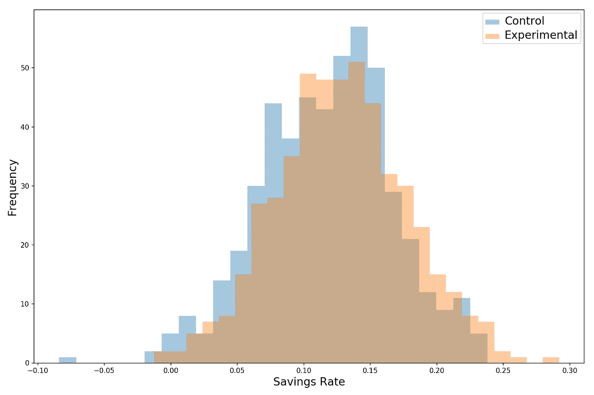
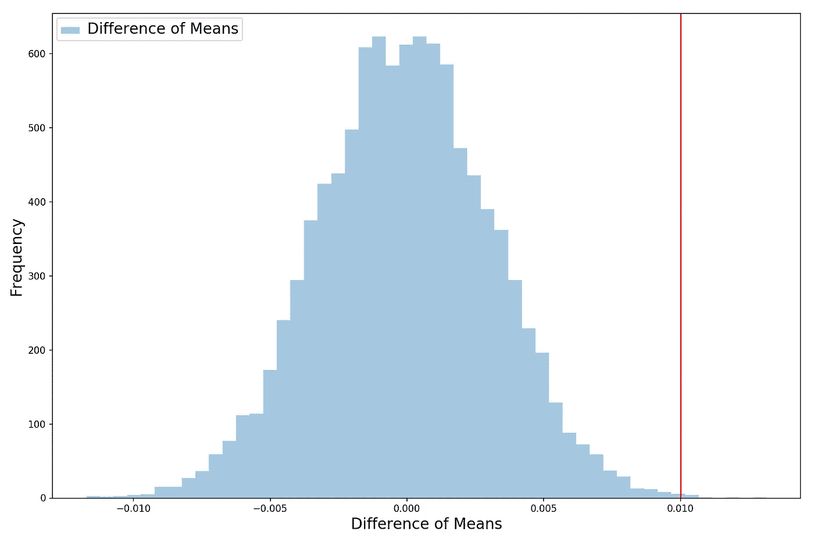
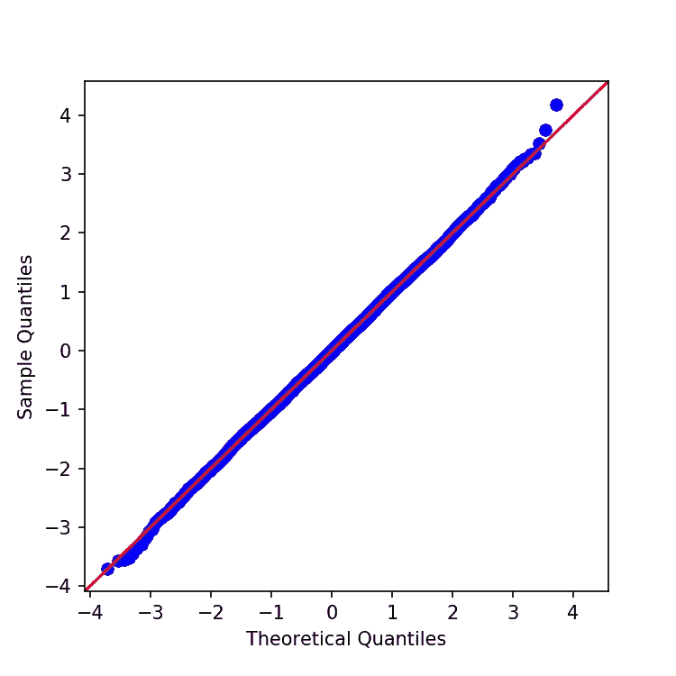
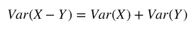
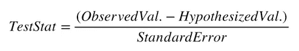
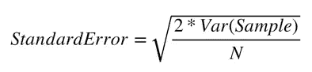

# 数据科学基础— A/B 测试

> 原文：<https://towardsdatascience.com/data-science-fundamentals-a-b-testing-cb371ceecc27?source=collection_archive---------4----------------------->


## 我们用一个简单的例子来探究 A/B 测试的来龙去脉

现在[数据科学训练营(Metis)已经结束](/how-i-feel-about-data-science-and-the-metis-bootcamp-experience-398b171289d0)，是时候为面试做准备了。自从我开始写博客，我发现写下一个概念并试图教给读者迫使我更深入地学习这个概念。

因此，在接下来的几周内，我将逐一查看每个数据科学家和有抱负的数据科学家(像我一样)应该拥有的所有核心工具，以便我们都能在面试中胜出(手指交叉)！现在进入今天的话题！

*(如果你对我在这次分析中使用的代码感兴趣，你可以在我的 GitHub* *上找到它* [*)*](https://github.com/yiuhyuk/A_B_testing)

# 伪装的假设检验


Photo by [it’s me neosiam](https://www.pexels.com/@neo8iam?utm_content=attributionCopyText&utm_medium=referral&utm_source=pexels) from [Pexels](https://www.pexels.com/photo/guy-fawkes-mask-685674/?utm_content=attributionCopyText&utm_medium=referral&utm_source=pexels)

如果你有统计学背景，在某些时候你可能会想，**“A/B 测试和假设测试是一回事吗”？是的，它是！**因此，让我们通过一个简单的例子来探究假设检验是如何工作的，从而弄清楚 A/B 检验。

想象一下，我们的客户，一个非常成功的个人理财应用的所有者，带着以下问题来找我们:

> “托尼，我们重新设计的新应用程序旨在帮助人们增加储蓄。但这真的有用吗？请帮助我们解决这个问题，以便我们决定是否部署它。”

所以我们的工作是弄清楚人们是否会因为新的应用程序设计而存更多的钱。首先，我们需要弄清楚我们是否有我们需要的数据。我们会问，“你已经收集了哪些可能有帮助的数据？”

原来我们的客户已经进行了一项实验并收集了一些数据:

*   六个月前，我们的客户随机选择了 1000 名新注册的用户，并将其中 500 人分配到控制组，500 人分配到实验组。
*   对照组继续使用当前的应用程序。
*   与此同时，实验组接触了重新设计的应用程序。
*   所有用户开始时的储蓄率都是 0%。
*   这 1000 名用户仅占该应用总用户的一小部分。

六个月后，我们的客户记录了实验中所有 1000 名用户的储蓄率。储蓄率是每个用户每月工资中储蓄的百分比。她发现了以下情况:

*   对照组的平均储蓄率从 0%上升到 12%，**标准差为 5%** 。
*   实验组的平均储蓄率从 0%上升到了 13%**，**标准差为 5%** 。**

我们的实验结果在绘制成柱状图时看起来是这样的:



Histogram of Control and Experimental Group Savings Rates

六个月后，实验组的成员看起来确实比控制组的成员有更高的储蓄率。那么，仅仅画出这个直方图，给我们的客户看，然后就到此为止，就够了吗？

不，因为我们仍然不能确定我们观察到的储蓄增加是真实的。幸运的是，我们本可以通过这样一种方式对用户进行抽样调查，即那些想要存更多钱的人最终都进入了实验组。为了解决这一问题，我们需要提出以下问题:

> 我们从随机机会中得到我们观察到的结果的可能性有多大？

回答这个问题是假设检验(也是一个 A/B 检验)的关键。

# 无效假设

**想象一下，在现实中，新的应用程序设计并没有帮助用户节省更多。**然而，即使新设计是无用的，当我们进行实验时，仍然有可能观察到储蓄率的增加。


Photo by [San Fermin Pamplona](https://www.pexels.com/@san-fermin-pamplona-549332?utm_content=attributionCopyText&utm_medium=referral&utm_source=pexels) from [Pexels](https://www.pexels.com/photo/bird-s-eye-view-of-group-of-people-1299086/?utm_content=attributionCopyText&utm_medium=referral&utm_source=pexels)

怎么会这样呢？这可能发生，因为我们正在取样。例如，如果我从成千上万的人群中随机挑选 100 人，并计算他们的平均身高，我可能会得到大约 5 英尺 8 英寸。如果我再做几次，下一次我可能会得到 5 英尺 10 英寸，下一次可能会得到 5 英尺 7 英寸。

因为我们是使用样本而不是整个人口来计算我们的统计数据，所以每个样本都意味着我们计算的数据会有所不同。

知道了采样会导致变异，我们可以将上面的问题重新组织成以下问题:

> **如果新的应用程序设计真的对人们的储蓄没有影响，那么观察到储蓄像我们从随机机会中观察到的那样大幅增加的概率有多大？**

正式地说，我们的零假设是——对照组储蓄率的增加等于实验组储蓄率的增加。

我们现在的工作是检验零假设。我们可以通过一个概率思维实验来实现。

# 一遍又一遍地模拟实验

想象一下，我们可以一次又一次地轻松即时地运行我们的实验。**此外，我们仍处于平行世界，新的应用程序设计毫无用处，对用户的储蓄没有任何影响。我们会观察到什么？**

出于好奇，我们在这里模拟一下:

*   抽取 500 个(我们的控制组中有 500 个用户，我们的实验组中有另外 500 个用户)与我们的控制组具有相同统计特征的两个正态分布随机变量中的每一个(平均值= 12%，标准偏差= 5%)。这些将是我们的控制组和实验组**(同样的意思，因为我们在我们的新设计没有效果的世界里)**。这里使用泊松分布的随机变量在技术上更正确，但是为了简单起见，我们使用正态分布的。
*   记录各组之间平均储蓄的差异(即我们从实验组的平均储蓄中减去对照组的平均储蓄)。
*   这样做一万次。
*   绘制各组间平均节省差异的直方图。

当我们这样做时，我们得到下面的直方图。直方图显示了由于随机机会(由抽样驱动)不同组之间的平均储蓄率差异有多大。

红色垂直线显示了我们的客户进行实验时实际观察到的平均储蓄率差异(1%)。**下面直方图中红线右侧的观察值百分比是我们要寻找的值——观察到随机机会节省 1%的可能性(我们在这里做一个单尾测试，因为这样更容易理解和形象化)。**



Histogram Showing the Difference Between Group Means for 10,000 Simulations (Assuming New Design Has Zero Effect on Savings Rates)

在这种情况下，该值非常低——在我们运行的 10，000 次实验中，只有 9 次(假设新设计对节约没有影响),我们观察到组均值的差异为 1%或更大。

> 这意味着**只有 0.09%的变化，观察到一个像我们一样高的值，由于随机的机会！**

**这 0.09%的几率就是我们的 p 值。**“嗯？别再给我扔乱七八糟的术语了！”，你说。围绕假设检验(和 A/B 检验)肯定有很多统计术语，我们将把大部分留给[维基百科来解释](https://en.wikipedia.org/wiki/Statistical_hypothesis_testing)。

一如既往，我们的目标是对这些工具如何工作以及为什么工作有一个直观的理解——所以一般来说，我们会尽可能避免使用术语，而倾向于简单的解释。然而，p 值是一个关键的概念，在数据科学世界中你会遇到很多，所以我们必须面对它。p 值(我们在上述模拟中计算的 0.09%值)表示:

> 如果零假设为真，观察到我们所观察到的现象的概率。

因此，**p 值是我们可以用来检验零假设是否成立的数字。**根据它的定义，看起来我们想要尽可能低的 p 值—**p 值越低，我们在实验中运气越好。**在实践中，我们将设置一个 p 值临界值(称为 alpha ),低于该临界值时，我们将拒绝零假设，并得出结论:观察到的效果/影响很可能是真实的(具有统计显著性)。

现在，让我们探索一个统计属性，让我们快速计算 p 值。

# 中心极限定理

现在是谈论统计学的一个基本概念的好时机——**[**中心极限定理**](https://en.wikipedia.org/wiki/Central_limit_theorem) **指出，如果你将独立的随机变量相加，随着你对它们求和越来越多，它们的归一化和趋向于正态分布。即使随机变量本身不来自正态分布，中心极限定理仍然成立。****

> **翻译— **如果我们计算一组样本平均值(假设我们的观察值彼此独立，就像硬币的翻转是如何独立的)，所有这些样本平均值的分布将是正态分布。****

****

**Q-Q Plot — The Red Line Denotes a Perfectly Normal Distribution**

**看看我们之前计算的平均差异直方图。看起来像正态分布，对吗？我们可以使用 [Q-Q 图](https://en.wikipedia.org/wiki/Q%E2%80%93Q_plot)来验证正态性，该图将我们分布的分位数与参考分布(在本例中为正态分布)的分位数进行比较。如果我们的分布是正常的，它会紧紧贴着红色的 45 度线。的确如此，酷！**

**因此，当我们一遍又一遍地运行我们的储蓄实验时，这就是中心极限定理发挥作用的一个例子！**

**那么，为什么这很重要呢？**

**还记得我们之前是如何通过运行 10，000 次实验来测试零假设的吗？听起来是不是超级累？现实中，反复做实验既累又费钱。但是由于中心极限定理，我们不必这样做！**

> **我们知道我们重复实验的分布是什么样的——正态分布，我们可以使用这一知识来统计推断我们 10，000 次实验的分布，而无需实际运行它们！**

# **让我们回顾一下目前我们所知道的:**

*   **我们观察到对照组和实验组之间平均储蓄率有 1%的差异。我们想知道这是真正的差异还是仅仅是统计上的噪音。**
*   **我们知道我们需要对实验结果有所保留，因为我们只对客户总用户群的一小部分样本进行了实验。如果我们在新的样本上再做一次，结果就会改变。**
*   **由于我们担心实际上新的应用程序设计对储蓄没有影响，我们的零假设是控制组和实验组之间的均值差异为零。**
*   **从中心极限定理中我们知道，如果我们重复采样并进行新的实验，这些实验的结果(对照组和实验组之间观察到的平均差异)将具有正态分布。**
*   **根据统计学，我们知道当我们取两个独立随机变量的差时，结果的方差等于单个方差之和:**

****

# **完成工作**

**不错！我们现在有了进行假设检验所需的一切。因此，让我们继续完成我们从客户那里收到的任务:**

****

**Same Histogram as Above (Pasted Again for Reference)**

*   **首先，在我们通过查看数据产生偏见之前，我们需要选择一个截断点，称为 alpha(如果我们计算的 p 值小于 alpha，我们拒绝零假设，并得出结论，新设计增加了储蓄率)。阿尔法值对应于我们发生假阳性的概率——当它实际上为真时拒绝零假设。0.05 在统计学家中是相当标准的，所以我们将采用它。**
*   **接下来，我们需要计算检验统计量。**检验统计量是上面直方图的等值数字，它告诉我们观察值(1%)离零假设值(在我们的例子中为零)有多少标准差。**我们可以这样计算:**

****

*   **[**标准差**](https://en.wikipedia.org/wiki/Standard_error) **是实验组平均储蓄率与对照组平均储蓄率之差的标准差。**在上图中，标准误差由蓝色直方图的宽度表示。回想一下，两个随机变量之差的方差等于单个方差之和(标准差是方差的平方根)。我们可以利用已有的信息轻松计算出标准误差:**

****

*   **记住，控制组和实验组的储蓄率都有 5%的标准差。所以我们的样本方差是 0.0025，N 是每组的观察次数，所以 N 等于 500。将这些数字代入公式，我们得到的标准误差为 0.316%。**
*   **在检验统计公式中，观察值是 1%，假设值是 0%(因为我们的零假设是没有影响)。将这些值与我们刚刚计算的标准误差一起代入检验统计公式，我们得到的检验统计值为 0.01/0.00316 = 3.16。**
*   **我们观察到的 1%的值距离假设值 0%有 3.16 个标准偏差。那太多了。我们可以使用下面的 Python 代码来计算 p 值(对于双尾检验)。我们得到的 p 值是 0.0016。请注意，我们使用 p 值进行**双尾检验，因为我们不能自动假设新设计与当前设计相同或更好——新设计也可能更差，双尾检验考虑了这种可能性**(更多信息请参见)。**

```
from scipy.stats import norm# Two Tailed Test
print('The p-value is: ' + str(round((1 - norm.cdf(3.16))*2,4)))
```

*   **p 值 0.0016 低于我们的 alpha 值 0.05，因此我们拒绝零假设，并告诉我们的客户，是的，新的应用程序设计确实帮助她的用户节省了更多的钱。万岁，胜利！**

****

**Photo by [Rakicevic Nenad](https://www.pexels.com/@rakicevic-nenad-233369?utm_content=attributionCopyText&utm_medium=referral&utm_source=pexels) from [Pexels](https://www.pexels.com/photo/man-with-fireworks-769525/?utm_content=attributionCopyText&utm_medium=referral&utm_source=pexels)**

**最后，请注意，我们分析计算的 p 值 0.0016 不同于我们之前模拟的 0.0009。这是因为我们运行的模拟是单尾的(单尾测试更容易理解和可视化)。我们可以通过将模拟的 p 值乘以 2(考虑第二个尾部)来协调这些值，得到 0.0018，非常接近 0.0016。**

# **结论**

**在现实世界中，A/B 测试不会像我们虚构的例子那样一目了然。很可能我们的客户(或老板)没有现成的数据给我们，我们必须自己收集和清理数据。以下是准备 A/B 测试时需要记住的一些额外的实际问题:**

*   **你需要多少数据？收集数据既费时又费钱。一个运行不佳的实验甚至可能会疏远用户。但是如果你没有收集到足够的观察数据，你的测试就不会很可靠。所以你需要仔细权衡更多观察的好处和收集它们的增量成本。**
*   ****错误拒绝真零假设(1 型错误)的成本与未能拒绝假零假设(2 型错误)的成本相比是多少？**回到我们的例子，第 1 类错误相当于为新的应用程序设计开绿灯，而它实际上对节约没有影响。第二类错误相当于坚持当前的设计，而新的设计实际上鼓励人们存更多的钱。我们通过选择一个合理的临界值α来权衡 1 型和 2 型错误的风险。**较高的α增加 1 型错误的风险，较低的α增加 2 型错误的风险。****

**希望这是有益的，干杯！**

*****如果你一路走到这里，请看看我带来的其他作品:*****

**[*这是我迄今为止所有作品中最喜欢的，关于神经网络的*](/understanding-neural-networks-19020b758230)**

**[*随机森林为什么伟大*](/understanding-random-forest-58381e0602d2)**

**我已经开始想念我的梅蒂斯训练营经历和朋友们了！**

**[*我在 Metis 工作时参与的一个项目，投资于 Lending Club 贷款*](/turning-lending-clubs-worst-loans-into-investment-gold-475ec97f58ee)**

**[*我的第一个数据科学帖子，逻辑回归*](/understanding-logistic-regression-using-a-simple-example-163de52ea900)**