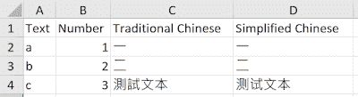
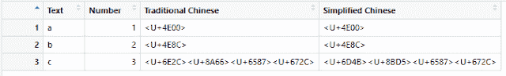
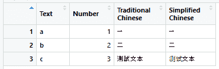
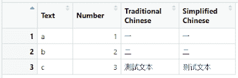
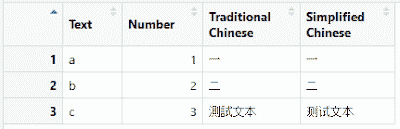
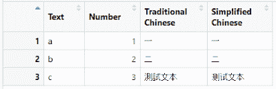

# 数据科学基础(R):从 Excel 导入数据— readxl

> 原文：<https://towardsdatascience.com/data-science-fundamentals-r-import-data-from-excel-readxl-380ef47216d5?source=collection_archive---------15----------------------->


导入和导出文件有多种方式。我们上次讲过 [xlsx](/data-science-fundamentals-r-import-export-data-in-excel-xlsx-bdb12a588735) 这次我们会通过 readxl，同样，也有一些参数需要设置，尤其是导入文本的时候。

其他导入和导出包在系列中讨论。

[](https://medium.com/series/data-science-fundamentals-r-import-export-data-14667fed24a8) [## 数据科学基础(R) —导入和导出数据

### 数据科学基础(R):从 Excel 导入和导出数据— xlsx

medium.com](https://medium.com/series/data-science-fundamentals-r-import-export-data-14667fed24a8) 

# **套餐**

readxl

# **功能**

读取 xls 和 xlsx 文件

# **描述**

read_excel()调用 excel_format()根据文件扩展名和文件本身来确定 path 是 xls 还是 xlsx。如果您有更好的了解并希望防止这种猜测，请直接使用 read_xls()和 read_xlsx()。

# **演示**

输入数据包括英文文本、数字、繁体中文文本和简体中文文本。

在本演示结束时，您将知道应该指定哪些选项来导入 r 中不同格式的上下文数据。使用 xlsx 和 readxl 的一个主要区别是，xlsx 只能支持 xlsx 文件的导入，但 **readxl 同时支持 xlsx 和 xls 文件**。

> **测试功能(默认设置):**
> 
> read_excel(path，sheet = NULL，range = NULL，col_names = TRUE，col_types = NULL，na = "，trim_ws = TRUE，skip = 0，n_max = Inf，guess_max = min(1000，n_max))
> 
> read_xls(path，sheet = NULL，range = NULL，col_names = TRUE，col_types = NULL，na = "，trim_ws = TRUE，skip = 0，n_max = Inf，guess_max = min(1000，n_max))
> 
> read_xlsx(path，sheet = NULL，range = NULL，col_names = TRUE，col_types = NULL，na = "，trim_ws = TRUE，skip = 0，n_max = Inf，guess_max = min(1000，n_max))

# **输入文件**

Reference_Sample.xlsx



参考 _ 样本. xls


# **代码**

```
###############
library(readxl) 
############### 
getwd() 
# read excel xls/ xlsx - method 1 
xls_df = read_excel(path = "Reference_Sample.xls", sheet = "Sample_Sheet")
```



与使用 xlsx 相同，如果未定义区域设置，则以 UTF 代码显示中文字符。如果您需要阅读中文字符或其他语言的特定字符，则需要进行区域设置。

```
Sys.setlocale(category = "LC_ALL", locale = "Chinese") 
# read excel xls/ xlsx - method 1
xls_df1 = read_excel(path = "Reference_Sample.xls", sheet = "Sample_Sheet")
```



```
xlsx_df1 = read_excel(path = "Reference_Sample.xlsx", sheet = "Sample_Sheet")
```



xlsx 和 xls 文件均以数据框结构导入，繁体中文和简体中文字符均可成功显示。

readxl 还提供了专门导入 xlsx 或 xls 文件的其他函数。

```
# read excel xls - method 2
xls_df2 = read_xls(path = "Reference_Sample.xls", sheet = "Sample_Sheet")
```



```
# read excel xlsx - method 3
xlsx_df2 = read_xlsx(path = "Reference_Sample.xlsx", sheet = "Sample_Sheet")
```



read_xls 和 read_xlsx 都可以演示与 read_excel 相同的读取功能。正如函数名所指定的，read_xls 只能读取 xls 文件，而 read_xlsx 只能读取 xlsx 文件。如果反过来做，会出现以下错误。

```
xlsx_df3 = read_xlsx(path = "Reference_Sample.xls", sheet = "Sample_Sheet")
```

sheets_fun(path)中的错误:评估错误:在“Reference_Sample.xls”中找不到“”。

# **总结**

与 xlsx 包相比，readxl 可以读取 xlsx 和 xls 文件，并且选项设置较少。使用 readxl 时，只需要文件路径和工作表名称。在 read_excel、read_xls 和 read_xlsx 这三个函数中，read_excel 既适用于 xlsx 文件，也适用于 xls 文件，因此，一般来说，建议使用 read_excel 来读取 excel 文件。

你可以在 R [这里](https://medium.com/series/data-science-fundamentals-r-import-export-data-14667fed24a8)找到数据导入导出的其他文章。

# 编辑的话

如果你有兴趣了解更多的窍门和技巧，欢迎你浏览我们的网站:【https://cydalytics.blogspot.com/

**领英:**

凯莉·罗—[https://www.linkedin.com/in/carrielsc/](https://www.linkedin.com/in/carrielsc/)

黄洋[—https://www.linkedin.com/in/yeungwong/](https://www.linkedin.com/in/yeungwong/)

1.  [数据科学基础(R):从文本文件导入数据— textreadr & readtext](https://medium.com/analytics-vidhya/data-science-fundamentals-r-import-data-from-text-files-textreadr-readtext-c5058c3bd0d6?source=friends_link&sk=dc3c4a22b2c02e66ceac70ad31001d0f)
2.  [数据科学基础(R):导入&导出 Excel 中的数据— xlsx](/data-science-fundamentals-r-import-export-data-in-excel-xlsx-bdb12a588735?source=friends_link&sk=15d135b8d3544f5a63f688ff309c159f)
3.  [数据可视化技巧(Power BI)——将分类变量转换为虚拟变量](/data-visualization-tips-power-bi-convert-categorical-variables-to-dummy-variables-a53f20cdb4e?source=friends_link&sk=64aeb5d2d5c7b1f9aa34b4adcc052694)
4.  [形状各异的中文词云(Python)](https://medium.com/@yeung_cyda/written-in-chinese-step-by-step-chinese-word-cloud-with-python-53f57f65be69?source=friends_link&sk=5194e7fadf63033934fae9111ef76a98)
5.  [用 Python 制作一个让孩子学英语、玩得开心的游戏](/making-a-game-for-kids-to-learn-english-and-have-fun-with-python-d6b54af792ec?source=friends_link&sk=d174a0470ca5400fda2b20ddf633e624)