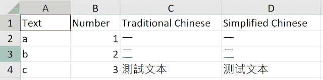
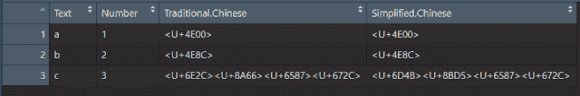
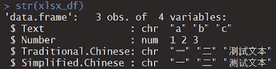
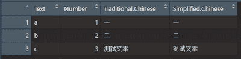
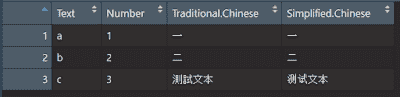
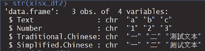
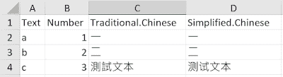
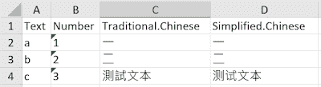

# 数据科学基础(R):从 Excel 导入和导出数据— xlsx

> 原文：<https://towardsdatascience.com/data-science-fundamentals-r-import-export-data-in-excel-xlsx-bdb12a588735?source=collection_archive---------21----------------------->


**数据科学是一个非常广泛的话题，在进入这个巨大的森林之前，你应该知道正确导入和导出数据这一最基础的部分。**没有数据，你就无法执行所有的机器学习技术或得出有见地的分析。你可能认为导入和导出非常容易，只需要一个简单的代码和里面的文件名。我以前也有同样的感觉，但是后来，我意识到有一些关键的参数需要更改(尤其是如果数据涉及到文本)，否则，您将不会以您想要的方式获得数据。你会看到下面的例子。

**这篇文章会给你一个使用 R 包的总结，** `**xlsx**` **。**您将了解如何导入和导出具有不同功能的 excel 文件，以及它们之间的区别。

其他导入和导出包在系列中讨论。

[](https://medium.com/series/data-science-fundamentals-r-import-export-data-14667fed24a8) [## 数据科学基础(R) —导入和导出数据

### 数据科学基础(R):从 Excel 导入和导出数据— xlsx

medium.com](https://medium.com/series/data-science-fundamentals-r-import-export-data-14667fed24a8) 

# 包裹

xlsx

# 功能

读取、写入和格式化 Excel 2007 和 Excel 97/2000/XP/2003 文件

# 描述

xlsx 包使用 r 对 Excel 文件进行编程控制。高级 API 允许用户**将一张 xlsx 文档读入 data.frame** 并将 **data.frame 写入文件**。较低级别的功能允许直接操作表、行和单元格。例如，用户**具有** **控件来设置颜色、字体、数据格式、添加边框、隐藏/取消隐藏工作表、添加/移除行、添加/移除工作表等**。

# 示范

输入数据包括英文文本、数字、繁体中文文本和简体中文文本。

在本演示结束时，您将知道应该指定哪些选项来导入和导出 r 中不同格式的上下文数据。

> **要测试的功能(默认设置)**
> 
> read.xlsx (file，sheetIndex，sheetName=NULL，rowIndex=NULL，startRow=NULL，endRow=NULL，colIndex=NULL，as.data.frame=TRUE，header=TRUE，colClasses=NA，keepFormulas=FALSE，encoding="unknown "，password=NULL，…)
> 
> read.xlsx2 (file，sheetIndex，sheetName=NULL，startRow=1，colIndex=NULL，endRow=NULL，as.data.frame=TRUE，header=TRUE，colClasses="character "，password=NULL，…)
> 
> write.xlsx (x，file，sheetName="Sheet1 "，col.names=TRUE，row.names=TRUE，append=FALSE，showNA=TRUE，password=NULL)
> 
> write.xlsx2 (x，file，sheetName="Sheet1 "，col.names=TRUE，row.names=TRUE，append=FALSE，password=NULL，…)

# 导入文件



Reference_Sample.xlsx

```
#############
library(xlsx)
#############
# read excel xlsx - method 1xlsx_df = read.xlsx(file="Reference_Sample.xlsx", sheetName="Sample_Sheet", header=T, stringsAsFactors=F, encoding="UTF-8")
```



```
str(xlsx_df)
```



header=T 在 r 中检索 xlsx 文件的标题。

使用 stringsAsFactors=F 代替 T，因为我们不希望 R 将字符输入视为因子。

你可以发现，由于编码设置为“UTF-8”，所以汉字是用 UTF 码显示的。如果未设置编码，将显示乱码。


如果要显示中文字符或其他语言的特定字符，应该预先设置区域设置。在本例中，应该指定 local = "Chinese"。

***local = "cht "只能显示繁体中文文本，local = "Chinese "可以显示繁体和简体中文两种文字。***

```
Sys.setlocale(category = "LC_ALL", locale = "Chinese")
# read excel xlsx - method 1xlsx_df = read.xlsx(file="Reference_Sample.xlsx", sheetName="Sample_Sheet", header=T, stringsAsFactors=F, encoding="UTF-8")
```



```
# read excel xlsx - method 2
xlsx_df2 = read.xlsx2(file="Reference_Sample.xlsx", sheetName="Sample_Sheet", header=T, stringsAsFactors=F)
```



您会发现两种方法，即 read.xlsx 和 read.xlsx2，都以相同的格式显示数据。由于默认编码是“UTF-8”，因此如果区域设置正确，即区域设置为“中文”，应该会显示相同的输出。然而，当您检查 xlsx_df2 的结构时，您可以发现一些不同之处。

```
str(xlsx_df2)
```



所有变量的结构都变成字符。如果以后要做计算，可能会造成不便。

使用 read.xlsx 和 read.xlsx2 时，如果列名包含空格，则所有空格都更改为“.”

因此，当您使用列名对列进行选择时，您需要使用新的名称，即“Traditional”。中文”和“简体”。中国人”在这种情况下。

# 导出文件

以下部分是编写 excel 输出的演示。

```
# write excel xlsx - method 1write.xlsx(xlsx_df, file="Output1.xlsx", sheetName="Sample_Sheet", row.names=F, showNA=F)
```



指示 row.names = F 删除 r 中使用的行索引。

使用 showNA = F 是为了在输出文件中空白将保持为空白，而不是被“NA”替换。

但是，如果在导出之前没有再次定义列名，则列名仍然是 R 中显示的那些列名，所以您仍然会发现那些“.”在列名中。

```
# write excel xlsx - method 2
write.xlsx2(xlsx_df2, file="Output2.xlsx", sheetName="Sample_Sheet", row.names=F, showNA=F)
```



使用 write.xlsx2 的输出显示类似的输出，但是 xlsx_df2 的所有列的上下文都是 char，所以输出会保留相同的结构，可以看到 B 列上的数字变成了字符。

# 摘要

建议使用 read.xlsx，因为原始数据结构没有改变，但是您需要定义编码方法。(编码= "UTF-8 "是常用的。)

对于编写 excel 文件，write.xlsx 和 write.xlsx2 的输出文件非常相似，因此您可以使用其中任何一个。

使用 xlsx 的一个限制是它只支持带有。xlsx 扩展名，如果要读取 xls 文件，可以使用 readxl(下一篇文章会讲到)。

你可以在这里找到 R [的其他数据导入导出的文章。](https://medium.com/series/data-science-fundamentals-r-import-export-data-14667fed24a8)

# 编辑的话

如果你有兴趣了解更多的窍门和技巧，欢迎你浏览我们的网站:[https://cydalytics.blogspot.com/](https://cydalytics.blogspot.com/)

**领英:**

卡丽·罗—[https://www.linkedin.com/in/carrielsc/](https://www.linkedin.com/in/carrielsc/)

黄洋[—https://www.linkedin.com/in/yeungwong/](https://www.linkedin.com/in/yeungwong/)

# 其他文章

1.  [数据科学基础(R):从 Excel 导入数据— readxl](/data-science-fundamentals-r-import-data-from-excel-readxl-380ef47216d5?source=friends_link&sk=c8992f7ab1cdc18d1e67353215d95097)
2.  [数据科学基础(R):从文本文件导入数据— textreadr & readtext](https://medium.com/analytics-vidhya/data-science-fundamentals-r-import-data-from-text-files-textreadr-readtext-c5058c3bd0d6?source=friends_link&sk=dc3c4a22b2c02e66ceac70ad31001d0f)
3.  [数据可视化技巧(Power BI)——将分类变量转换为虚拟变量](/data-visualization-tips-power-bi-convert-categorical-variables-to-dummy-variables-a53f20cdb4e?source=friends_link&sk=64aeb5d2d5c7b1f9aa34b4adcc052694)
4.  [形状各异的中文词云(Python)](https://medium.com/@yeung_cyda/written-in-chinese-step-by-step-chinese-word-cloud-with-python-53f57f65be69?source=friends_link&sk=5194e7fadf63033934fae9111ef76a98)
5.  [用 Python 制作一个让孩子学习英语并从中获得乐趣的游戏](/making-a-game-for-kids-to-learn-english-and-have-fun-with-python-d6b54af792ec?source=friends_link&sk=d174a0470ca5400fda2b20ddf633e624)