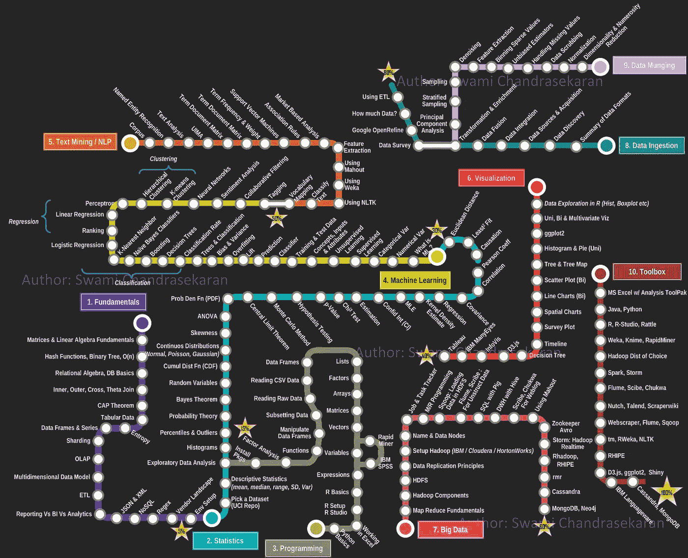

# 数据科学变得太模糊了

> 原文：<https://towardsdatascience.com/data-science-has-become-too-vague-538899bab57?source=collection_archive---------5----------------------->

## 大家专精，散了吧！

我不反对淡化“数据科学”这个术语，并把它分解成专门的学科。不要误解，我认为全球“数据科学”运动是必要的，并对坏脾气的企业界产生了积极影响。但这场运动已经取得了胜利，每个人都接受了这个想法。与其继续在“数据科学”的保护伞下宣传和招聘，也许我们应该让尘埃落定，让人们能够适应变化。

数据科学专业人士，请考虑不再让自己背负“数据科学家”的沉重头衔。我们中的大多数人并不具备每个新话题的博士或百科知识。也许我们应该专业化，减轻自己无所不知的压力。数据科学已经成为一个过于宽泛的术语，并且变得如此普遍和模糊，以至于经常毫无意义。为什么会有人想拥有如此不起眼的东西？

同样有趣的是，八年前，那些被你称为“数据科学家”的人也有这些担忧，甚至质疑数据科学不是真正的科学。毕竟，[“给我看一门不涉及数据的科学”](http://radar.oreilly.com/2011/05/data-science-terminology.html)。

在这篇文章中，我想强调“数据科学”是如何发展的，以及为什么是时候对它进行细分了。

 [## 2019 年学数据科学的感受

### 透过(决策树)看到(随机)森林

towardsdatascience.com](/how-it-feels-to-learn-data-science-in-2019-6ee688498029) 

# 贾巴沃克效应

2010 年，有一部短暂但令人难忘的美剧叫做*比 Ted 更好*。这部剧是一部愚蠢的职场喜剧，以夸张的方式讽刺了企业文化。但是有一集，*贾巴沃克*(第一季第 12 集)，太准确地抓住了公司流行语的效果。

主角泰德试图隐藏一个宠物项目的预算。当他的老板 Veronica 与他对质时，他撒谎说资金被用于革命性的“贾巴沃克”项目，这是他当场含糊地编造的。

有趣的是。维罗妮卡没有澄清“贾巴沃克”是什么，而是假装“知道内情”,害怕因为被排除在外而显得无能。她将不存在的贾巴沃克项目作为公司其他部门的重中之重。令人捧腹的结果是，在贾巴沃克工作的每一位领导和员工都不知道这是什么，但他们绝不敢互相承认自己的无知。

对事态升级的程度感到措手不及，在他们做“贾巴沃克”的主题演讲之前，泰德向维罗妮卡坦白了。Veronica 告诉 Ted 继续进行，因为“产品是为没有演示的人准备的”。

我大概不必解释“贾巴沃克”这个比喻。把这个词换成“区块链”、“大数据”、“比特币”、“人工智能”、“物联网”、“量子计算”、“机器学习”或者“数据科学”，你就完全明白我的意思了。长期以来，企业文化一直在宣传创新，人们假装理解创新，结果却遭遇了它们的局限，并追逐其他东西。

既然我已经强调了“贾巴沃克效应”，让我们继续。

# 数据科学简史

如果你想把“数据科学”定义为任何与“数据”有关的东西，你可以回到计算的黎明。如果你认为数学和统计学与数据一样对数据科学至关重要，你可以回到几个世纪前，说统计学家是最初的“数据科学家”。

为了简洁起见，让我们回到 20 世纪 90 年代。事情过去很简单。分析师、统计学家、研究人员和数据工程师都是相当独立的角色，偶尔会有重叠。工具栈通常由电子表格、R、MATLAB、SAS 和/或 SQL 组成。

当然，在整个 2000 年，事情都在变化。谷歌将数据收集和分析推到了难以想象的高度。2009 年，谷歌高管[坚持认为统计学家将是未来 10 年内“最性感的工作”。那是十年前的事了，但我记得那是一种奇怪的感觉。但你瞧，2011 年《哈佛商业评论》将这一名为“数据科学”的概念纳入主流，并宣布其为](https://www.youtube.com/watch?v=tm3lZJdEvCc)[21 世纪最性感的工作](https://hbr.org/2012/10/data-scientist-the-sexiest-job-of-the-21st-century)。

就在那时,“贾巴沃克”时尚的热潮开始了。哈佛创造了一个名为“数据科学”的空白，每个人都竞相填补。SQL 开发人员、分析师、研究人员、定量分析师、统计学家、物理学家、生物学家和无数其他专业人员将自己重新包装为“数据科学”专业人员。硅谷公司觉得“分析师”或“研究员”等传统职位听起来太局限，于是将这些职位更名为“数据科学家”，听起来更有权力和影响力。

在硅谷之外，这增加了困惑，因为大多数人认为“科学家”是穿着白大褂的博士。与直觉相反，数据科学家实际上来自不同教育水平的许多背景(技术和非技术)(学士、学士、工商管理硕士，有时还有博士)。许多招聘经理、人力资源部门和组织通常都很难定义他们需要什么样的数据科学家，这就是为什么你们中的许多人可能都有关于年轻数据科学家被扔进 MySQL 数据库，但却无法用它做任何有意义的事情的悲伤轶事。

再加上数据工程(想想“大数据”)的扩展进步，以及“机器学习”的快速进步，“数据科学”的保护伞变得更大、更模糊。越来越多的流行语被抛出，很多人都在说，但很少有人理解。不知不觉中，“大数据”和“机器学习”已经成为同义词，学科的区分也就失去了。

更糟糕的是，公司在不知情的情况下做出决策，并认为他们需要数据科学技能“X”(例如深度学习)来解决调度等日常问题，而实际上他们需要的是懂搜索算法的运筹学人员。[当前的热点并不是大多数问题的最佳解决方案](/is-deep-learning-already-hitting-its-limitations-c81826082ac3)，这可能是一个代价高昂的错误。你可以在下面阅读我关于这个主题的另外两篇文章。

 [## 深度学习已经达到极限了吗？

### 又一个人工智能的冬天来了吗？

towardsdatascience.com](/is-deep-learning-already-hitting-its-limitations-c81826082ac3)  [## 数独和时间表

### 用树搜索解决调度问题

towardsdatascience.com](/sudokus-and-schedules-60f3de5dfe0d) 

“数据科学”的领域已经被“贾巴沃克”效应耗尽。如果我们希望它继续成功，我们需要使它专门化，而不是用一般化造成更多的混乱。

# 解散“数据科学”的理由

“数据科学”的推动做了一些伟大的事情。它让脾气暴躁的老企业重新振作起来，做一些新鲜刺激的事情。传统上，IT 部门在提供数据访问和[允许非 IT 人员编写代码](https://en.wikipedia.org/wiki/Shadow_IT)方面很吝啬，他们被迫发展并支持这样的计划。最重要的是，它将技术大众化到如此多的非技术职业中。律师可以从学习编码中获益的想法已经不再是边缘性的了，这种仪式也不再是计算机科学家、专业程序员和工程师的专利。

> 不知不觉中，“大数据”和“机器学习”已经成为同义词，学科的区分也就失去了。

但这是“数据科学”运动已经成功并走到尽头的标志。继续推动它开始变得有害。以下是一些原因:

## 它太宽了

不久前，如果你获得了“商业管理”学士学位，你就可以轻松地向上流动。但是今天，传统的成功往往需要专注于某个特定的领域，这仅仅是因为我们的世界变得复杂了。商科学生学习金融、供应链管理、运筹学、会计学、市场营销或其他特定的商业学科会更好。

我认为“数据科学”需要经历类似的转变。就像商业本身一样，有太多的学科需要完全掌握。尝试学习所有这些知识是徒劳的，尤其是一次就学会。当然，对外面的世界有高层次的认识是有益的。随着时间的推移改变兴趣也是健康的。然而，试图无所不知永远不会产生价值。我发现这种不集中注意力的学习方式是无效的，喜剧演员布莱恩·里根对此做了最好的讽刺:“我想学习！我想成为一名学习者！”

“数据科学”可以在 Excel 或 [Tableau](https://www.tableau.com/) 中创建图表，以及构建和调整[神经网络分类器](https://www.youtube.com/watch?v=tAioWlhKA90)，这一直困扰着我。说真的，这是怎么回事？这两项任务在性质、所需的技能和薪水上有着天壤之别。编写 SQL 查询还是构建贝叶斯模型？这些也是不相关的技能组合，绝对不能互换。那么，为什么我们将拥有这些极其多样化技能的人概括为“数据科学家”，并让招聘变得如此模糊和困难呢？

一些读到这里的人可能会说“所有这些学科都是相互关联的，而‘数据科学’学科有助于统一和整合它们。”这在某种程度上是有争议的，但是营销、财务、供应链、会计和其他业务功能也是相互关联的。尽管有一个共同的目标，但它们仍然是不同的领域，我们不再强调“业务管理”的整体。碎片化和专门化是领域成熟的一部分，随着时间的推移，它们比领域本身得到更多的关注。

> “数据科学”可以在 Excel 或 Tableau 中创建图表，以及构建和调整神经网络分类器，这一直困扰着我。说真的，这是怎么回事？

## 这是压倒性的

促使我写这篇文章的原因之一是，越来越多的数据科学家发表文章，承认他们对“[冒名顶替综合征](https://en.wikipedia.org/wiki/Impostor_syndrome)”的感受。有[这个我见过流传的。](https://brohrer.github.io/imposter_syndrome.html?imm_mid=0fa51c&cmp=em-data-na-na-newsltr_20180110)还有[这个](https://www.linkedin.com/pulse/imposter-syndrome-data-science-jt-kostman-phd/?trackingId=eyGMSRhsUj7Ww1A8ffgZgg%3D%3D)。随着时间的推移，越来越多的数据科学专业人士不断站出来，承认他们的欺诈感。从专业角度来说，冒名顶替综合症的负担会让你充满恐惧，夜不能寐。这个问题总是挥之不去“多久我会被发现我的欺诈行为？”

但是我相信这是这篇文章中更大问题的一个症状。我花了太长时间才明白“数据科学”已经变成了与“数据”相关的任何事物。可悲的是，有些人认为自己拥有这一切。我不明白为什么会有人想这么做。

This is all you need to become a confident data scientist (as of 2013). Totally achievable, right?

上图是成为数据科学家的流行(但过时)路线图。这不仅对有个人生活的人来说不切实际，而且为什么要开一个“一刀切”的课程？也许你可以在那里获得关于每个主题的浅薄知识，但是人们在不同的环境中工作，会遇到不同的问题。在给定的时间点，为什么不学习您特定工作所需的工具呢？也不要介意工具和平台来来去去，技能很快成为遗产。这个路线图中唯一不容易过时的部分是经典的数学概念。

不要误解，学习和获得现有解决方案的一般概念总是好的。但在日常生活的现实中，有效的人知道如何辨别和优先考虑，而不是被 FOMO 所驱使。

## 它浸透了一切

数据现在就像电一样。它在任何地方都有不同的用途。在 19 世纪，人们会惊叹于电力带来的一切。

如今，人们对电力的关注越来越少，而是更多地关注它所驱动的设备。我们并不认为电是理所当然的，但是你知道，总有一天你会停止庆祝它。数据也是如此。它成功了，并成为新的常态。与其继续我们疲惫的庆祝，我们应该关注它将带来的下一个创新。

你认为自然语言处理可以创造一个改善客户投诉处理的机会吗？然后推“自然语言处理”，而不是“数据科学”、“机器学习”，或者“AI”。具体而集中。您是否对优化利润、成本、收入或运营可行性感兴趣，然后将自己定位在[优化](https://www.coursera.org/learn/discrete-optimization/)上。“数据科学”现在已经变成了白噪音，作为一个术语已经不太实用了。关注具体的、切实的领域，这些领域的问题还没有得到应用和解决。

# 流行词困境

作为总结，这里有一些最后的考虑。我明确表示我们*应该*停止使用“数据科学”这个术语。这真的会发生吗？我想迟早会的。就像“云计算”这个术语已经基本消亡并被专业化所取代一样，我认为数据科学也会发生类似的转变。我要遵循我自己的建议吗？我还不确定。虽然这个术语仍然流行，但这可能是让人们去[参加我的讲座](https://www.youtube.com/watch?v=-zTqtEcnM7A&feature=youtu.be)或阅读这个名为*走向数据科学*的博客上的文章的唯一途径。我不能责怪别人也这样做。

也问问你自己:我们是否用流行语来激发积极的改变？还是为了达到我们自己的目的？在全球范围内,“数据科学”这个时髦词也产生了积极的影响。它使各行各业的技术大众化，让许多人成为数字劳动力。但是我确信有人自称为“数据科学家”来夸大他们的能力并利用炒作。

总之，让我们放松对人和角色的概括。也许我们应该停止称角色为“数据科学家”,取而代之的是让角色反映它所承担的任务。雇佣“数据工程师”、“运筹学开发者”、老派“统计学家”和“机器学习分析师”。让每个人都有机会找到自己的位置，并以他们知道的最好的方式做出贡献。随着时间的推移，组织将以合理的方式塑造自己，并根据需求调整角色。

**下一篇:**

 [## 2019 年学数据科学的感受

### 透过(决策树)看到(随机)森林

towardsdatascience.com](/how-it-feels-to-learn-data-science-in-2019-6ee688498029)