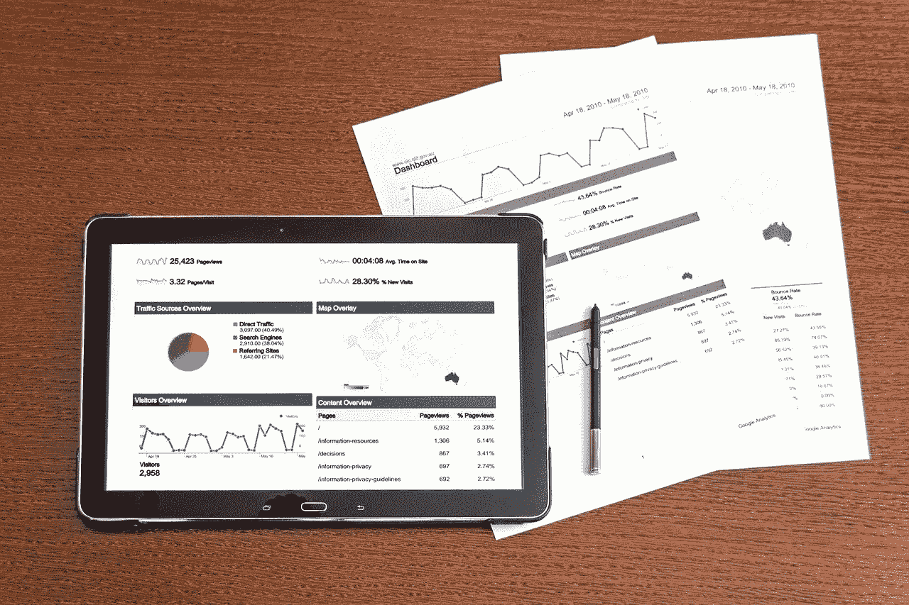

# 7 个简单步骤中的数据科学

> 原文：<https://towardsdatascience.com/data-science-in-7-easy-steps-ca80d063f175?source=collection_archive---------38----------------------->

## 高效学习分析数据和解决问题。

以下是如何成为一名数据科学家的分步指导。在本文中，我将介绍数据工程概念，如如何收集和转换数据，如何提取和分类数据，以及如何可视化数据([参见 YouTube 上的整个课程](https://www.youtube.com/watch?v=Qa-2Ii12Lf0&list=PLqkIWXwde6nHnG5UWqwfzIb3AwtapGojf))。为了让你更容易学习，我在这里做了一个精简版的课程，但在文本旁边添加了 YouTube 视频的链接。

Learn data science in 7 easy steps

# 1.数据分析

数据分析是数据科学的关键原则之一，你必须首先理解这一点。了解如何有效地选择和准备数据分析部分是数据科学的第一阶段。

了解如何使用 Excel 分析数据，如何从电子表格执行基本分析，谁是数据科学家，哪些工具将用于数据分析，如何使用 Python 编写统计测试代码，从数据库到处理和规划步骤。

也就是说:**至少在基础层面学习统计和线性代数**！

# 2.数据清理

在这一部分中，我们将涵盖所有不同类型的数据，包括原始数据，如何清理标准格式并将其转换为正确的输入格式，以及如何清理并将其转换为我们希望用于数据分析的数据结构。

# 3.数据工件

这时，您将了解一些对您的数据集负责的工件。这是更有趣的部分之一，因为它是关于数据科学项目的设计和功能实现。

当涉及到数据集时，您希望了解什么是异常值，什么是平均值，什么是偏差。或者换句话说，您希望了解与您的数据相关的异常。

# 4.数据建模

在第二阶段，你将被引导到两把钥匙中的一把。数据模型是处理、收集、转换和操作数据的艺术。同样关键的是使用关系数据库还是像 MongoDB 这样的对象数据库。

基于您的数据分析经验，您将获得一个关于如何将数据库键实现到您的数据管理系统中的关键想法。

关于处理数据的视频[中也涉及到了这一部分。](https://www.youtube.com/watch?v=if8oai5POLQ&t=23s)

# 5.数据工程

[我们接下来要讨论的是用 Python 构建数据工程部分](https://medium.com/swlh/learn-machine-learning-in-2020-4a09dd888fea)，机器学习例程和测试工具。同时，了解如何构建你的管道。还要观察一些数字处理代码——统计推理、分类、聚类等等。

首先使用 sklearn 和 NumPy，然后使用 Keras 和 Tensorflow 来增强机器学习。

# 6.数据设计

大的小的。设计部分是主要部分之一，在这里您将获得如何通过消除不必要的参数来简化数据的详细说明。

我们需要做的不仅仅是数字运算，也不仅仅是对数据结构的理解。这部分会给你很好的理解，以便设计重要的深度学习管道。

# 7.数据模式

在第七个也是最后一个阶段，我们将学习应该遵循的模式，以便成功地将我们的数据科学应用程序用于生产。

从稀疏数据到大型数据集。从样本训练和验证数据集到我们需要的所有其他数据。

请在评论中告诉我，在你的数据科学之旅中，哪个部分最重要。

也分享一下自己作为数据科学家的经历。

Data Science Job

最后，如果你想了解成为一名数据科学家意味着什么，那么看看我的书[数据科学工作:如何成为一名数据科学家](https://amzn.to/3aQVTjs)，它将指导你完成这个过程。