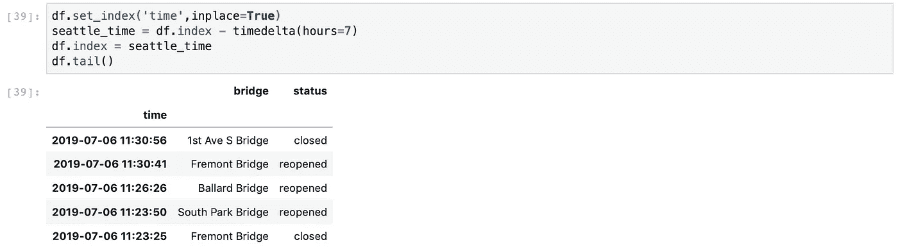
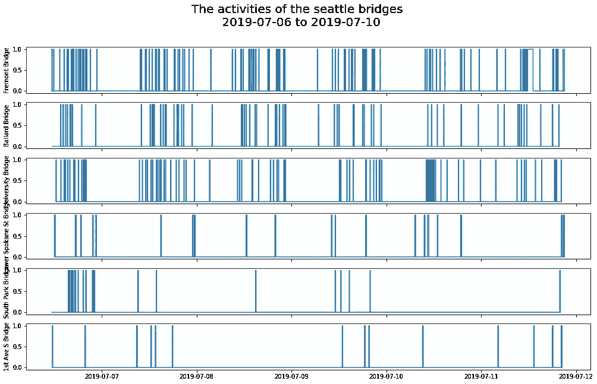
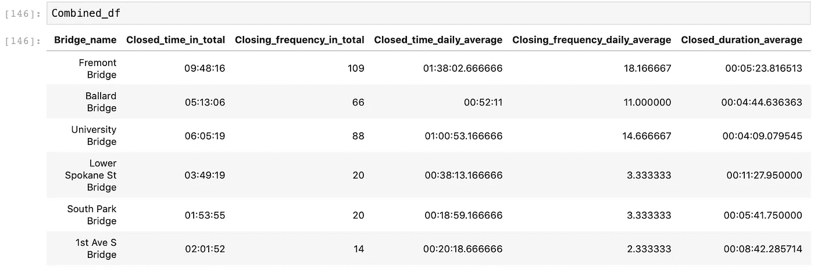
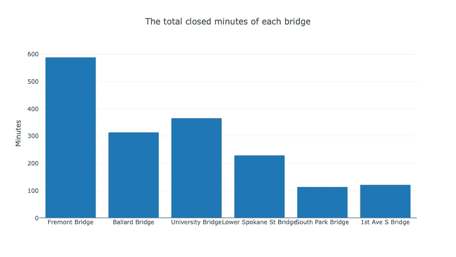
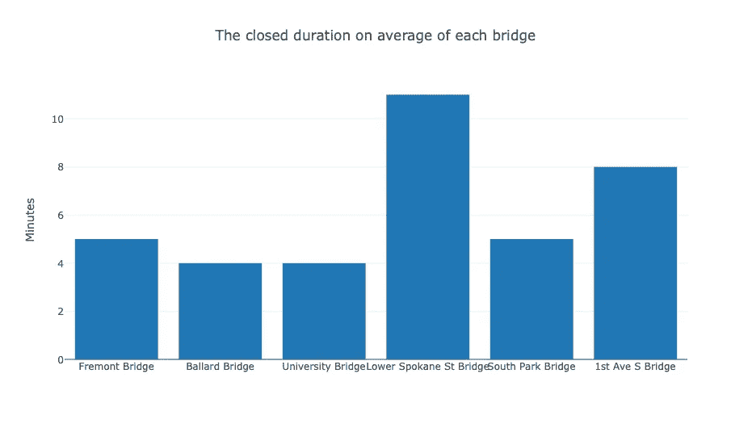
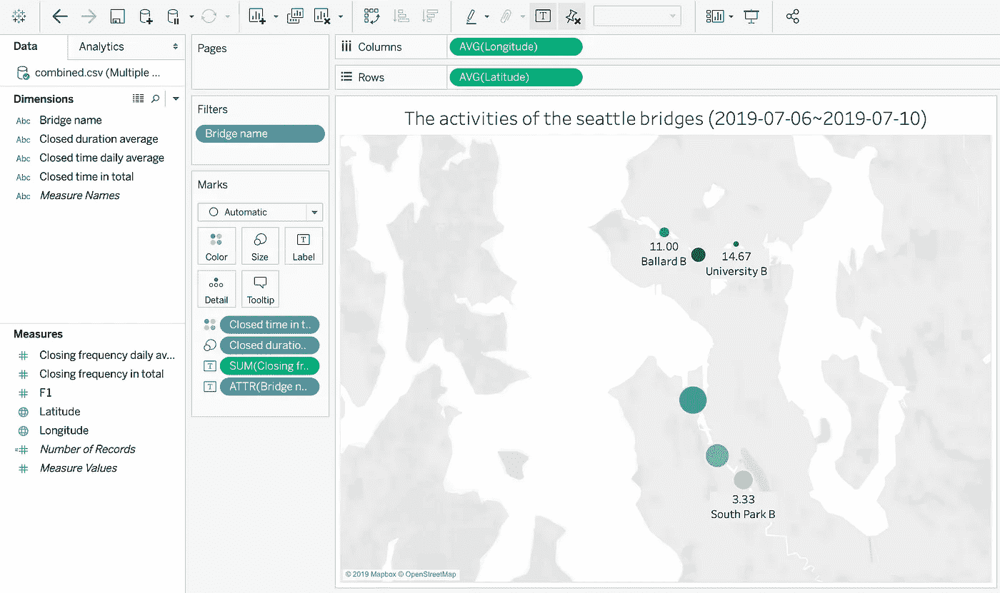
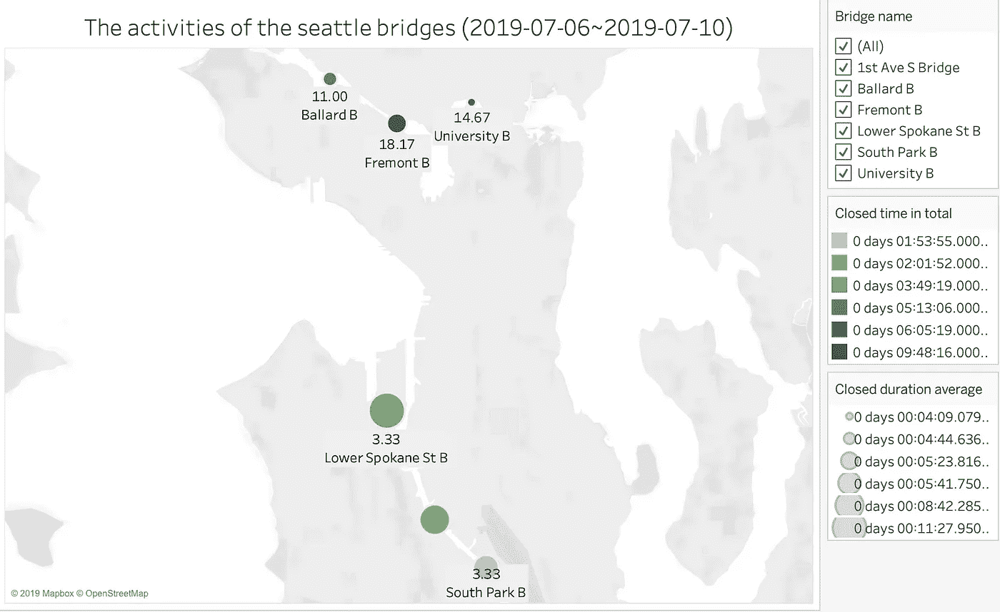

# 日常生活中的数据科学

> 原文：<https://towardsdatascience.com/data-science-in-daily-life-ee1ed06b93d7?source=collection_archive---------31----------------------->

## — —获取数据，整理并分析数据


([Source](https://akspic.com/image/93693-girder_bridge-arch_bridge-beam_bridge-transport-seattle))

我通常确保自己不是“迟到的人”甚至有时我不能提前参加聚会；我准时到达那里。我想，和大多数人一样，我会事先查看谷歌地图，计划好何时出发。然而，你永远无法避免各种各样的事故，让你陷入困境。最近，我刚刚在我的列表中添加了一个新事件。刚搬到西雅图过暑假，第一次被夹在一座可能会关闭的桥里！为了让渡船通过，这些桥会时不时地关闭。有时候 5 到 10 分钟会让你焦虑。

为此我想，为什么不用数据科学知识来做一些基本面的分析。我的朋友曾经告诉我，有一个西雅图大桥 twitter 发布了西雅图所有桥梁的关闭-重新开放信息，我发现这是一个做网络报废的极好资源。在 twitter 内部，我发现这些推文仅仅是六天前的，这对于一个迷你数据科学项目来说已经足够了。


(The tweets generally look like this)

一般来说，网络搜集是数据科学家从网站收集数据的一种强有力的方法。即使我们获得了使用 API 的许可，我们可能会发现自己需要从现有数据库之外获取一些信息。这些信息可以帮助我们更好地分析问题，或者为更好的建模增加特性。在所有针对 python 的 web 浏览器包中，BeautifulSoup 和 Selenium 是最常用的工具之一。BeautifulSoup 允许您存储整个 HTML 页面以供进一步解析，而 Selenium 将允许您单击按钮，在框中键入单词，并向下滚动网页。在这个项目中，我使用 Selenium 向下滚动 twitter(就像人一样)，使用 BeautifulSoup 存储 HTML 页面并解析它以获取所有信息。

```
# import web scrapping libraries
from selenium.common.exceptions import NoSuchElementException
from selenium.webdriver import Chrome
from bs4 import BeautifulSoup
import re
import requestsbroswer = Chrome()url = '[https://twitter.com/sdotbridges?lang=en'](https://twitter.com/sdotbridges?lang=en')
broswer.get(url)
```

我们首先导入 web 报废库，并使用 Selenium 打开网页。

```
def get_all_bridge_openings(browser):
    """
    Scrolls tweets.
    Parameters
    ----------
    browser: webdriver object
    Returns
    -------
    bridge_opening: webelement object
    """
    sel = 'div.tweet'
    prev_items_found = -1
    n_items_found = 0
    while n_items_found > prev_items_found:
        prev_items_found = n_items_found
        bridge_opening = browser.find_elements_by_css_selector(sel)
        n_items_found = len(bridge_opening)
        last_bridge_opening = bridge_opening[-1] 
        loc = last_bridge_opening.location_once_scrolled_into_view
        time.sleep(2)
    print(f"The total number of tweets collected is: {n_items_found}")
    return bridge_openingbridge_openings = get_all_bridge_openings(broswer)
```

这个函数模拟向下滚动的过程，并获取 web 元素对象进行解析。如打印声明所示，我们总共收集了 821 条推文。

```
data = [tweet.get_attribute("innerHTML") for tweet in bridge_openings]with open(".secret_bridge") as f:
    password = f.readline().strip()mongo_url = f'mongodb+srv://Colin:{[@cluster0](mailto:password}<a href=)-tnykl.mongodb.net">password}[@cluster0](http://twitter.com/cluster0)-tnykl.mongodb.net/test'
mc = pymongo.MongoClient(host= mongo_url)db = mc['boat_info']html_col = db['tweet_html']for tweet in data[1:]:
   html_col.insert_one({'html': tweet})
```

在这里，我将我的 JSON 文档存储在 MongoDB 中，这是一个 NoSQL 数据库程序。这个视频很好地介绍了这个数据库。MongoDB 使用带有模式的类似 JSON 的文档，这对于存储 HTML 文件很有用。然而，MongoDB 要求客户端登录。然后，通过使用 insert-one 函数，我们可以追加我们的文档。

```
def get_bridge_time(info):
    """
    Parse the epoch time in the html.
    Parameters
    ----------
    info: dict
    Returns
    -------
    date: datetime
    """
    soup = BeautifulSoup(info['html'])
    epoch_time = soup.find_all('a')[1].span['data-time']
    date = pd.Timestamp(int(epoch_time), unit='s')
    return date
```

对于 HTML 解析，我们可以使用 BeautifulSoup。其中一个解析函数如上所示。检查完网页后，我们需要查看 HTML 标记，如" div "、" a "、" span "、" li "，以找到我们想要的信息，并使用正确的方法来定位和调用它们。一旦获得时间戳，我们就可以将其转换为 DateTime 类型。

```
df.set_index('time',inplace=True)
seattle_time = df.index - timedelta(hours=7)
df.index = seattle_time
df.tail()
```



在我们解析 HTML 和时间、桥和状态信息之后，我们可以将它们存储到数据帧中。数据框将如下所示。

通常，数据工程过程可能是另一个挑战。有时，会有一些无效的数据记录，如空值，或者可能会有一些由人为错误产生的荒谬记录。这些都需要评估。由于数据清理过程相当繁琐，我不会把它包括在博客中。

这个数据集的另一个问题是很难解释状态。为了帮助在图中绘制，我将“关闭”状态设置为 1，将“重新打开”状态设置为 0。“关闭”状态和“重新开放”状态之间的时间段代表渡船经过的时间。同时,“重新开放”状态和“关闭”状态之间的时间段代表汽车经过的时间。前一个是我感兴趣的状态。



如上所示，每个细长条代表桥的“关闭”状态。六个支线剧情给出了“关闭”频率的直觉，即六天内每座桥的总“关闭”时间。从这个图中，我们了解到弗里蒙特桥、巴拉德桥和大学桥是西雅图最繁忙的桥梁。它们代表最长的总“关闭”时间和最高的“关闭”频率。此外，通过仔细观察，我们可以看出大多数状态变化发生在上午 10 点到下午 7 点。



如果我们计算每座桥的总时间段，我们还可以生成该数据框，该数据框显示总关闭时间、总关闭频率以及日平均关闭频率。用总关闭时间除以总关闭频率，可以计算出平均关闭持续时间。由此可见，前三座桥关闭的次数最多，时间最长。



从柱状图中可以更清楚地看出，在过去的六天中，弗里蒙特桥处于“关闭”状态的时间是六座桥中最长的。总之，弗里蒙特大桥的关闭状态总计接近 10 个小时。



更有趣的是，在这六天里，下斯波坎街大桥平均处于“关闭”状态的时间最长。



如果位置信息相关并包含在数据集中，那么值得尝试在地图上绘制结果。我这里用的是 Tableau，一个强大的数据可视化软件。通过导入 CSV 文件，列将在左侧显示为“尺寸”和“尺寸”然后，您可以“拖动”上面“列”和“行”上的“纬度”和“经度”列。此外，通过将其他“维度”和“度量”拖到中间的“标记”框中，每一行的值都会按照您的需要显示在地图上。您可以尝试不同的标记方法，看看如何有效地说明这些值。



六个圆圈代表六座桥的位置，三座靠近西雅图市中心，而另外三座稍远一点。圆圈的大小表示平均关闭状态持续时间。圆圈越大，平均关闭状态越长。这些数字代表每座桥的平均频率。绿色的透明度取决于总的关闭时间。

现在我们对西雅图大桥有了更深入的了解，这更令人兴奋！我们可以假设为什么不同桥梁的关闭频率和持续时间是不同的。我们也可以从其他网站进行网络搜集，为进一步的研究提供证据。

但更实际的是，因为我通常乘坐公交车通过弗里蒙特桥和大学桥，而且因为我现在知道这些桥应该只关闭 5 分钟，所以我不需要太担心迟到！

我希望这个小项目对你有所帮助。下面随意评论，干杯！