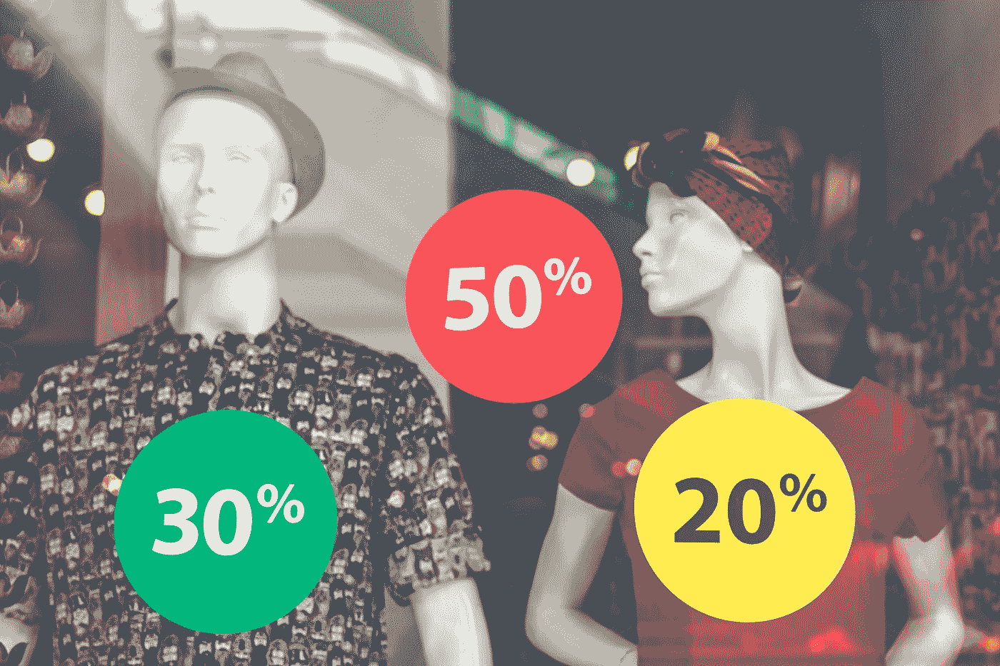

# Ecom 数据系列:什么是需求预测？

> 原文：<https://towardsdatascience.com/data-science-in-ecommerce-what-is-demand-forecasting-43a2da2aadec?source=collection_archive---------26----------------------->

## 让电子商务数据科学概念变得简单，一次一个主题。

## 几代人以来推动零售和物流运作的黑魔法。

Ecom Data Talk Episode 4: What is Demand Forecasting?

了解过去的事件以预测未来的销售📈📊是零售和电子商务运营的基础*优化*。

在您准确衡量您的定价和促销效果之前，库存计划感觉像是猜测。更糟糕的是，如果你错误地归因于这些影响，它可能会导致利润的侵蚀和销售的损失。

[需求预测](https://en.wikipedia.org/wiki/Demand_forecasting)是通过测量**定价**、**促销**、**季节性**和**假日**影响来估计未来销售的练习。它不仅有助于库存规划和谈判，而且可以衡量客户对您的定价和促销活动的反应，从而帮助优化营销活动。最后，随着对你的假日效应的深入了解，你可以在一年中的关键时刻防止缺货把钱留在桌子上。

Photo by [Adeolu Eletu](https://unsplash.com/@adeolueletu?utm_source=medium&utm_medium=referral) on [Unsplash](https://unsplash.com?utm_source=medium&utm_medium=referral)

# 什么是需求预测？

这个问题有两个部分——什么是需求，什么是预测。

那么什么是需求呢？来自[维基百科](https://en.wikipedia.org/wiki/Demand) : **需求**是消费者在一定时期内愿意以各种价格支付的一种商品的数量。广义来说，需求就是人们想要的东西。按照目前的价格，预计特斯拉 Model 3 在 2019 年的销量将在 37 万至 42 万辆之间。如果你将价格提高 50%，那么这个数字可能会大幅下降。下降多少由我们称之为[需求弹性](https://en.wikipedia.org/wiki/Price_elasticity_of_demand)的指标来衡量，我们将在后面讨论。另一方面，预测是对给定时期内事件未来结果的估计。当你把两者放在一起时，它会突然变成一个引人注目的概念。你能告诉我在不久的将来我可能卖多少吗？

当然，对某样东西的真实需求是*不可知*的，因为你不可能调查所有人。你可以在 FB 上接近这一点，它拥有世界上三分之一的人口——这就是它如此强大的原因。其次，需求通常滞后于供给。如果你只有 500 件 t 恤要卖，而你在 30 分钟内就卖完了，你怎么真正知道有多少需求？尽管如此，需求预测仍然是一个强大的工具，可以帮助电子商务商店了解*客户在价格、促销方面的行为*，以及当 BFCM 到来时需要做多少计划。

# 为什么需求预测很重要？我为什么要在乎？

正如我们刚刚讨论的，不是每个人都知道你的产品和服务。然而，如果你已经正确地建立了你的获取渠道，你应该每个月都把人们送到你的网站上。

100 名访客中，有 60 人立即返回，30 人点击，10 人加入购物车，最后，3 人完成了结账流程。那么什么是需求呢？好吧，实际需求是为商品或服务付款的 3 个人，但也许我们可以把有购物车的 10 个人视为潜在需求。

Photo by [Charles 🇵🇭](https://unsplash.com/@charlesdeluvio?utm_source=medium&utm_medium=referral) on [Unsplash](https://unsplash.com?utm_source=medium&utm_medium=referral)

也许他们没有完成购买，因为他们不喜欢这个价格。或者运输成本太高。或者交货时间太长。或者，他们只是改变了想法，找到了更好的。这样你就可以根据潜在和未来的需求来测试你的定价和促销方案，看看它对转化有什么帮助。在收集了客户对不同价格和促销水平的产品的需求信息后，您可以开始使用流量数据根据您的潜在需求预测未来的销售。在与供应商谈判时，改进的销售预测是一个非常有力的计划工具。想象一下*再也不会*把钱留在桌子上，当人们拿出信用卡准备购买而没有存货出售的时候。最后，您可以提前备货，从而减少交付时间，为客户提供更好的体验。

# 为什么需求预测对我有用？

需求预测不仅是了解将会有多少销售额，也是了解你的业务。是以 49 美元的原价显示 39 美元的销售价格，还是提供 10 美元的优惠优惠券？如果您提供 15%的折扣、25%的折扣和 50%的折扣，您希望销售多少？当黑色星期五网络星期一来临的时候，我应该期待多少销售额，这样我才能做好准备？

如何入门？嗯，需求预测通常涉及统计或机器学习模型，以解释与销售相关的定价、促销、季节性和假日的影响。

Photo by [Artem Beliaikin @belart84](https://unsplash.com/@belart84?utm_source=medium&utm_medium=referral) on [Unsplash](https://unsplash.com?utm_source=medium&utm_medium=referral)

价格效应由价格弹性来衡量，价格弹性是单位数量的变化相对于价格变化的比率。如果我们把一个产品的价格降低 10%，而数量增加超过 10%，那么比率大于 1，我们说这个产品是有弹性的。如果比值小于 1，那么我们称之为无弹性。大多数消费品都是有弹性的，卫生纸就是一个例子，人们倾向于在打折的时候多买一些。相反，大多数处方药是无弹性的，一个例子是胰岛素，糖尿病患者无论价格如何都必须购买。

促销效果是衡量销售量相对于促销水平的变化:10%或 25%的折扣，或不同类型的广告，如买一送一，或免费送货优惠。

季节性效应是一年中发生的销售量的周期性变化，通常以周或月来衡量，有时以天来衡量。这些周期通常反映了相对于人们钱包的消费行为。你可能会注意到，当人们有更多的可支配现金时，月初的销售额会更高，随后在月底账单到期时，销售额会下降。

Photo by [Mein Deal](https://unsplash.com/@meindeal?utm_source=medium&utm_medium=referral) on [Unsplash](https://unsplash.com?utm_source=medium&utm_medium=referral)

最后，节日效应。节日效应通常在短时间内销量急剧增加时形成，如黑色星期五、圣诞节、劳动节、7 月 4 日等。不仅大多数商店都计划在这些时间进行促销，而且消费者也希望利用这些销售机会，并处于购买心态。取决于你的产品系列，某些节日可能与你更相关，比如情人节前后的珠宝或浪漫产品。衡量上述协同效应至关重要，这样才能知道是什么在推动变化。

当然，也有你无法控制的外部因素，比如宏观经济、政治、贸易战等等影响到每个人的因素。但是你越了解你的价格和促销效果，你就越有可能得到可靠的预测。

总的来说，我们讨论了需求预测的好处，以及在衡量需求时应该采取的措施。明确你的预测将为你的库存计划和谈判提供一个有用的工具。衡量您的定价/促销的影响将有助于您向合适的人优化您的营销方案。预测季节性/假日效应可以帮助您在一年中的关键时期防止缺货。

最后，数据就是力量，我们希望将电子商务数据的力量还给人们。因此，请加入我们，立即开始与您的数据一起增长！

由[段](https://segments.tresl.co/)制成

在 [LinkedIn](https://www.linkedin.com/company/tresl) 或[脸书](http://facebook.com/groups/ecomdatascience)上找到我们。

【tresl.co】原载于