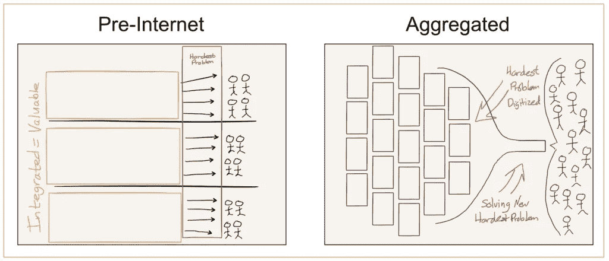
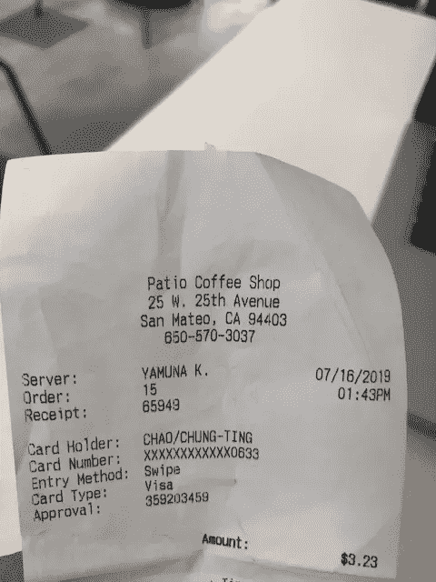
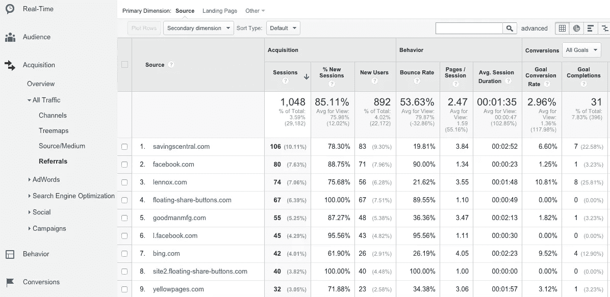
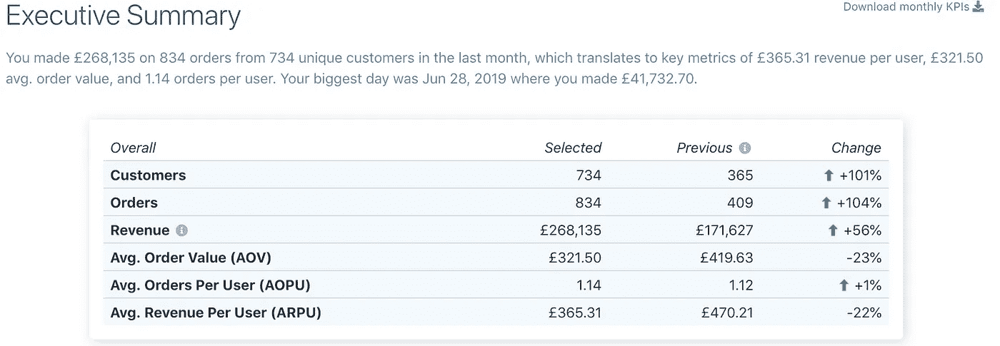

# Ecom 数据系列:Shopify 订单数据中有什么？

> 原文：<https://towardsdatascience.com/data-science-in-ecommerce-what-is-order-data-e2a8430abbc0?source=collection_archive---------25----------------------->

## 让电子商务数据科学概念变得简单，一次一个主题。

## 电子商务中最重要的表格第 1 部分，共 3 部分

Ecom Data Talk Episode 5: What is Order data?

【什么是订单数据是电子商务中最常用的表的 3 部分系列的第 1 部分:订单、产品和客户。我们将使用 Shopify 的[数据 API](https://help.shopify.com/en/api/reference/orders) 作为例子。由于大多数数据平台都有相似的结构，因此该分析也适用于其他平台。]

我的朋友经常问我为什么选择 Shopify 来建立 SaaS 业务，Shopify 和亚马逊有什么不同？答案很简单:商家拥有**数据**的*可用性*。

亚马逊是一个聚合器(关于这个的更多信息，请看本·汤普森的[聚合理论](https://stratechery.com/2015/aggregation-theory/))。虽然它为高意向在线购物者提供了大量的 AmazonPrime 和潜在销售额，但它垄断了客户关系。

Shopify 则完全相反。表面上看，更像是一个简单的建站者。在后端，它就像一个基于云的销售点系统，简化了计费、订购、库存和托管。它允许任何人在 30 分钟内开始在线销售，这就是 Shopify 的强大之处。

Aggregation Theory — source ([https://stratechery.com/2015/aggregation-theory/](https://stratechery.com/2015/aggregation-theory/))

这是销售一个梦想——任何人都可以成为百万富翁电子商务企业家，机会的伟大均衡器。

Shopify 投资于简化商家的数据。他们帮助商家跟踪、存储和维护来自他们商店的所有数据。他们的基础设施不仅为商家带来巨大的利益和成本节约；它也是数据科学家的完美乐园。

在[细分市场](https://segments.tresl.co/)，我们希望让数据科学变得触手可及。我们希望向 Shopify 等平台上的数百万中小型企业数字原生品牌提供科技巨头和大品牌享有的相同数据科学见解。

这就是为什么我们做我们所做的。

太多的人不知道什么是可能的，也不在乎去发现。我的目标是通过提供简单的解释来改变这一点，这样人们就可以知道什么是可用的，理解什么是可能的，并建立一个有利可图的生意。

# 什么是订单表？

一切从订单表开始。在一排排的交易日志下面埋藏着数据科学的小金块，可以用来理解客户行为。

将订单数据视为 excel 中的一行，包含订单、客户和产品的相关数据。我们大多数人以前都见过这样的数据。这叫收据。

它说约翰在特定的日期用信用卡在特定的地点花了 3.23 美元买了一杯咖啡。订单表可能包含从简单到复杂的各种信息。然而，它应该始终包括关键信息:谁是客户，他们购买了什么产品，以及订单本身的详细信息。

如果您正在使用 Shopify，您是否想过 Shopify 会代表您收集客户订单的哪些信息？

# 订单表中有什么？

如前所述，order 表包含关于谁是客户、他们购买了什么产品以及订单细节的信息。

让我们把注意力集中在订单细节上。

首先，我们有时间:这是订单开始和结束的日期。它们不仅可以帮助你记账，还可以汇总几天、几周、几个月或几年的订单，以发现趋势并评估业绩。

接下来是支付信息:价格、折扣和结账。

有两种类型的价格被跟踪——总价和小计价格。小计价格是不含运费和税金的折扣后的标价，总价包含运费和税金。使用小计价格来计算 KPI 和指标通常更准确，因此运费和税费不会影响您的结果。

Photo by [Daniel von Appen](https://unsplash.com/@daniel_von_appen?utm_source=medium&utm_medium=referral) on [Unsplash](https://unsplash.com?utm_source=medium&utm_medium=referral)

折扣是促销，这里有一些信息，折扣代码、折扣类型、折扣级别，以及它是否适用于产品或运输。促销与价格密切相关，有助于吸引顾客。此处获取的额外细节可以帮助您评估哪种类型、哪种级别的促销最适合不同类型的客户和产品。

收银台记录了顾客选择付款的方式，他们是通过在线收银台、Paypal 还是其他电子支付服务付款。通常，人们可以支付的方式越多，就越有利于转化。掌握客户付款信息的详细信息可以帮助您对客户群进行细分，以查看他们的平均价格是否有差异。订单价值或客户终身价值。

最后，我们有网站流量信息。

我们从源头开始。“来源”字段告诉您订单来自哪里。他们是使用网络浏览器、智能手机(iPhone vs. Android)订购的，还是您手动创建的。

example google analytics page

然后我们有了登陆网站，它跟踪客户访问你的网站时看到的第一页。当客户直接输入你的网址，或者从谷歌搜索中查找时，他们通常会登陆主页。然而，如果他们通过电子邮件或广告点击，那么他们可能会登陆你选择的页面。

最后，推荐网站获取关于你的推荐流量的信息。推荐流量是来自你的社交媒体参与、媒体报道或合作伙伴渠道的网络流量。例如，有人点击你的脸书广告，Instagram 影响者的帖子，或者你的电子邮件简讯，都在计算你的推荐流量。你有没有注意到你点击的网址末尾有额外的代码？这些胡言乱语包含了谷歌分析用来显示你的流量来自哪里的信息。

您可以看到 Shopify 为商店捕获了相当多的订单信息。接下来，我们将看一些例子来说明为什么你应该关心。

# 订单数据能为我做什么？

当您汇总每个客户的多次购买时，您可以查看订单之间的时间，以找出第一个订单和第二个订单之间的平均天数。一旦汇总，我们可以检查季节性和假日模式，这样我们就可以更好地为那些大的假日高峰做准备，并避免代价高昂的缺货。

至于 KPI，平均订单价值(AOV)、平均每用户收入(ARPU)和重复购买率是可以用订单表构建的一些例子。

Segments Executive Summary ([https://segments.tresl.co/](https://segments.tresl.co/))

商家经常想知道是否进行 10 美元折扣的促销比 10%折扣的促销更好。看看提供免费运输是否比 25%的折扣更有利可图？

我们可以研究历史促销来帮助找到这些问题的答案。

一旦你知道客户如何访问你的网站，以及他们如何选择支付，你就可以细分你的客户，找到有利可图的渠道，并优先考虑收购努力。这些都是您可以用来优化运营、增加销售和收入的信息。

总之，我们讨论了订单表中包含的信息、它们的含义以及可能的分析。重要的是要知道你能得到什么信息，这样你就能充分利用它们并制定你的策略。研究什么是可用的，了解什么是可能的，并通过数据驱动的决策建立一个有利可图的业务。

最后，数据就是力量，我们希望将电子商务数据的力量还给人们。因此，请加入我们，立即开始与您的数据一起增长！

由[段](https://segments.tresl.co/)制成

在 [LinkedIn](https://www.linkedin.com/company/tresl) 或[脸书](http://facebook.com/groups/ecomdatascience)上找到我们。

*原载于*[*tresl.co*](https://tresl.co/what-is-in-shopify-order-data/)