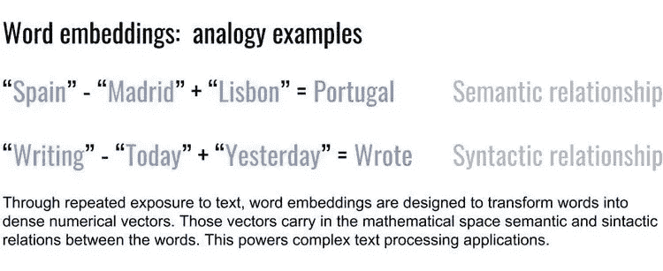
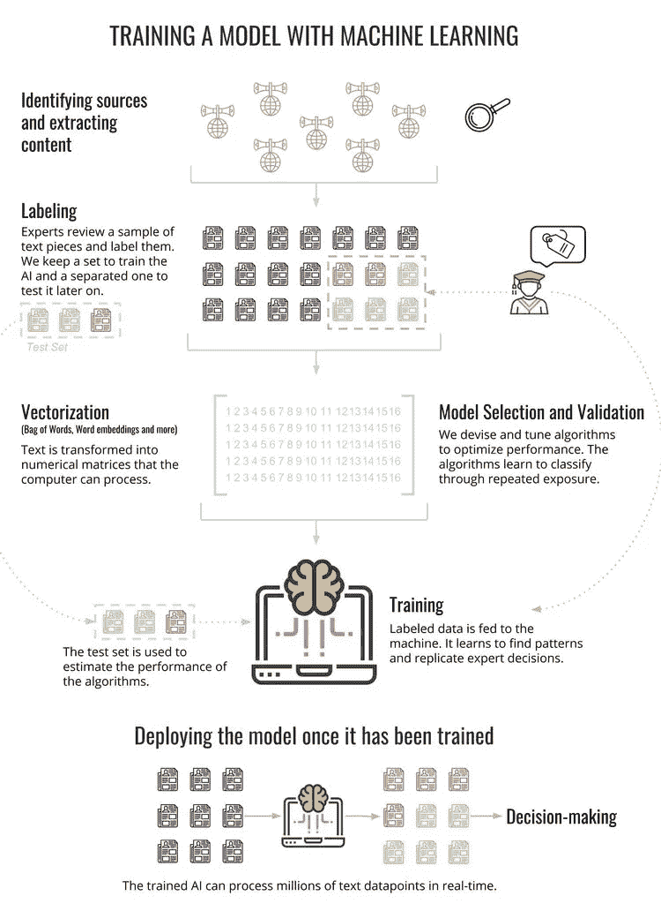
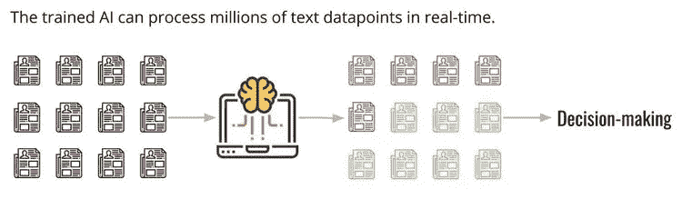

# 国际发展中的数据科学

> 原文：<https://towardsdatascience.com/data-science-in-international-development-part-i-working-with-text-44ebb6e0feef?source=collection_archive---------17----------------------->

## 第一部分:使用文本

*由* [合著*凯尔西·巴顿-亨利*](https://medium.com/u/b3982b103197?source=post_page-----44ebb6e0feef--------------------------------) *，版本和图片由* [*米格尔·瓦雷拉*](https://medium.com/u/cb8aa6c255fc?source=post_page-----44ebb6e0feef--------------------------------) *。*

今天，头条新闻充斥着关于人工智能(AI)能够做以前只有人类才能做的事情的说法。识别图像中的对象、响应语音查询或解释复杂的文本实例等等。但是 AI 应用是如何工作的呢？在国际发展和安全领域有哪些人工智能解决方案？在这篇文章中，我们总结了一些计算机使用机器学习处理人类语言并做出反应的基本技术，使用了我们在[***AK tek***](https://www.aktek.io/)***的几个项目中的真实场景。***

Image: [AKTEK](https://www.aktek.io/) Ltd

开发人员经常处理大量的文本和语音数据。这些数据包含了理解冲突和社会动态的关键信息。近年来，社交媒体、新闻和其他文本存储和共享机制产生了更多的数据。因此，能够快速准确地处理文本比以往任何时候都更加重要。人工智能可以提供帮助。

人工智能处理文本的领域被称为自然语言处理(NLP)。NLP 技术是许多众所周知的应用的基础，包括垃圾邮件过滤器、互联网搜索引擎、对话机器人、推荐系统、客户服务应用和机器翻译。驱动所有这些工具的核心技术之一叫做**文本分类**。

文本分类是机器学习的一部分，在机器学习中，计算机学习以高精度自动将给定的文本分配到特定的类别，然后它可以重复这样做，而无需进一步的人工干预。

在 [AKTEK](https://www.aktek.io/) ，我们已经利用自然语言处理和文本分类来创建在该领域有效的技术解决方案:检测在线的潜在有害的极端主义内容，或者帮助揭露在线传播的虚假信息。

# 检测在线极端主义

我们的旗舰 NLP 项目涉及检测欧洲某个国家的在线极端主义。我们建造、训练并部署了一个能够准确识别网上极端主义文本的探测器。

为了建造它，我们与当地环境和语言的研究专家一起工作。第一步包括研究人员审查和标记我们从选定的在线公共平台提取的不同文本样本。他们研究了这些内容，并根据当地的政治背景将每一篇文章标记为极端主义或非极端主义。

这种监督为我们提供了足够的标记数据来驱动机器学习引擎。我们利用这些数据，设计了一套算法来寻找数据中的模式，并学习复制和推断研究人员的决策过程。因此，我们有了检测器，它可以从几个在线公共平台接收文本，并提供与文本与不同类型的极端主义和仇恨言论相关联的概率相关的分数。

这个人工智能引擎允许我们自动处理来自在线领域的数百万条评论，这是手工不可能做到的。与我们的专家研究人员一起，我们建立了一个由数据驱动的网络空间极端主义的图片，以支持政策制定和安全。

# 打击虚假信息

按照类似的过程，我们开发了一个原型来检测和揭露网上虚假信息。这个原型是在经过事实检验的新闻文章上设计和训练的。通过这种方式，它能够在真实和虚假的文本中找到共同的语言模式，这些模式表明真实的新闻或虚假信息。

在这种情况下，我们发现单靠文本不足以检测虚假信息:我们还为我们的算法提供了关于文章在哪里发表、文章来源、作者是谁以及文章如何在社交媒体上分享(以及由谁分享)的数据。

包含这些信息使我们能够分析社交媒体中精心策划的活动的常见模式以及机器人的存在。有了这些数据的组合，我们的原型已经能够达到类似于文献中发表的针对特定场景的一些最先进的人工智能研究的精确度。

这个项目的目的是提供一种探测器，可以近实时地在线标记虚假信息。我们旨在帮助记者、出版商、政策制定者，尤其是媒体消费者更好地理解虚假信息的本质，并保护自己免受虚假信息的攻击。

目前，这个原型只在一小部分标签数据样本上进行了测试。现在估计原型的性能将如何外推到现实世界还为时过早，但我们正在朝着这个方向采取措施，寻找编辑更多事实核查文章的方法，并包括跨来源的自动事实核查过程。

这两个项目都基于文本分类、自然语言处理和其他机器学习技术。但是它们是如何工作的呢？

# 工作原理:自然语言处理和文本分类

计算机是如何处理文本的？

如今，为大多数强大的人工智能应用提供支持的机器学习技术是……数学算法。这意味着，这些技术的核心是处理数字。图像(或视频)识别将像素颜色亮度作为数字输入进行处理；声音信号被数字化并被转换成用于语音到文本应用的振幅和频率。我们如何将文本转换成数字是我们在这篇文章中讨论的任何项目的关键步骤之一。这个过程叫做**文本矢量化**。

**文本矢量化:从单词包……**

最基本的——尽管通常很强大——矢量化技术是基于计算文本中的词频。这些数字可以用来填充一个矩阵，这给了我们继续前进所需要的数字。毕竟，在进行文本分类时，直觉地认为某些词的出现和重复与文本所属的类别有很强的相关性，对吗？

当然，这是一个巨大的过度简化。事实上，以这种方式计算单词可能会导致一些被多次提及的单词权重过大，但这些单词并没有为手边的文本分类带来任何信息。这就是为什么在一篇文章中有几种“计算”单词的方法。在某些情况下，删除“停用词”(*即*非常常见的词，如*‘the’，‘a’或‘is’*)以提高算法的性能。

这些类型的单词对文本意义没有显著贡献，因此不能帮助确定其类别，所以最好将其删除。在其他情况下，这些常用词的权重会降低，以降低它们的重要性。有关更复杂的矢量化方法的示例，请参见[词频逆文档频率](https://en.wikipedia.org/wiki/Tf%E2%80%93idf)。

如果一个单词拼错了怎么办？我们如何解释同一个单词的多次倾斜？有几种方法可以处理这类问题，比如[词汇化和词干化](https://nlp.stanford.edu/IR-book/html/htmledition/stemming-and-lemmatization-1.html)。另一种处理方法是计算字符集(也就是字母)，而不仅仅是单词。

你可能会注意到，使用字符和单词作为文本单元来分解句子会使我们丢失部分上下文信息。为了部分克服这一点，我们不仅计算单词和字符，还计算 2、3 或更多的组合。这些组合被称为 *n 元语法*。

**…到单词嵌入**

然而，复杂分类问题的挑战是，即使使用 *n 元语法，*我们仍然可能丢失部分上下文含义。在计算上，这些方法也具有挑战性，因为它们导致必须由计算机处理的巨大矩阵，并且难以在存储器中维护。

更糟糕的是，那些巨大的稀疏矩阵(大部分是 0 的矩阵)使得算法很难学习和避免过度拟合。这被称为*维度诅咒*。因此，我们必须认真实施一个非常稳健的统计框架，以控制这些问题的影响。对于这些更复杂的任务，我们可以使用单词嵌入方法来提高性能。

[开发单词嵌入](https://blog.acolyer.org/2016/04/21/the-amazing-power-of-word-vectors/)是为了克服上述的一些限制，并捕捉更多的语义信息和语言中单词之间的关系。为了构建单词嵌入，我们首先对大量无监督的文本数据进行数学处理。然后，我们让一个算法(通常是一个狭窄的神经网络)学习预测一个单词*是否属于给定的上下文*(或者反之亦然)。

在这个过程的最后，计算机仍然不会像人类一样理解单词的意思。但是通过这种重复查看文本的统计过程，它将“学习”以有意义的方式向量化单词。语义和句法关系将出现在这个新的*数学超空间*上，检查一下可以获得的常见类比，有些真的很神奇。

Image: [AKTEK](https://www.aktek.io/) Ltd

此外，单词嵌入的构建使得我们必须处理的数字矩阵不再像以前那样庞大和稀疏。在单词袋模型中，一整段文本被转换成稀疏的一维向量(具有几十万维或更多维)，而在这里，一个单词被转换成密集的一维向量(只有几百维)。

因此，一段文本(多个单词)可以被排列成例如矩阵，一种二维数字结构。然后，这种结构开辟了将深度学习技术应用于文本分类的可能性，为此，文本的顺序和上下文结构使其成为构建翻译系统、聊天机器人或极端主义检测器等东西的合适场所。

当然，这并不是故事的结尾:段落嵌入、字符嵌入、ULMFiT、ELMo…当您阅读本文时，令人印象深刻的新技术正在研究中。

**我们如何训练计算机对文本进行分类？**

一旦矢量化完成，我们就可以将文本转换成计算机可以进一步处理的形式。但是，即使在将文本转换成数字之后，我们仍然需要教会计算机执行我们感兴趣的特定文本分类。

**监督学习**

对于这一步，我们需要一个由分析师标记的文本片段(帖子、文档或文章，取决于任务)的智能样本。分析师团队手动将这些文本片段分配到它们相应的类别中，我们认为这种分配是它们各自的基本事实标签。与矢量化的文本一起，基本事实标签形成了训练集，这样我们就可以对文本进行分类了。

存在多种算法来执行这种分类，它们都有各自的优点和缺点。在很高的层次上，算法是数学公式，它对文本向量进行运算，并输出文本属于特定类别的概率。为了能够尽可能准确地对新文本进行分类，算法会尽量减小它们在训练集上的预测与这些相同文本的真实分类之间的误差。

Image: [AKTEK](https://www.aktek.io/) Ltd

最小化的过程本身是另一个丰富的数学领域，它通常通过微分、代数和其他强大的数值方法来进行。摄取标记数据并最小化预测误差的过程称为**训练**。这个过程允许算法学习数据中的模式，这些模式确定一篇文章是否属于特定类别(例如一篇帖子是否是极端主义)。

经过训练后，当算法看到一段新的文本时，它可以在没有任何人工干预的情况下对其所属的类别做出明智的预测。在这个阶段，计算机已经学会了，可以近乎实时地做出新的预测，这个过程现在很容易扩展到海量数据。

Image: [AKTEK](https://www.aktek.io/) Ltd

**稳健的统计框架**

在模型开发和训练的所有部分中，最重要的方面是拥有定义良好的统计框架。为了支持每个模型选择:要做哪些文本预处理(词汇化、词干化、停用词)，要使用哪些特定的矢量化(BoW、tf-idf、嵌入)，要选择哪个分类器或集成(更简单的算法或复杂的深度学习构造)或如何调整所有这些，我们需要持续评估模型在新数据上部署后的预期表现。这种模型选择通常是通过所谓的验证来完成的。

然后，我们可以通过向最终算法展示它从未见过的新数据，来测试它在数据中发现模式的能力。这个新数据必须与训练集分开保存，在所谓的**测试集**中。我们通过算法传递这个“新”数据，并将算法的预测与再次从分析师那里获得的真实结果值进行比较。这给了我们一个非常可靠估计，当我们的算法被应用到真实世界应用中的新数据时，它将如何准确地执行。

# 观点

我们在这里总结的每一种技术背后都有丰富的文献。我们鼓励您进一步调查它们；这个领域当然值得深入研究！这里提到的所有技术，以及更多的技术，正在推动许多现实世界的应用:搜索引擎、翻译系统、聊天机器人、极端主义探测器。

当与研究专家合作应用时，数据科学正在为国际发展和安全领域目前面临的一些最复杂的问题提供答案和解决方案。本条目仅涵盖了基于文本的解决方案的一小部分示例—在以后的条目中，我们将描述使用其他类型数据的方法。

*凯尔西·巴顿-亨利合著。最初发布于*[*www . AK tek . io*](https://www.aktek.io/blog/data-science-in-international-development-working-with-text)*。*