# 库存管理中的数据科学:管理仓库的真实案例

> 原文：<https://towardsdatascience.com/data-science-in-inventory-management-real-case-in-managing-a-warehouse-6259cad17c0e?source=collection_archive---------3----------------------->

## 在这篇文章中，我们将知道如何用最有效的预算来管理仓库

大家好，欢迎回到另一个关于数据科学的故事！这是一个**真实案例**，不仅仅是一个理论或学术文章，所以我们将在现实生活中用问题做一个测试实验。所以如果你有任何担心，让我们留下评论，我们可以一起讨论！

# 思考这个问题

*好的，让我们想想你购物时经历的两个购物案例。有一天，你去鞋店决定买一双新鞋，不幸的是，你遇到了问题:*

1.  *你挑选了一个好模特，但是他们没有适合你脚的尺码*
2.  他们提供了另一款适合你脚的型号，但是你不喜欢

多么糟糕的一天，对吗？

作为店长，他们也不高兴。他们失去了一个顾客——就是你。如果这是你第一次去商店，你会回来吗？当然…“可能吧”。但是如果这是你第二次在这家商店遇到同样的问题，你会回来吗？绝对是店长的噩梦。

# 找到（达到目的）的方法

那么如果你是在扮演店长的角色，如何避免这个问题呢？当然，*我们不能*因为我们无法控制同一天会有多少同样款式同样尺码的顾客光顾你的商店。这要看我们的运气了！

然后我们结案，放弃这个问题，试着向我们的大老板解释“好吧，对不起，是我运气不好”？

绝对没有！我们有足够的统计工具来解决这个问题。但是请记住，**我们无法确保每位顾客都有自己的鞋子**，但是**我们可以利用数据科学增加顾客在我们商店找到他们最喜欢的鞋子的机会**(所以不要浪费我们的运气)。

# 查看历史数据

在计划未来之前，我们需要回顾过去的历史——记住这一点！所以第一步，我们需要与销售部门会面，以获得过去几年的销售历史。这是我们从销售部得到的数据(你可以在这里下载

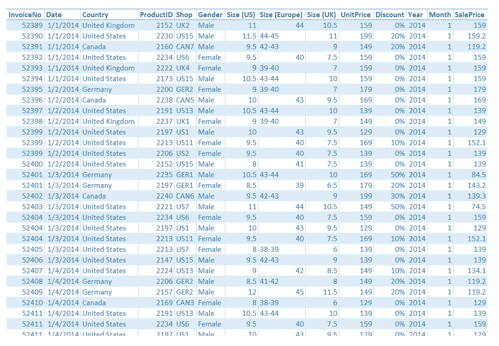

[Al Bundy raw data](https://s3.us-west-2.amazonaws.com/public.gamelab.fun/dataset/Al-Bundy_raw-data.csv)

# 检查和清理数据

让我们检查一下数据集中的字段:

InvoiceNo、ProductID、Year、Month:它们只包含数字，但它们不是数字字段，而是分类字段

日期，国家:分类字段。我们已经有了日期字段，它同时具有年和月字段的含义，所以我们应该保留日期，并将年和月排除在我们的数据集中

商店:绝对是按国家 ID 分组的分类字段(美国、英国、加拿大、德国)

Size(美国)，Size(欧洲)，Size(英国):分类字段。但是让我们三思！3 个字段具有相同的含义，因为我们可以使用这张[转换图](http://www.shoesizes.co/)将尺寸(美国)转换为尺寸(欧洲)和尺寸(英国)，反之亦然。所以在这种情况下，我们应该只保留 1 个字段作为代表。我会选择美国尺码，因为它看起来比欧洲尺码简单，浮动数字也比英国少。请记住*男性和女性的尺寸是不同的*，所以**不要使用没有性别字段**的尺寸字段，否则会犯严重的错误！

性别:另一个基本范畴

单价、折扣、销售价格:数字字段。在进行任何计算之前，我建议我们应该将包含百分比值的折扣字段转换为 float，以便于计算。如果你是一个聪明的人，你可以看到这些场之间隐藏的等式

`SalePrice = UnitPrice * (1 — Discount)`

…所以我们应该只保留数据集的销售价格

完成这一步后，我们将有一个更简单的数据集:

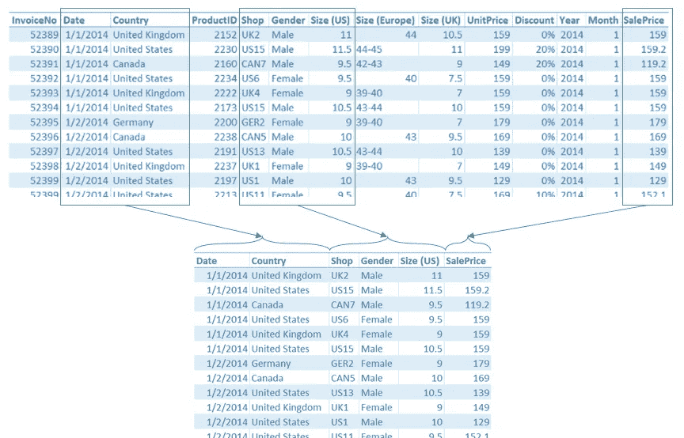

Cleaning up the data set

# 分析数据

数据集已经准备好进行分析了！现在我们必须计算前一时期(可能是一年，或一个月……)卖出了多少件商品。在数据分析中，统计单个对象的出现次数称为“频率”。为了计算频率，在这种情况下，我们将通过以下方式对数据集进行分段:

*   **国家**
*   **尺寸**
*   **性别** *(正如我之前提到的，没有性别就不能使用尺寸，所以我们也必须包括性别)*

我们的[交叉表](https://medium.com/@nhan.tran/contingency-table-55e375a76a8)将只有 2 个维度，但我们这里已经有 3 个维度，所以我们必须按性别将表分成 2 个不同的维度。这是结果:

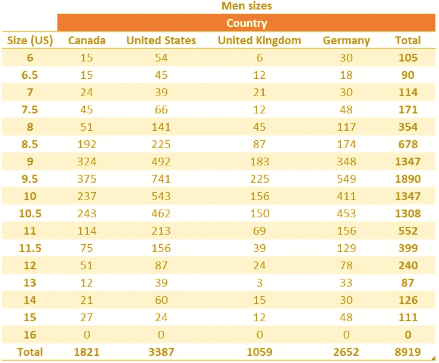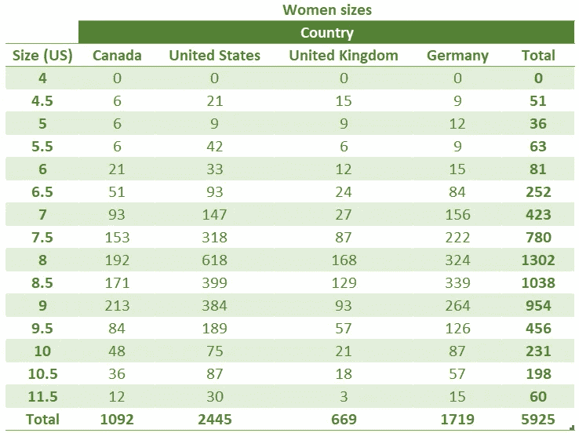

Sizes distributed by country

# 定义问题

1.  **问题:**根据我们的观察，有可能售出的鞋子数量(型号、尺码)是多少？
2.  条件:我们将以 95%的置信区间找到问题的答案
3.  **计划:**
    -使用过去 12 个月的数据集
    -使用男鞋数据集
    -使用美国数据集

这一步，你会想为什么我们只使用男鞋和美国数据集。*让我们想一想:如果一个男人去商店，一个女人会来吗？* **我们无法回答，**因为在这种情况下性别是相同的。它没有任何反射在一起。另一方面，例如，如果一个孩子去商店，他的父母也很有可能一起去，因为那个孩子不能独自去购物和自己用钱。但是在我们的例子中，如果一个男人去商店，他可以一个人去，或者和他的兄弟，或者和他的女朋友，甚至一群朋友一起去。男访客和女访客的几率没有联系。这就是我们所说的**相同的**。

当然，国家和性别是一样的，他们都是一样的。

*那为什么要设置 12 个月的数据？*因为足够了**代表一年的完整周期**。购物行为大多基于一整年的周期，如:年终大甩卖，黑色星期五，公司的周年促销，人们可能会在冬天到来时更换鞋子(以购买更暖和的鞋子)…

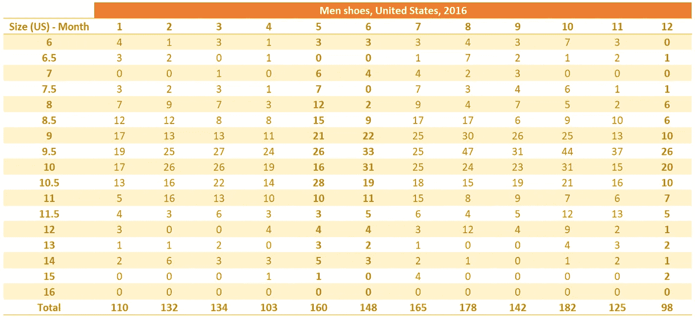

Men shoes sold in 2016 distributed by Size and Month

将数据放入热图，让我们看看数据集中隐藏的信息

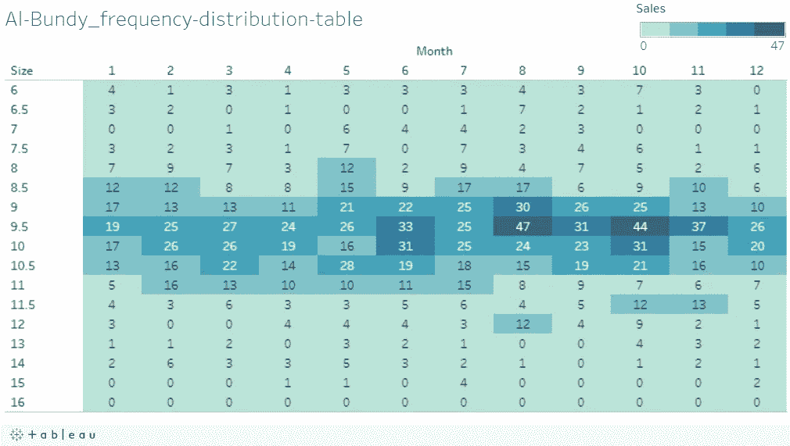

Men shoes sold in 2016 distributed by Size and Month — Heatmap [on Tableau](https://public.tableau.com/profile/nhan.tran#!/vizhome/Medium-AlBundy-StoreManagement/Al-Bundy_frequency-distribution-table)

现在我们可以很容易地看出隐藏的信息:

*   太小的尺码(6 至 7.5)和太大的尺码(13 至 16)不受欢迎。所以，一个人来我们店里买这双鞋的几率非常低，尤其是超大号的 15 和 16 码——我们全年都没有卖出过这个尺码的鞋！
*   平均尺寸(9 到 10.5)看起来很不错。美国男人的脚的尺寸是 9.5，似乎超出了其他尺寸的数量。专注于生产和储存这种尺寸的鞋子，我们有很大的机会去卖鞋子和赚钱！

但这只是高水平的考试。继续深入挖掘，揭示我们的数据集隐藏的全部隐藏信息。

# 计算

因为我们有 17 种不同的鞋码(仅限男士——基于我们的计划),所以我们需要计算 17 种不同的 CI(置信区间)。首先让我们用 Microsoft Excel 的`=average(number1, [number2]...)`函数来计算平均值(在这篇文章中，我不会过多提及编程。只是坚持吻校长)

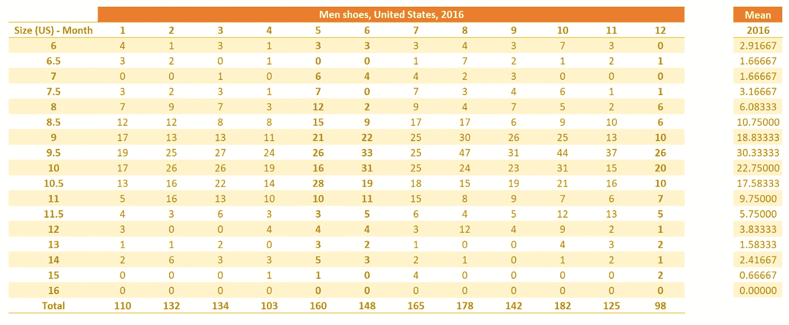

Men shoes, US 2016 & Mean

我们确实**不知道人口方差**并且我们的数据集仅包含 12 个观察值(由 2016 年的 12 个月表示)，那么我们必须**使用 T 统计量**。

让我们在 T-统计表中找到 11 个自由度的 95%置信区间的值！

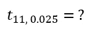

让我们解释一下，以防你担心:

*   **11** 是用`df = n— 1`(n = 12)计算的 12 个月的*自由度*
*   0.025 是使用`SL = (1 - CI) / 2`计算的 95%置信区间的显著水平(更喜欢下图)

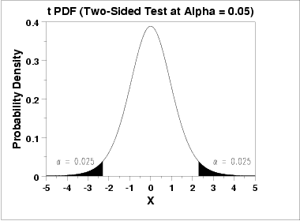

Probability Density 2 tails

好吧！查看下面的 T 统计表，我们可以发现**的 T 值是 2.201** (正好在红色列和蓝色行的交叉点)

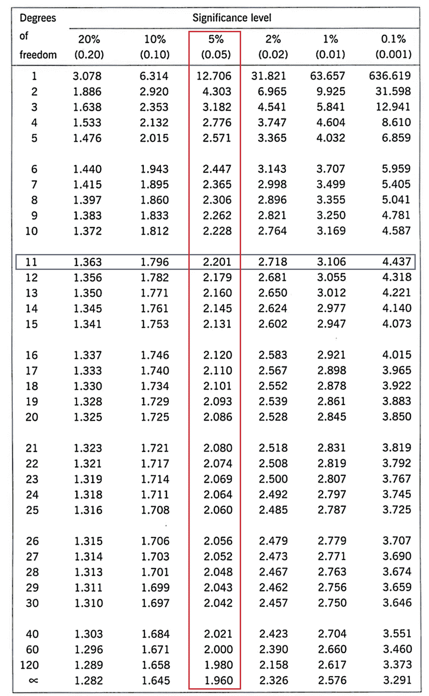

T-Statistic Table of 95%CI (0.05%SL) and 11DF

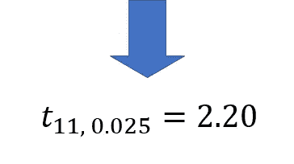

T-Statistic Value

现在，让我们计算标准误差和边际误差！

在 Microsoft Excel 中，可以使用以下公式计算标准误差:

`=STDEV.S(number1, [number2]...)/SQRT(n)`

使用:

*   数字 1，数字 2…是卖出的鞋子的数量
*   n = 12(月)

和`Margin Errors = Standard Errors * t(11, 0.025)`

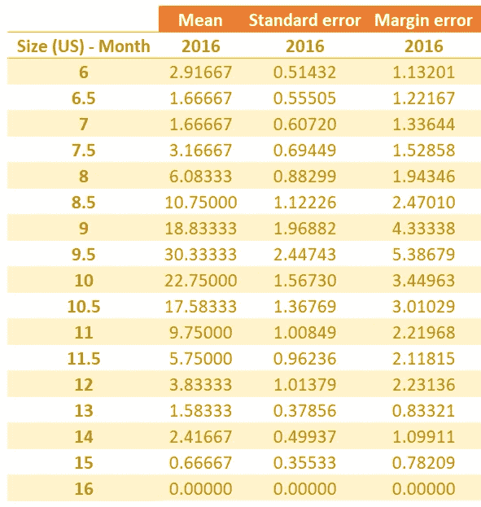

Mean, SE, and ME

最后一个，计算置信区间

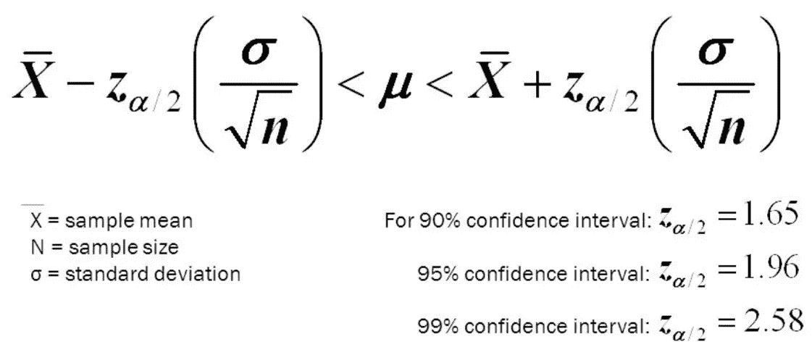

Confidence Interval formula

我知道你对上面的公式感到头疼，但是等等！我们已经有了均值和边际误差，对吗？那么我们可以计算 CI 为`(Mean — ME; Mean + ME)`

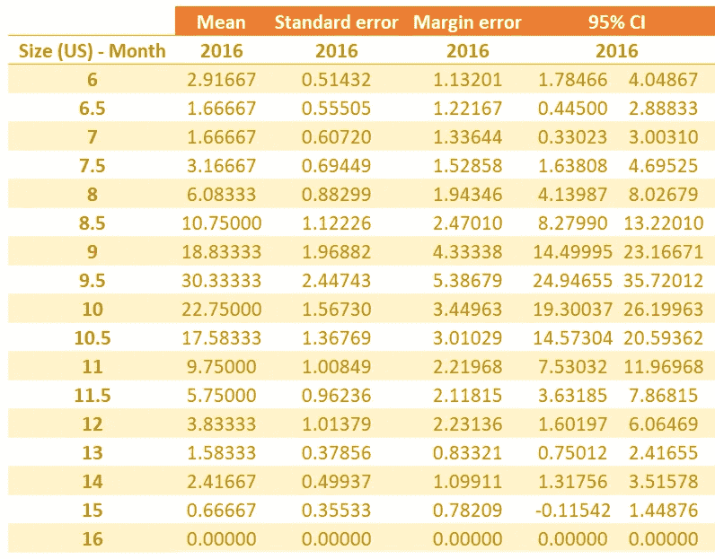

Mean, SE, ME, and CI(95%)

在 95%的情况下，每双鞋销售的真实总体平均值将落入各自的区间。CI 的上限值(上限或更高的值)向我们显示了所需鞋子的最大数量。反之亦然，因为它们是卖出的鞋的最小数量。因为我们不想库存太低，所以解决这个问题的一个可能的办法是，尽可能多地购买最接近最大销售可能性置信区间上限的**双鞋。当然，我们需要储存超过 CI 地板限制的**,以确保所有顾客(男性，有特定鞋码)都能买到他们喜欢的鞋子**,而不是因为商品缺货而不买就离开我们的商店。**

让我们总结一下 CI，看看:

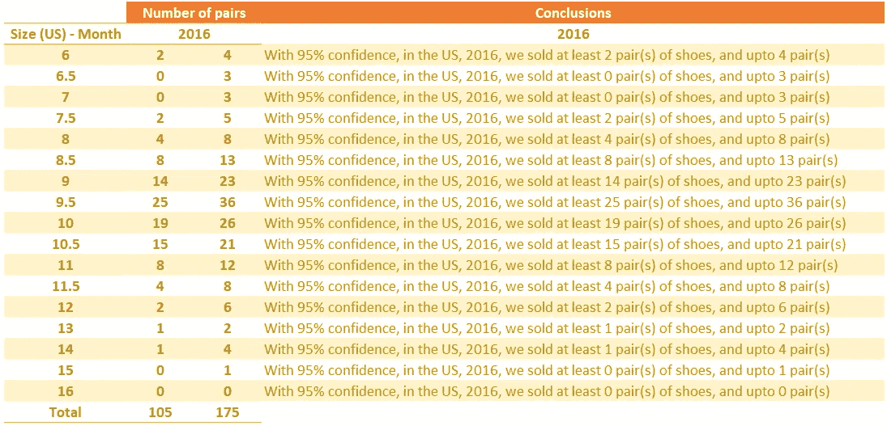

Conclusions based on sample data set

# 我们解决问题了吗？

没有！别怪我

*   好吧。这是 2016 年的结论，但现在是 2019 年，我们可以使用它吗？绝对是！我们可以计算 2017 年、2018 年，然后取它们的平均值，给出 2019 年的预测
*   由于其他因素，2019 年的预测可能不正确，例如:今年的流行趋势发生了变化，人们更喜欢使用运动鞋而不是鞋子；或者我们旁边刚开了另一家鞋店。但是这篇文章只分析了历史数据
*   这篇文章我们使用了美国 2016 年的数据，并且只分析了男人的尺寸。因此，如果你是一名商店经理，你必须对女性进行同样的分析，以便对你的商店有更全面的了解

# 延伸！让我们再深入一点

我想知道你是否注意到在之前的“基于样本数据集的结论”图片底部的数字 105 和 175。这是什么意思？

*   105:卖出最少数量的鞋子。所以作为商店经理，我们必须准备足够多的库存来储存这些鞋子，否则我们就会缺货
*   175:库存大是好，但没必要库存巨大！大到可以存放 175 双就够了。请记住，您的库存越大，管理费用就越高

你穿 16 码的有什么？如果你的眼睛足够敏锐，你可以看到没有这种尺寸的产品出售。让我们检查一下 2017 年和 2018 年的数据。如果没有商品售出，你需要停止生产或进口这种尺寸的商品

如果你的库存不够大，不能存放最少数量的鞋子怎么办？别担心。这是全年售出的商品数量。让我们来看看这篇文章顶部的热图，你可以看到 12 个月内的分布情况。将每个数字(每月)转换为频率—该月占全年的百分比。你可以计算出哪个月我们卖得最多，仔细检查库存，准备进口计划，然后你就不用担心供求趋势了

# 结论

1.  数据分析**不能帮你回避问题，但是帮你反映历史数据**预测未来趋势
2.  在数据科学和统计学中，**我们不保证任何事情，我们只是根据有多少信心给出结论**(这个帖子是 95%)
3.  而最后一个，你可以**通过频繁分析历史数字**来增加自己的信心。保持每年、每月或每周更新。更新数据越频繁，预测的准确性就越高

再次感谢您的阅读时间。

天天快乐学习！