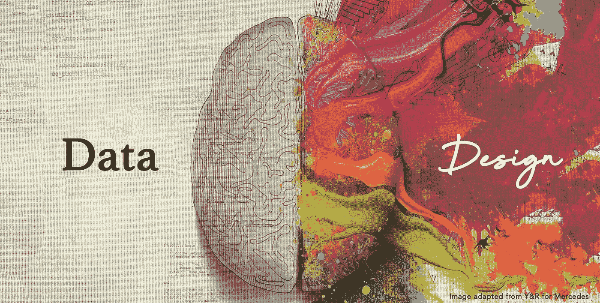

# 设计过程中的数据科学

> 原文：<https://towardsdatascience.com/data-science-in-the-design-process-754954c996de?source=collection_archive---------12----------------------->

## 第一部分

## 服务设计者的框架

## “设计流程中的数据科学”的第 1 部分，旨在帮助服务设计师在设计流程的所有阶段使用数据，从使用数据进行研究和分析到使用数据作为创意媒介和工具。

# **摘要**

近年来，我们生活和环境的数字化导致了数字数据的激增。通过可穿戴技术的兴起和手机的出现，我们在网上甚至网下都留下了我们行为的数字痕迹。技术使公司能够存储这些数据，这些公司开始意识到这些数据对其产品、服务和营销的价值。根据《哈佛商业评论》(Harvard Business Review)，数据科学家的角色已经成为“21 世纪最性感的工作”(Davenport，2012)，所有行业的组织都在使用数据科学从他们收集的大量数据(大数据)中提取价值。

服务设计机构也需要使用数据科学，因为越来越多的客户向他们的设计机构施加压力，要求将数据的使用纳入他们的工作方式。因此，这项研究旨在解决服务设计师在设计过程中纳入数据科学的程度。通过设计进行研究的方法用于调查设计师如何使用数据科学，因为传统上设计过程深深植根于定性研究。这项研究揭示了数据设计师面临的广泛挑战，以及数据不仅可以用来补充定性见解，还可以探索数据作为一种新的设计媒体。此外，还提出了一个框架和工具包作为建议的解决方案，该报告说明了原型是如何开发、测试和迭代的。接下来的步骤中提出的解决方案的发展强调，最后，建议作出进一步的领域实践为基础的学术研究在这一领域。

# **大数据的兴起**

大数据已经成为一个热门词汇，引起了所有行业的企业、政府和媒体的关注(Davenport & Patil，2012)。数据的收集和存储变得比以往任何时候都更简单、更便宜。我们的生活已经变得数字化，从网上交谈，到分享假日照片，登记航班，甚至网上约会，我们在每一步上都留下了我们活动的痕迹。我们现在每两天创造的关于我们自己的信息与从早期文明到 2003 年创造的信息一样多:每 48 小时 5 艾字节(McGuier 等人，2013；Gobble，2013)。随着智能手机和可穿戴跟踪设备的发展，我们现在不再只有在工作时登录电脑才能产生数据；数字正在渗透我们的家庭和个人生活。“睡眠、锻炼、性、食物、情绪、位置、警觉性、生产力，甚至精神健康都被跟踪、测量、分享和展示”(Wolf，2010)。

Figure 1: Extract from Black Mirror episode ‘Be right back’

《黑镜》是一部英国电视“科幻选集系列片，探索了一个扭曲的高科技未来，在那里人类最伟大的创新和最黑暗的本能碰撞”(网飞，没有日期)。第二季第一集《马上回来》(Be right back)由查理·布洛克编剧，欧文·哈里斯执导，展示了人们如何仅仅基于他们的在线身份被再造。一位最近去世的寡妇了解到一项新的在线服务，该服务通过使用算法和他的社交媒体和在线历史来重现她已故的丈夫(见图 2)。

仅在十多年前，最有价值的公司名单主要由制造和生产公司组成，如通用电气和福特，但今天，从信息中产生价值的公司，如谷歌、亚马逊和脸书，已经成为领导者(Osman & Mines，2015)。

数据科学和大数据紧密相连，但又不完全相同。大数据涉及数据捕获、传输、存储、归档和分析等，而数据科学基于通过算法、应用数学和统计学从数据中提取信息(Osman & Mines，2015)。可以说，这是谷歌和 LinkedIn 等公司建立的基础，也是在科学研究中越来越受欢迎的基础(Hey et al .，2010；Tolle 等人，2011 年)。

Wolf (2010)描述了一种对数据近乎痴迷的关系，他说“对数字的迷恋是现代管理者的典型特征。面对敌意股东的企业高管口袋里装满了数字”。事实上，商业世界已经习惯于使用数据，因为可量化的数据和数字便于比较和测试。此外，Alharti 等人(2017 年)认为，大数据可以支持组织提供更好、更个性化的体验，从而提高效率和盈利能力，并且是获得竞争力的最重要因素之一

优势，因为它允许企业以新的方式创新(LaValle 等人，2011)。然而，McGuier 等人(2013 年)发现，首席营销官(CMO)仅在 29%的时间里根据数据分析做出决策，这凸显了数据在使用不当时的无足轻重。这可能是因为组织在充分利用大数据可能带来的价值时面临许多障碍，例如“过时的 IT 基础设施、大数据固有的复杂性和混乱性、组织内部缺乏数据科学技能、隐私问题以及不利于数据驱动的运营或数据驱动的决策的组织文化”(Alharti 等人，2017 年，第 286 页)。

# **数据科学家及其在商业世界中的角色**

如果数据不能被解释，数据的数量和丰富性的增长是没有意义的，雇佣一个专门的资源来操纵和提取数据的意义的想法只是在 2001 年才出现，当时“数据科学”一词首次在克利夫兰的一篇论文中使用(2001；波拉克 2012)。这为许多大学促进数据科学领域的发展开辟了道路，他们开设了数据科学机构和中心，正式将数据科学作为一种职业来教授，例如爱丁堡大学数据科学博士培训中心、伯克利数据科学研究所和纽约大学数据科学中心等。十多年后，数据科学已经成为每个行业的基本要素，无数作者将数据称为“未来的货币”，并将它比作黄金(Pollack，2012；Johnson，2012)和数据科学家已经成为这种新货币成功的一部分。Bakhshi & Mateos-Garcia (2014)将数据科学家定义为“使用统计、计算和其他学科的分析技术从新(‘大’)数据中创造价值的专家。”

随着数据量的不断增加，数据分析变得比以往任何时候都更加复杂，许多组织的解决方案已经变成雇用数据科学家，并期望他们挥舞魔杖，从根本上改变他们的业务。然而，实际上这并不那么简单(Wettersten & Malmgren，2013)。许多公司都试图了解如何在其业务中定位数据团队。在零食公司 Graze，数据团队直接向首席执行官安东尼·弗莱彻汇报。他表示，这不是一种典型的方法，但他们希望从一开始就在组织内部围绕数据创建正确的文化。数据科学家负责向企业内的利益相关者提供可操作的见解，并需要为销售、营销和财务等部门提供这些见解(Davis，2016)。如今，团队跨业务工作，这一方面对数据科学家很有吸引力，因为他们可以处理各种类型的问题，另一方面，这使整个工作团队的数据“民主化”。

快速产生的不断增长的数据量已经超过了处理、分析和解释数据的能力。因此，数据科学家已经成为商业世界中一种稀缺和急需的人才商品。Parsons(Davis，2016 年引用)宣称“数据科学家是数字世界的火箭科学家，首席数据科学家(CDS)的角色正在出现”，甚至受人尊敬的《哈佛商业评论》(Davenport，2012 年)也将数据科学家的角色称为“21 世纪最性感的工作”。

# **数据和设计——协同还是二分法？**

Treseler (2015)指出，在医学、工程和其他安全关键系统中使用科学方法测试新事物是常见的做法，但在消费品和网站设计中使用这种方法是相对较新的现象。看看发表的关于商业、技术和营销相关数据的文章数量，很明显数据是当今的主题*，Treseler (2015)认为应该让“数据科学”超越统计学家的角色，让设计师将数据科学作为他们技能的一部分。*

*有一种流行的观点认为，设计师基于本能和创造性直觉做出决定，这可能会导致一些人认为设计从来没有以数据为基础，不能被视为一种经验主义学科。因此，设计站在数据科学的对立面(King 等人，2017)。这样做是正确的，产品和服务的设计是基于与用户建立共鸣，通过探索和创造过程创造“巧妙”的体验。与“科学”的认识论过程不同，“设计是感性的。[……]设计不能被合理化和约束”(金等人，2017 年，xi 页)。一些专业人士(DigiCult，无日期；艾斯林格，2017)担心数据可能会对设计师的直觉、经验和创造力造成潜在的限制。*

*在光谱的另一端，从一个极端的角度来看，数据科学被视为一个无可争议的真理，为商业领袖创造了一个备受追捧的确定性。King 等人(2017 年)描述了从数百万用户收集数据的极端观点，这些用户被认为回答了所有设计问题，因此，这些数据可以取代设计。事实上，Denham (2018)甚至称赞数据科学家是未来的 UX 设计师。*

*Waechter (2016)将设计和数据科学置于光谱的相反两端，认为设计师和数据科学家“通常不会说相同的语言，更不用说对期望的用户体验有共同的理解”。这一概念引出了一个问题，即数据科学和设计是否可以协同共存，并创造一种互惠互利的关系？Wettersten & Malmgren (2018)似乎正是这种信念。当 *IDEO* 和 *Datascope Analytics* 合并他们的团队时，设计总监 Wettersten 和数据科学家 Malmgren 开始密切合作(Wettersten & Malmgren，2013)。他们将在他们著名的以人为中心的设计过程中使用数据科学称为“*以人为中心的数据科学”*，他们陈述了跨学科团队的结果，并建议从业者应该合作并相互学习，而不是一个人同时成为设计师和数据科学家。*

*一方面，有人认为，数据科学家在参与设计研究时，可以学会与研究对象建立更多的同理心。此外，设计方法，如可视化和草图，可以帮助数据科学家在分析阶段看到数据中的模式(Osman & Mines，2015)。另一方面，设计师也可以从数据科学中学到很多东西，例如使用指标来与业务目标保持一致，而不是依赖“直觉”，他们可以使用数据和指标来测试和评估他们的假设和假说(黄，2016)。*

# *数据驱动设计是答案吗？*

*任何领域变得更加“数据驱动”的需求，都是人们越来越熟悉的需求(King et al .，2017)。组织越来越依赖数据来帮助决策，包括关于设计和用户体验的决策。尽管术语“数据驱动的设计”在文献中已经变得流行，但 King 等人(2017)讨论了三种不同的方式来思考数据以及如何在设计流程中使用数据。他们讨论了熟悉的术语*数据驱动的*和*数据通知的*，并额外创造了术语*数据感知的*。*

*以下概述了这三个术语的定义:*

*   ***数据驱动设计:**数据决定产品和业务的结果*
*   *可以优化对其主要指标的影响。当设计项目的目标明确，并且有明确的设计和研究问题需要回答时，数据驱动设计是最常见的。*
*   ***基于数据的设计:**数据与其他资源一起使用，如战略应用、用户体验、直觉和竞争。以数据为基础的方法意味着它没有那么集中和有针对性，但数据是一个可以告知如何看待问题空间和做出决策的元素。*
*   ***数据感知设计:**通过这种方法，设计师意识到有许多类型的数据可以回答大量不同的设计和研究问题，而且设计师通常意识到在整个设计过程中他们可以使用不同类型的数据。*

> *King 等人，2017 年*

*Ngai (2016)相信用量化数据补充定性见解的好处。他解释说，对于许多公司来说，设计和数据是相互关联的，因为有一个持续的数据流来监控数百个指标和迭代。他表示，“虽然设计本能仍然很有价值，但数据和分析可以帮助你磨练对产品的理解，并确保你的决定让利益相关者满意”。*

*由于随时可用的数据量不断增加，组织面临着利用其数据集的压力。这种压力传递给组织雇佣的机构，设计师需要通过对客户数据的量化分析来支持他们收集的定性见解。量化研究专家 hertto(Likkanen，2017 年引用)批评说，太多的项目在压力下毫无目的地收集量化数据，最终得到“从设计角度看不可操作的数据”。这一点得到了艾斯林格(2017)的支持，他批评说，数据不能轻易地支持每一个设计决策。他有力地指出，利用基于过去行为的数据来塑造未来的产品开发，对许多人来说是一个陷阱。他以摩托罗拉为例，当时该公司拒绝了一项关于触摸屏智能手机的提议，因为市场数据显示，消费者希望购买与当时的诺基亚类似的手机。显然，在应该创造什么样的的问题上，设计师的洞察力要优于基于数据的洞察力(Likkanen，2017)。*

# ***数据和创意***

*Bakhshi & Mateos-Garcia (2014)强调了一个事实，即大多数人认为数据科学工作与“创造性”完全相反，许多人认为它是例行公事、可预测的，甚至是无聊的。Digicult(无日期)指出，设计师难以处理数据的原因之一是，他们将自己的工作视为一种艺术形式，他们担心自己的“创造力和直觉将被数据和事实取代”。Pardi (2017)认为，在创作过程中，数据应该用来告诉我们事实，这可以作为提出问题和试验“邻近可能性”的基础，以便发现原始数据无法提供的见解和潜力。他认为，创造力是对可能结果的探索，但它只能是可能性的一小部分，因为我们的记忆、偏见和我们利用的视角限制了我们的想象力。*

*在这种情况下，团队中的经验和背景的多样性变得非常宝贵，数据的使用可以激发不同的观点、新的想法，更重要的是提出更多可能不会被认为是可能的问题。*

# *下一篇文章*

*如果您对这个主题感兴趣，可以通过下面的链接阅读本系列的其他文章:*

*   ***第 1 部分**“设计过程中的数据科学”(你在这里👈)*
*   ***第二部分** ' [数据作为设计的新媒介](https://medium.com/@alex.schwartz/data-as-a-new-medium-of-design-1d4cbc7bfea1)*

# *参考*

*Bakhshi，h .和 Mateos-Garcia，J. (2014) *数据科学工作是创造性工作(第一部分)。*可从:[https://www . Nesta . org . uk/blog/data-science-work-is-creative-work-part-1/](https://www.nesta.org.uk/blog/data-science-work-is-creative-work-part-1/)(访问时间:2018 年 10 月 7 日)。*

*Cleveland，W. (2001)，“数据科学:扩展统计领域技术领域的行动计划”，*《国际统计评论》*，69 (1)，第 21–26 页。*

*Davenport，t .和 Patil，J. (2012)“数据科学家:21 世纪最性感的工作”，*《哈佛商业评论》，* 90 年，第 70-76 页。*

*Davis，H. (2016) *数据科学家的角色以及我们为什么需要他们*。可从:[https://www . raconteur . net/technology/the-role-of-a-data-scientist-and-why-we-need-them](https://www.raconteur.net/technology/the-role-of-a-data-scientist-and-why-we-need-them)(访问时间:2018 年 10 月 13 日)。*

*Denham，L. (2018) *数据科学家是下一个 UX 设计师*。可从:[https://channels . the innovation enterprise . com/articles/data-scientists-is-the-next-UX-](https://channels.theinnovationenterprise.com/articles/data-scientists-are-the-next-ux-)designers(访问时间:2018 年 10 月 6 日)。*

*DigiCult(无日期)*关于数据驱动设计你需要知道的 3 件事*。可从:[http://digi cult . it/digi mag/3-things-need-know-data-driven-design/](http://digicult.it/digimag/3-things-need-know-data-driven-design/)(访问时间:2018 年 10 月 8 日)。*

*h .艾斯林格(2017) *大数据挑战*。可从:[https://www.frogmut.com/2017/05/08/big-data-challenge/](https://www.frogmut.com/2017/05/08/big-data-challenge/)(访问时间:2018 年 10 月 9 日)。*

*黄(2016) *设计师如何利用数据创作出令人惊叹的作品。*可在:[https://www . invision app . com/inside-design/how-designers-can-use-data/](https://www.invisionapp.com/inside-design/how-designers-can-use-data/)(访问时间:2018 年 10 月 10 日)。*

*j . Johnson(2012)，“大数据+大分析=大机会”，*财务主管*，28 (6)，第 50–53 页。*

*King，r .，Churchill，e .，Tan，C. (2017)，*用数据进行设计*。加利福尼亚州塞瓦斯托波尔:奥莱利媒体公司。*

*Likkanen，l .(2016)*Web 服务的数据驱动设计工具*。可从:[https://www . LinkedIn . com/pulse/tools-data-driven-design-we B- services-lassi-a-](https://www.linkedin.com/pulse/tools-data-driven-design-web-services-lassi-a-)liikkanen？trk=mp-reader-card(访问日期:2018 年 10 月 9 日)。*

*McGuire，Meyer，c .和 Stone，D. (2013) *数据驱动的生活*。可从:[https://www . McKinsey . com/business-functions/marketing-and-sales/our-insights/the-data-](https://www.mckinsey.com/business-functions/marketing-and-sales/our-insights/the-data-)driven-life 获取(获取时间:2018 年 10 月 12 日)。*

*网飞(无日期)*黑镜*。可从:[https://www.netflix.com/gb/title/70264888](https://www.netflix.com/gb/title/70264888)(访问时间:2018 年 11 月 15 日)。*

*Ngai，J (2016) *用数据进行设计——作为一名设计师解释和分析数据*。可从:[https://uxdesign.cc/designing-with-data-ed721ffa008e](https://uxdesign.cc/designing-with-data-ed721ffa008e)(访问时间:2018 年 10 月 9 日)。*

*Osman，A. & Mines，K. (2015)“数据科学作为设计的新前沿”，*国际工程设计会议*。2015 年 7 月，意大利米兰。*

*Pardi，B. (2017) *如果你想有创造力，就不要被数据驱动*。可从:[https://medium . com/Microsoft-design/if-you-want-to-be-creative-don-be-data-driven-](https://medium.com/microsoft-design/if-you-want-to-be-creative-dont-be-data-driven-)55db 74078 EDA(访问时间:2018 年 10 月 4 日)。*

*Pollack，N. (2012) *亿字节革命:Kaggle 如何将数据科学家变成摇滚明星*。可从:[https://www.wired.co.uk/article/the-exabyte-revolution](https://www.wired.co.uk/article/the-exabyte-revolution)(访问时间:2018 年 10 月 12 日)。*

*Tolle，k .，Tansley，s .和 Hey，A. (2011)，《第四范式:数据密集型科学发现》，*IEEE 会议录*，99 (8)，第 1334-1337 页。*

*Wettersten，j .和 Malmgren，D. (2018) *当数据科学家和设计师一起工作时会发生什么*。可从:[https://hbr.org/2018/03/what-happens-when-](https://hbr.org/2018/03/what-happens-when-)数据-科学家-设计师-一起工作(访问时间:2018 年 10 月 5 日)。*

*Wolf，G. (2010) *数据驱动的生活*。可从:[https://www . nytimes . com/2010/05/02/magazine/02 self-measurement-t . html](https://www.nytimes.com/2010/05/02/magazine/02self-measurement-t.html)(访问时间:2018 年 10 月 12 日)。*