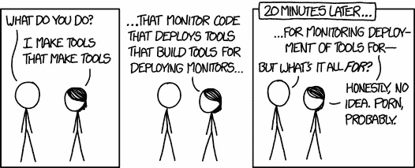

# 20 个必须知道的数据科学面试问题

> 原文：<https://towardsdatascience.com/data-science-interview-questions-ef87a3543b84?source=collection_archive---------15----------------------->

## 和相关阅读。

我遇到的一些好的数据科学问题的非穷举(*咄*)列表。我希望这个列表对想温习一些基本概念的人有用。向这里提到的所有令人惊叹的帖子的作者致敬。

**Q.** 定义均值、众数、中位数。向外行人解释这些概念。两者孰优孰劣。举实际例子。

**问**解释不同类型的分布。为什么正态分布对数据科学家如此重要。什么是中心极限定理？举个现实生活中的例子。

 [## 常见概率分布

### 数据科学家的表格！

medium.com](https://medium.com/@srowen/common-probability-distributions-347e6b945ce4) 

一个有趣的分布是 T8 T9 T9 分布。 搞笑什么啤酒能从一个家伙身上弄出来！

 [## 吉尼斯的天才和他的统计遗产

### 今年圣帕特里克节，世界各地的狂欢者将聚集在街头，寻找爱尔兰的国酒之一:阿…

theconversation.com](http://theconversation.com/the-genius-at-guinness-and-his-statistical-legacy-93134) 

**问.**解释术语: ***峰度*** 和 ***偏度*** 。

 [## 偏斜和峰度:数据科学中你需要知道的两个重要的统计学术语

### 如果您不知道数据科学中的其他一些常用术语。然后点击这里。

codeburst.io](https://codeburst.io/2-important-statistics-terms-you-need-to-know-in-data-science-skewness-and-kurtosis-388fef94eeaa) 

**Q.** 用实际例子解释 ***异方差*** 。你会怎么解决？***statsmakemecry***精辟地解释了这个*无法言说的*字。

简而言之:

*   一个变量相对于一个独立预测变量的可变性的方差。

在*不那么-* 中简称:

 [## 令人困惑的统计术语解释:异方差(Heteroskedasticity)

### 异方差是一个很难发音的词，但它不需要成为一个很难理解的概念。

www.statsmakemecry.com](http://www.statsmakemecry.com/smmctheblog/confusing-stats-terms-explained-heteroscedasticity-heteroske.html) 

当你在博客上的时候，也检查一下 ***多重共线性*** 和 ***残差*** 。还有，相关 xkcd 漫画:

[Seriously, this is not debatable!](http://www.tylervigen.com/spurious-correlations)

**问**解释偏差/方差，权衡。各种模型在偏差/方差方面如何比较？用实例解释第一类和第二类错误。

Google for the rest.

**Q.** 解释决策树和 ***XGBoost*** 的工作原理以及它们之间的所有模型(装袋、随机森林、Boosting、梯度 Boosting)。谈论这些模型中的并行化。谈论这些模型的偏差/方差。

 [## 随机森林算法

### 随机森林是一个灵活的，易于使用的机器学习算法，即使没有超参数调整…

towardsdatascience.com](/the-random-forest-algorithm-d457d499ffcd)  [## XGBoost 算法:愿她统治长久！

### 接管世界的机器学习算法的新女王…

towardsdatascience.com](/https-medium-com-vishalmorde-xgboost-algorithm-long-she-may-rein-edd9f99be63d) 

Statistically speaking, carry a bomb on a plane. The odds of two people carrying a bomb on the same plane are very very very low.

**问**什么是 ***贝叶斯法则*** 。实际例子。什么是先验概率和后验概率？如果你的 3 个朋友各以 1/3 的概率说实话，他们说目前正在下雨，那么实际下雨的概率是多少？*为什么会有那么多撒谎的朋友？*

 [## 应用贝叶斯规则

### 在现实世界问题中使用贝叶斯推理

towardsdatascience.com](/bayes-rule-applied-75965e4482ff) 

我怎么推荐上面这篇文章都不为过。

**问**你将如何构建一个 ***推荐引擎*** ？描述从头开始建造一个的来龙去脉。什么是***协同过滤*** 。下面的阅读非常吸引人。

 [## Spotify 怎么这么了解你？

### 一位软件工程师解释了个性化音乐推荐背后的科学原理

medium.com](https://medium.com/@sophiaciocca/spotifys-discover-weekly-how-machine-learning-finds-your-new-music-19a41ab76efe) 

**问**如何处理 ***不平衡数据集*** ？

简而言之:

*   对较大样本进行子采样。
*   对较小的样本进行过采样。
*   为较小的样本创建伪样本。
*   调整模型以平衡类权重。

在*不那么-* 中简称:

 [## 机器学习中不平衡数据集的处理

### 面对不平衡的班级问题，应该做什么，不应该做什么？

towardsdatascience.com](/handling-imbalanced-datasets-in-machine-learning-7a0e84220f28) 

**问。**谈论各种模型及其性能评估指标。向外行解释 F1 的分数。F1 分数是怎么算出来的？

**问**多类与多标签分类。

**问。**描述你解决一般分类问题的首选方法。谈论你会考虑的所有因素。你如何选择和确定一个特定的模型？

**问**什么是迁移学习，强化学习？例子，例子，例子。

**问**树构建算法在节点处拆分使用的是什么算法？

**问**什么是过拟合和欠拟合？将其与偏差/方差联系起来。你如何处理过度拟合？谈谈正规化及其类型。

**问**描述聚类技术。在聚类技术中如何确定聚类的个数？讨论处理偏差/方差权衡时的聚类数。

 [## 选择最佳集群数量的 10 个技巧

### 聚类是最常见的无监督机器学习问题之一。观察值之间的相似性被定义为…

towardsdatascience.com](/10-tips-for-choosing-the-optimal-number-of-clusters-277e93d72d92) 

**Q.** 如果 logistic 回归是一个分类模型，为什么叫 logistic **回归**？解释它的内部工作原理。

 [## 为什么 Logistic 回归不叫 Logistic 分类？

### 逻辑回归本身绝对不是一个分类模型。人们会注意到编辑过的广告吗？在评论里打我。

stats.stackexchange.com](https://stats.stackexchange.com/questions/127042/why-isnt-logistic-regression-called-logistic-classification) 

**问**你如何处理缺失的特征？哪些型号支持缺失的功能？谈论估算和填补缺失值的方法。删除观察值如何处理缺失值的插补？

 [## 如何处理丢失的数据

### “归罪的想法既诱人又危险”

towardsdatascience.com](/how-to-handle-missing-data-8646b18db0d4) 

**Q. *天魔堂*** 问题:经典概率问题:

*   有三扇门，门后有两只山羊和一辆汽车。
*   你选一扇门(称之为门 A)。你当然希望有辆车。
*   游戏节目主持人蒙蒂·霍尔检查了其他的门(B & C 饰)，打开了一扇有山羊的门。(如果两扇门都有山羊，他随机挑选。)

游戏是这样的:你是坚持用门 A(最初的猜测)还是换到未打开的门？**有关系吗？**为什么或者为什么不？

A comic for everything!

**问**数据科学中的 DevOps。等等，现在怎么办？

 [## 数据科学家 DevOps:驯服独角兽

### 当大多数数据科学家开始工作时，他们配备了从学校学到的所有简洁的数学概念…

towardsdatascience.com](/devops-for-data-scientists-taming-the-unicorn-6410843990de) 

DevOps Engineers, where you at?

**问**说说一些软件架构模式。

 [## 简而言之，10 种常见的软件架构模式

### 想知道大型企业级系统是如何设计的吗？

towardsdatascience.com](/10-common-software-architectural-patterns-in-a-nutshell-a0b47a1e9013) 

**问**你的弱点是什么？

提前考虑一下也无妨。这是一个很常见的问题，所以很多人在谈到这个问题时都会笨手笨脚。说你在任何项目上工作太努力，或者说不完成任务不罢休，这不是弱点。你可以提出这个问题的技术方面。

 [## 我作为数据科学家的弱点

### 不认识到我们的弱点，我们将永远无法克服它们

towardsdatascience.com](/my-weaknesses-as-a-data-scientist-1310dab9f566)