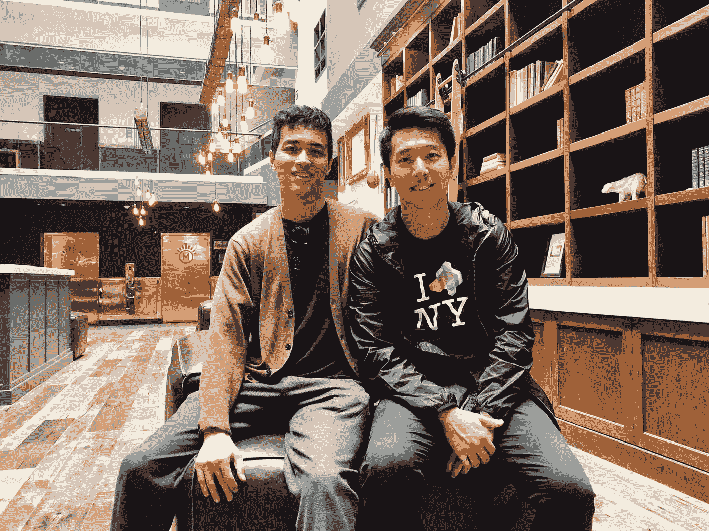
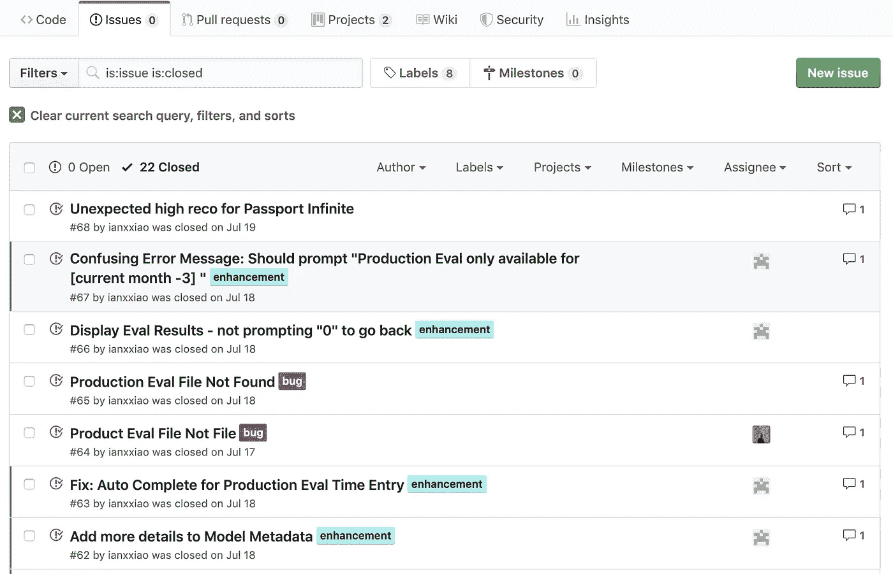

# 数据科学很无聊

> 原文：<https://towardsdatascience.com/data-science-is-boring-1d43473e353e?source=collection_archive---------0----------------------->

## 我如何应对部署机器学习的无聊日子

Photo by [Julian Howard](https://unsplash.com/@jsaxxhoward?utm_source=unsplash&utm_medium=referral&utm_content=creditCopyText) on [Unsplash](https://unsplash.com/search/photos/boring?utm_source=unsplash&utm_medium=referral&utm_content=creditCopyText)

**TLDR** :许多人选择从事数据科学(或 ML，机器学习)中令人兴奋的部分来激励自己和他人。*但是我们必须面对一个现实:真正的工作通常是“无聊”的——和人们浪漫化的工作相比是无聊的。*感到无聊产生紧张感；这最终会导致数据科学领域的高人员流动率。我想分享我实际上做了什么，以及我是如何应对“数据科学中的枯燥”的。希望能帮助各位有志的数据科学家，树立正确的预期。因此，一旦你决定从事数据科学职业，你就要做一场持久战。享受吧。

*更新:走向数据科学，我记录了关于这个博客的采访。见文末视频链接。*

***喜欢读什么？*** *跟我上* [*中*](https://medium.com/@ianxiao) *，* [*领英*](https://www.linkedin.com/in/ianxiao/) *，或者* [*推特*](https://twitter.com/ian_xxiao) *。还有，作为一名数据科学家，要不要学习商业思维和沟通技巧？查看我的《* [*用机器学习影响*](https://www.bizanalyticsbootcamp.com/influence-with-ml-digital) *》指南。*

***免责声明*** *:这篇文章没有得到我工作的任何公司的支持或赞助。我交替使用术语数据科学和 ML。*

# 1.故事时间

我年轻英俊的表弟肖恩最近来到了加拿大。他在这里攻读计算机科学硕士学位。和很多学生一样，Shawn 对机器学习非常有热情。他想在两年后毕业时成为一名数据科学家(或任何与 ML 有关的工作)。

作为一个对 Shawn 的成功真正感兴趣的哥哥，我决定分享我在数据科学职业生涯中最谨慎的学习——它是 ***而不是像 HBR 描绘的***“21 世纪最性感的工作”；很无聊；它正在流失；令人沮丧。就像其他职业一样。

我有义务告诉肖恩真相，即使这很令人失望。这将有助于他对自己的职业选择做出明智的决定(更重要的是，我会避开妈妈和叔叔凌晨 3 点打来的电话，他们肯定会给我上关于家庭、责任、指导和诚实的课)。

作为一个聪明、上进、好奇的年轻人，**肖恩让我详细解释一下“无聊”是什么样子。**这就是这篇文章的内容。

此外，我们还将触及 ML 的主要趋势，以及如何保持相关性并脱颖而出。我将在几篇后续文章中分享这一点。**请** [**关注我**](https://medium.com/@ianxiao) **上媒**有兴趣的话。

# 2.设置一些背景

重要的是要认识到[我是如何来到这里的](https://www.linkedin.com/in/ianxiao/)(我的 LinkedIn)，这样你才能正确看待事情。我作为数据科学经理提供我的观察和意见，他领导团队在财富 100 强企业部署 ML 系统，管理客户关系，并做一些技术工作。

几个更重要的定义。一个 **ML 系统**是一个解决商业领域问题的解决方案，有一个 ML 组件，并且有所有其他与人或机器一起工作所需的非 ML 系统的东西。

**部署**意味着获得推动实际业务运营的解决方案。例如，建立实验来训练和验证一个 ML 模型是*而不是*一个部署；设置一个推荐引擎，通过电子邮件发送每月产品报价，这是一种部署。部署 ML 系统面临着非常不同的问题，而不仅仅是建立一个好的 ML 模型。有兴趣的话在这里阅读更多[。](/fixing-the-last-mile-problems-of-deploying-ai-systems-in-the-real-world-4f1aab0ea10)

也就是说，我并不代表那些作为初级开发人员加入谷歌或其他高科技公司并成为技术经理的人。这些公司确实做得很好，但我认为它们只代表了“最顶尖的 1%”。其他财富 100 强企业通常在技术成熟度、采用速度以及工具和工程人才投资方面落后。

# 3.让我们开始吧

简而言之，当我说数据科学很无聊时，我指的是当一个人意识到浪漫化的期望和现实之间的差距时的沮丧感。

[GIFHY](https://media.giphy.com/media/3oz8xGme7vEndhrsly/giphy.gif)

大多数年轻的数据科学家希望将大部分时间花在修补和构建花哨的 ML 模型上，或者用丰富多彩的可视化展示突破性的商业见解。当然，这些仍然是工作的一部分。

但是，随着企业受到的教育越来越多，它们更加关注真正的运营价值。这意味着**企业** **想要部署更多的 ML 系统**；他们不太关心自己有多少新车型或花哨的仪表盘。因此，数据科学家被要求做非 ML 的工作。这让人厌烦。

让我们进一步限定在数据科学中“无聊”是什么样子，如果我向你展示我从周一到周五的典型一天，那将是非常无聊的。因此，我将把我的工作分成几个主要的工作类别，突出预期和现实，并分享我的应对机制。

我将使用叙述*“我们”*，因为这些例子来自经验和团队的集合。这些例子可能并不详尽，但我认为它们会说明问题。

**3.1 设计**(5-10%的时间)

这是我们集体变得“兴奋”起来解决问题并提出绝妙想法的时候。这些想法可以包括新的模型架构、数据特性和系统设计等。很快，我们就会陷入低谷，因为由于时间限制和其他优先事项，我们需要采用最简单的(通常也是最无聊的)解决方案。

***预期*** *:我们实现可以在著名的 ML 期刊上刊登的想法，比如 NIPS，Google 的 AI 研究博客等。甚至可能赢得下一届诺贝尔奖。*

***现实*** *:我们实施能很好完成工作的事情。我们拍了一些漂亮的白板画的照片，这些照片值得装裱。*

***应对机制:*** *1)和我领域之外的朋友边喝边聊那些疯狂的想法；他们可以非常诚实(和粗鲁)地关闭疯狂但愚蠢的想法，2)把疯狂和聪明的想法作为次要项目，3)事实证明，大多数疯狂的想法并不真正有效，或者只是比简单的想法好一点点。因此，确认和强化接吻原则(保持简单愚蠢)总能给我带来安慰和结束。*

**3.2 编码**(20–70%的时间取决于角色)

这里没什么好说的。这是我们戴上耳机，喝点咖啡，伸展手指，锁定屏幕，打出漂亮的代码行，让奇迹发生的时候。

我们的代码通常分为五类(占代码总行数的百分比):数据管道(50-70%)、系统和集成(10-20%)、ML 模型(5-10%)、支持调试和演示的分析(5-10%)。和别人的观察大致吻合。这里有一个更大的图片。

The proportion of the model code (illustrative); [here](https://papers.nips.cc/paper/5656-hidden-technical-debt-in-machine-learning-systems.pdf) is a link to the Hidden Technical Debt of ML by a team at Google

如你所见，我们大部分时间都花在无聊的非 ML 工作上。虽然 ML 组件非常重要，但现代框架和编码语言(例如 Keras、XGBoost、Python 的 sklearn 等)已经抽象出了许多复杂性。这意味着实现我们需要的结果不需要大量的代码；工作流已经被很好地标准化和优化了(做低级别的优化是不同的，但这可能是 1%的情况)。

***预期*** *:你把大部分时间花在开发和提炼 ML 组件上；其他人会处理好的。*

***现实*** *:没有人希望 1)做你不想做的事情，2)你把所有的好东西都留给自己，3)你在已经优化好的工作流程上花费过多的时间。*

***应对机制*** *:我们都根据自己的领域专业知识带头做出设计决策，并成为我们这一方的主要开发人员，同时对其他人起到支持作用(例如贡献想法、进行一些实际开发或 QA)。这样做可以让我们在向他人学习的同时发挥自己的优势。更重要的是，它有助于避免因争夺“性感工作”而产生的紧张情绪。*

3.3 质量保证、调试和修复 Sh*t (至少 65%的时间)

在我看来，这是任何技术开发工作中最无聊最痛苦的部分。开发 ML 系统也不例外。

在 ML 环境中，有两种类型的“错误”:糟糕的结果和传统的软件问题。**糟糕的结果**指的是低模型分数(如准确度或精确度)或不敏感的预测(如基于业务经验的概率非常不准确)。代码没有问题，只是结果没有意义或者不够好。传统的软件问题包括代码损坏或系统配置问题。

***预期*** *:我们只需要处理不好的结果，想出更聪明的办法来建立更好的模型。这在某种程度上还是很吸引人的。由于一些好的想法，看到业绩上升也是值得的。*

***现实*** *:在我们花费在 QA/调试/应用修复上的时间中，大约 70–90%是在传统软件问题上。通常，在我们构建了端到端的模型训练和验证管道之后，我们可以相当快地获得足够好的结果。然后，我们通常会降低建模的优先级，将重点放在系统问题上。*

***应对机制*** : *我用 Github 的 Issues 功能游戏化并保留了一个“奖杯板”。当我关闭发行票时，我有一种瞬间多巴胺冲动。看到我们“征服”的问题，我感到自豪，越是自豪。当然，如果当我点击“go”时一切都神奇地工作，我会更自豪——这在大学的一次编程作业中只发生过一次。我会一辈子记得那种感觉。如果在现实生活中再次发生，很可能是出了问题。*

A Snapshot of the Gibhut Issue Board

**3.4 消防**(10-50%的时间)

这对于任何交付团队经理来说都是一场噩梦，而不仅仅是数据科学。时间线有多长并不重要。事情总会出现，让你偏离轨道。具体来说，意外可以分为三类: **a)** **外部问题**如范围变更、上游系统依赖和客户投诉， **b)内部团队问题**如需要比预期长得多的时间来解决的恼人的 bug、人们获得新工作而没有正确过渡、人员配备不足、个性冲突，以及 **c)** **我自己的无知**，这是“其他人”的一个杂桶。

***预期*** *:从头游弋到底。来自客户、老板和团队的击掌和拥抱。*

***现实*** *:意想不到的事情一般发生在最不方便的时候。有通用的模式，但没有包罗万象的公式，这令人沮丧。*

**7)执行就好。其中许多本身并不是应对机制，但它们是良好的做法，并且一直运作良好。**

# 4.综上

所有这些都是说现实世界的数据科学是困难的。有志于从事 ML 职业的人应该认识到这样一个事实，即不仅仅是构建模型。你最终会感到厌倦和沮丧，就像你从事任何职业一样。**没事，正常。**最重要的是，你要制定应对机制，这样你才能长期留在游戏中，**享受一路上的小奖励和最后的胜利**。

这只是我和 Shawn 谈话的一部分。在接下来的两篇文章中，我将分享我对**该领域两年后可能会是什么样子**和**如何保持相关性和脱颖而出**的想法。敬请期待！

**喜欢你读的书吗？**关注我[中](https://medium.com/@ianxiao)、 [LinkedIn](https://www.linkedin.com/in/ianxiao/) ，或者 [Twitter](https://twitter.com/ian_xxiao) 。还有，作为数据科学家要不要发展商业影响力？查看我的“[对机器学习的影响](https://www.bizanalyticsbootcamp.com/influence-with-ml-digital)”指南。

这是一个关于这个博客的采访。希望你喜欢它。

你可能也会喜欢这些…

 [## 对生活的追求

### 一个发现为什么许多 ML 项目失败的工具

towardsdatascience.com](/the-pursuit-of-lift-why-ml-projects-fail-f032dc31a303)  [## 最有用的 ML 工具 2020

### 每个懒惰的全栈数据科学家都应该使用的 5 套工具

towardsdatascience.com](/the-most-useful-ml-tools-2020-e41b54061c58)  [## 被遗忘的算法

### 用 Streamlit 探索蒙特卡罗模拟

towardsdatascience.com](/how-to-design-monte-carlo-simulation-138e9214910a)  [## 12 小时 ML 挑战

### 如何使用 Streamlit 和 DevOps 工具构建和部署 ML 应用程序

towardsdatascience.com](/build-full-stack-ml-12-hours-50c310fedd51)  [## 越狱

### 我们应该如何设计推荐系统

towardsdatascience.com](/how-to-design-search-engines-24e9e2e7b7d0)  [## 我们创造了一个懒惰的人工智能

### 如何为现实世界设计和实现强化学习

towardsdatascience.com](/we-created-a-lazy-ai-5cea59a2a749)  [## ML 和敏捷注定的联姻

### Udacity 的创始人巴斯蒂安·特龙毁了我的 ML 项目和婚礼

towardsdatascience.com](/a-doomed-marriage-of-ml-and-agile-b91b95b37e35)  [## 抵御另一个人工智能冬天的最后一道防线

### 数字，五个战术解决方案，和一个快速调查

towardsdatascience.com](/the-last-defense-against-another-ai-winter-c589b48c561)  [## 人工智能的最后一英里问题

### 许多数据科学家没有充分考虑的一件事是

towardsdatascience.com](/fixing-the-last-mile-problems-of-deploying-ai-systems-in-the-real-world-4f1aab0ea10)  [## 数据科学很无聊(第二部分)

### 为什么我喜欢无聊的 ML 问题，以及我是如何思考这些问题的。

towardsdatascience.com](/data-science-is-boring-part-2-d7c702422004) 

下次见。

伊恩·肖