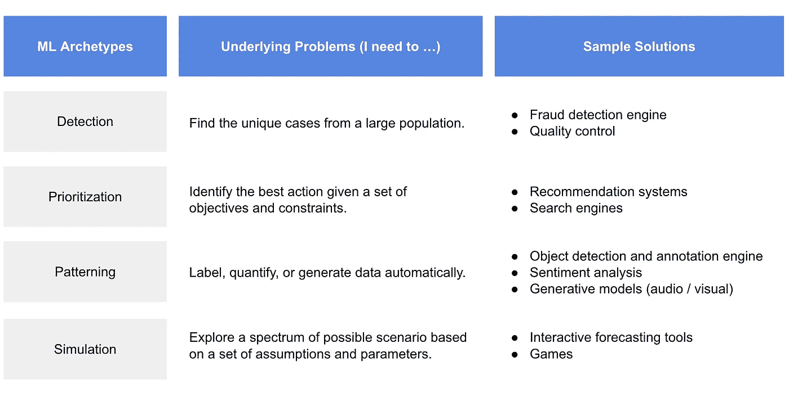
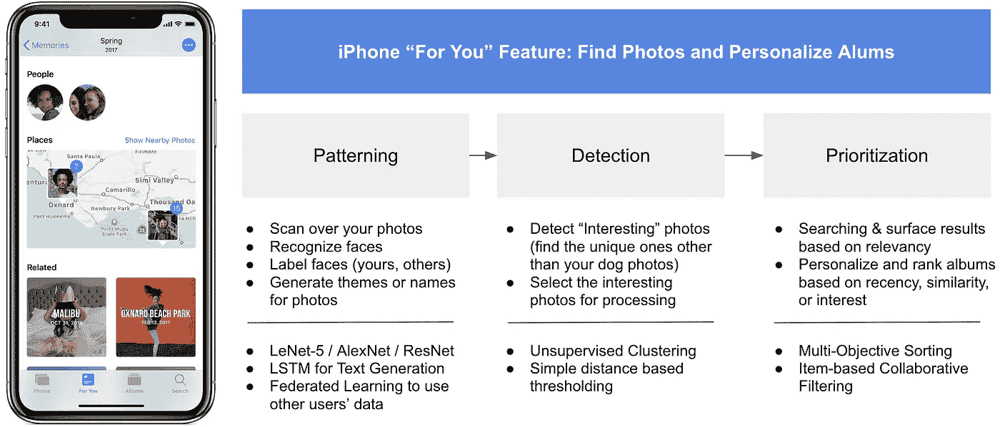
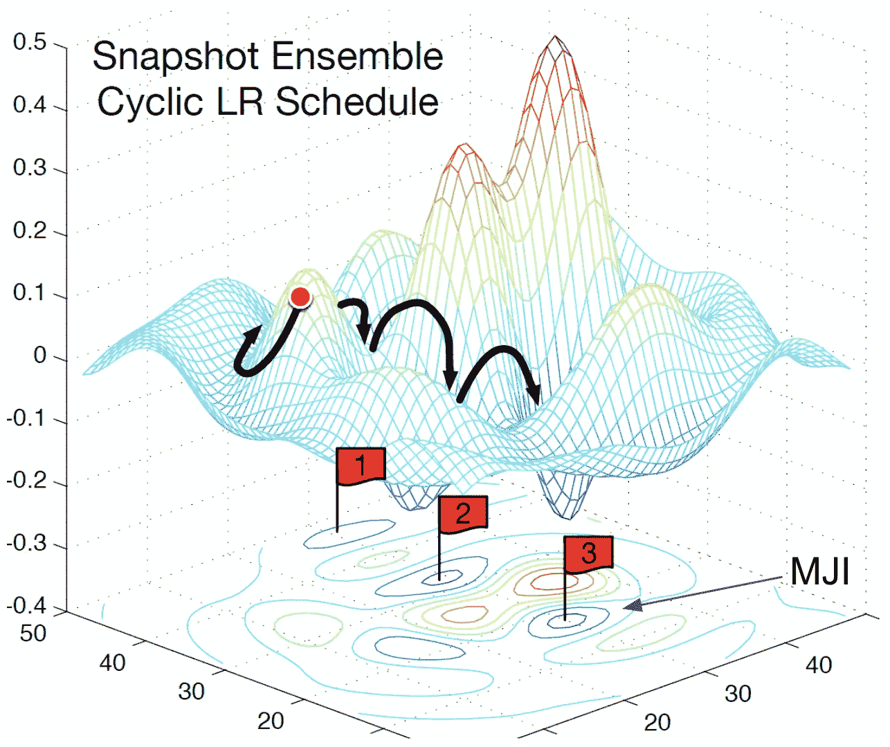
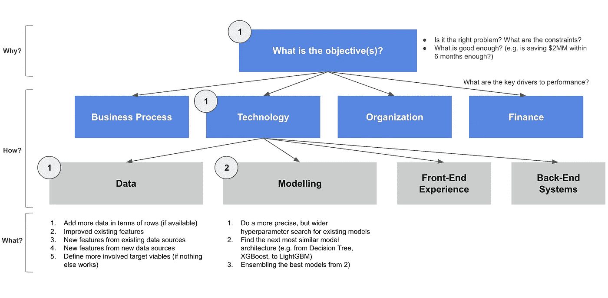
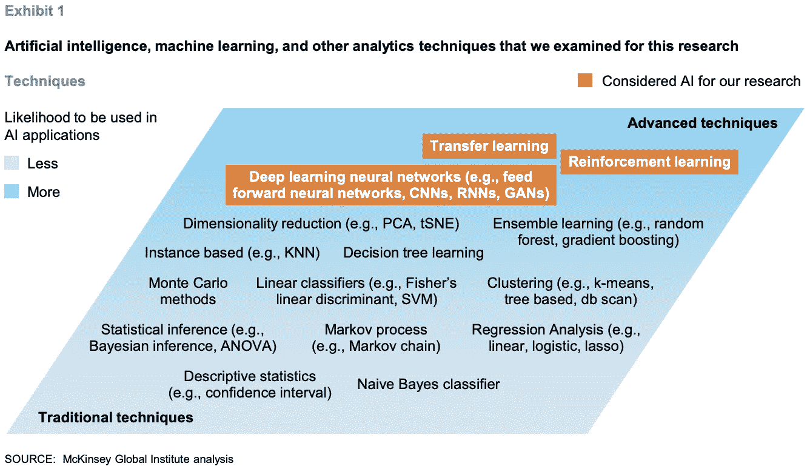

# 数据科学很无聊(第二部分)

> 原文：<https://towardsdatascience.com/data-science-is-boring-part-2-d7c702422004?source=collection_archive---------19----------------------->

为什么我喜欢无聊的 ML 问题，以及我是如何思考这些问题的。

Photo by [Julian Howard](https://unsplash.com/@jsaxxhoward?utm_source=unsplash&utm_medium=referral&utm_content=creditCopyText) on [Unsplash](https://unsplash.com/search/photos/boring?utm_source=unsplash&utm_medium=referral&utm_content=creditCopyText)

**TLDR** :我喜欢无聊的机器学习(ML)问题。他们是企业的核心。在这篇文章中，我讨论了为什么无聊的问题是好的，并分享了两个简单的工具: **ML 原型**和 **MJIT** 。它们可以帮助数据科学家和 ML 产品经理识别有意义的问题，更快地生成有效的解决方案，并清晰地表达强有力的信息。

**谢谢！** [本系列第 1 部](/data-science-is-boring-1d43473e353e?source=friends_link&sk=66370c11535aebed5c53cb81d2eedb14)有超过 3.4K 的拍手(仍在统计)。不到 4 天就在培养基上达到了[前 1%](https://www.freecodecamp.org/news/how-i-analyzed-a-million-medium-articles-to-learn-how-many-claps-great-stories-get-d688cf92759f/) 。我非常谦卑，非常感谢你的支持。一如既往，希望你喜欢这篇文章。

**喜欢你读的东西？**在[媒体](https://medium.com/@ianxiao)、 [LinkedIn](https://www.linkedin.com/in/ianxiao/) 或 [Twitter](https://twitter.com/ian_xxiao) 上关注我。还有，作为一名数据科学家，要不要学习商业思维和沟通技巧？看看我的“[对机器学习的影响](https://www.bizanalyticsbootcamp.com/influence-with-ml-digital)”指南。

***免责声明*** *:这篇文章没有得到我工作的任何一家公司的认可。我交替使用术语“数据科学”和“ML”。*

# 1.故事时间

[第 1 集](/data-science-is-boring-1d43473e353e?source=friends_link&sk=66370c11535aebed5c53cb81d2eedb14)在《数据科学很无聊》中:在一次去 Shawn 的学校(我的小表弟)的公路旅行中，我分享了我是如何应对部署 ML 的无聊的。

我在激励他方面做得很棒，所以肖恩问:“**你用 ML 解决了什么问题？**真题，不是我在网上看到的玩具例题。”

“很好。首先，你需要认清一点:**现实问题的现实是它们都挺无聊的。**但是，我爱无聊的问题！如果你想认真对待数据科学职业，你也应该……”我说，故事继续。

# 2.让我们开始吧

简而言之，我认为 **a)无聊的问题是好的**和 **b)我们应该应用 ML 来解决更多无聊的问题，但要创新**。

**为什么无聊的问题是好的？**无聊的问题是好的，因为它们代表了稳态操作问题。这些运营驱动着企业的核心。业务的核心是创造持续和实质性的价值。因此，企业优先投资解决阻碍其核心的无聊问题。无聊的问题得到真实的、持续的关注。

**那又怎样？**作为一名专业的数据科学家或 ML 产品经理，如果你能够认识到并清楚地表达 a)真正的问题是什么，b)如果你能够证明 ML 为什么以及如何能够更好地解决问题，那么说服你的老板(客户或顾客)接受你的 ML 想法就更容易了**。考虑到问题的重要性，许多人可能已经解决了相同的问题。ML 原型和 MJIT 可以帮助区分你的想法，请继续阅读。**

作为一名有抱负的数据科学家，这意味着你可以向招聘经理展示你务实的能力，你对如何解决现实世界的问题有直觉，最重要的是，你有正确的态度(例如，3 个月后你不会感到“无聊”)。

**这篇文章不是关于什么的？**企业用 [**零对一**](https://en.wikipedia.org/wiki/Zero_to_One) **式**解决方案进行“创新项目”的原因很多。我也喜欢思考和解决这些问题。但是，从统计上来说，我没有特权每天从事这样的项目。如果你有一个零到一的想法并且需要帮助，给我发信息。你可以在 [Medium](https://medium.com/@ianxiao) 、 [LinkedIn](https://www.linkedin.com/in/ianxiao/) 或 [Twitter](https://twitter.com/ian_xxiao) 上找到我。

那么，真正(无聊)的问题是什么？而今天人们又是如何用 ML 解决的呢？

**2.1ML 原型:了解历史**

尽管最近大肆宣传，但我们今天看到的许多 ML 解决方案并不是新的(这样想将是无知的)。因此，理解永恒的基本原理是很重要的——它们在过去、现在都是正确的，将来也可能如此。

**ML 原型关注基本面**，提出以下问题:

*   每个 ML 原型解决了什么潜在的问题？
*   有哪些不考虑业务职能(例如营销、运营、财务等)的应用程序的具体示例。)?

Author’s Analysis

像任何包罗万象的框架一样，可能会缺少一些东西。请**在下面留下评论**，如果需要我会更新。

你可能会问:像“[具有知识转移能力的分布式强化学习](https://arxiv.org/abs/1810.04058)”这样的前沿东西怎么样(我自己的工作。等等，好像是个玩具例子)还是“[人脸生成使用生成对抗网络](/face-generator-generating-artificial-faces-with-machine-learning-9e8c3d6c1ead)”？我认为它们分别属于优先化和模式化原型。这些例子只是如何更好或不同地解决问题的“技术”;它们不是问题。这里的关键是**关注潜在的问题和输出类型**。

让我们更进一步。每个原型都可以是一个独立的解决方案。更重要的是，每个 ML 原型都可以是一个更大、更复杂、更“酷”的 ML 应用程序的**构建块**。

举例来说，这里有一个我最喜欢的 iPhone 功能的例子——“给你的”个性化相册。我将特性分解成原型和更细粒度的实现细节。这过于简化了(UX、数据和系统都很重要)，但是我希望你能看到**ML 原型是如何一起工作并构建成一个更大的 ML 应用程序的。**

[Link](https://support.apple.com/en-ca/HT207023) to the iPhone screenshot; author’s analysis

***注意事项*** *:这是我自己的分析，用于说明目的。可能并不能代表苹果工程师实际是如何实现的。*

**那么，怎么用呢？**作为一名有抱负的数据科学家，ML 原型充当了**【地图】**。你可以用它来制定一个学习计划，选择你感兴趣的，并深入学习。如果你想超越，也许你可以 1)选择一个最喜欢的原型，在 Github 上建立一些开源项目，并应用简单和复杂的方法，2)以创造性的方式结合多个原型来做一些很酷的事情。

作为企业中的专业人士和 ML 产品经理，你可以用这个作为**【画布】来布局你的 ML 组合(比如去掉“样本解决方案”，用你的实际用例及其性能来代替)。此外，使用“画布”探索不同的可能性。因此，你可以**发现差距和机会**。这就引出了我们的下一个话题。**

****2.2 MJIT:为渐进式创新找到正确的优势****

**现在你对已经做了什么和可以做什么有了一个概念，这里有一个更重要的问题:**下一个直接的机会是什么？**许多数据科学家(或工程师，包括我自己)会立即想到最疯狂、最大胆、最复杂的想法。**

**这不是一件坏事。它只是显示了一种推动边界的内在动力。然而，正如我在[的上一篇文章](/data-science-is-boring-1d43473e353e)中提到的，许多疯狂的想法往往过于复杂，因此考虑到递增的回报，它们不值得付出努力。**

**所以，找到**最小合理改进(MJI，**我称之为“M-gee”**)**是至关重要的。我这样做是通过穿越下面的空间。**

****

**[Link](https://discuss.pytorch.org/t/snapshot-ensemble-implementation-in-pytorch/8297) to the original image**

***好吧，开个玩笑。我的大脑无法处理这件事。所以，我开发并使用了一个更简单的心智模型，叫做 **MJI 树(MJIT)** 。MJIT 是一个结构化和高效的问题解决和解决方案生成工具，用于解决三个基本问题:1) **为什么**我们要这样做？2)**我们怎样才能做得与众不同？3) **到底能做什么**？*****

********

****说到增量创新，MJIT 建立在久经考验的工具之上，包括管理咨询中使用的[假设驱动的问题解决](https://www.consultantsmind.com/2012/09/26/hypothesis-based-consulting/)，软件开发中的[最小可行产品(MVP)](https://en.wikipedia.org/wiki/Minimum_viable_product) 概念，以及计算机科学中的[树搜索算法](https://en.wikipedia.org/wiki/Search_tree)。西蒙·西内克提出了“为什么——如何——做什么”的方法。我只对 ML 的*合并和改编*负责。****

*******重要提示:*** *我只收录了和 ML 问题最相关的例子。数据科学家应该对其他非 ML 解决方案有更广阔的视野。ML 是有用的，但不是银弹。*****

****我到底要做什么？****

******A)** I **从上到下遍历树**并通过各自的索引。我写下所有与目标直接相关的可行选项。我估计了每个选项的工作量。这项工作因情况而异，所以尽可能运用你的最佳判断或与团队一起完成(这有助于消除偏见和风险)。****

******B)** I **入围**顶级创意；我会记录那些需要太多时间的想法。****

******C)** 我对我的候选名单的总体改进做了一个**粗略估计**。在我真正去做之前，通常很难知道；这取决于经验和直觉的结合。****

****这可能是决定项目成功的最关键的一步。我可能会分享一个后续的帖子，用几个例子来说明我是如何做到这一点的。请关注我上 [*中*](https://medium.com/@ianxiao)*[*领英*](https://www.linkedin.com/in/ianxiao/) *，或* [*推特*](https://twitter.com/ian_xxiao) *敬请关注。******

*****由于问题的框架和这棵树的结构，随着您的进展，选项通常会按照**每单位工作的预期增量进行排序。也就是说，**前几个选项是你的 mji**。每个 MJI 可以是一个小任务或项目，可能需要大量资金和数月的工作。同样，这是视情况而定的，运用你的判断。*******

***下一步(又)是什么？假设你正确地执行了 mji，但它们仍然不够好，每次你遍历这个树，选项将不可避免地变得“更创新，但更昂贵”，因为你应该划掉“无聊，但立即有效”的选项。遍历、思考、执行、重复，直到没有任何选择，或者你的头脑爆炸(或者气炸)！***

*****想试试吗？作为一个思想实验，你为什么不把 MJIT 应用到你当前的 ML 项目中，试着产生 10 个如何改进它的想法，假设你有 4 周时间，然后按顺序写在笔记本上？*****

***如果您没有 ML 项目，您可以尝试使用上面的 iPhone“为我”示例。假设你是苹果公司的一名 ML 工程师，你的任务是改进该功能，将“与家人分享的照片数量”增加 10%，你有 4 周的时间拿出一个原型，然后你需要向蒂姆·库克展示(假设他在乎)。***

****(请不要说“挺苹果，加入谷歌做安卓的拍照 app，获得灵感，加薪回苹果”。这很聪明，但在这种情况下这是作弊。)****

***具体来说，下面是我的输出通常是什么样子的两个例子:***

*   *****数据想法**:使用表 X、Y 和 Z，结合列 A 和 B，在第 1 个月和第 12 个月之间，开发一个客户级别的 3 个月美元支出滚动平均值。***
*   *****模型思路**:将 XGBoost 模型换成目标和特性相同的 LightGBM 在 1-10 之间的最大树深度上搜索时，通过 F1 分数进行性能基准测试。***

***这种级别的细节可以帮助您更好地确定工作量和 MJIs 的优先级。一旦你熟悉了这个过程，**你应该为你的领域问题和优先级开发你自己的 MJIT** 。你可以有不同的索引，这没关系。MJIT 并不意味着是一种精确的科学算法。***

*****琢磨有什么技巧？**网上有很多好的资料，强调了技术的复杂性和应用范围。这里有一个例子(虽然只适用于建模)。***

******

***[Link](https://www.mckinsey.com/~/media/mckinsey/featured%20insights/artificial%20intelligence/notes%20from%20the%20ai%20frontier%20applications%20and%20value%20of%20deep%20learning/notes-from-the-ai-frontier-insights-from-hundreds-of-use-cases-discussion-paper.ashx) to the article***

# ***3.综上***

***无聊的问题很棒。它们构成了业务的核心，代表了真正的运营需求。我们应该解决更多无聊的问题，因为你的工作会转化为直接的、切实的、可持续的价值。从战术角度来看，重要的是 1)认识到存在哪些基本问题以及相应的 ML 解决方案，2)ML 原型如何构成强大的 ML 应用程序，3)确定下一个最佳机会，以提供即时价值并获得更多关注。我希望 **ML 原型**和 **MJIT** 有所帮助。***

***一如既往，欢迎反馈。请在下面留下评论。***

*****喜欢你读的东西？**在[媒体](https://medium.com/@ianxiao)、 [LinkedIn](https://www.linkedin.com/in/ianxiao/) 或 [Twitter](https://twitter.com/ian_xxiao) 上关注我。还有，作为一名数据科学家，要不要学习商业思维和沟通技巧？查看我的“[对机器学习的影响](https://www.bizanalyticsbootcamp.com/influence-with-ml-digital)”指南。***

***你可能也会喜欢我的其他作品:***

*** [## 数据科学很无聊

### 我从事数据科学的正常(无聊)日子以及我如何应对

towardsdatascience.com](/data-science-is-boring-1d43473e353e)  [## 人工智能的最后一英里问题

### 许多数据科学家没有充分考虑的一件事是

towardsdatascience.com](/fixing-the-last-mile-problems-of-deploying-ai-systems-in-the-real-world-4f1aab0ea10)  [## 基于人工智能的操作:商业和技术经理的学习

### 利用强化学习解决城市自行车再平衡问题及其他问题

towardsdatascience.com](/ai-based-operation-learnings-for-business-and-technical-managers-3ec53e32b6a8) 

下次见。

伊恩·肖***