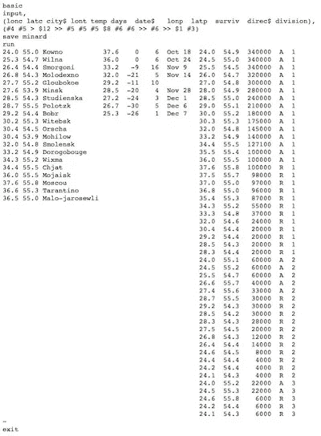
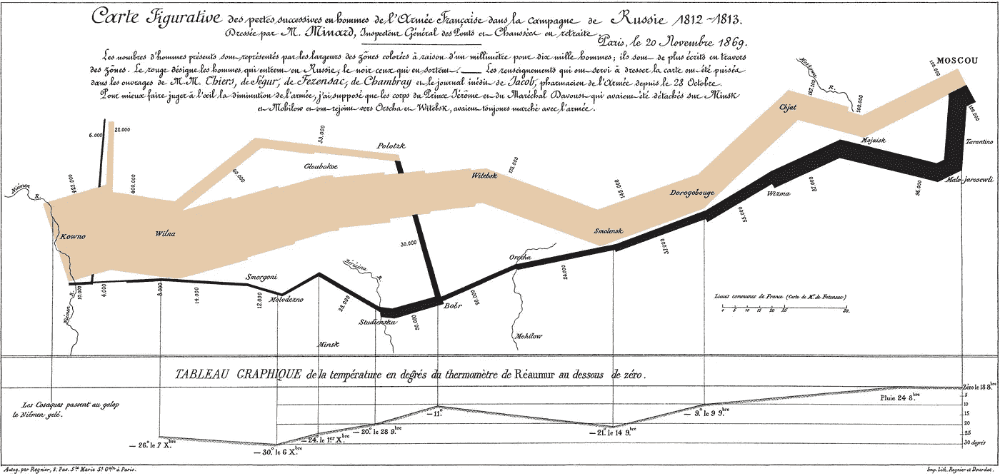
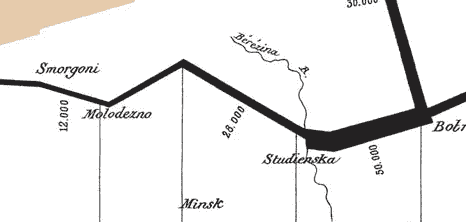
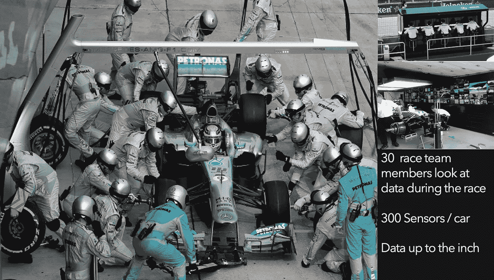

# 向高中生解释数据科学

> 原文：<https://towardsdatascience.com/data-science-is-hot-heres-why-it-s-cool-ddfdb8739a22?source=collection_archive---------10----------------------->

Data science is hot; here’s why it's cool.

*我试图让数据科学变得很酷(因为它很酷)*

自从我的孩子出生后，我就想在职业介绍日成为一个酷爸爸，在那里我的明智建议会改变一个人的一生。但我在高科技领域工作，即使对大多数成年人来说，科技也是可怕的，而不是酷的。但是当我的儿子杰克选修计算机科学时，我自愿谈论数据科学，让它听起来很酷。在我演讲的一周前，当我的演讲曲目不令人兴奋或激动时，恐慌袭来。幸运的是，我有一个知情者:我的儿子杰克。

## 高中生想知道什么？

我问杰克，他认为全班会想知道什么。他说，“我所有的朋友脑子里想的第一件事就是:你能赚多少钱？”

这不是我想要的鼓舞人心的介绍，但这是一个开始，杰克还有很多其他的基本问题。

几周后，在试管和周期表中，我从杰克的问题开始。"数据科学家的平均年薪是 11.3 万美元."

茫然的脸。

当我试图转移杰克的注意力时，他也有同样的表情。一年 11.3 万美元对他来说毫无意义。他的朋友谈到每小时 10 美元、13 美元和 16 美元。"知道每小时多少钱吗？"我问。一名学生猜测每小时 30 美元，因为这是她收入的两倍。

我透露:“11.3 万美元是 67 美元/小时。”

几个背挺直了。我引起了他们的注意。

## 为什么数据科学家很重要

“但真正重要的是数据科学为什么重要，你如何用数据科学改变世界，以及它为什么有趣，”我继续说道。

这个世界的祝福和诅咒是我们有大量的数据，但没有足够的洞察力，也没有足够多的人关心提取这种洞察力。这就是数据科学家所做的:他们从数据中提取意义。它们帮助我们了解世界，发现新事物。

> 数据科学家从数据中提取意义。它们帮助我们了解世界，发现新事物。

我举了一些简短的例子，比如[阿尔·戈尔利用数据科学来宣传全球变暖](https://en.wikipedia.org/wiki/An_Inconvenient_Truth)政策变化；《纽约时报》用数据科学来[解释边境墙是如何工作的](https://www.nytimes.com/interactive/2018/02/05/us/border-wall.html)；ESPN 利用数据科学展示爱国者队如何赢得另一场不可思议的超级碗比赛。

具体来说，我向全班展示了这张数字表，并问他们看到了什么。

他们的不回应正是我想要的。这个数据没有讲故事。我们需要一位数据科学家在这些无意义的数字中寻找意义。

我向全班展示了约瑟夫·密纳德是如何在 1869 年发现这些数字的意义的。他创造了许多人认为是有史以来最好的统计图表。在一张图中，他展示了六个维度的数据，并讲述了一个毁灭性的故事。

这些数字描述了拿破仑对俄罗斯的进军，包括时间、部队规模、部队位置和温度。

Charles Minard’s statistcial graphic of [Napoleon](https://en.wikipedia.org/wiki/Napoleon)’s disastrous [Russian campaign of 1812](https://en.wikipedia.org/wiki/French_invasion_of_Russia_(1812)).

黄褐色的锯齿状线条代表了拿破仑军队的规模和方向。从左路开始，拿破仑率领 422，000 人的军队于 1812 年进入俄罗斯。随着他们从左到右向东行进，褐色墨水逐渐减少。六个月后，军队到达莫斯科。

322，000 人死亡。然后他们转过身来。

在最右边，拿破仑开始撤退。返回的部队规模是黑色的。米纳德在底部添加了一个线形图来显示温度，从 0 度开始，下降到零下 30 度。

薄薄的黑色长条显示 422，000 人中只有 10，000 人幸存。

米纳德的图形是统计图形中的蒙娜丽莎——你逗留的时间越长，看到的就越多。例如，1813 年 9 月 28 日，黑线上的数据标签显示为 50，000，然后是 28，000。22000 人死于明斯克附近的别列兹纳河。

密纳德为什么要创作这个图形？这是对战争可能带来的破坏的警告。

## 现代数据科学的例子

我以数据科学在药物发现、机场情报安全、风能分析、算法交易、家庭物联网应用、社会分析中的现代例子来结束，以更好地理解人口统计和健康问题。

我的最后一个迎合策略是展示梅赛德斯方程式赛车团队如何使用分析来优化赛车配置、超车策略和实时比赛条件。

学生们被问到数据科学如何应用于地质学、法学和艺术。好问题。

我认为我的传教使命已经完成。

## 我的演讲也对我产生了影响

我的间谍杰克无意中听到几个孩子谈论科学家制造了多少数据。至少他们在说话！

额外收获是，解释为什么数据科学很重要让我重新认识到为什么数据科学很酷。通过教学，我重新给自己注入了能量。

*马克·帕尔默是 TIBCO 软件公司的 SVP 分析师。作为 StreamBase 的首席执行官，他被《时代》杂志评为将改变你生活的技术先锋之一。要连接，请访问* [*我的约。Me 页*](https://about.me/mark.palmer) *。*