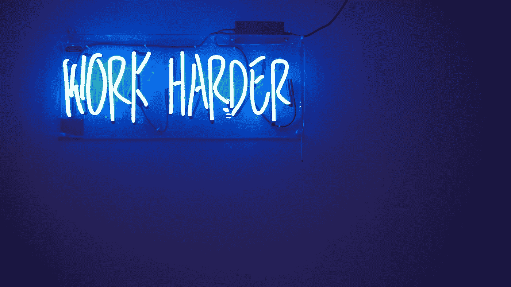

# 数据科学是实用的

> 原文：<https://towardsdatascience.com/data-science-is-practical-91965d1e6425?source=collection_archive---------37----------------------->

## 学习数据科学的最佳方式莫过于编码

数据科学中的“科学”可能会产生误导。毕竟，数据科学是一项非常实用的工作。为了真正得到它，你需要写很多代码。

Work harder, work smarter

所以你想成为更好的数据科学家？代码。收集数据库，可视化，分析，理解它。然后学习如何将这些知识应用到新的数据集。

作为一名数据科学家，很重要的一点就是要确保对尽可能多的数据进行分析，因为这些数据只是需要分析的更多数据。

您可以随时返回并尝试再次获得您的最佳结果集，但作为一名数据科学家，您真的希望在开始以更系统的方式查看数据之前获得尽可能多的数据。

# 开始构建 Github 组合

越早开始构建开源项目的 Github 组合越好。这样你不仅会学到很多东西，还会有更好的机会找到下一份理想的工作。它极大地提高了您作为数据科学家的知名度，并允许您记录您的数据科学之旅。

如果你有兴趣在数据科学领域工作，但不确定该选择哪家公司，试着从某个特定领域或类别的公司获取报价。让招聘人员相信你能胜任某项特定的工作要求，比让他们认为你是大众的数据科学家要容易得多。

实际上，最好的方法是研究特定领域的公司，例如通过 [Crunchbase](http://www.crunchbase.com) ，然后建立与该领域相关的数据科学项目组合。如果利基是你的爱好，这是一个双赢的局面。

# 什么是好的数据科学项目

如果你认为你能做到，或者你认为它很适合数据科学的思维模式，并且你有机会学习做这件事所需的技能和经验，那就去做吧！

数据科学项目都是关于学习的，你拥有的数据科学技能越好，你就越有可能建立一个成功的项目。

下面列出了创建数据科学项目时需要考虑的最重要的方面。

*   该项目需要有某种可衡量的结果。
*   这个项目应该是简单的。
*   客户应该很好地理解这个项目。
*   这个项目应该在客户的控制之下。
*   这个项目应该符合他们的最大利益。
*   项目应提供清晰、简明的信息和结果。

你应该用这些数据开始一个项目。这往往是第一步。从你知道什么，不知道什么，以及原因开始。

你应该有一个清晰的项目议程和时间表。

这个项目必须从你想做什么的清晰想法开始。如果没有，就没有明确的方向。

# 实验

数据科学就是实验。一个好的工具可以让你更好地理解你的数据是什么样的，但只有当你能从中获得洞察力时，它才是有用的。当查看数据集时，除了查看它是否有模式之外，您还需要做更多的事情。

要从数据集中获得洞察力，您需要知道要寻找什么。您可以识别哪些模式，以及如何将其转化为可操作的见解？

如果你已经想好了这些问题，那么你就可以开始获得能够带来商业成果的洞察力。你可以开始利用这些见解来提高你的工作质量和技能。

一旦你对你要寻找的东西有了一个坚实的理解，有三种方法可以让你从你的数据中获得洞察力。

最后，查看数据的最佳方式之一是创建自己的报告。做一个电子表格，记录你在一个项目中做的每一件事。这样你就能让一切井井有条，你会学到很多东西，并准备好处理更复杂的项目。

祝你好运！

Data Science Job

最后，如果你想了解成为一名数据科学家意味着什么，那么看看我的书[数据科学工作:如何成为一名数据科学家](https://amzn.to/3aQVTjs)，它将指导你完成这个过程。

如果你想了解更多关于数据科学的知识，我推荐以下几本书:

*   [成为数据科学家的 5 种方法](/5-ways-to-become-a-data-scientist-8590811b0dc3?source=your_stories_page---------------------------)
*   [给数据科学家的最佳建议](https://medium.com/@pchojecki/best-tips-for-data-scientists-a52d7cace027?source=your_stories_page---------------------------)
*   [如何从数据科学开始](https://medium.com/@pchojecki/how-to-start-with-data-science-93d3ca32d7e5?source=your_stories_page---------------------------)
*   [成为数据科学家的实用指南](/practical-guide-to-become-a-data-scientist-2483a5f83770?source=your_stories_page---------------------------)