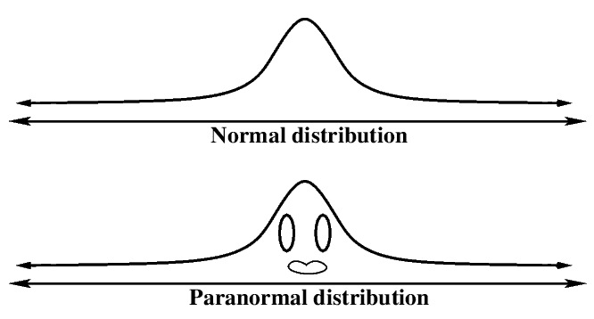

# 数据科学工作和他们的薪水

> 原文：<https://towardsdatascience.com/data-science-jobs-with-their-salaries-171acd3bf9be?source=collection_archive---------6----------------------->

## **顶级数据科学工作及其薪酬和工作职责**

**没关系！但是，你挣多少钱？**

数据科学工作是 IT 行业薪酬最高的工作。在过去的几年中，我们遇到了大量的数据科学角色，因此很难对它们是什么以及它们有何不同有一个基本的了解。即使这些角色的名称不同，也无济于事。

对数据科学家的需求相当大。对数据科学家的需求正处于顶峰，他们是美国薪酬最高的人群之一，平均基本工资为**13 万美元。麦肯锡的预测表明，在未来几年，数据科学专业人员的供需将出现 50%的缺口。你也可以 [**掌握数据科学**](https://data-flair.training/blogs/why-learn-data-science/) 从数据中理出头绪。**

# 数据科学中的各种工作角色:

有太多的数据科学角色可能难以理解。 [**每个工作角色所需的技能互不相同**](https://data-flair.training/blogs/top-data-science-skills/) 。数据科学领域使用数学。统计学和计算机科学学科，以及一个公共工具集，包括 Python、R、Tableau、SQL 等。如今对数据科学专业人员的需求很大，下面，我们将讨论数据科学领域提供的不同**职位**:

**1。数据科学家—** 数据科学家可能是当今世界该领域最热门的职位之一，也是最受欢迎的工作。他们负责处理原始数据，借助上述各种技术进行分析，并以有助于预测业务问题的方式提出见解。一个数据科学家使用 [**机器学习**](https://data-flair.training/blogs/machine-learning-for-data-science/) ，也根据过去的模式预测未来。

数据科学家的平均工资范围(美国)是 11.9 万美元。

Source:Google

**2。数据分析师—** 数据分析师是分析数据的人。但这一过程需要创建系统，帮助企业用户获得洞察力并确保数据质量。他的职责是收集、处理和执行统计数据分析。数据分析师从可用数据中找到有意义的信息，并使用 [**R 或 SAS**](https://data-flair.training/blogs/r-python-or-sas-for-data-science/) **。**不仅仅是 IT 行业，医疗保健、汽车、金融、零售和保险等行业的所有公司都需要数据分析师来运营业务。

数据分析师的平均年薪(美国)为 6.2 万美元。

Source:Google

**3。数据架构师—** 随着大数据的兴起，数据架构师的角色越来越重要。他的职责是创建数据管理系统，以整合、保护和维护数据源和公司信息。他负责数据库架构、数据的设计、创建和优化。他非常依赖 Microsoft Excel 进行属性映射和设计表格。Pig、Spark、SQL、XML、Hive 等技术都需要数据架构师掌握。

该职业的平均年薪(美国)为**10 万美元。**

Source:Google

**4。数据工程师—** 他们不是分析数据的人，而是为其他专业人员构建某种软件基础设施来完成这项工作。他们之所以能够做到这一点，是因为他们对 Hadoop 和 [**大数据技术**](https://data-flair.training/blogs/what-is-big-data/) 有着深入的了解，如 MapReduce、Hive 和 Pig、NoSQL 技术、SQL 技术。他的职责是开发、测试和维护大规模处理系统。超过 50%的工作是数据争论，其中数据工程师胜过有软件工程背景的人。

这份工作的平均工资是 95000 美元。

Source:Google

**5。统计员—** 统计员的角色是了解影响企业发展的不断变化的市场趋势。这项工作是收集数据并将其转化为有用的信息。他们的技能使他们能够处理各种数据，无论是结构化的还是非结构化的。他们常用的工具和技术包括 SAS、SPSS、Matlab、Python、Scala、SQL、R 等。他们有很强的统计学背景，包括描述性和推理性的主题。

统计人员的平均工资(美国)是 7.5 万美元。

Source:Google

**6。数据库管理员—** 他们是受过培训的专业人员，负责存储和组织公司的数据。所有与数据保护、监控、维护和安全相关的活动都由数据库管理员执行和指导。这有助于让用户(包括员工)在任何时候都可以使用数据库。用于此目的的各种工具有 MySQL Workbench、Toad、Adminer、DatabaseSpy 等。

这个职位的典型平均工资(美国)是**68，000 美元。**

Source:Google

**7。业务分析师—** 业务分析师的角色类似于数据分析师。然而，业务分析师拥有业务领域的专业知识。他们用自己的技能指导企业改进产品和服务。他们收集和分析基本的业务需求和要求，并负责带来和管理业务的变化。业务分析师使用的工具有 Microsoft Office，包括 PowerPoint、Excel、Word 和 Visio、Google Docs、Sheets 和 Slides、SmartDraw、Balsamiq 等。

这份数据科学工作的平均工资(美国)为**65，000 美元。**

Source:Google

**8。数据&分析经理—** 数据&分析经理负责开发有效的数据分析、解释和报告流程。他们为数据分析师团队提供指导，还负责做出招聘决策。他们需要在数据科学领域拥有 7-10 年的经验。他们可以根据市场趋势向组织领导提出改变的建议。他们必须精通计算机编程语言、数据库系统、 [**大数据工具**](https://data-flair.training/blogs/big-data-tutorials-home/) ，以及机器学习。

这个职业的平均工资(美国)为 11.6 万美元。

Source:Google

# 结束语:

在寻找你梦想的数据科学工作时，要考虑到角色的不同，这就是为什么你需要确保你详细了解每个角色，然后选择你认为适合你和你的技能的角色。如果一个人选择在数据科学**领域从事他的 [**职业，他知道他会享受这份高薪且有需求的工作。随着数据渗透到我们的生活中，公司试图理解产生的数据，职业机会预计将长期增长。**](https://data-flair.training/blogs/data-science-tutorials-home/)**