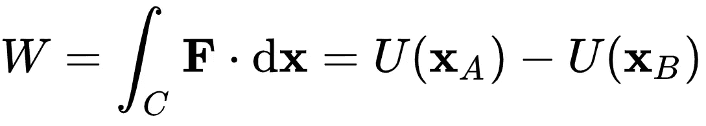

# 数据科学狂人

> 原文：<https://towardsdatascience.com/data-science-lunacy-cee7f063fa6a?source=collection_archive---------41----------------------->

作者注:我通常不会用第一人称写作，但是考虑到这种咆哮，这似乎很恰当。这些观点完全是我自己的，应该被认为是非常可疑的。

Howling at the moon.

# 逐渐减弱的信任

我很难认真对待 LinkedIn。如果你的反馈和我的一样，一半是[明目张胆的自我推销](https://smallbusiness.chron.com/use-linkedin-selfpromotion-50881.html)，另一半是[通过保险杠贴纸式的口号进行的赤裸裸的自我推销](https://www.businessinsider.com/how-linkedin-became-the-ad-industrys-favorite-tool-for-self-promotion-2017-6)。

我认为这本身没有什么奇怪的，这肯定与我在其他社交媒体上看到的行为一致。虽然这不是我寻找灵感时经常去的平台，但看到关于毅力和成就的小广告，或者加强我的泡沫的观察也是不错的。我不想看到一个冷漠和不公平的世界的冷酷和赤裸裸的真相。

是的，随机人力资源专家:我绝对同意——即使数据不支持[——人们辞职的是老板，而不是工作。谢谢你重申了我的世界观。](https://www.gallup.com/workplace/231641/talent-walks-why-best-employees-leaving.aspx)

但是，有一条鼓舞人心的消息([来源可疑](https://www.npr.org/sections/goatsandsoda/2016/07/30/487925796/it-takes-a-village-to-determine-the-origins-of-an-african-proverb))让我感到无止境的惊愕；对应该是不言自明的事情的本能反应:

> 如果你想走得快，就一个人走。想走远，就一起走。

我无法解释为什么这点缺乏营养的智慧如此难以理解。谁不想建立同志关系，有效地合作，并冒险达到新的高度？如果我回避这些无害的理想，我会是什么样的厌世者呢？在我中彩票之前，工作不是可有可无的，我最感兴趣的是不要在地下室找我的红色订书机。所以，我没有告诉人们去踩沙子，而是违背了我的本性，和别人玩得很好。

幸运的是，我棘手的认知失调问题已经解决了。原来， [**你想去的地方**](https://www.nature.com/articles/s41586-019-0941-9) 是比速度和/或距离更重要的考虑因素。听起来很疯狂？数学是这样的:

Talk nerdy to me.

做的功与走的路无关，所以在漫无目的的徘徊之前，我们或许应该决定去哪里。如果你想要一个[不寻常的解决方案](https://medium.com/@djtachyon/the-tragedy-of-the-uncommons-25cbe30cdb9b)，一个大团队不是最好的选择。

*那为什么我感觉更糟呢？*

# 日益增长的怀疑

撇开自我膨胀不谈，我最大的问题不是团队合作，而是我有多愿意接受这些信息是真的。协作符合时代精神——我为什么要质疑它？我的团队合作苦难可能无法与选举舞弊运动相提并论，但我会识破那些谎言吗？

我们根本没有足够的时间来仔细检查给我们的数据点。而且，即使有无限的时间，我怀疑我能否复制谷歌/脸书/LinkedIn 的黑盒算法[来决定呈现什么信息。没有人不受暗示的影响。我怎么能相信这些呢？我](https://www.theregister.co.uk/2017/12/02/blackbox_code_us_house_committee/)[多久才能走完所有满洲人](https://itsalwayssunny.fandom.com/wiki/Charlie_Goes_America_All_Over_Everybody%27s_Ass)的候选人？

前面提到的地下室看起来越来越诱人了。但是，在我对锡纸帽子感到太舒服之前，有两个相互交织的解决方案可以帮助结束这种疯狂:*告诉我我需要知道的*和*告诉我我不想听到的*。

Shield your eyes.

# 完全公开

数据可能是危险的。可以[误用](https://www.jstor.org/stable/10.5325/jinfopoli.8.2018.0078#metadata_info_tab_contents)和[武器化](https://www.theatlantic.com/magazine/archive/2018/10/yuval-noah-harari-technology-tyranny/568330/)。我无法在任何时候都冷静地评价这一切。但是我知道谁可以——这是他们工作职责的一部分。

就像我们对医学宣誓，对工程宣誓，对光明会宣誓一样，我们也需要对数据科学宣誓[。在这个誓言中，数据科学家不会](/we-must-prevent-data-pseudoscience-before-its-too-late-86b1fc50c970)[故意制造混乱](https://projecteuclid.org/euclid.ss/1124891288)，[歪曲事实](/how-to-lie-with-data-science-5090f3891d9c)，并且[实施合理的隐私控制](http://fortune.com/2019/02/14/hacked-myfitnesspal-data-sale-dark-web-one-year-breach/)。

如果有人在推进一个议程，没关系，只要告诉我。如果价值主张是好的，那就没有什么好的理由来欺骗我同意你的观点。但是，试图蒙蔽我们的集体眼睛在伦理上是模棱两可的，你的产品可能很糟糕——毫无疑问。

# 新来源

他的这个对我来说有点棘手，因为它看起来自相矛盾，但我需要你告诉我我不想听到的。就像其他人一样，[我被自己认同的消息来源包围着，这很危险。福克斯新闻频道可能会打破一个故事，但我永远不会知道，因为我极力避免它。这和我年长的亲戚憎恨 MSNBC 有什么不同吗？是的，但还不够。](https://www.theatlantic.com/politics/archive/2019/03/us-counties-vary-their-degree-partisan-prejudice/583072/)

我们不应该害怕消化与我们的世界观不平行的数据。如果我不喜欢事实所说的，问题就不是事实。如果我的观点经不起严格的质疑，它们可能需要被改变。

这个过程不一定是敌对的——谁知道我错过了什么精彩的节目，因为网飞认为我只看(奥威尔式)科幻小说？让我们给信号添加一些噪声，看看我的观看习惯是否改变，我是否达到了沙发土豆涅槃的更高状态。

# 重叠容量

我愿意承认，现在我确实知道了很多事情。我的无知很大一部分是因为懒惰，但更大一部分是因为缺乏能力；我们的世界非常复杂，而且每一分钟都在变得更加复杂。当我们做出自己的决定时，我们被迫依赖他人的决定，但是知道我们经常被欺骗是令人不安的。

我也许可以仔细检查一下 5 个牙医中的 4 个是否真的更喜欢 T2、T3、T4 和 T5，但是我不会打电话给 668 名密歇根居民，看看他们是否真的更喜欢基德洛克作为他们的参议员。我想选民们已经做出了更奇怪的选择，所以我可以理解为什么这是可信的，尽管这是错误的。

再加上数字回声室，它似乎放大了耸人听闻的东西，却懒得检查真实性。在 FactCheck 或 Snopes 的好人们有机会纠正记录之前，假新闻——真实的和一大早就在推特上发布的假新闻——已经在全球跑了好几圈。到那时，我可能已经形成了一个观点，并开始了一场争论，所以我现在不会退缩，否则我会看起来比平时更愚蠢。

我们为什么要容忍这些江湖骗子和蛇油贩子？答案是因为我们不得不这样做，至少目前是这样，因为即使是事实审查员也不堪重负。虽然我欣赏这种自上而下的方法，但我们真正需要的是一种自下而上的模式:一种数据科学家和统计学家集体聚在一起——带着他们的可乐瓶眼镜和口袋保护器——并宣布他们不会将他们的技能用于邪恶。

愤怒吧，愤怒吧，对抗死亡之光，你们这些书呆子，因为 [**我需要你们的帮助**](http://chng.it/nXHmQbqQYf) 。我们没有理由满足于一个真相如此难以辨别的世界。

> 不要相信你在网上看到的一切。
> 
> —亚伯拉罕·林肯