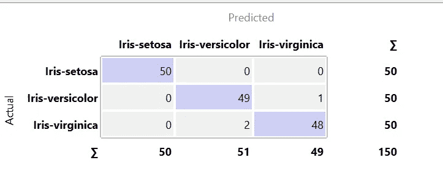

# 数据科学变得简单:使用 Orange 进行数据建模和预测

> 原文：<https://towardsdatascience.com/data-science-made-easy-data-modeling-and-prediction-using-orange-f451f17061fa?source=collection_archive---------9----------------------->

## 尝试不同的学习算法并根据训练好的模型进行预测从未如此简单！

Image taken from the official [Orange website](https://orange.biolab.si)

您现在正在阅读数据科学变得简单系列的第四部分。本文是关于根据我们使用训练数据训练的模型对测试数据执行预测。大多数时候，数据建模和预测部分是最有趣的，因为它需要您思考和调整底层参数来改善结果。在我们开始之前，请确保您已经安装了 Orange。请阅读[第一部分](/data-science-made-easy-interactive-data-visualization-using-orange-de8d5f6b7f2b)进行设置和安装，如果您错过了，底部会有链接供您浏览整个 Data Science Made Easy 系列。首先，我将向你解释如何使用**预测**小工具。然后，我将介绍一些可用于数据建模的最常见的模型。

# 预言

**预测**小部件接受两个输入。一个是数据集，通常来自测试数据，而第二个是“**预测器**”。"**预测器**"指任何**模型**小部件的输出。您可以连接任意数量的**模型**小部件和**预测**小部件。整个数据建模和预测过程只需要几天时间。

## 分离训练和测试文件

第一种是通过两个不同的**文件**小部件，它们保存了训练集和测试集的数据。

Image by Author

1.  向画布添加两个**文件**小部件。装载列车组并测试。根据您分别加载的数据重命名这两个小部件。
2.  将任何**型号**小部件添加到画布上。在本例中，我添加了一个树小部件。这个 widget 其实指的是“**决策树**”。将训练**文件**小部件连接到模型小部件。
3.  添加**预测**微件，并将**树**微件连接到其上。之后，如上图所示，连接**测试**小部件。
4.  双击**预测**控件打开界面。

Image by Author

您应该会看到类似于上图的内容。在第 71 行，我们可以注意到模型预测它是 Iris-virgica，但是实际的类是 Iris-versicolor。您还可以看到每个预测的置信度。

Image by Author

如上图所示，您可以测试其他模型并在其上添加。请记住将模型与正确的数据集连接起来作为训练数据。

Image by Author

您会注意到预测小部件的输出有一个大问题。它只显示基于一行数据的结果。如果你想得到整体的结果或者从中得到一些启示。您将需要使用一些评估小部件。我们在上一篇文章中已经谈到了这一点。请检查一下，然后再继续。我们将只试用其中一个小部件。

1.  向画布添加一个**混淆矩阵**小部件。
2.  将**预测**部件与**混淆矩阵**部件连接。
3.  双击**混淆矩阵**小部件打开界面。

Image by Author

您应该会获得类似于上图所示的结果。你可以用其他型号测试一下，看看它们的性能。

## 使用数据采样器

或者，如果您没有用于测试的专用数据集，我们可以依靠**数据采样器**小部件将数据分为训练集和测试集。正如我在上一篇文章中提到的， **Data Sampler** widget 与 sklearn 的 train_test_split 功能相似。

Image by Author

1.  向画布添加一个**文件**小部件，并加载您的数据集。
2.  将**数据采样器**小部件添加到画布，并将**文件**小部件连接到画布。
3.  添加一个**树**小部件，并连接**数据采样器**小部件。
4.  添加一个**预测**小部件，并将**数据采样器**小部件连接到它。
5.  双击**数据采样器**控件和**预测**控件之间的链接，打开界面。将链接从**剩余数据**修改为**数据**。如果你不确定该怎么做。查看下面的 gif。
6.  可选地，您可以添加**混淆矩阵**小部件以从结果中获得更多信息。

Gif by Author

## 预测与测试和分数

不要混淆**预测**小部件和**测试&得分**小部件，因为它们执行不同的任务。

*   **测试&得分**小部件用于评估基于训练数据集的模型。它将根据定义的折叠数执行交叉验证。如果将折叠数设置为 10，它会将数据集分成 10 个部分，并使用数据集的 9/10 作为训练集运行 10 轮评估，而剩余的 1/10 作为训练集。每轮将使用不同的部分作为训练集和测试集。
*   **预测**小部件用于根据训练好的模型预测测试数据。它不执行任何类型的交叉验证。使用训练集训练模型，并将模型连接到预测小部件以测试测试集。与测试&分数相比，结果会有所不同。

# 模型

我将粗略地解释一些可用的模型和可以为每个模型修改的参数。这是为了让初学者更好地理解。对于高级读者，你可以从官方的[文档](https://orange.biolab.si/docs/)中找到大部分信息。

## 树

**树** widget 是指带有正向剪枝的决策树学习算法。它可用于离散和连续数据集。该界面具有以下参数:

Image by Author

*   **归纳二叉树**:构建二叉树(拆分成两个子节点)
*   **最小。leaves 中的实例数量**:如果选中，算法将永远不会构造一个分割，将少于指定数量的训练实例放入任何分支。
*   **不分割小于**的子集:禁止算法分割小于给定实例数的节点。
*   **限制最大树深**:将分类树的深度限制在指定的节点层数。

Image by Author

您可以将它与上图所示的 **Tree** Viewer 小部件连接，以获得更多关于树的外观的信息。

Image by Author

您应该能够获得如上图所示的类似结果。

## 随机森林

随机森林是一种构建一组决策树的集成学习方法。它可用于多种任务，如分类和回归。该界面具有以下参数:

Image by Author

*   **树的数量**:类似于决策树的工作方式，确定森林中将包含多少棵决策树
*   **每次分割考虑的属性数量**:决定在每个节点任意抽取多少属性进行考虑
*   **随机生成器**的固定种子:确定使结果可复制的种子

## 线性回归

**线性回归**微件试图根据提供的数据点找到最佳拟合线。它可以学习和识别预测变量 x 和响应变量 y 之间的关系。请注意，**线性回归**小工具只能用于回归任务。您可以设置正则化的类型及其各自的强度。

Image by Author

正则化的概念不在本教程的范围之内。请随意从其他来源查看。基于官方文档，Lasso 回归使用 L1 范数罚函数最小化最小二乘损失函数的惩罚版本，而岭正则化使用 L2 范数罚函数最小化它。

## 逻辑回归

**逻辑回归**小工具的工作方式与**线性回归**小工具略有不同。尽管它有回归这个词，但它只适用于分类任务。

Image by Author

这些参数几乎类似于线性回归，因为您可以在山脊正则化或套索正则化之间进行选择。此外，您还可以修改强度，默认值为 C=1。

# 结论

这次我们学习了如何使用**预测**小部件来基于训练集和测试集进行预测。或者，我们可以使用一个**数据采样器**小部件将数据集一分为二。我们还粗略解释了**预测**小部件和**测试&得分**小部件之间的区别。然后，我们继续讨论一些常用的数据建模学习算法。我们从**树**小部件开始，它可以连接到**树查看器**小部件来显示决策树。然后，我们继续讨论**随机森林**小部件及其各自的参数。最后，我们探索了线性回归窗口小部件和逻辑回归窗口小部件。**线性回归**控件只能用于回归任务，而**逻辑回归**控件用于分类任务。感谢阅读**数据科学变得简单**教程的第 4 部分。在下一部分，我将介绍使用 Orange 的图像分析。❤️

# 数据科学变得简单

1.  [交互式数据可视化](/data-science-made-easy-interactive-data-visualization-using-orange-de8d5f6b7f2b)
2.  [数据处理](/data-science-made-easy-data-processing-using-orange-cb00476a7861)
3.  [测试和评估](/data-science-made-easy-test-and-evaluation-using-orange-d74e554d9021)
4.  [数据建模和预测](/data-science-made-easy-data-modeling-and-prediction-using-orange-f451f17061fa)
5.  [图像分析](/data-science-made-easy-image-analytics-using-orange-ad4af375ca7a)

# 参考

1.  [https://orange.biolab.si/](https://orange.biolab.si/)
2.  [https://github.com/biolab/orange3](https://github.com/biolab/orange3)
3.  https://orange.biolab.si/docs/
4.  [https://data science . stack exchange . com/questions/20572/why-orange-predictions-and-test-score-produce-different-results-on-the-Sam/21672](https://datascience.stackexchange.com/questions/20572/why-orange-predictions-and-test-score-produce-different-results-on-the-sam/21672)