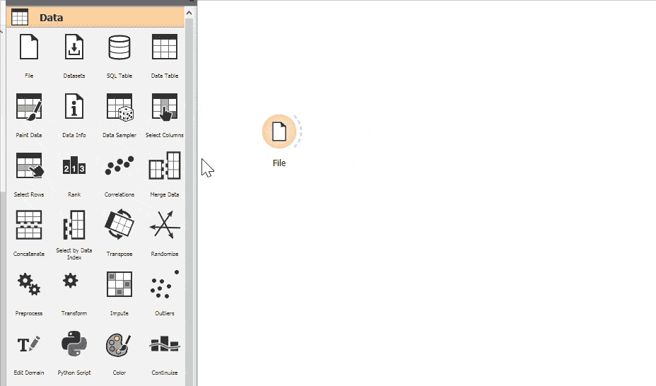

# 数据科学变得简单:使用 Orange 进行数据处理

> 原文：<https://towardsdatascience.com/data-science-made-easy-data-processing-using-orange-cb00476a7861?source=collection_archive---------13----------------------->

## 利用开源工具以正确的方式处理数据集，而无需接触任何代码！

Image taken from the official [Orange website](https://orange.biolab.si)

这是 Data Science Made Easy 系列的第二部分，您将了解处理数据集的必要步骤。数据处理是数据科学家最基本的任务之一，因为你会意识到我们花了大部分时间清理和调整数据集。在我们开始之前，请确保您已经安装了 Orange。请阅读[第一部分](/data-science-made-easy-interactive-data-visualization-using-orange-de8d5f6b7f2b)进行设置和安装，如果您错过了，底部会有链接供您浏览整个 Data Science Made Easy 系列。让我们从简单的列和行过滤开始。

## 选择列

假设您已经成功地从数据集中识别出一些重要的要素，并且想要创建一个仅包含这些要素的新数据集。您可以使用**选择列**小部件轻松做到这一点。假设您已经通过浏览自定义文档将虹膜数据集加载到**文件**小部件中。

Gif by Author

1.  将一个**选择列**小部件拖到画布上。
2.  连接**文件**小部件和**选择列**小部件。
3.  双击**选择列**小部件打开界面。

Gif by Author

打开**选择列**界面后，可以左右移动变量。左侧表示不需要的要素，而右侧表示选定的要素。一旦下定决心，关闭界面，双击**数据表**小部件。您应该能够看到您选择的功能。

## 选择行

除了能够选择特性之外，您还可以将数据过滤成您想要的东西。让我们在**选择行**小部件上探索更多。

Gif by Author

1.  将一个**选择行**小部件拖到画布上。
2.  连接**文件**小部件和**选择行**小部件。
3.  双击**选择行**控件打开界面。

Gif by Author

您可以使用**选择行**界面设置您的条件以过滤出所需的数据。假设您正在使用 Iris 数据集，我们可以过滤出特定类别的数据。同样，我们可以过滤掉不属于特定类的数据。此外，我们还可以为萼片长度必须大于某个数字等特征设置条件。您可以添加任意多个条件。双击**数据表**小部件，应该可以看到过滤后的数据。

## 特征构造器

有时需要从现有特征创建新特征。例如，您可以使用人的身高和体重要素创建身体质量指数要素。这通常被称为特征工程。Orange 附带了一个名为**特征构造器**的内置小部件，允许我们使用现有特征创建一个新特征。如果你有好的记忆力，你会记得我说过“数据处理不涉及任何代码”。嗯，你猜对了。我骗了你！😈特征工程需要一些 Python 的基本编码知识。不用担心，因为我在这里指导你。

Image by Author

1.  右键单击画布以显示小部件选项。搜索**特征构造器**小部件，并将其添加到画布中。
2.  添加一个**数据表**小部件。
3.  如上图所示，将它们全部连接起来。
4.  双击它打开界面

Image by Author

1.  点击“**新**按钮，您将看到一个下拉列表，显示数字、分类和文本。
2.  选择 Numerical，将创建一个新项目(很可能命名为 X1)。
3.  将名称更改为 sepal_length_square(根据您的偏好进行相应修改，因为这是您的新功能的名称)。
4.  关注右边的文本框。这是你需要输入一些代码的部分。点击“**选择特征**”按钮，您将看到数据集中的所有特征。选择 sepal length，您将看到“sepal_length”被添加到文本框中。您可以自己输入，但要记住在功能名称的每个空格处添加一个下划线。
5.  “**选择函数**”提供了一个数学函数列表，如果您不熟悉脚本，可以使用它。你应该不会有问题，因为提供的函数类似于任何 Excel 电子表格中的函数。键入** 2，你应该有 sepal_length ** 2，就像上面的图片一样。
6.  使用上述步骤添加一个新的分类项目。分类用于标注特征。例如，你可以根据萼片长度将鸢尾分为小、中、大三类。该代码基于以下内容:“if(*值*)(*特征名* ) < ( *值*)，else ( *值* ) if ( *特征名* ) < ( *值*)，else ( *值*)”
7.  将名称改为 small_iris 并键入下面的" 0 if sepal_length < 5 else 1 if sepal_length < 6 else 2”
8.  At the values text box, type in “S, M, L”. This represents the label of the label based on the conditions at step 7\. 0 will map to S, 1 will map to M and 2 will map to L.

You should be able to see the following output once you closed the **特征构造器**接口并打开数据表接口

Image by Author

基于官方文档，这里有一些对 Python 新手的快速提示:

*   +，-相加、相减
*   *相乘
*   /来划分
*   %相除并返回余数
*   **代表指数(代表平方根乘以 0.5)
*   //用于楼层划分
*   、<=, > =小于、大于、小于或等于、大于或等于
*   ==表示相等
*   ！=不等于

## 数据采样器

数据采样器小部件是数据科学家最重要的小部件之一。将数据集划分为训练集和测试集是最基本的任务之一。还记得 sklearn 提供的 train_test_split 函数吗？这个小部件的功能与 train_test_split 的功能相同。让我们在画布上测试一下。

Gif by Author

1.  将一个**文件**小部件拖到画布中。
2.  将一个**数据采样器**小部件拖到画布上。
3.  将**文件**微件与**数据采样器**微件连接。
4.  将两个**数据表**小部件拖到画布中。第一个小部件用于训练数据，第二个小部件用于测试数据。
5.  如上图所示，将**数据采样器**微件与**数据表**微件连接。
6.  双击**数据采样器**微件和第二个**数据表**微件之间的链接，打开编辑链接界面。
7.  将**剩余数据**连接到**数据**上，双击**数据样本**和**数据**之间的链接。这允许第二个**数据表**根据**数据采样器**中的设置接收剩余数据。
8.  双击**数据采样器**打开界面。

Image by Author

根据官方文件，

*   **数据的固定比例:**返回整个数据的选定百分比(例如，所有数据的 70%)。在这种情况下，70%到**的数据样本**和 30%到**的剩余数据**。
*   **固定样本大小:**返回选定数量的数据实例，有机会设置*样本替换*，它总是从整个数据集中采样(不减去子集中已经存在的实例)。通过替换，您可以生成比输入数据集中可用实例更多的实例。
*   **交叉验证:**将数据实例划分为互补的子集，在这里您可以选择折叠(子集)的数量以及您想要使用哪个折叠作为样本。
*   **Bootstrap:** 从总体统计推断样本。

## 保存数据

到目前为止进行的所有数据处理都只适用于 Orange。这些更改不会反映在原始数据集中。如果您想保存处理过的数据，您应该使用**保存数据**小部件。

Image by Author

您可以将其放置在**数据表**之后，如上图所示独立保存列车数据。

Image by Author

同样，您可以在任何**可视化**小部件中选择一些数据，并仅保存所选数据。

Image by Author

您可以确定文件类型并检查是否使用压缩。有两种保存方式:

*   **保存**:覆盖现有文件
*   **另存为**:新建一个文件

# 结论

就这样，伙计们！您已经学习了如何使用**选择列**小部件和**选择行**小部件过滤数据集。此外，您可以利用您的 Python 编程技能，通过**特性构造器**小部件进行特性工程。您也可以通过图形用户界面这样做。接下来，**数据采样器**小部件允许我们将数据分成训练集和测试集。完成数据处理后，您可以使用**保存数据**小部件将其保存到文件中。还有很多小部件可以用来处理数据。请随意查看官方文件。感谢阅读**数据科学变得简单**教程的第 2 部分。在下一部分，我将使用 Orange 进行测试和评估。❤️

# 数据科学变得简单

1.  [交互式数据可视化](/data-science-made-easy-interactive-data-visualization-using-orange-de8d5f6b7f2b)
2.  [数据处理](/data-science-made-easy-data-processing-using-orange-cb00476a7861)
3.  [测试和评估](/data-science-made-easy-test-and-evaluation-using-orange-d74e554d9021)
4.  [数据建模和预测](/data-science-made-easy-data-modeling-and-prediction-using-orange-f451f17061fa)
5.  [图像分析](/data-science-made-easy-image-analytics-using-orange-ad4af375ca7a)

# 参考

1.  [https://orange.biolab.si/](https://orange.biolab.si/)
2.  [https://github.com/biolab/orange3](https://github.com/biolab/orange3)
3.  [https://orange.biolab.si/docs/](https://orange.biolab.si/docs/)