# 数据科学变得简单:使用 Orange 进行图像分析

> 原文：<https://towardsdatascience.com/data-science-made-easy-image-analytics-using-orange-ad4af375ca7a?source=collection_archive---------12----------------------->

## 使用开源机器学习工具简化您的图像分析任务，无需编写任何代码！

Image taken from the official [Orange website](https://orange.biolab.si)

您已经进入了数据科学简化系列的第五部分。在这篇文章中，我将教你一些使用 Orange 进行图像分析的基本步骤。供您参考，除了正常的分类和回归任务之外，Orange 还可用于图像分析任务。到目前为止，您应该已经熟悉了 Orange 的用户界面。在我们开始之前，请确保您已经安装了 Orange。请阅读[第一部分](/data-science-made-easy-interactive-data-visualization-using-orange-de8d5f6b7f2b)进行设置和安装，如果您错过了，底部会有链接供您浏览整个 Data Science Made Easy 系列。我们开始吧！

# 安装图像分析插件

Orange 附带了很多非常有用的附件。在本文中，我们将只关注其中一个叫做**的图像分析**。

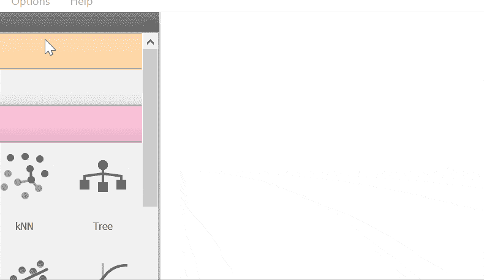

Gif by Author

1.  单击选项菜单，将出现一个下拉列表。
2.  选择附加组件并点击按钮打开附加组件界面。

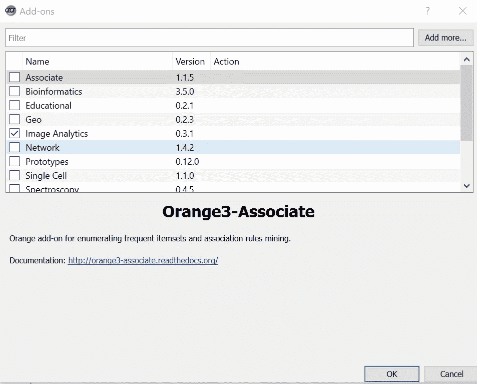

Image by Author

勾选**图像分析**，点击右下角的“确定”按钮。等待安装完成，您就可以开始工作了。你可能需要重新启动 Orange 才能工作。您应该能够看到如下图所示的图像分析小部件。

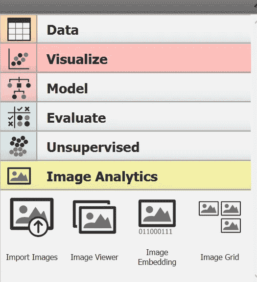

Image by Author

# 小工具

## 导入图像

首先要做的是通过**导入图像**小部件导入图像。您可以将这个小部件视为图像的**文件**小部件。然而，**导入图像**小部件接受目录而不是文件。

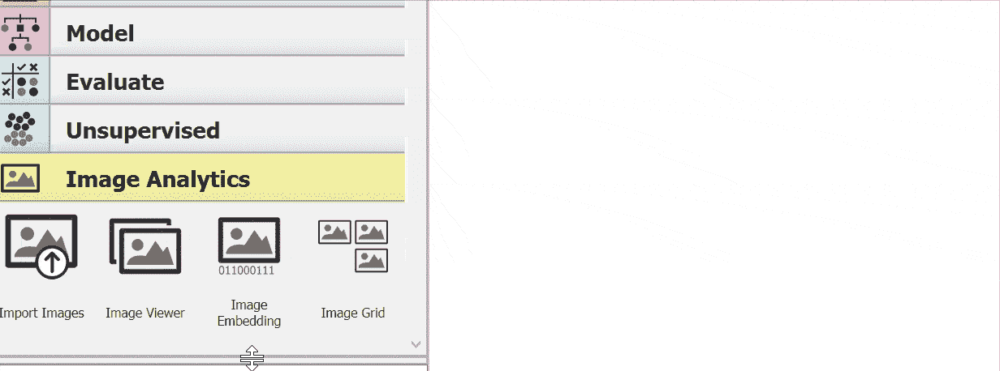

Gif by Author

1.  将**导入图像**小部件添加到画布。
2.  双击它打开界面。

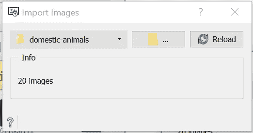

Image by Author

下拉列表显示过去的目录，而中间的按钮是打开任何新的目录。如果您在目录中添加或删除了任何图像，您可以使用“重新加载”按钮来刷新内容。还有一个显示目录中图像数量的信息文本。对于本教程，我将使用 Orange 的官方博客帖子提供的一些样本图像。你可以从下面的[链接](https://github.com/ajdapretnar/datasets/blob/master/images/domestic-animals.zip)中获取数据集。它应该包含 19 个家养动物的图像。提取它，你应该有一个*家畜*文件夹。

## 图像浏览器

接下来，我们将依靠**图像查看器**小部件来检查目录的内容。这个小部件将显示所有加载的图像。这很有用，因为整个工作流程可以通过 Orange 完成，而不需要打开浏览器。让我们继续上一节课。

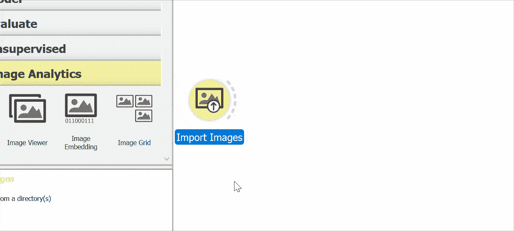

Gif by Author

1.  向画布添加一个**图像查看器**小部件。
2.  将**导入图像**小工具与图像查看器小工具连接。
3.  双击**图像查看器**小工具打开界面。

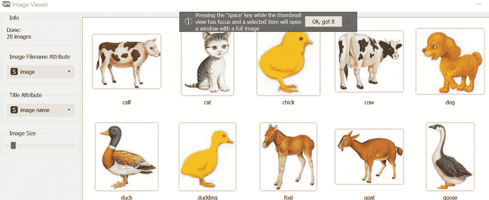

Image by Author

您应该会看到如上图所示的界面。

## 图像嵌入

这个小部件对于整个**图像分析**包来说是最重要的，因为这是魔法发生的地方。供您参考，分类和回归任务需要数字形式的数据，除非我们以数字形式表示，否则没有一种好的方法来使用图像执行此类任务。这就是**图像嵌入**小部件的工作原理，它将图像嵌入转换成一个数字向量。**图像嵌入**小工具读取图像并上传到远程服务器或在本地进行评估。

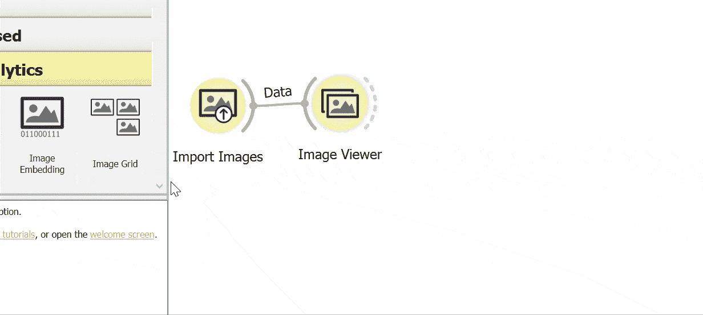

Gif by Author

1.  向画布添加一个嵌入小部件的**图像。**
2.  将**导入图像**控件与**图像嵌入**控件连接。
3.  双击**图像嵌入**控件打开界面。

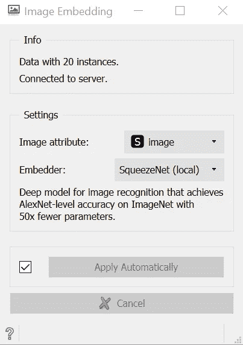

Image by Author

**图像嵌入**界面最重要的参数是嵌入器。你可以使用很多嵌入器。除了 SqueezeNet，大多数都需要互联网连接来进行转换。根据官方文档，列表如下:

*   **SqueezeNet** : [在 ImageNet 上训练的用于图像识别的小型快速](https://arxiv.org/abs/1602.07360)模型。
*   **Inception v3** : [谷歌在 ImageNet 上训练的 Inception v3](https://arxiv.org/abs/1512.00567) 模型。
*   **VGG-16** : [在 ImageNet 上训练的 16 层图像识别模型](https://arxiv.org/abs/1409.1556)。
*   **VGG-19** : [在 ImageNet 上训练的 19 层图像识别模型](https://arxiv.org/abs/1409.1556)。
*   **画家**:一个被训练成[从艺术品图像中预测画家的模型](http://blog.kaggle.com/2016/11/17/painter-by-numbers-competition-1st-place-winners-interview-nejc-ilenic/)。
*   **DeepLoc** :一个被训练分析[酵母细胞图像](https://www.ncbi.nlm.nih.gov/pubmed/29036616)的模型。

最安全的选择是选择挤压网，如果你没有任何互联网连接。您可以随意使用它，因为每个嵌入器都会产生不同的输出。请注意，官方文档声明发送到服务器的图像不会存储在任何地方。

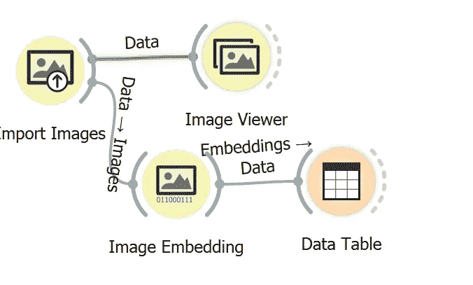

Image by Author

你可以用一个**数据表**小部件连接它来查看输出。您应该获得类似下图的内容。

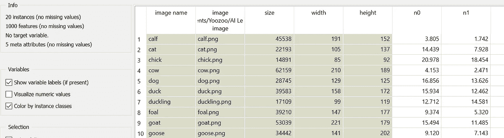

Image by Author

## 距离和层次聚类

您可以通过将来自**图像嵌入**小部件的输出传递到**距离**小部件和**层次聚类**小部件来进一步分析它。您将能够看到一个树形图，这是一个树形图，常用于说明由层次聚类产生的聚类的排列。

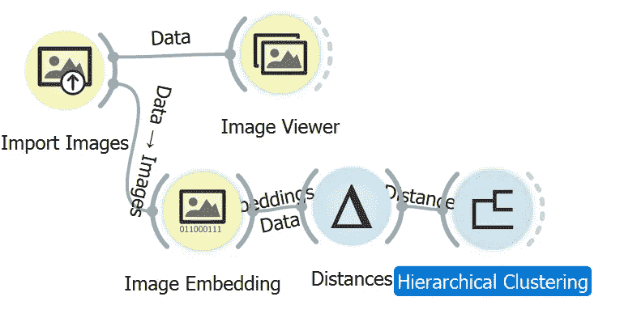

Image by Author

1.  向画布添加一个**距离**小部件。
2.  将**图像嵌入**控件与**距离**控件连接。
3.  向画布添加一个**分层聚类**小部件。
4.  将**距离**控件与**层次聚类**连接。
5.  双击**层次聚类**控件打开界面。

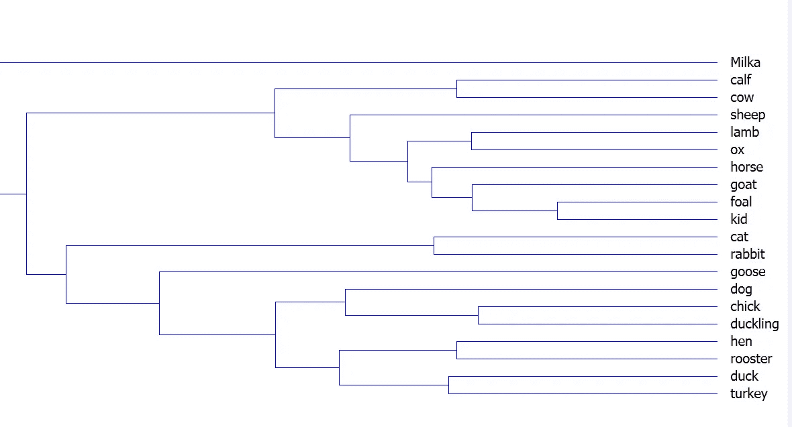

Image by Author

您应该能够看到如上图所示的界面。

## 图像网格

如果你更喜欢视觉，你可以试试图像网格部件。根据官方文档，**图像网格**小部件可以在相似网格中显示数据集的图像。这意味着具有相似内容的图像彼此放置得更近。它可用于图像比较，同时查找所选数据实例之间的相似性或差异。

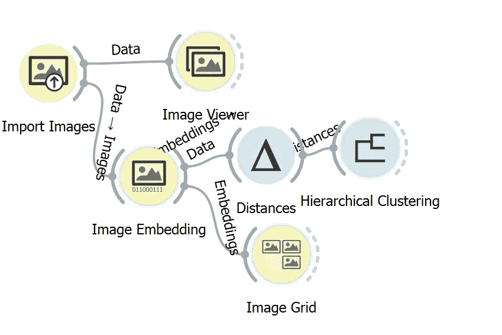

Image by Author

1.  将图像网格小部件添加到画布。
2.  将图像嵌入小部件与图像网格小部件连接。
3.  双击图像网格小部件打开界面。

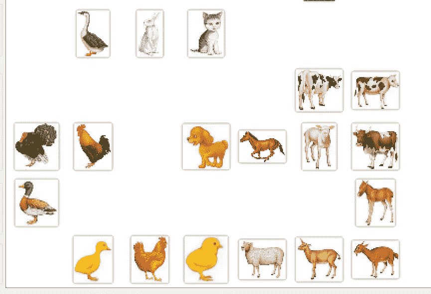

Image by Author

您应该能够获得类似于上图的东西。你可以看到这些图像根据形状和颜色被很好地分成不同的组。

## 试验

让我们通过使用不同类型的图像来尝试一下聚类是如何工作的。官方[博客](https://blog.biolab.si/tag/image-analytics/)为我们提供了面对前置摄像头的 Milka。这与我们现有的任何图像都有很大不同。它能和小牛或母牛聚集在一起吗？

Image by Author

保存图像并放入*家畜*文件夹中。刷新**导入图像**小部件，双击**层次聚类**小部件。

Image by Author

你应该可以看到 Milka 就放在小牛和母牛的正上方。但是，它不在同一个群集中。你可以从网上选择一些图片来试试。

# 结论

恭喜你走到这一步！让我们回顾一下今天所学的内容。我们从安装图像分析插件开始，它为我们提供了一些新的小部件。然后，我们通过 Import Images 小部件加载图像。你可以把它指向你选择的目录。您可以通过图像查看器小部件检查图像。此外，我们还学习了使用图像嵌入小部件将图像转换为数字向量。可以使用不同种类的嵌入器。接下来，我们尝试了距离小部件和层次聚类小部件来显示聚类的树形图。最后，我们用一个样本图像进行测试。感谢阅读**数据科学变得简单**教程的第 5 部分。下节课再见。❤️

# 数据科学变得简单

1.  [交互式数据可视化](/data-science-made-easy-interactive-data-visualization-using-orange-de8d5f6b7f2b)
2.  [数据处理](/data-science-made-easy-data-processing-using-orange-cb00476a7861)
3.  [测试和评估](/data-science-made-easy-test-and-evaluation-using-orange-d74e554d9021)
4.  [数据建模和预测](/data-science-made-easy-data-modeling-and-prediction-using-orange-f451f17061fa)
5.  [图像分析](/data-science-made-easy-image-analytics-using-orange-ad4af375ca7a)

# 参考

1.  [https://orange.biolab.si/](https://orange.biolab.si/)
2.  [https://github.com/biolab/orange3](https://github.com/biolab/orange3)
3.  [https://orange.biolab.si/docs/](https://orange.biolab.si/docs/)
4.  [https://orange 3-image analytics . readthedocs . io/en/latest/index . html](https://orange3-imageanalytics.readthedocs.io/en/latest/index.html)
5.  [https://blog.biolab.si/tag/image-analytics/](https://blog.biolab.si/tag/image-analytics/)
6.  [https://github . com/ajdapretnar/datasets/blob/master/images/家养动物. zip](https://github.com/ajdapretnar/datasets/blob/master/images/domestic-animals.zip)