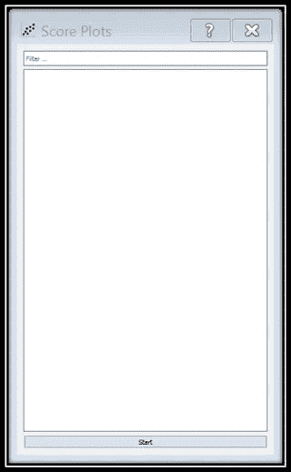

# 数据科学变得简单:使用 Orange 的交互式数据可视化

> 原文：<https://towardsdatascience.com/data-science-made-easy-interactive-data-visualization-using-orange-de8d5f6b7f2b?source=collection_archive---------11----------------------->

一个开源的机器学习和数据可视化工具，可以加速你的数据分析，而无需编写任何代码！


Image taken from the official [Orange website](https://orange.biolab.si)

今天的主题是关于使用开源软件 Orange 执行简单的数据可视化。如果您正在寻找一种不用代码就能可视化数据集的替代方案，Orange 是您的正确选择！官方的 Github 页面声明

> “Orange 是一款基于组件的数据挖掘软件。它包括一系列数据可视化、探索、预处理和建模技术。它可以通过一个漂亮而直观的用户界面来使用，或者对于更高级的用户来说，可以作为 Python 编程语言的一个模块来使用。”

换句话说，在处理数据科学任务时，Orange 既适合新手，也适合专家。本教程有 3 个部分:

1.  设置和安装
2.  小工具
3.  结论

# [第 1 节]设置和安装

首先，安装 Orange 的方法有很多。最常见的方式是通过独立的安装程序，Anaconda 或 Pip。让我们逐一看看。

## 独立安装程序(Windows、macOS)

转到下面的[链接](https://orange.biolab.si/download/#windows)，选择所需的操作系统。


Image by Author

点击“**下载橙色**按钮开始下载。完成后，双击安装程序进行安装。

## Linux/Source

没有为 Linux/Source 提供安装程序。你必须从 [GitHub](https://github.com/biolab/orange3) 中克隆官方库或者下载[源代码 tarball](https://github.com/biolab/orange3/archive/stable.tar.gz) 。之后，你就可以按照 [README.md](https://github.com/biolab/orange3/blob/stable/README.md) 中的说明去做了。完成后，您可以通过以下命令开始运行 Orange Canvas:

```
python -m Orange.canvas
```

## 蟒蛇

如果您已经有了 Anaconda，那么您可以通过下面的命令将 conda-forge 添加到您的频道中:

```
conda config --add channels conda-forge
```

然后，运行以下命令安装 orange:

```
conda install orange3
```

GUI 需要一些 conda-forge 没有包含或提供的依赖项。让我们通过在终端中键入并运行以下命令来添加它们:

```
conda install -c defaults pyqt=5 qt
```

还可以安装其他附加组件:

```
conda install orange3-<addon name>
```

或者，您可以在**选项**菜单中找到附加管理器。

## 点

如果您决定使用 Python 包索引，您可能需要您的发行版提供的附加系统包。在安装 Orange 之前，您可能需要创建自己的虚拟环境。完成所有设置后，运行以下命令:

```
pip install orange3
```

同样，您需要包括 GUI 的附加依赖项:

```
pip install PyQt5 PyQtWebEngine
```

让我们进入下一部分，了解更多关于 Orange 的信息。

# [第 2 部分]部件

打开 Orange，您应该能够看到以下用户界面:


Main user interface of Orange. Image by Author

你可以注意到工具箱在你的左边，白色的工作区是画布。工具箱包含所有可以移动到画布上的小部件。


Example of widgets. Image by Author

有 3 种方法可以将 widget 添加到画布:

1.  双击小部件。
2.  将 widget 拖到画布上。
3.  右键单击小部件菜单的画布。


Widget menu. Image by Author

## 文件和数据表

如果两个部件兼容，您可以将它们连接在一起。让我们来试试:


Gif by Author

1.  将**文件**小部件拖到画布上。
2.  将**数据表**小部件拖到画布上。
3.  在**文件**控件的右侧，有一个半圆形。将鼠标放在它上面，并将其拖动到**数据表**小部件。
4.  请注意，两个小部件之间有一个链接，顶部有单词 *Data* 。
5.  不要担心**文件**小部件顶部的错误标记，因为我们还没有加载数据。

在画布中，双击文件小部件将其打开。然后，您可以加载自己的数据集或从自定义文档数据集中浏览它。让我们通过自定义文档数据集用 iris.tab 来尝试一下。Orange 接受以下任何格式:

*   制表符分隔的值
*   逗号分隔值
*   篮子文件
*   Microsoft Excel 电子表格
*   腌橙数据

您应该能够看到下面的屏幕。


Image by Author

完成后，使用右上角的 X 标记关闭弹出窗口。如果您注意到**应用**按钮呈灰色，请不要惊慌。这意味着在您修改或编辑了数据的**类型**或**角色**后应用更改。接下来，双击数据表小部件。您应该能够看到数据集。你可以检查左边的变量来直观显示数字。检查完所有选项后，您应该能够看到以下屏幕。


Image by Author

## 分配

您可以通过一些可视化小部件轻松地可视化数据。分布是识别数据集重要要素的最佳微件之一。您可以很容易地看到数据集是否被很好地分离。让我们从上一步继续。


Gif by Author

1.  将一个**分发**小部件拖到画布上。
2.  将文件小部件连接到**分发**小部件。
3.  双击**分发**小部件查看可视化效果。
4.  在左上角，选择不同的变量并检查分布结果。


Image by Author

## 散点图

散点图是另一个可视化微件，它将两个要素绘制在一起，以确定它们之间的投影。让我们来测试一下！


Gif by Author

1.  将**散点图**小部件拖到画布中。
2.  将**文件**小部件连接到**散点图**小部件。这一步类似于**发行版**小部件。
3.  双击**散点图**小部件查看可视化效果。
4.  您可以根据可用的功能更改 x 轴和 y 轴。


Image by Author

如果您不确定要选择哪些功能，请单击“查找信息性投影”,您将看到以下界面。



Image by Author

点击“开始”并从列表中选择任何项目。散点图将根据您的选择进行修改。


Image by Author

## FreeViz

FreeViz widget 使用了从粒子物理学借来的范例。虽然点不能移动，但是锚点是可以移动的。这使我们能够看到相互吸引的特征和相互排斥的特征。它带有一个优化按钮，可以执行爬山优化，使其达到平衡。在您继续之前，让我们清除一些小部件以保持整洁。有两种方法可以删除小组件:

1.  右击它，一个菜单就会出现。选择**移除**选项。您也可以通过这种方式或 F2 快捷键来重命名小部件。
2.  左键选中它，点击键盘上的**删除**按钮。可以多选小部件并一起删除它们。


Gif by Author

完成后，请按照下面的说明继续操作:


Gif by Author

1.  将一个 **FreeViz** 小部件放到画布上。
2.  将**文件**小部件连接到 **FreeViz** 小部件。
3.  将一个**数据表**小部件放到画布上。
4.  将 **FreeViz** 微件连接到**数据表**微件。

如果你想知道为什么我们将**数据表**小部件与 **FreeViz** 小部件连接，而不是**文件**小部件。原因是您可以在**可视化**微件界面中选择数据点，选择的点将输出到**数据表**微件中。让我们看看下面的 gif，了解更多关于如何为 FreeViz 接口移动锚点和选择数据点的信息。


Gif by Author

或者，您可以继续按优化按钮，直到它达到平衡。您可以使用这个小部件来了解更多关于功能之间关系的信息。让我们看一下官方文档中的以下示例。


Image by Author

只要看一眼，我们就能发现:

*   产卵的生物更容易长羽毛。
*   水生生物更有可能有鳍。
*   产奶的生物更容易有毛。
*   产卵的生物不产奶

FreeViz 是一个非常强大的小工具，可以帮助你从数据集中提取重要的信息。有更多的微件可用于可视化数据集。请随意尝试。

# [第三节]结论

让我们回顾一下今天所学的内容。我们首先学习了在我们的计算机中设置和安装 orange 的三种方法。然后，我们探讨了 Orange 中的用户界面和小部件的概念。此外，我们还测试了三种向画布添加小部件的方法。如果兼容，这些小部件可以相互连接。例如，文件小部件可以连接到数据表小部件。最重要的部分是可视化我们已经加载的数据集。我们使用定制的 Iris 数据集尝试了分布、散点图和 FreeViz 小部件。感谢阅读**数据科学变得简单**教程的第 1 部分。在下一部分中，我将介绍使用 Orange 的数据处理。❤️

# 数据科学变得简单

1.  [交互式数据可视化](/data-science-made-easy-interactive-data-visualization-using-orange-de8d5f6b7f2b)
2.  [数据处理](/data-science-made-easy-data-processing-using-orange-cb00476a7861)
3.  [测试和评估](/data-science-made-easy-test-and-evaluation-using-orange-d74e554d9021)
4.  [数据建模和预测](/data-science-made-easy-data-modeling-and-prediction-using-orange-f451f17061fa)
5.  [图像分析](/data-science-made-easy-image-analytics-using-orange-ad4af375ca7a)

# 参考

1.  [https://orange.biolab.si/](https://orange.biolab.si/)
2.  [https://github.com/biolab/orange3](https://github.com/biolab/orange3)
3.  [https://orange.biolab.si/docs/](https://orange.biolab.si/docs/)