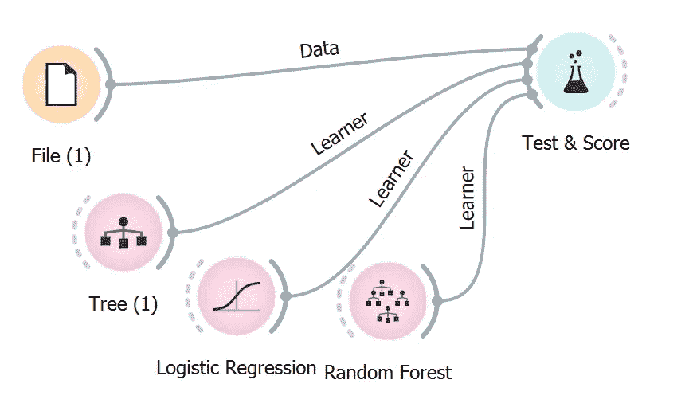
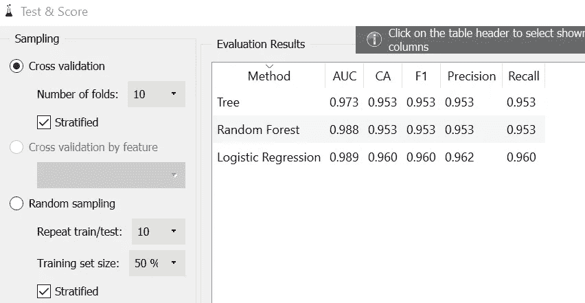
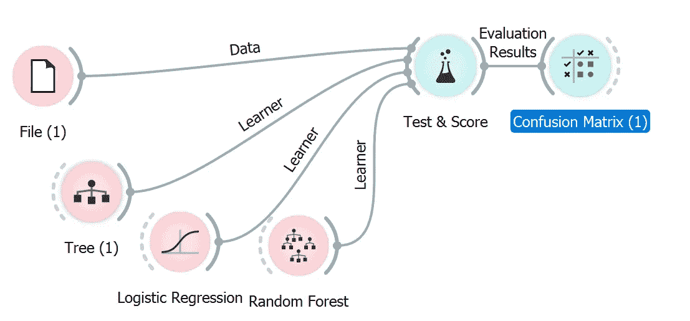
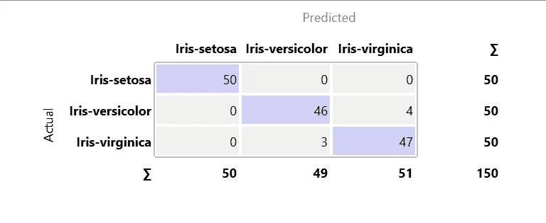
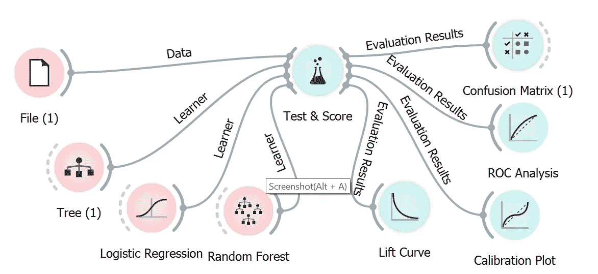
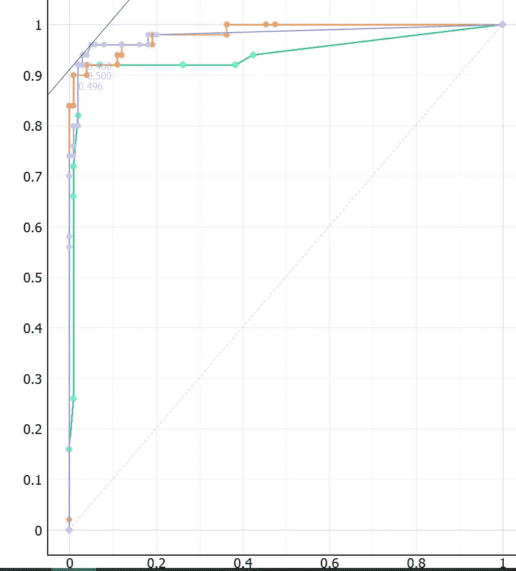
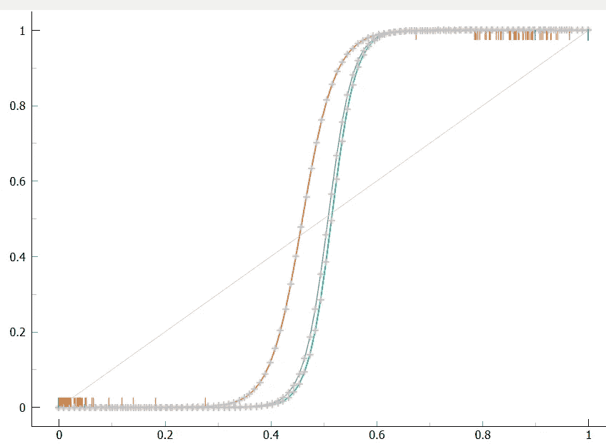
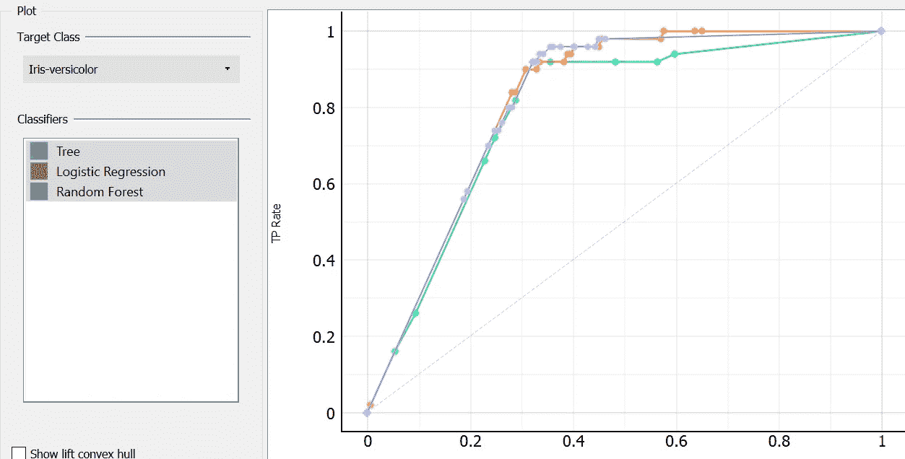
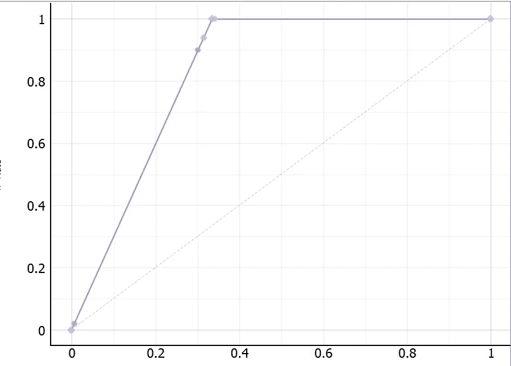

# 数据科学变得简单:使用 Orange 进行测试和评估

> 原文：<https://towardsdatascience.com/data-science-made-easy-test-and-evaluation-using-orange-d74e554d9021?source=collection_archive---------12----------------------->

## 测试和评估模型的最简单的方法之一，无需接触任何代码！

Image taken from the official [Orange website](https://orange.biolab.si)

欢迎回到数据科学简易系列的第三部分。本教程将涵盖使用开源机器学习软件 Orange 测试和评估不同类型模型所需的基本步骤。在我们开始之前，请确保您已经安装了 Orange。请阅读[第一部分](/data-science-made-easy-interactive-data-visualization-using-orange-de8d5f6b7f2b)进行设置和安装，如果您错过了，底部会有链接供您浏览整个 Data Science Made Easy 系列。我将从评估过程的一些基本解释开始。请注意，类型模型和预测将只在下一篇文章中讨论。本文主要关注测试和评估模型的步骤。

## 测试和评分

Test & Score 小部件可用于在数据集上测试您想要的学习算法。您应该使用此微件来确定所选的的性能，从而大致了解数据集的质量以及要使用的模型。这一步至关重要，因为从长远来看，这将为你节省大量时间。我不建议你直接跳到数据建模和预测，除非你知道你在做什么。我们来试试吧！

Image by Author

1.  向画布添加一个**文件**小部件，并加载来自浏览定制文档的虹膜数据。
2.  向画布添加一个**测试&分数**小部件，并将**文件**小部件连接到它。
3.  转到建模选项卡，选择几个您喜欢的模型，并将其添加到画布中。将每个模型连接到**测试&评分**小部件。您可以连接任意多个模型。
4.  双击**测试&分数**控件打开界面。

Image by Author

可以看到上图所示的各个型号的评测结果。请注意，分类任务和回归任务会有不同的结果。

对于分类任务，您应该得到以下结果:

*   **ROC 下面积:**为受试者操作曲线下面积。
*   **分类:**准确率是正确分类的例子的比例。
*   **F-1:** 是精度和召回率的加权调和平均值(见下文)。
*   **精度**:分类为阳性的实例中真阳性的比例，例如*北美鸢尾*被正确识别为北美鸢尾的比例。
*   **回忆:**是数据中所有阳性实例中真阳性的比例，例如所有诊断为患病的人中患病的人数。

如果您对回归任务执行了测试，结果将包括以下内容:

*   **MSE:** 测量误差或偏差的平方平均值(估计值和被估计值之间的差值)。
*   **RMSE:** 是一组数的平方的算术平均值的平方根(估计量对数据拟合的不完美性的度量)
*   **MAE:** 用于衡量预测或预言与最终结果的接近程度。
*   **R2:** 解释为可从自变量预测的因变量中方差的比例。

您可以修改左边的设置，如折叠的数量，以获得更平衡的结果。

## 混淆矩阵

有时候 **Test & Score** widget 提供的评测结果对我们来说根本不够好。例如，您将无法知道哪个类具有最佳预测。在这种情况下，我们将依赖另一个名为**混淆矩阵**的小部件。让我们试一试。

Image by Author

1.  只需在画布上添加一个**混淆矩阵**小部件。
2.  将**测试&分数**控件连接到**混淆矩阵**控件。
3.  双击**混淆矩阵**控件打开界面。

Image by Author

对于那些不熟悉混淆矩阵的人来说，它给出了预测类和实际类之间的实例比例。在这种情况下，您将知道如上图所示，所有 Iris-setosa 都已被正确预测。这些信息对我们来说更有意义。

## ROC 分析

除了混淆矩阵，您还可以根据需要尝试其他种类的小部件来显示重要信息。只需将小部件添加到画布上，并将**测试&分数**小部件连接到画布上。下图显示了连接到所有其他小部件的正确方式。

Image by Author

**ROC 分析** widget 绘制了测试的真阳性率和假阳性率。双击 **ROC 分析**小部件，您应该能够看到以下内容。

Image by Author

x 轴代表假阳性率，而 Y 轴代表真阳性率。换句话说，一个准确的分类器将会把大部分的点放在左上角，就像我们在上面的图中看到的那样。

## 校准图

与 **ROC 分析**小部件不同的是，**校准图**小部件根据分类器预测的概率绘制分类概率。请注意，在撰写本文时，校准图小部件仅与**测试&分数**小部件兼容。因此，它只能与**测试&分数**小工具一起使用。

Image by Author

此微件提供了图中类别概率的预测精度。根据官方文件，在图的底部，左边的点是那些被(正确地)分配了低概率目标类的点，而右边的点被错误地分配了高概率。在图的顶部，右边的实例被正确地分配了高概率，反之亦然。这个小部件可以确定一个分类器是过于乐观(主要给出正面结果)还是悲观(主要给出负面结果)。如果你理解起来有困难，一个精确的分类器将会有一个 s 形曲线的形状，就像我们上面的那个一样。

## 升力曲线

**Lift Curve** widgets 测量所选分类器相对于随机分类器的性能。提升曲线常用于人口细分。x 轴代表总体(P-比率)，而 Y 轴代表真阳性(TP-比率)。请注意，在撰写本文时，**升力曲线**小部件仅与**测试&分数**小部件兼容。因此，它只能与测试&分数控件一起使用。

Image by Author

检查“**显示提升凸包**”以显示每个所需 TP/P 速率的最佳分类器。根据官方文档，完美的分类器应该有一个朝向 1 的陡坡，直到所有的类都猜对了，然后沿着 y 轴上的 1 直线运行到(1，1)。下图是这种分类器的一个很好的例子。

Image by Author

# 结论

让我们复习一下今天所学的内容。我们从学习**测试&分数**小部件的功能开始。它可用于粗略评估模型的性能。您可以简单地将其与其他类型的模型连接，并检查结果。根据任务是分类还是回归，输出结果是不同的。为了获得更多的信息，我们必须依赖一些其他的小部件。其中之一就是**混淆矩阵**小部件。它为我们提供了预测类和实际类之间的实例比例。此外，还有一些小工具，如 **ROC 分析**、**校准图**和**升力曲线**，可用于从结果中获得更多信息。感谢阅读**数据科学变得简单**教程的第 3 部分。在下一部分中，我将介绍使用 Orange 进行数据建模。❤️

# 数据科学变得简单

1.  [交互式数据可视化](/data-science-made-easy-interactive-data-visualization-using-orange-de8d5f6b7f2b)
2.  [数据处理](/data-science-made-easy-data-processing-using-orange-cb00476a7861)
3.  [测试和评估](/data-science-made-easy-test-and-evaluation-using-orange-d74e554d9021)
4.  [数据建模和预测](/data-science-made-easy-data-modeling-and-prediction-using-orange-f451f17061fa)
5.  [图像分析](/data-science-made-easy-image-analytics-using-orange-ad4af375ca7a)

# 参考

1.  [https://orange.biolab.si/](https://orange.biolab.si/)
2.  [https://github.com/biolab/orange3](https://github.com/biolab/orange3)
3.  [https://orange.biolab.si/docs/](https://orange.biolab.si/docs/)