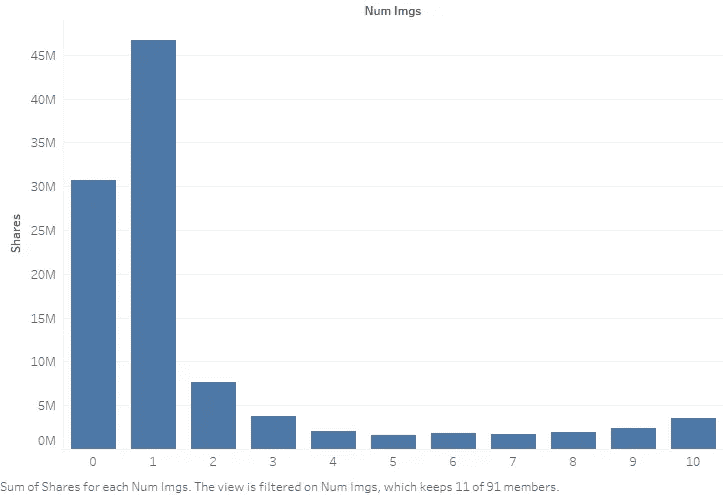
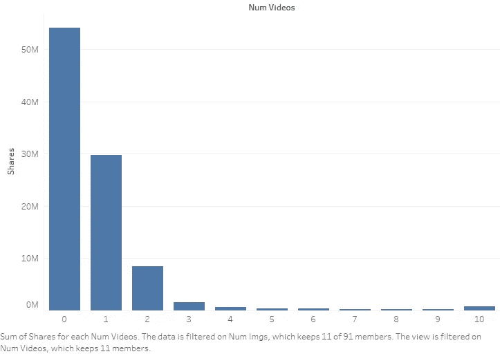
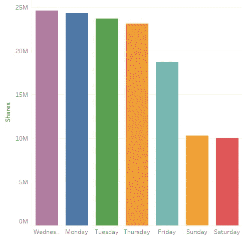
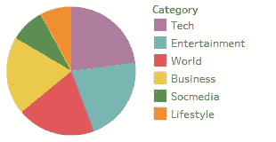

# 关于可混搭文章的在线新闻流行度的数据科学小型项目

> 原文：<https://towardsdatascience.com/data-science-mini-project-on-online-news-popularity-of-mashable-articles-d7a120feef0d?source=collection_archive---------13----------------------->

我们有一个由 mashable 发布的文章数据集，我们希望预测给定文章的受欢迎程度。这是一个分类问题。一些特征属于各种类别，例如关于文章的定量信息——例如图像数量、视频数量等。—以及关于文章的定性信息—例如文章是哪一天发表的以及文章属于哪个主题。

将图像数量与份额数量进行比较，我们会得到以下条形图:



正如你所看到的，只有一张图片的文章总体上做得更好。然后，没有图像的文章是次优的；有两张图片的文章排在第三位。拥有 2 张以上图片的文章的分享数量可以忽略不计。有鉴于此，在一篇文章中包含 0 或 1 张图片将是明智的。

将视频数量与分享数量进行比较，我们得到了下图:



注意，没有视频的文章往往做得最好，有 1 个视频的文章做得第二好，有 2 个视频的文章做得第三好。拥有 2 个以上视频的文章相比之下可以忽略不计。

我们还可以看到一周中哪一天的份额最高。这是一周中各天的条形图:



如你所见，工作日的份额最高。周三、周一、周二和周四的股票数量最高，周五的股票数量大幅下降。

我们还可以看到哪个类别或主题做得最好。这是一个饼状图，分为科技、娱乐、世界、商业、社交媒体和生活方式六个类别:



表现最好的类别是科技，其次是娱乐、世界和商业。最不受欢迎的类别是社交媒体和生活方式。

使用 Tableau，我们可以创建上述可视化效果，并进行一些基本的数据挖掘。我们得到的见解可以告诉我们一篇文章中要包含多少图片和视频，在哪天发表这篇文章，以及这篇文章应该属于哪个类别。

接下来，使用 Python，我对数据集应用了一些机器学习。先公式化一个分类问题，我用 1400 股的门槛创建了两个类:如果分享数大于 1400，那么文章被分类为热门；如果分享数量小于或等于 1400，则该文章被分类为不受欢迎。

为了准备 csv 文件，我使用 IF 函数在 shares 列之后创建了一个新列——popularity 列；如果份额数大于 1400，则该类别为 4(受欢迎)，否则该类别为 2(不受欢迎)。

我们的目标是创建一个机器学习模型，将文章分类为流行或不受欢迎。为此，我使用了梯度推进分类器。

首先，我将数据集分为训练集和测试集——将数据集的 80%作为训练集，20%作为测试集。

我们将梯度提升分类器与我们的训练集相匹配。然后，我们将拟合的梯度推进分类器应用于我们的测试集。

根据通过比较预测类和测试类得到的混淆矩阵，我们的模型从 7929 个测试分类中得到 5277 个正确的分类。这给出了 67%的准确度。

以下是 python 代码:

```
#Classification for Online News Popularity#Importing the Librariesimport pandas as pd#Importing the datasetdataset = pd.read_csv('OnlineNewsPopularity(classification with nominal).csv')X = dataset.iloc[:,2:-2].valuesY = dataset.iloc[:, -1].values#Splitting the dataset into the Training set and Test setfrom sklearn.model_selection import train_test_splitX_train, X_test, Y_train, Y_test = train_test_split(X, Y, test_size = 0.2, random_state = 0)#Fitting Gradient Boosting to Training setfrom sklearn.ensemble import GradientBoostingClassifierclassifier = GradientBoostingClassifier()classifier.fit(X_train, Y_train)#Predicting the Test set resultsY_pred = classifier.predict(X_test)#Making the Confusion Matrixfrom sklearn.metrics import confusion_matrixcm = confusion_matrix(Y_test, Y_pred)
```

数据集可以在这里找到:[http://archive . ics . UCI . edu/ml/datasets/Online+News+population](http://archive.ics.uci.edu/ml/datasets/Online+News+Popularity)

K.费尔南德斯 p .维纳格雷和 p .科尔特斯。预测在线新闻流行度的主动智能决策支持系统。第 17 届 EPIA 2015-葡萄牙人工智能会议记录，9 月，葡萄牙科英布拉。